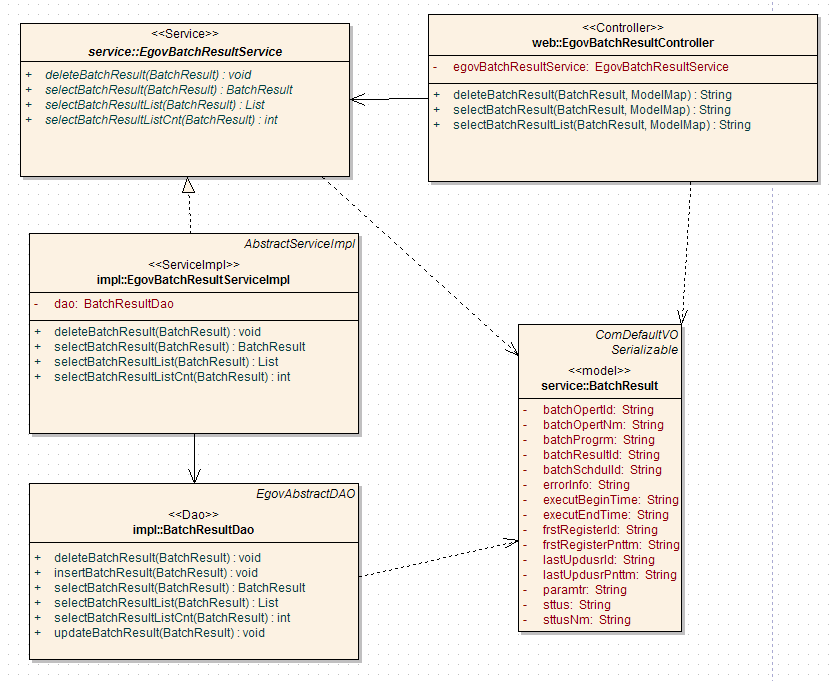
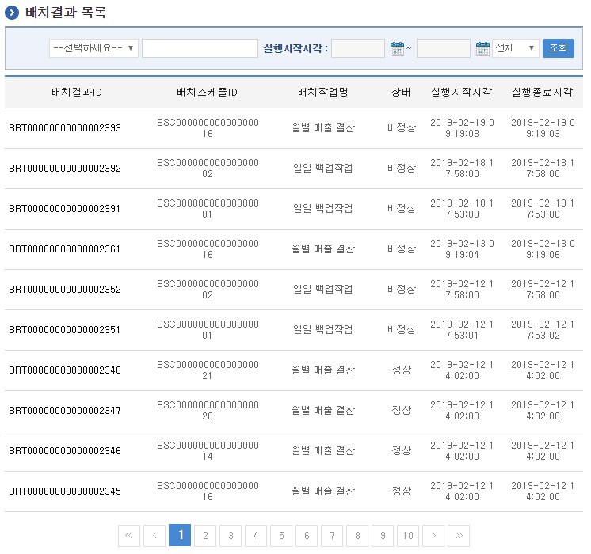
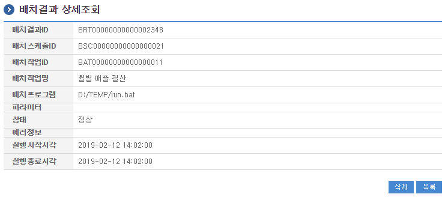

# 배치결과관리

## 개요

 배치결과관리는 시스템에서 주기적으로 실행하는 배치결과을 등록하는 기능을 제공한다.

## 설명

 배치결과관리는 배치결과을 등록하기 위한 목적으로 배치결과의 조회, 삭제, 목록조회의 기능을 수반한다.

 ① 배치결과목록조회 : 배치결과으로 정의된 정보를 최근 등록 순서대로 조회하고, 그 결과 목록을 화면에 반영한다.
 ④ 배치결과삭제 : 기 등록된 배치결과정보를 삭제한다.
 ⑤ 배치결과조회 : 등록된 배치결과정보를 조회한다.

### 관련소스

| 유형 | 대상소스명 | 비고 |
| --- | --- | --- |
| Controller | egovframework.com.sym.bat.web.EgovBatchResultController.java | 배치결과 관리를 위한 컨트롤러 클래스 |
| Service | egovframework.com.sym.bat.service.EgovBatchResultService.java | 배치결과 관리를 위한  서비스 인터페이스 |
| ServiceImpl | egovframework.com.sym.bat.service.impl.EgovBatchResultServiceImpl.java | 배치결과 관리를 위한 서비스 구현 클래스 |
| DAO | egovframework.com.sym.bat.service.impl.BatchResultDao.java | 배치결과 관리를 위한 데이터처리 클래스 |
| Model | egovframework.com.sym.bat.service.BatchResult.java | 배치결과 관리를 위한 Model 클래스 |
| JSP | /WEB-INF/jsp/egovframework/com/sym/bat/EgovBatchResultList.jsp | 배치결과 목록조회를 위한 jsp페이지 |
| JSP | /WEB-INF/jsp/egovframework/com/sym/bat/EgovBatchResultDetail.jsp | 등록된 배치결과를 조회하기 위한 jsp페이지 |
| QUERY XML | resources/egovframework/mapper/com/sym/bat/EgovBatchResult\_SQL\_mysql.xml | 배치결과관리 MySQL용 QUERY XML |
| QUERY XML | resources/egovframework/mapper/com/sym/bat/EgovBatchResult\_SQL\_oracle.xml | 배치결과관리 Oracle용 QUERY XML |
| QUERY XML | resources/egovframework/mapper/com/sym/bat/EgovBatchResult\_SQL\_tibero.xml | 배치결과관리 Tibero용 QUERY XML |
| QUERY XML | resources/egovframework/mapper/com/sym/bat/EgovBatchResult\_SQL\_altibase.xml | 배치결과관리 Altibase용 QUERY XML |
| QUERY XML | resources/egovframework/mapper/com/sym/bat/EgovBatchResult\_SQL\_cubrid.xml | 배치결과관리 Cubrid용 QUERY XML |
| QUERY XML | resources/egovframework/mapper/com/sym/bat/EgovBatchResult\_SQL\_maria.xml | 배치결과관리 Maria용 QUERY XML |
| QUERY XML | resources/egovframework/mapper/com/sym/bat/EgovBatchResult\_SQL\_postgres.xml | 배치결과관리 Postgres용 QUERY XML |
| QUERY XML | resources/egovframework/mapper/com/sym/bat/EgovBatchResult\_SQL\_goldilocks.xml | 배치결과관리 Goldilocks용 QUERY XML |
| Message properties | resources/egovframework/message/com/message-common\_ko.properties | 배치결과관리 Message properties |
| Message properties | resources/egovframework/message/com/sym/bat/message\_ko.properties | 배치결과관리를 위한 Message properties(한글) |
| Message properties | resources/egovframework/message/com/sym/bat/message\_en.properties | 배치결과관리를 위한 Message properties(영문) |
| Idgen XML | resources/egovframework/spring/com/idgn/context-idgn-BatchResult.xml | 배치결과관리를 위한 Id생성 Idgen XML |

### 클래스 다이어그램

 

### 관련테이블

| 테이블명 | 테이블명(영문) | 비고 |
| --- | --- | --- |
| 배치결과 | COMTNBATCHRESULT | 배치결과정보를 관리하기 위한 속성정보를 정의하고, 관리한다. |

### ID Generation 관련 DDL 및 DML

 ID Generation Service를 활용하기 위해서 Sequence 저장테이블인  COMTECOPSEQ에 BATCH_RESULT_ID 항목을 추가해야 한다.

```sql
CREATE TABLE COMTECOPSEQ ( table_name varchar(16) NOT NULL, 
                               next_id DECIMAL(30) NOT NULL,
                               PRIMARY KEY (table_name)
    );
 
    INSERT INTO COMTECOPSEQ VALUES ('BATCH_RESULT_ID','0');
```

### ID Generation 환경설정(context-idgn-BatchResult.xml)

```xml
<bean name="egovBatchResultIdGnrService" class="egovframework.rte.fdl.idgnr.impl.EgovTableIdGnrServiceImpl" destroy-method="destroy">
        <property name="dataSource" ref="egov.dataSource" />
        <property name="strategy"   ref="batchResultIdStrategy" />
        <property name="blockSize"  value="10"/>
        <property name="table"      value="COMTECOPSEQ"/>
        <property name="tableName"  value="BATCH_RESULT_ID"/>
    </bean>
    <bean name="batchResultIdStrategy" class="egovframework.rte.fdl.idgnr.impl.strategy.EgovIdGnrStrategyImpl">
        <property name="prefix"     value="BRT" />
        <property name="cipers"     value="17" />
        <property name="fillChar"   value="0" />
    </bean>
```

## 관련화면 및 수행매뉴얼

### 배치결과 목록조회

| Action | URL | Controller method | QueryID |
| --- | --- | --- | --- |
| 조회 | /sym/bat/selectBatchResultList.do | selectBatchResultList | "BatchResultDAO.selectBatchResultList" |
| 조회 | /sym/bat/selectBatchResultList.do | selectBatchResultList | "BatchResultDAO.selectBatchResultListCnt" |

 배치결과 목록은 페이지당 10건씩 조회되며 페이징은 10페이지씩 이루어진다.
 검색조건은 배치작업명,배치스케줄ID에 대해서 수행된다.

 

 조회 : 기 등록된 배치결과의 목록을 조회한다.

### 배치결과 상세조회

| Action | URL | Controller method | QueryID |
| --- | --- | --- | --- |
| 상세조회 | /sym/bat/getBatchResult.do | selectBatchResult | "BatchResultDAO.selectBatchResult" |
| 삭제 | /sym/bat/deleteBatchResult.do | deleteBatchResult | "BatchOpertDAO.deleteBatchResult" |

 배치결과의 속성정보를 조회한다.

 

 삭제 : 기 등록된 배치결과정보를 삭제한다.
 목록 : 배치작업 목록조회 화면으로 이동한다.
