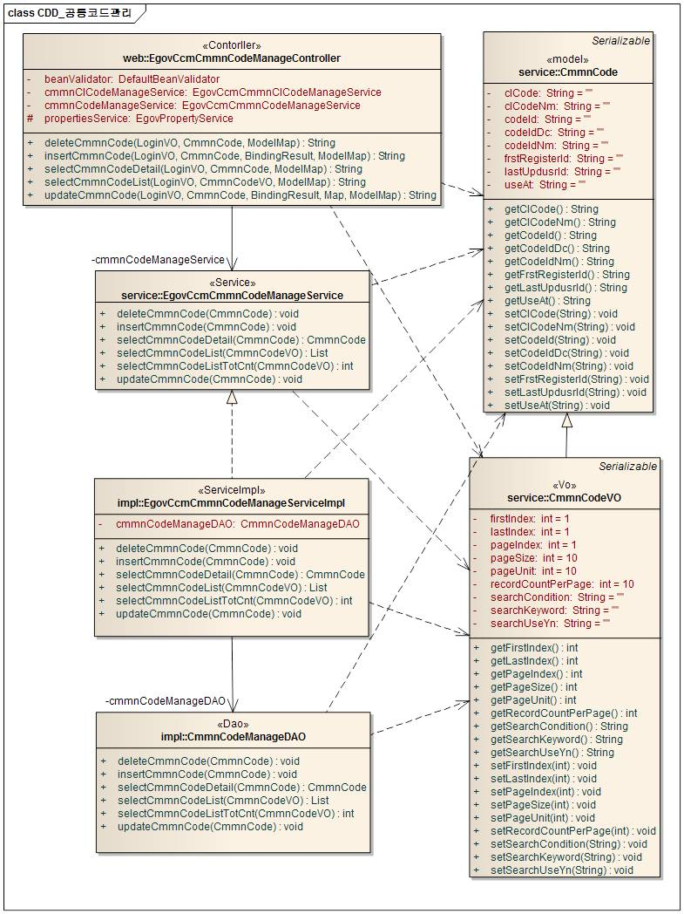
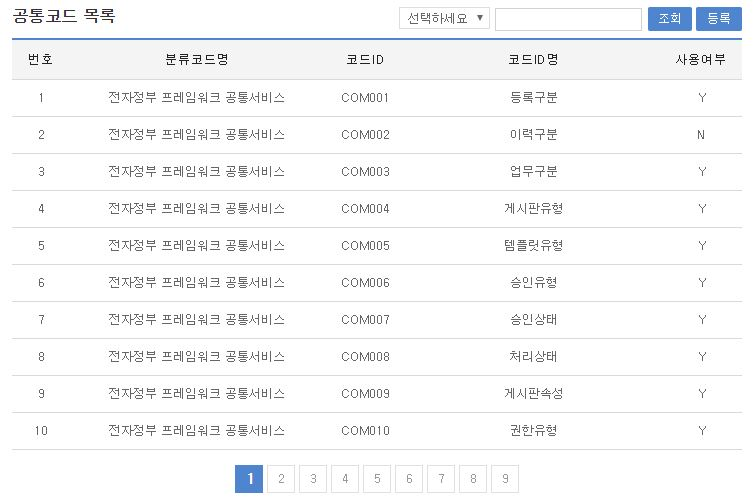
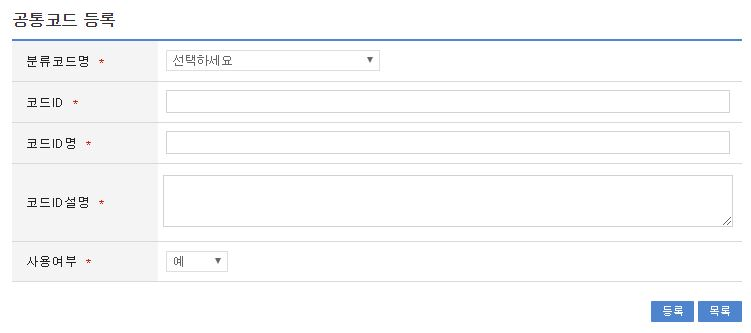
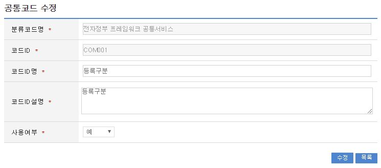
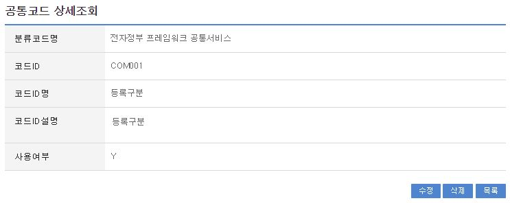
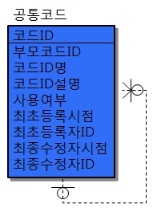
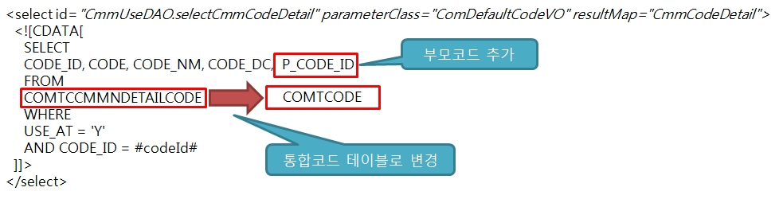

# 공통코드

## 개요

 공통코드 관리는 공통코드를 등록, 수정, 목록조회, 상세조회를 제공한다.

## 설명

### 패키지 참조 관계

 공통코드 패키지는 요소기술의 공통 패키지(cmm)와 공통분류코드관리 패키지에 대해서만 직접적인 함수적 참조 관계를 가진다. 하지만, 컴포넌트 배포 시 오류 없이 실행되기 위하여 패키지 간의 참조관계에 따라 공통상세코드관리 패키지와 함께 배포 파일을 구성한다.
- 패키지 간 참조 관계 : [시스템관리 Package Dependency](../intro/package-reference.md/#시스템관리)

### 관련소스

| 유형 | 대상소스명 | 비고 |
| --- | --- | --- |
| Controller | egovframework.com.sym.ccm.cca.web.EgovCcmCmmnCodeManageController.java | 공통코드 관리를 위한 컨트롤러 클래스 |
| Service | egovframework.com.sym.ccm.cca.service.EgovCcmCmmnCodeManageService.java | 공통코드 관리를 위한 서비스 인터페이스 |
| ServiceImpl | egovframework.com.sym.ccm.cca.service.impl.EgovCcmCmmnCodeManageServiceImpl.java | 공통코드 관리를 위한 위한 서비스구현 클래스 |
| Model | egovframework.com.sym.ccm.cca.service.CmmnCode.java | 공통코드 정보 Model 클래스 |
| VO | egovframework.com.sym.ccm.cca.service.CmmnCodeVO.java | 공통코드 관리를 위한 VO 클래스 |
| DAO | egovframework.com.sym.ccm.cca.service.impl.CmmnCodeManageDAO.java | 공통코드 정보 관리를 위한 데이터처리 클래스 |
| JSP | /WEB-INF/jsp/egovframework/com/sym/ccm/cca/EgovCcmCmmnCodeDetail.jsp | 공통코드 상세보기를 위한 JSP 페이지 |
| JSP | /WEB-INF/jsp/egovframework/com/sym/ccm/cca/EgovCcmCmmnCodeList.jsp | 공통코드 목록을 위한 JSP 페이지 |
| JSP | /WEB-INF/jsp/egovframework/com/sym/ccm/cca/EgovCcmCmmnCodeUpdt.jsp | 공통코드 수정을 위한 JSP 페이지 |
| JSP | /WEB-INF/jsp/egovframework/com/sym/ccm/cca/EgovCcmCmmnCodeRegist.jsp | 공통코드 등록을 위한 JSP 페이지 |
| Query XML | resources/egovframework/mapper/com/sym/ccm/cca/EgovCmmnCodeManage\_SQL\_altibase.xml | 공통코드 관리를 위한 Altibase용 Query XML |
| Query XML | resources/egovframework/mapper/com/sym/ccm/cca/EgovCmmnCodeManage\_SQL\_cubrid.xml | 공통코드 관리를 위한 Cubrid용 Query XML |
| Query XML | resources/egovframework/mapper/com/sym/ccm/cca/EgovCmmnCodeManage\_SQL\_maria.xml | 공통코드 관리를 위한 MariaDB용 Query XML |
| Query XML | resources/egovframework/mapper/com/sym/ccm/cca/EgovCmmnCodeManage\_SQL\_mysql.xml | 공통코드 관리를 위한 MySQL용 Query XML |
| Query XML | resources/egovframework/mapper/com/sym/ccm/cca/EgovCmmnCodeManage\_SQL\_oracle.xml | 공통코드 관리를 위한 Oracle용 Query XML |
| Query XML | resources/egovframework/mapper/com/sym/ccm/cca/EgovCmmnCodeManage\_SQL\_postgres.xml | 공통코드 관리를 위한 PostgreSQL용 Query XML |
| Query XML | resources/egovframework/mapper/com/sym/ccm/cca/EgovCmmnCodeManage\_SQL\_tibero.xml | 공통코드 관리를 위한 Tibero용 Query XML |
| Query XML | resources/egovframework/mapper/com/sym/ccm/cca/EgovCmmnCodeManage\_SQL\_goldilocks.xml | 공통코드 관리를 위한 Goldilocks용 Query XML |
| Message properties | resources/egovframework/message/com/sym/ccm/cca/message\_ko.properties | 공통코드를 위한 Message properties(한글) |
| Message properties | resources/egovframework/message/com/sym/ccm/cca/message\_en.properties | 공통코드를 위한 Message properties(영문) |

### 클래스 다이어그램

 

### 관련테이블

| 테이블명 | 테이블명(영문) | 비고 |
| --- | --- | --- |
| 공통분류코드 | COMTCCMMNCLCODE | 공통분류코드 정보를 관리한다. |
| 공통코드 | COMTCCMMNCODE | 공통코드 정보를 관리한다. |

## 관련기능

 공통코드는 공통코드 목록조회, 공통코드 등록, 공통코드 수정, 공통코드 상세조회 기능으로 구분된다.

### 공통코드 목록조회

#### 비즈니스 규칙

 공통코드 목록은 페이지 당 10건씩 조회되며 페이징은 10페이지씩 이루어진다.검색조건은 코드ID, 코드ID명에 대해서 수행된다.

#### 관련코드

 N/A

#### 관련화면 및 수행매뉴얼

| Action | URL | Controller method | SQL Namespace | SQL QueryID |
| --- | --- | --- | --- | --- |
| 목록조회 | /sym/ccm/cca/SelectCcmCmmnCodeList.do | selectCmmnCodeList | “CmmnCodeManage” | “selectCmmnCodeList” |
|  |  |  |  | “selectCmmnCodeListTotCnt” |

 페이지 당 검색 범위를 변경하고자 하는 경우
 context-properties.xml 파일의 pageUnit, pageSize를 변경한다.(단 해당 설정은 전체 공통서비스 기능에 영향을 미친다.)

 

 조회: 조회하기 위해서는 상단의 검색조건을 선택 후 해당하는 검색문자를 입력 후 조회 버튼을 클릭한다.
 등록: 등록하기 위해서는 등록 버튼을 통해서 공통코드 등록 화면으로 이동한다.
 목록클릭: 공통코드 상세조회 화면으로 이동한다.

### 공통코드 등록

#### 비즈니스 규칙

 공통코드에 대한 상세내용을 등록한다. 등록이 성공하면 공통코드 목록 화면으로 이동한다.

#### 관련코드

 N/A

#### 관련화면 및 수행매뉴얼

| Action | URL | Controller method | SQL Namespace | SQL QueryID |
| --- | --- | --- | --- | --- |
| 등록화면 | /sym/ccm/cca/RegistCcmCmmnCodeView.do | insertCmmnCodeView | “CmmnClCodeManage” | “selectCmmnClCodeList” |
| 등록 | /sym/ccm/cca/RegistCcmCmmnCode.do | insertCmmnCode | “CmmnCodeManage” | “insertCmmnCode” |

 

 등록: 입력한 공통코드 정보들이 등록처리된다.
 목록: 공통코드 목록 화면으로 이동한다.

### 공통코드 수정

#### 비즈니스 규칙

 수정이 성공하면 공통코드 목록 화면으로 이동한다.

#### 관련코드

 N/A

#### 관련화면 및 수행매뉴얼

| Action | URL | Controller method | SQL Namespace | SQL QueryID |
| --- | --- | --- | --- | --- |
| 수정화면 | /sym/ccm/cca/UpdateCcmCmmnCodeView.do | updateCmmnCodeView | “CmmnCodeManage” | “selectCmmnCodeDetail” |
| 수정 | /sym/ccm/cca/UpdateCcmCmmnCode.do | updateCmmnCode | “CmmnCodeManage” | “updateCmmnCode” |

 

 수정: 입력한 정보들이 수정처리된다.
 목록: 공통코드 목록 화면으로 이동한다.

### 공통코드 상세 조회

#### 비즈니스 규칙

 상세조회에는 삭제 처리가 포함되어 있고 삭제(사용여부 N으로 변경)가 성공하면 공통코드 목록 화면으로 이동한다.

#### 관련코드

 N/A

#### 관련화면 및 수행매뉴얼

| Action | URL | Controller method | SQL Namespace | SQL QueryID |
| --- | --- | --- | --- | --- |
| 상세조회 | /sym/ccm/cca/SelectCcmCmmnCodeDetail.do | selectCmmnCodeDetail | “CmmnCodeManage” | “selectCmmnCodeDetail” |
| 삭제 | /sym/ccm/cca/RemoveCcmCmmnCode.do | deleteCmmnCode | “CmmnCodeManage” | “deleteCmmnCode” |

 

 수정: 수정버튼 클릭 시 공통코드 수정 화면으로 이동한다.
 삭제: 삭제버튼 클릭 시 삭제여부를 확인하는 메시지를 보여주고 삭제처리(사용여부 N으로 변경)를 할 수 있다.
 목록: 공통코드 목록 화면으로 이동한다.

### 발전방향

 공통코드 컴포넌트의 데이터 모델은 3단계(대,중,소) 코드 구조에 근거하여 구성되어 있다. 이러한 구조는 현재 공통컴포넌트를 실행함에 있어 아무런 문제가 없으나, 이를 적용하는 프로젝트가 그 이상의 코드 구조를 활용하고자 하는 경우에는 확장에 제약 사항이 존재한다. 공통코드 테이블을 회귀구조를 갖는 하나의 테이블로 구성하면 확장이 가능한 공통코드를 구성할 수 있다. 아래 그림은 자기 테이블이 부모코드ID를 참조하는 필드를 갖도록 구성된 공통코드 테이블 설계의 예시이다.

 

 이와 같이 공통코드 테이블을 설계 변경하는 경우 아래와 같은 사항을 수정하여야 한다.
 공통분류코드, 공통코드, 공통상세코드 세 개의 컴포넌트를 공통코드 하나로 통합
 각 공통컴포넌트에서 공통코드 관련 테이블(COMTCCMMNCLCODE, COMTCCMMNCODE, COMTCCMMNDETAILCODE)을 사용하는 SQL 문을 모두 찾아서 새로 변경된 구조에 맞게 SQL 문을 수정
 아래 그림은 SQL을 변경된 공통코드 테이블에 맞게 수정하는 예시이다.(변경된 공통코드 테이블명이 COMTCODE, 부모코드ID 컬럼명이 P_CODE_ID라고 가정한다.)

 
