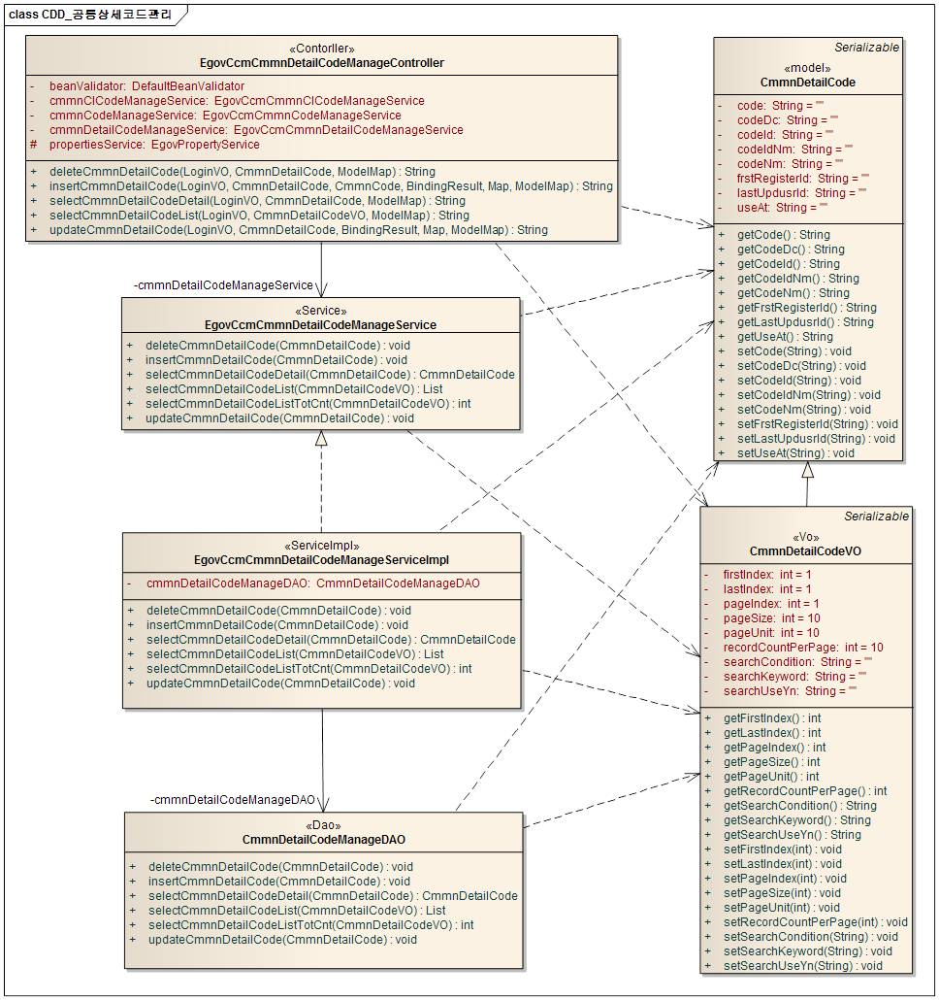
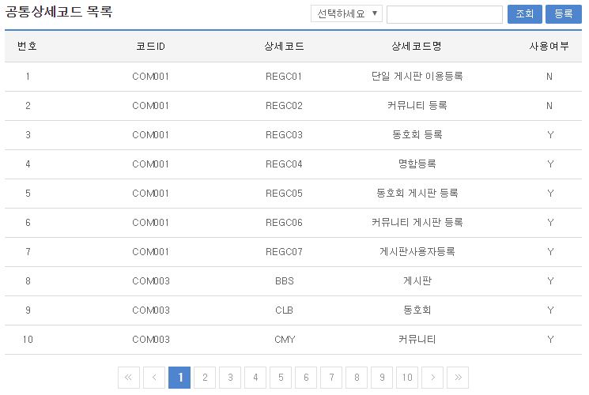
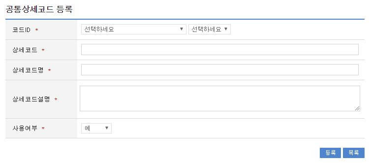
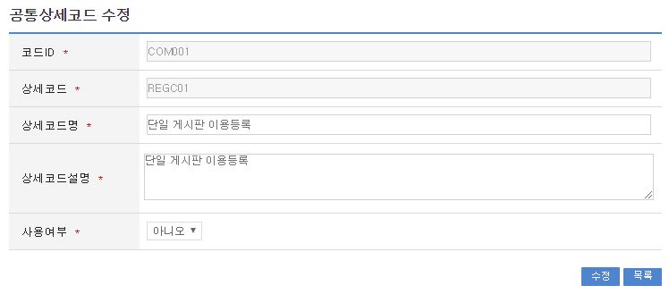
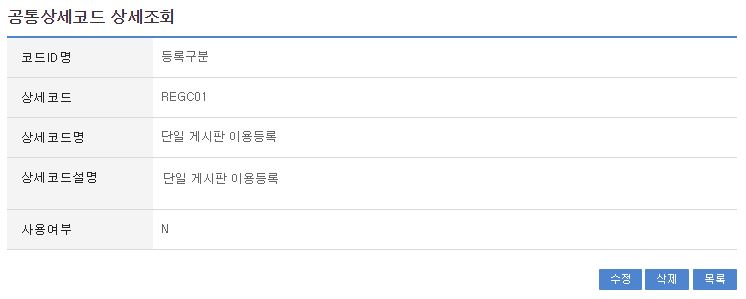

# 공통상세코드

## 개요

 공통상세코드 관리는 공통상세코드를 등록, 수정, 목록조회, 상세조회를 제공한다.

## 설명

### 패키지 참조 관계

 공통상세코드관리 패키지는 요소기술의 공통 패키지(cmm)와 공통코드 패키지에 대해서만 직접적인 함수적 참조 관계를 가진다. 하지만, 컴포넌트 배포 시 오류 없이 실행되기 위하여 패키지 간의 참조관계에 따라 공통분류코드관리 패키지와 함께 배포 파일을 구성한다.
- 패키지 간 참조 관계 : [시스템관리 Package Dependency](../intro/package-reference.md/#시스템관리)

### 관련소스

| 유형 | 대상소스명 | 비고 |
| --- | --- | --- |
| Controller | egovframework.com.sym.ccm.cde.web.EgovCcmCmmnDetailCodeManageController.java | 공통상세코드 관리를 위한 컨트롤러 클래스 |
| Service | egovframework.com.sym.ccm.cde.service.EgovCcmCmmnDetailCodeManageService.java | 공통상세코드 관리를 위한 서비스 인터페이스 |
| ServiceImpl | egovframework.com.sym.ccm.cde.service.impl.EgovCcmCmmnDetailCodeManageServiceImpl.java | 공통상세코드 관리를 위한 위한 서비스구현 클래스 |
| VO | egovframework.com.sym.ccm.cde.service.CmmnDetailCodeVO.java | 공통상세코드 관리를 위한 VO 클래스 |
| DAO | egovframework.com.sym.ccm.cde.service.impl.CmmnDetailCodeManageDAO.java | 공통상세코드 정보 관리를 위한 데이터처리 클래스 |
| JSP | /WEB-INF/jsp/egovframework/com/sym/ccm/cde/EgovCcmCmmnDetailCodeDetail.jsp | 공통상세코드 상세보기를 위한 JSP 페이지 |
| JSP | /WEB-INF/jsp/egovframework/com/sym/ccm/cde/EgovCcmCmmnDetailCodeList.jsp | 공통상세코드 목록을 위한 JSP 페이지 |
| JSP | /WEB-INF/jsp/egovframework/com/sym/ccm/cde/EgovCcmCmmnDetailCodeUpdt.jsp | 공통상세코드 수정을 위한 JSP 페이지 |
| JSP | /WEB-INF/jsp/egovframework/com/sym/ccm/cde/EgovCcmCmmnDetailCodeRegist.jsp | 공통상세코드 등록을 위한 JSP 페이지 |
| Query XML | resources/egovframework/mapper/com/sym/ccm/ccc/EgovCmmnClCodeManage\_SQL\_altibase.xml | 공통상세코드 관리를 위한 Altibase용 Query XML |
| Query XML | resources/egovframework/mapper/com/sym/ccm/ccc/EgovCmmnClCodeManage\_SQL\_cubrid.xml | 공통상세코드 관리를 위한 Cubrid용 Query XML |
| Query XML | resources/egovframework/mapper/com/sym/ccm/ccc/EgovCmmnClCodeManage\_SQL\_maria.xml | 공통상세코드 관리를 위한 MariaDB용 Query XML |
| Query XML | resources/egovframework/mapper/com/sym/ccm/ccc/EgovCmmnClCodeManage\_SQL\_mysql.xml | 공통상세코드 관리를 위한 MySQL용 Query XML |
| Query XML | resources/egovframework/mapper/com/sym/ccm/ccc/EgovCmmnClCodeManage\_SQL\_oracle.xml | 공통상세코드 관리를 위한 Oracle용 Query XML |
| Query XML | resources/egovframework/mapper/com/sym/ccm/ccc/EgovCmmnClCodeManage\_SQL\_postgres.xml | 공통상세코드 관리를 위한 PostgreSQL용 Query XML |
| Query XML | resources/egovframework/mapper/com/sym/ccm/ccc/EgovCmmnClCodeManage\_SQL\_tibero.xml | 공통상세코드 관리를 위한 Tibero용 Query XML |
| Query XML | resources/egovframework/mapper/com/sym/ccm/ccc/EgovCmmnClCodeManage\_SQL\_goldilocks.xml | 공통상세코드 관리를 위한 Goldilocks용 Query XML |
| Message properties | resources/egovframework/message/com/sym/ccm/cde/message\_ko.properties | 공통상세코드를 위한 Message properties(한글) |
| Message properties | resources/egovframework/message/com/sym/ccm/cde/message\_en.properties | 공통상세코드를 위한 Message properties(영문) |

### 클래스 다이어그램

 

### 관련테이블

| 테이블명 | 테이블명(영문) | 비고 |
| --- | --- | --- |
| 공통코드 | COMTCCMMNCODE | 공통코드 정보를 관리한다. |
| 공통상세코드 | COMTCCMMNDETAILCODE | 공통상세코드 정보를 관리한다. |

## 관련기능

 공통상세코드는 공통상세코드 목록조회, 공통상세코드 등록, 공통상세코드 수정, 공통상세코드 상세조회기능으로 구분된다.

### 공통상세코드 목록조회

#### 비즈니스 규칙

 공통상세코드 목록은 페이지 당 10건씩 조회되며 페이징은 10페이지씩 이루어진다.
 검색조건은 코드ID, 상세코드, 상세코드명에 대해서 수행된다.

#### 관련코드

 N/A

#### 관련화면 및 수행매뉴얼

| Action | URL | Controller method | SQL Namespace | SQL QueryID |
| --- | --- | --- | --- | --- |
| 목록조회 | /sym/ccm/cde/SelectCcmCmmnDetailCodeList.do | selectCmmnDetailCodeList | "CmmnDetailCodeManage" | "selectCmmnDetailCodeList" |
|  |  |  |  | "selectCmmnDetailCodeListTotCnt" |

 페이지 당 검색 범위를 변경하고자 하는 경우
 context-properties.xml 파일의 pageUnit, pageSize를 변경한다.(단 해당 설정은 전체 공통서비스 기능에 영향을 미친다.)

 

 조회: 조회하기 위해서는 상단의 검색조건을 선택 후 해당하는 검색문자를 입력 후 조회 버튼을 클릭한다.
 등록: 등록하기 위해서는 상단의 등록 버튼을 통해서 공통상세코드 등록화면으로 이동한다.
 목록클릭: 공통상세코드 상세조회 화면으로 이동한다.

### 공통상세코드 등록

#### 비즈니스 규칙

 공통상세코드에 대한 상세내용을 등록한다.
 등록이 성공하면 공통상세코드 목록 화면으로 이동한다.

#### 관련코드

 N/A

#### 관련화면 및 수행매뉴얼

| Action | URL | Controller method | SQL Namespace | SQL QueryID |
| --- | --- | --- | --- | --- |
| 등록화면 | /sym/ccm/cde/RegistCcmCmmnDetailCodeView.do | insertCmmnDetailCodeView | "CmmnClCodeManage" | "selectCmmnClCodeList" |
|  |  |  | "CmmnDetailCodeManage" | "selectCmmnCodeList" |
| 등록 | /sym/ccm/cde/RegistCcmCmmnDetailCode.do | insertCmmnCode | "CmmnDetailCodeManage" | "insertCmmnDetailCode" |

 

 등록: 입력한 공통상세코드 정보들이 등록 처리된다.
 목록: 공통상세코드 목록 화면으로 이동한다.

### 공통상세코드 수정

#### 비즈니스 규칙

 수정이 성공하면 공통상세코드 목록 화면으로 이동한다.

#### 관련코드

 N/A

#### 관련화면 및 수행매뉴얼

| Action | URL | Controller method | SQL Namespace | SQL QueryID |
| --- | --- | --- | --- | --- |
| 수정화면 | /sym/ccm/cde/UpdateCcmCmmnDetailCodeView.do | updateCmmnDetailCodeView | "CmmnDetailCodeManage" | "selectCmmnDetailCodeDetail" |
| 수정 | /sym/ccm/cde/UpdateCcmCmmnDetailCode.do | updateCmmnDetailCode | "CmmnDetailCodeManage" | "updateCmmnDetailCode" |

 

 수정: 입력한 정보들이 수정처리된다.
 목록: 공통상세코드 목록 화면으로 이동한다.

### 공통상세코드 상세 조회

#### 비즈니스 규칙

 상세조회에는 삭제 처리가 포함되어 있고 삭제(사용여부 N으로 변경)가 성공하면 공통상세코드 목록 화면으로 이동한다.

#### 관련코드

 N/A

#### 관련화면 및 수행매뉴얼

| Action | URL | Controller method | SQL Namespace | SQL QueryID |
| --- | --- | --- | --- | --- |
| 상세조회 | /sym/ccm/cde/SelectCcmCmmnDetailCodeDetail.do | selectCmmnDetailCodeDetail | "CmmnDetailCodeManage" | "selectCmmnDetailCodeDetail" |
| 삭제 | /sym/ccm/cde/RemoveCcmCmmnDetailCode.do | deleteCmmnDetailCode | "CmmnDetailCodeManage" | "deleteCmmnDetailCode" |

 

 수정: 수정버튼 클릭 시 공통상세코드 수정 화면으로 이동한다.
 삭제: 삭제버튼 클릭 시 삭제여부를 확인하는 메시지를 보여주고 삭제처리(사용여부 N으로 변경)를 할 수 있다.
 목록: 공통상세코드 목록 화면으로 이동한다.
