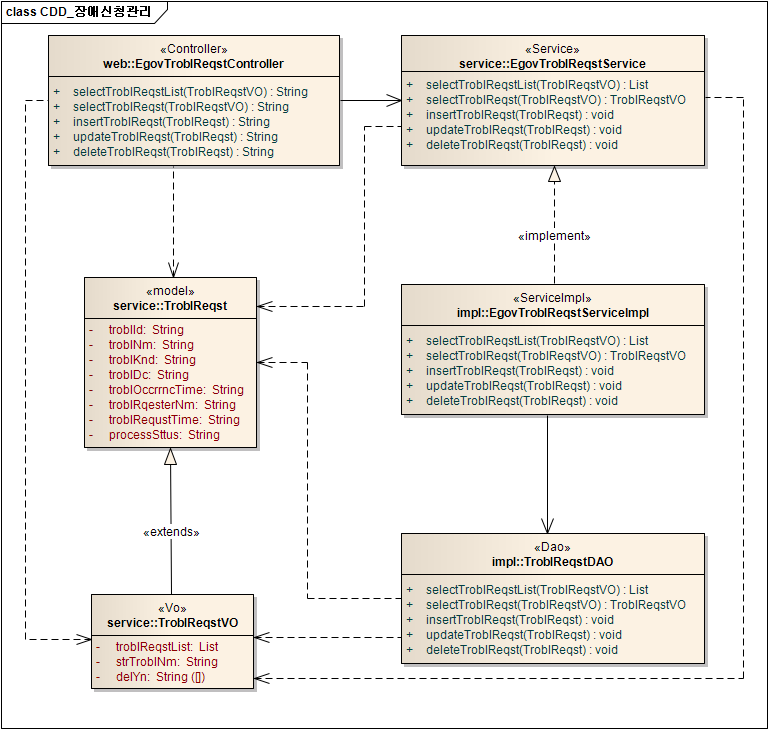
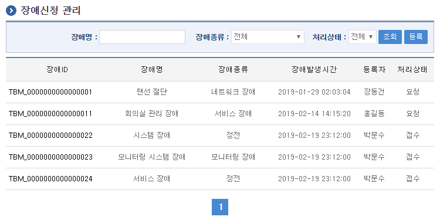
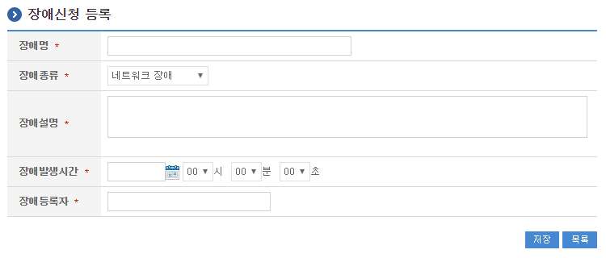
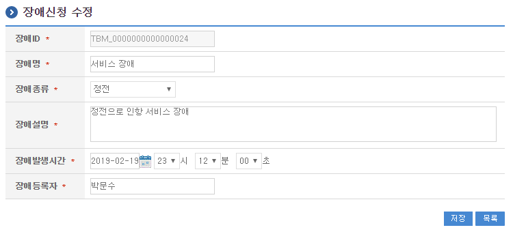
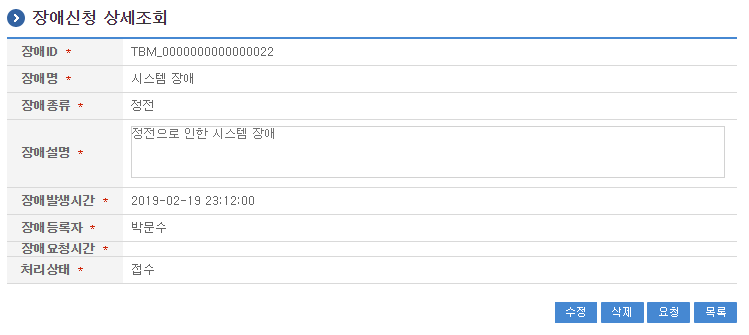
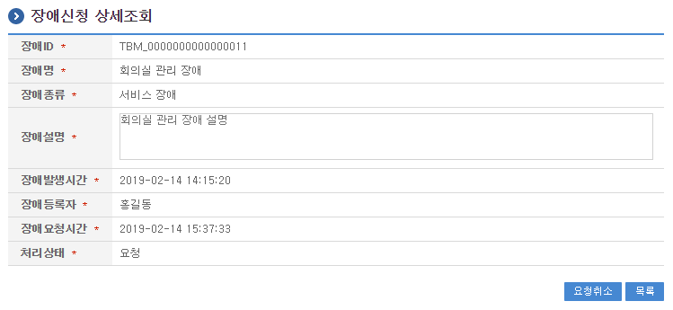

# 장애신청관리

## 개요

 장애신청관리는 시스템 장애발생 시 장애내역을 등록하고 처리를 요청하는 기능을 제공한다.

## 설명

 장애신청관리는 장애신청 정보를 관리하기 위한 목적으로 장애신청 정보의 등록, 수정, 삭제, 조회, 목록조회의 기능을 수반한다.

```text
  ① 장애신청목록조회 : 장애신청으로 정의된 정보를 최근 등록 순서대로 조회하고, 그 결과 목록을 화면에 반영한다.
  ② 장애신청등록 : 장애신청정보를 등록하고, 등록 결과를 조회한다.
  ③ 장애신청수정 : 기 등록된 장애신청정보의 항목들을 수정한다.
  ④ 장애신청삭제 : 기 등록된 장애신청정보를 삭제한다.
  ⑤ 장애신청상세조회 : 등록된 장애신청정보를 조회한다.
```

#### 관련소스

| 유형 | 대상소스명 | 비고 |
| --- | --- | --- |
| Controller | egovframework.com.sym.tbm.tbr.web.EgovTroblReqstController.java | 장애신청정보 관리를 위한 controller 클래스 |
| Service | egovframework.com.sym.tbm.tbr.service.EgovTroblReqstService.java | 장애신청정보 관리를 위한 Service Interface |
| ServiceImpl | egovframework.com.sym.tbm.tbr.service.impl.EgovTroblReqstServiceImpl.java | 장애신청정보 관리를 위한 서비스 구현 클래스 |
| DAO | egovframework.com.sym.tbm.tbr.service.impl.TroblReqstDAO.java | 장애신청정보 관리를 위한 데이터처리 클래스 |
| Model | egovframework.com.sym.tbm.tbr.service.TroblReqst.java | 장애신청정보 관리를 위한 Model 클래스 |
| VO | egovframework.com.sym.tbm.tbr.service.TroblReqstVO.java | 장애신청정보 관리를 위한 VO 클래스 |
| JSP | /WEB-INF/jsp/egovframework/com/sym/tbm/tbr/EgovTroblReqstList.jsp | 장애신청정보 목록조회를 위한 jsp페이지 |
| JSP | /WEB-INF/jsp/egovframework/com/sym/tbm/tbr/EgovTroblReqstRegist.jsp | 장애신청정보 등록를 위한 jsp페이지 |
| JSP | /WEB-INF/jsp/egovframework/com/sym/tbm/tbr/EgovTroblReqstUpdt.jsp | 장애신청정보 수정를 위한 jsp페이지 |
| JSP | /WEB-INF/jsp/egovframework/com/sym/tbm/tbr/EgovTroblReqstDetail.jsp | 등록된 장애신청정보를 조회하기 위한 jsp페이지 |
| Query XML | resources/egovframework/mapper/com/sym/tbm/tbr/EgovTroblReqst\_SQL\_altibase.xml | 장애신청정보 관리를 위한 Altibase용 Query XML |
| Query XML | resources/egovframework/mapper/com/sym/tbm/tbr/EgovTroblReqst\_SQL\_cubrid.xml | 장애신청정보 관리를 위한 Cubrid용 Query XML |
| Query XML | resources/egovframework/mapper/com/sym/tbm/tbr/EgovTroblReqst\_SQL\_maria.xml | 장애신청정보 관리를 위한 MariaDB용 Query XML |
| Query XML | resources/egovframework/mapper/com/sym/tbm/tbr/EgovTroblReqst\_SQL\_mysql.xml | 장애신청정보 관리를 위한 MySQL용 Query XML |
| Query XML | resources/egovframework/mapper/com/sym/tbm/tbr/EgovTroblReqst\_SQL\_oracle.xml | 장애신청정보 관리를 위한 Oracle용 Query XML |
| Query XML | resources/egovframework/mapper/com/sym/tbm/tbr/EgovTroblReqst\_SQL\_postgres.xml | 장애신청정보 관리를 위한 PostgreSQL용 Query XML |
| Query XML | resources/egovframework/mapper/com/sym/tbm/tbr/EgovTroblReqst\_SQL\_tibero.xml | 장애신청정보 관리를 위한 Tibero용 Query XML |
| Query XML | resources/egovframework/mapper/com/sym/tbm/tbr/EgovTroblReqst\_SQL\_goldilocks.xml | 장애신청정보 관리를 위한 Goldilocks용 Query XML |
| Message properties | resources/egovframework/message/com/sym/tbm/tbr/message\_en.properties | 장애신청정보 관리를 위한 Message properties(영문) |
| Message properties | resources/egovframework/message/com/sym/tbm/tbr/message\_ko.properties | 장애신청정보 관리를 위한 Message properties(한글) |
| Idgen XML | resources/egovframework/spring/com/idgn/context-idgn-Trobl.xml | 장애신청정보 관리를 위한 Id생성 Idgen XML |

#### 클래스 다이어그램

 

#### 관련테이블

| 테이블명 | 테이블명(영문) | 비고 |
| --- | --- | --- |
| 장애정보 | COMTNTROBLINFO | 시스템 장애발생 시 장애내역에 대한 정보를 관리한다. |

### ID Generation

#### ID Generation 관련 DDL 및 DML

 ID Generation Service를 활용하기 위해서 Sequence 저장테이블인  COMTECOPSEQ에 TROBL_ID 항목을 추가해야 한다.

```sql
    CREATE TABLE COMTECOPSEQ ( table_name varchar(16) NOT NULL, 
                               next_id DECIMAL(30) NOT NULL,
                               PRIMARY KEY (table_name)
    );
 
    INSERT INTO COMTECOPSEQ VALUES ('TROBL_ID','0');
```

#### ID Generation 환경설정(context-idgn-Trobl.xml)

```xml
    <bean name="egovTroblIdGnrService" class="egovframework.rte.fdl.idgnr.impl.EgovTableIdGnrServiceImpl" destroy-method="destroy">
        <property name="dataSource" ref="egov.dataSource" />
        <property name="strategy"   ref="TroblIdStrategy" />
        <property name="blockSize"  value="10" />
        <property name="table"      value="COMTECOPSEQ" />
        <property name="tableName"  value="TROBL_ID" />
    </bean>
    <bean name="TroblIdStrategy" class="egovframework.rte.fdl.idgnr.impl.strategy.EgovIdGnrStrategyImpl">
        <property name="prefix"     value="TBM_" />
        <property name="cipers"     value="16" />
        <property name="fillChar"   value="0" />
    </bean>
```

## 관련화면 및 수행메뉴얼

#### 장애신청 목록조회

| Action | URL | Controller method | QueryID |
| --- | --- | --- | --- |
| 조회 | /sym/tbm/tbr/selectTroblReqstList.do | selectTroblReqstList | "troblReqstDAO.selectTroblReqstList" |
|  |  |  | "troblReqstDAO.selectTroblReqstListTotCnt" |

 장애신청 목록은 페이지당 10건씩 조회되며 페이징은 10페이지씩 이루어진다.
 검색조건은 장애명, 장애종류, 처리상태에 대해서 수행된다.
 처리상태는 접수, 요청, 완료 등 3가지 상태를 나타내고, 최초 장애등록 시 접수상태가 되며, 해당 장애신청을 요청시 요청상태로 변경되고, 요청한 장애 신청건에 대하여 처리결과 등록 시 완료상태가 된다.
 요청상태에서는 장애신청 내용이 수정 불가능하며, 수정이 반드시 필요할 경우 요청취소를 한 뒤 해당 장애신청정보를 수정한다.

 

 조회 : 기 등록된 장애신청의 목록을 조회한다.
 등록 : 신규 장애신청를 등록하기 위해서는 상단의 등록 버튼을 통해서 장애신청 등록 화면으로 이동한다.
 상세조회 : 장애신청의 상세정보를 조회하기 위해 장애ID를 선택하여 장애신청 상세조회 화면으로 이동한다.

#### 장애신청 등록

| Action | URL | Controller method | QueryID |
| --- | --- | --- | --- |
| 등록 | /sym/tbm/tbr/addTroblReqst.do | insertTroblReqst | "troblReqstDAO.insertTroblReqst" |

 장애신청의 속성정보를 입력한 뒤 등록한다.

 

 저장 : 신규 장애신청을 등록하기 위해서는 장애신청 속성을 입력한 뒤 하단의 저장 버튼을 통해서 장애신청을 등록한다. 장애ID는 등록 시 자동으로 부여된다.
 목록 : 장애신청 상세조회 화면으로 이동한다.

#### 장애신청 수정

| Action | URL | Controller method | QueryID |
| --- | --- | --- | --- |
| 수정 | /sym/tbm/tbr/updtTroblReqst.do | updateTroblReqst | "troblReqstDAO.updateTroblReqst" |

 장애신청의 속성정보를 변경한 후 저장한다.

 

 저장 : 기 등록된 장애신청 속성을 수정한 뒤 하단의 저장 버튼을 통해서 장애신청을 수정한다.
 조회 : 장애신청 상세조회 화면으로 이동한다.

#### 장애신청 상세조회

| Action | URL | Controller method | QueryID |
| --- | --- | --- | --- |
| 상세조회 | /sym/tbm/tbr/getTroblReqst.do | selectTroblReqst | "troblReqstDAO.selectTroblReqst" |
| 삭제 | /sym/tbm/tbr/removeTroblReqst.do | deleteTroblReqst | "troblReqstDAO.deleteTroblReqst" |
| 요청 | /sym/tbm/tbr/requstTroblReqst.do | requstTroblReqst | "troblReqstDAO.requstTroblReqst" |
| 요청취소 | /sym/tbm/tbr/requstTroblReqstCancl.do | requstTroblReqstCancl | "troblReqstDAO.requstTroblReqst" |

 장애신청의 속성정보를 조회한다.

 

 수정 : 기 등록된 장애신청 속성을 수정한 뒤 하단의 수정 버튼을 통해서 장애신청수정 화면으로 이동한다.
 삭제 : 기 등록된 장애신청을 삭제한다.
 요청 : 장애신청에 대한 처리요청을 한다.
 목록 : 장애신청 목록조회 화면으로 이동한다.

 

 요청취소 : 장애신청에 대한 처리요청 취소를 한다.
 목록 : 장애신청 목록조회 화면으로 이동한다.
