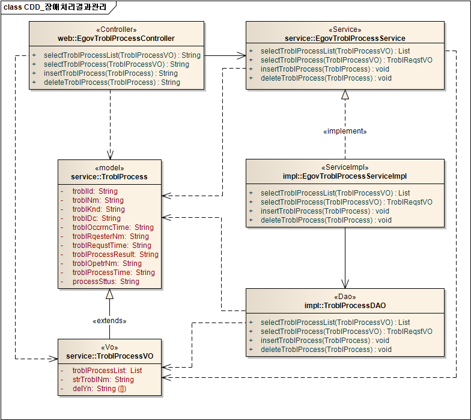
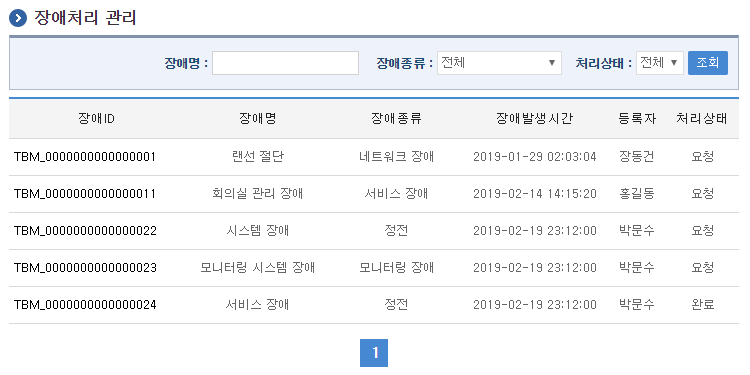
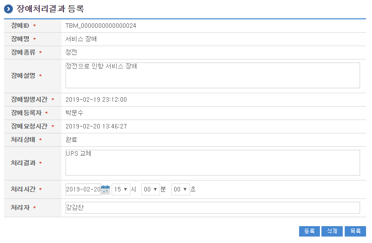

# 장애처리결과관리

## 개요

 장애처리결과관리는 시스템 장애발생 시 장애조치내역을 등록하고 처리결과를 조회하는 기능을 제공한다.

## 설명

 장애처리결과관리는 장애처리결과 정보를 관리하기 위한 목적으로 장애신청 정보의 등록, 수정, 삭제, 조회, 목록조회의 기능을 수반한다.

```text
  ① 장애처리목록조회 : 장애처리로 정의된 정보를 최근 등록 순서대로 조회하고, 그 결과 목록을 화면에 반영한다.
  ② 장애처리결과등록 : 장애처리결과정보를 등록하고, 등록 결과를 조회한다.
```

### 관련소스

| 유형 | 대상소스명 | 비고 |
| --- | --- | --- |
| Controller | egovframework.com.sym.tbm.tbp.web.EgovTroblProcessController.java | 장애처리결과정보 관리를 위한 controller 클래스 |
| Service | egovframework.com.sym.tbm.tbp.service.EgovTroblProcessService.java | 장애처리결과정보 관리를 위한 Service Interface |
| ServiceImpl | egovframework.com.sym.tbm.tbp.service.impl.EgovTroblProcessServiceImpl.java | 장애처리결과정보 관리를 위한 서비스 구현 클래스 |
| DAO | egovframework.com.sym.tbm.tbp.service.impl.TroblProcessDAO.java | 장애처리결과정보 관리를 위한 데이터처리 클래스 |
| Model | egovframework.com.sym.tbm.tbp.service.TroblProcess.java | 장애처리결과정보 관리를 위한 Model 클래스 |
| VO | egovframework.com.sym.tbm.tbp.service.TroblProcessVO.java | 장애처리결과정보 관리를 위한 VO 클래스 |
| JSP | /WEB-INF/jsp/egovframework/com/sym/tbm/tbp/EgovTroblProcessList.jsp | 장애처리결과정보 목록조회를 위한 jsp페이지 |
| JSP | /WEB-INF/jsp/egovframework/com/sym/tbm/tbp/EgovTroblProcessRegist.jsp | 장애처리결과정보 등록을 위한 jsp페이지 |
| Query XML | resources/egovframework/mapper/com/sym/tbm/tbp/EgovTroblProcess\_SQL\_altibase.xml | 장애처리결과정보 관리를 위한 Altibase용 Query XML |
| Query XML | resources/egovframework/mapper/com/sym/tbm/tbp/EgovTroblProcess\_SQL\_cubrid.xml | 장애처리결과정보 관리를 위한 Cubrid용 Query XML |
| Query XML | resources/egovframework/mapper/com/sym/tbm/tbp/EgovTroblProcess\_SQL\_maria.xml | 장애처리결과정보 관리를 위한 MariaDB용 Query XML |
| Query XML | resources/egovframework/mapper/com/sym/tbm/tbp/EgovTroblProcess\_SQL\_mysql.xml | 장애처리결과정보 관리를 위한 MySQL용 Query XML |
| Query XML | resources/egovframework/mapper/com/sym/tbm/tbp/EgovTroblProcess\_SQL\_oracle.xml | 장애처리결과정보 관리를 위한 Oracle용 Query XML |
| Query XML | resources/egovframework/mapper/com/sym/tbm/tbp/EgovTroblProcess\_SQL\_postgres.xml | 장애처리결과정보 관리를 위한 PostgreSQL용 Query XML |
| Query XML | resources/egovframework/mapper/com/sym/tbm/tbp/EgovTroblProcess\_SQL\_tibero.xml | 장애처리결과정보 관리를 위한 Tibero용 Query XML |
| Query XML | resources/egovframework/mapper/com/sym/tbm/tbp/EgovTroblProcess\_SQL\_goldilocks.xml | 장애처리결과정보 관리를 위한 Goldilocks용 Query XML |
| Message properties | resources/egovframework/message/com/sym/tbm/tbp/message\_en.properties | 장애처리결과정보 관리를 위한 Message properties(영문) |
| Message properties | resources/egovframework/message/com/sym/tbm/tbp/message\_ko.properties | 장애처리결과정보 관리를 위한 Message properties(한글) |

### 클래스 다이어그램

 

### 관련테이블

| 테이블명 | 테이블명(영문) | 비고 |
| --- | --- | --- |
| 장애정보 | COMTNTROBLINFO | 시스템 장애발생 시 장애내역에 대한 정보를 관리한다. |

## 관련화면 및 수행메뉴얼

### 장애처리 목록조회

| Action | URL | Controller method | QueryID |
| --- | --- | --- | --- |
| 조회 | /sym/tbm/tbp/selectTroblProcessList.do | selectTroblProcessList | "troblProcessDAO.selectTroblProcessList" |
|  |  |  | "troblProcessDAO.selectTroblProcessListTotCnt" |

 장애처리 목록은 페이지당 10건씩 조회되며 페이징은 10페이지씩 이루어진다.
 검색조건은 장애명에 대해서 수행된다.

 

 조회 : 기 등록된 장애처리대상 목록을 조회한다.
 등록 : 장애처리결과를 등록하기 위해서는 장애ID를 선택하여 장애처리결과 등록 화면으로 이동한다.

### 장애처리결과 등록

| Action | URL | Controller method | QueryID |
| --- | --- | --- | --- |
| 등록 | /sym/tbm/tbp/addTroblProcess.do | insertTroblProcess | "troblProcessDAO.insertTroblProcess" |
| 삭제 | /sym/tbm/tbp/removeTroblProcess.do | deleteTroblProcess | "troblProcessDAO.deleteTroblProcess" |

 장애처리결과의 속성정보를 입력한 뒤 등록하거나 삭제한다.

 

 등록 : 장애처리결과를 등록하기 위해서는 장애처리결과 속성을 입력한 뒤 하단의 등록 버튼을 통해서 장애처리결과를 등록한다.
 삭제 : 기 등록된 장애처리결과를 삭제하기 위해서는 하단의 삭제 버튼을 통해서 장애처리결과를 삭제한다.
 목록 : 장애처리 목록조회 화면으로 이동한다.
