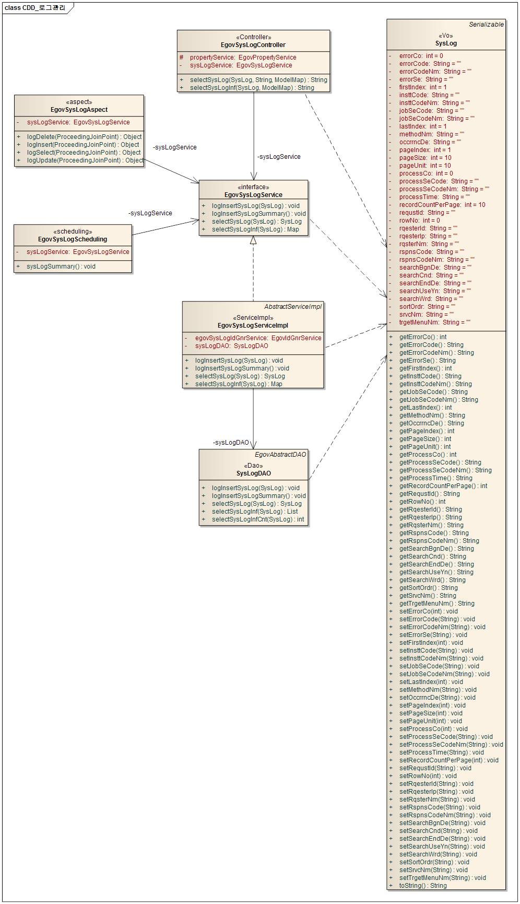
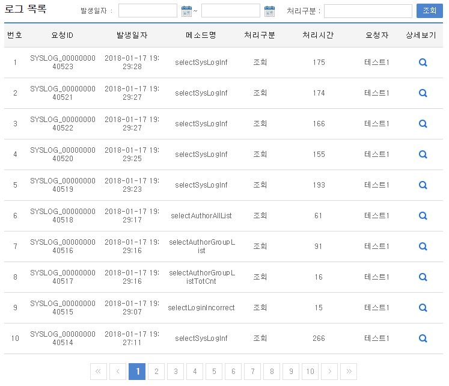
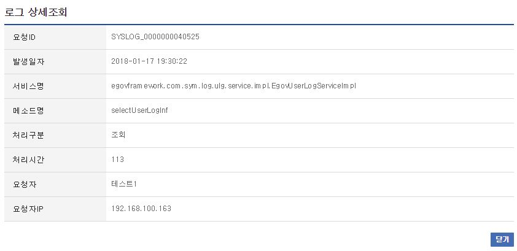

# 로그관리

## 개요

 로그관리는 시스템 사용시 발생하는 각종 로그를 검색, 조회하는 기능을 제공한다.

## 설명

 로그조회는 시스템로그의 등록, 조회, 목록, 삭제, 요약의 기능을 수반한다.

 ① 로그등록 : 로그정보를 등록한다. - AOP 기능을 이용
 ② 로그조회 : 로그정보의 상세내용을 조회한다.
 ③ 로그목록 : 로그정보의 목록을 검색, 조회한다.
 ④ 로그삭제 : 로그정보를 삭제한다. - 실행환경의 Scheduling 기능을 이용
 ⑤ 로그요약 : 로그정보를 요약하여 Summary를 생성한다. - 실행환경의 Scheduling 기능을 이용

### 패키지 참조 관계

 로그관리 패키지는 요소기술의 공통(cmm) 패키지에 대해서만 직접적인 함수적 참조 관계를 가진다.
 패키지 간 참조 관계 : [시스템관리 Package Dependency](../intro/package-reference.md#시스템관리)

### 관련소스

| 유형 | 대상소스명 | 비고 |
| --- | --- | --- |
| Controller | egovframework.com.sym.log.lgm.web.EgovSysLogController.java | 로그관리를 위한 컨트롤러 클래스 |
| Service | egovframework.com.sym.log.lgm.service.EgovSysLogService.java | 로그관리를 위한  서비스 인터페이스 |
| ServiceImpl | egovframework.com.sym.log.lgm.service.impl.EgovSysLogServiceImpl.java | 로그관리를 위한 서비스 구현 클래스 |
| Model | egovframework.com.sym.log.lgm.service.SysLog.java | 로그관리를 위한 Model 클래스 |
| DAO | egovframework.com.sym.log.lgm.service.impl.SysLogDAO.java | 로그관리를 위한 데이터처리 클래스 |
| Aspect | egovframework.com.sym.log.lgm.service.EgovSysLogAspect.java | 로그 등록을 위한 Aspect 클래스 |
| Scheduler | egovframework.com.sym.log.lgm.service.EgovSysLogScheduling.java | 로그 삭제, 요약을 위한 Scheduling 클래스 |
| JSP | /WEB-INF/jsp/egovframework/com/sym/log/lgm/EgovSysLogList.jsp | 로그 목록을 위한 jsp페이지 |
| JSP | /WEB-INF/jsp/egovframework/com/sym/log/lgm/EgovSysLogDetail.jsp | 로그 조회를 위한 jsp페이지 |
| Query XML | resources/egovframework/mapper/com/sym/log/lgm/EgovSysLog\_SQL\_altibase.xml | 로그관리를 위한 Altibase용 Query XML |
| Query XML | resources/egovframework/mapper/com/sym/log/lgm/EgovSysLog\_SQL\_cubrid.xml | 로그관리를 위한 Cubrid용 Query XML |
| Query XML | resources/egovframework/mapper/com/sym/log/lgm/EgovSysLog\_SQL\_maria.xml | 로그관리를 위한 MariaDB용 Query XML |
| Query XML | resources/egovframework/mapper/com/sym/log/lgm/EgovSysLog\_SQL\_mysql.xml | 로그관리를 위한 MySQL용 Query XML |
| Query XML | resources/egovframework/mapper/com/sym/log/lgm/EgovSysLog\_SQL\_oracle.xml | 로그관리를 위한 Oracle용 Query XML |
| Query XML | resources/egovframework/mapper/com/sym/log/lgm/EgovSysLog\_SQL\_postgres.xml | 로그관리를 위한 PostgreSQL용 Query XML |
| Query XML | resources/egovframework/mapper/com/sym/log/lgm/EgovSysLog\_SQL\_tibero.xml | 로그관리를 위한 Tibero용 Query XML |
| Query XML | resources/egovframework/mapper/com/sym/log/lgm/EgovSysLog\_SQL\_goldilocks.xml | 로그관리를 위한 Goldilocks용 Query XML |
| Idgen XML | resources/egovframework/spring/com/idgn/context-idgn-SysLog.xml | 로그관리 Id생성 Idgen XML |
| Scheduler XML | resources/egovframework/spring/com/scheduling/context-scheduling-sym-log-lgm.xml | 로그관리 Scheduler 설정 XML |
| AOP XML | resources/egovframework/spring/com/context-syslogaop.xml | 로그관리 AOP 설정 XML |
| Message properties | resources/egovframework/message/com/sym/log/lgm/message\_ko.properties | 로그관리를 위한 Message properties(한글) |
| Message properties | resources/egovframework/message/com/sym/log/lgm/message\_en.properties | 로그관리를 위한 Message properties(영문) |

### 클래스 다이어그램

 

### ID Generation

#### ID Generation 관련 DDL 및 DML

 ID Generation Service를 활용하기 위해서 Sequence 저장테이블인 COMTECOPSEQ에 SYSLOG_ID 항목을 추가한다.

```sql
CREATE TABLE COMTECOPSEQ( TABLE_NAME VARCHAR(20) NOT NULL,
	                  NEXT_ID    NUMERIC(30) NULL,
	                  PRIMARY KEY (TABLE_NAME));
 
  INSERT INTO COMTECOPSEQ VALUES('SYSLOG_ID','1');
```

#### ID Generation 환경설정(context-idgn-SysLog.xml)

```xml
<bean name="egovSysLogIdGnrService"
    class="egovframework.rte.fdl.idgnr.impl.EgovTableIdGnrService"
    destroy-method="destroy">
    <property name="dataSource" ref="egov.dataSource" />
    <property name="strategy"   ref="sysLogStrategy" />
    <property name="blockSize"  value="10"/>
    <property name="table"      value="COMTECOPSEQ"/>
    <property name="tableName"  value="SYSLOG_ID"/>
  </bean>
 
  <bean name="sysLogStrategy"
    class="egovframework.rte.fdl.idgnr.impl.strategy.EgovIdGnrStrategyImpl">
    <property name="prefix" value="SYSLOG_" />
    <property name="cipers" value="13" />
    <property name="fillChar" value="0" />
  </bean>
```

### 테이블

| 테이블명 | 테이블명(영문) | 비고 |
| --- | --- | --- |
| 시스템로그 | COMTNSYSLOG | 시스템로그 정보를 관리한다. |
| 시스템로그요약 | COMTSSYSLOGSUMMARY | 시스템로그 요약정보를 관리한다. |

### AOP

#### context-syslogaop.xml

```xml
<bean id="syslog" class="egovframework.com.sym.log.lgm.service.EgovSysLogAspect" />
 
	<aop:config>
		<aop:aspect id="sysLogAspect" ref="syslog">
			<!--  insert로 시작되는 service Method -->
			<aop:around pointcut="execution(public * egovframework.com..impl.*Impl.insert*(..))" method="logInsert" />
			<!--  update로 시작되는 service Method -->
			<aop:around pointcut="execution(public * egovframework.com..impl.*Impl.update*(..))" method="logUpdate" />
			<!--  delete로 시작되는 service Method -->
			<aop:around pointcut="execution(public * egovframework.com..impl.*Impl.delete*(..))" method="logDelete" />
			<!--  select로 시작되는 service Method -->
			<aop:around pointcut="execution(public * egovframework.com..impl.*Impl.select*(..))" method="logSelect" />
		</aop:aspect>
	</aop:config>
```

 시스템로그 등록 기능구현을 위하여 AOP를 설정한다.
 시스템로그 등록 기능구현을 위하여 EgovSysLogAspect 클래스를 생성한다.

```java
package egovframework.com.sym.log.lgm.service;
import javax.annotation.Resource;
import org.aspectj.lang.ProceedingJoinPoint;
import org.springframework.util.StopWatch;
import egovframework.com.cmm.LoginVO;
import egovframework.com.cmm.util.EgovUserDetailsHelper;
public class EgovSysLogAspect {
@Resource(name="EgovSysLogService")
private EgovSysLogService sysLogService;
/**
* 시스템 로그정보를 생성한다.
* service Class의 insert로 시작되는 Method
*
* @param ProceedingJoinPoint
* @return Object
* @throws Exception
*/
public Object logInsert(ProceedingJoinPoint joinPoint) throws Throwable {
StopWatch stopWatch = new StopWatch();
try {
stopWatch.start();
Object retValue = joinPoint.proceed();
return retValue;
} catch (Throwable e) {
throw e;
} finally {
stopWatch.stop();
SysLog sysLog = new SysLog();
String className = joinPoint.getTarget().getClass().getName();
String methodName = joinPoint.getSignature().getName();
String processSeCode = "C";
String processTime = Long.toString(stopWatch.getTotalTimeMillis());
String uniqId = "";
String ip = "";
/* Authenticated  */
Boolean isAuthenticated = EgovUserDetailsHelper.isAuthenticated();
if(isAuthenticated.booleanValue()) {
LoginVO user = (LoginVO)EgovUserDetailsHelper.getAuthenticatedUser();
uniqId = user.getUniqId();
ip = user.getIp();
}
sysLog.setSrvcNm(className);
sysLog.setMethodNm(methodName);
sysLog.setProcessSeCode(processSeCode);
sysLog.setProcessTime(processTime);
sysLog.setRqesterId(uniqId);
sysLog.setRqesterIp(ip);
sysLogService.logInsertSysLog(sysLog);
}
}
/**
* 시스템 로그정보를 생성한다.
* service Class의 update로 시작되는 Method
*
* @param ProceedingJoinPoint
* @return Object
* @throws Exception
*/
public Object logUpdate(ProceedingJoinPoint joinPoint) throws Throwable {
StopWatch stopWatch = new StopWatch();
try {
stopWatch.start();
Object retValue = joinPoint.proceed();
return retValue;
} catch (Throwable e) {
throw e;
} finally {
stopWatch.stop();
SysLog sysLog = new SysLog();
String className = joinPoint.getTarget().getClass().getName();
String methodName = joinPoint.getSignature().getName();
String processSeCode = "U";
String processTime = Long.toString(stopWatch.getTotalTimeMillis());
String uniqId = "";
String ip = "";
/* Authenticated  */
Boolean isAuthenticated = EgovUserDetailsHelper.isAuthenticated();
if(isAuthenticated.booleanValue()) {
LoginVO user = (LoginVO)EgovUserDetailsHelper.getAuthenticatedUser();
uniqId = user.getUniqId();
ip = user.getIp();
}
sysLog.setSrvcNm(className);
sysLog.setMethodNm(methodName);
sysLog.setProcessSeCode(processSeCode);
sysLog.setProcessTime(processTime);
sysLog.setRqesterId(uniqId);
sysLog.setRqesterIp(ip);
sysLogService.logInsertSysLog(sysLog);
}
}
/**
* 시스템 로그정보를 생성한다.
* service Class의 delete로 시작되는 Method
*
* @param ProceedingJoinPoint
* @return Object
* @throws Exception
*/
public Object logDelete(ProceedingJoinPoint joinPoint) throws Throwable {
StopWatch stopWatch = new StopWatch();
try {
stopWatch.start();
Object retValue = joinPoint.proceed();
return retValue;
} catch (Throwable e) {
throw e;
} finally {
stopWatch.stop();
SysLog sysLog = new SysLog();
String className = joinPoint.getTarget().getClass().getName();
String methodName = joinPoint.getSignature().getName();
String processSeCode = "D";
String processTime = Long.toString(stopWatch.getTotalTimeMillis());
String uniqId = "";
String ip = "";
/* Authenticated  */
Boolean isAuthenticated = EgovUserDetailsHelper.isAuthenticated();
if(isAuthenticated.booleanValue()) {
LoginVO user = (LoginVO)EgovUserDetailsHelper.getAuthenticatedUser();
uniqId = user.getUniqId();
ip = user.getIp();
}
sysLog.setSrvcNm(className);
sysLog.setMethodNm(methodName);
sysLog.setProcessSeCode(processSeCode);
sysLog.setProcessTime(processTime);
sysLog.setRqesterId(uniqId);
sysLog.setRqesterIp(ip);
sysLogService.logInsertSysLog(sysLog);
}
}
/**
* 시스템 로그정보를 생성한다.
* service Class의 select로 시작되는 Method
*
* @param ProceedingJoinPoint
* @return Object
* @throws Exception
*/
public Object logSelect(ProceedingJoinPoint joinPoint) throws Throwable {
StopWatch stopWatch = new StopWatch();
try {
stopWatch.start();
Object retValue = joinPoint.proceed();
return retValue;
} catch (Throwable e) {
throw e;
} finally {
stopWatch.stop();
SysLog sysLog = new SysLog();
String className = joinPoint.getTarget().getClass().getName();
String methodName = joinPoint.getSignature().getName();
String processSeCode = "R";
String processTime = Long.toString(stopWatch.getTotalTimeMillis());
String uniqId = "";
String ip = "";
/* Authenticated  */
Boolean isAuthenticated = EgovUserDetailsHelper.isAuthenticated();
if(isAuthenticated.booleanValue()) {
LoginVO user = (LoginVO)EgovUserDetailsHelper.getAuthenticatedUser();
uniqId = user.getUniqId();
ip = user.getIp();
}
sysLog.setSrvcNm(className);
sysLog.setMethodNm(methodName);
sysLog.setProcessSeCode(processSeCode);
sysLog.setProcessTime(processTime);
sysLog.setRqesterId(uniqId);
sysLog.setRqesterIp(ip);
sysLogService.logInsertSysLog(sysLog);
}
}
}
```


### Scheduling

#### context-scheduling-sym-log-lgm.xml  (src/main/resources/egovframework/spring/com/scheduling/context-scheduling-sym-log-lgm.xml)

```xml
<!-- 시스템 로그 요약  -->
	<bean id="sysLogging" class="org.springframework.scheduling.quartz.MethodInvokingJobDetailFactoryBean">
		<property name="targetObject" ref="egovSysLogScheduling" />
		<property name="targetMethod" value="sysLogSummary" />
		<property name="concurrent" value="false" />
	</bean>
 
	<!-- 시스템 로그 요약  트리거-->
	<bean id="sysLogTrigger" class="org.springframework.scheduling.quartz.SimpleTriggerFactoryBean">
		<property name="jobDetail" ref="sysLogging" />
		<!-- 시작하고 1분후에 실행한다. (milisecond) -->
		<property name="startDelay" value="60000" />
		<!-- 매 1시간마다 실행한다. (milisecond) -->
		<property name="repeatInterval" value="3600000" />
	</bean>
 
	<!-- 시스템 로그 요약 스케줄러 -->
	<bean id="sysLogScheduler" class="org.springframework.scheduling.quartz.SchedulerFactoryBean">
		<property name="triggers">
			<list>
				<ref bean="sysLogTrigger" />				
			</list>
		</property>
	</bean>
```

 시스템로그 삭제, 요약 기능구현을 위하여 Scheduling을 설정한다.
 시스템로그 삭제, 요약 기능구현을 위하여 EgovLogManageScheduling 클래스를 생성한다.

```java
@Service("egovSysLogScheduling")
public class EgovSysLogScheduling extends EgovAbstractServiceImpl {
@Resource(name="EgovSysLogService")
private EgovSysLogService sysLogService;
/**
* 시스템 로그정보를 요약한다.
* 전날의 로그를 요약하여 입력하고, 6개월전의 로그를 삭제한다.
*
* @param
* @return
* @throws Exception
*/
public void sysLogSummary() throws Exception {
sysLogService.logInsertSysLogSummary();
}
}
```

## 관련기능

 로그관리는 로그 목록조회, 로그 상세조회 기능으로 구분된다.

### 로그 목록조회

#### 비즈니스 규칙

 시스템로그 목록은 페이지 당 10건씩 조회되며 페이징은 10페이지씩 이루어진다.
 검색조건은 발생일자와 처리구분에 대해서 수행된다.
 시스템로그 상세조회 기능을 수행하기 위해서는 상세보기 버튼을 클릭한다.

#### 관련코드

 N/A

#### 관련화면 및 수행매뉴얼

| Action | URL | Controller method | SQL Namespace | SQL QueryID |
| --- | --- | --- | --- | --- |
| 목록조회 | /sym/log/lgm/SelectSysLogList.do | selectSysLogInf | "SysLog" | "selectSysLogInf" |
|  |  |  | "SysLog" | "selectSysLogInfCnt" |

 

 조회: 조회하기 위해서는 발생일자/처리구분 조건을 입력한 후 조회 버튼을 클릭한다.
 목록클릭: 로그관리 상세조회 화면으로 이동한다.

### 시스템로그 상세조회

#### 비즈니스 규칙

 시스템로그 상세조회는 팝업창으로 구성되며, 닫기 버튼을 클릭하면 창을 닫는다.

#### 관련코드

 N/A

#### 관련화면 및 수행매뉴얼

| Action | URL | Controller method | SQL Namespace | SQL QueryID |
| --- | --- | --- | --- | --- |
| 상세조회 | /sym/log/lgm/SelectSysLogDetail.do | selectSysLog | "SysLog" | "selectSysLog" |

 

## 참고자료

 실행환경 참조 : [AOP](/egovframe-runtime/foundation-layer-core/aop.md)
 실행환경 참조 : [Scheduling](/egovframe-runtime/foundation-layer/scheduling.md)
 실행환경 참조 : [ID Generation](/egovframe-runtime/foundation-layer/id-generation.md)
