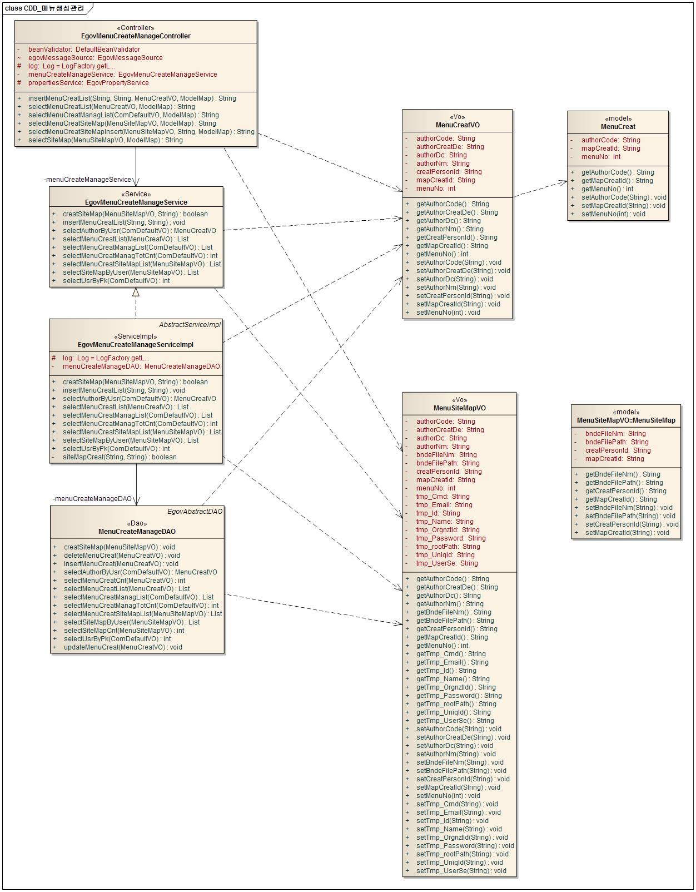
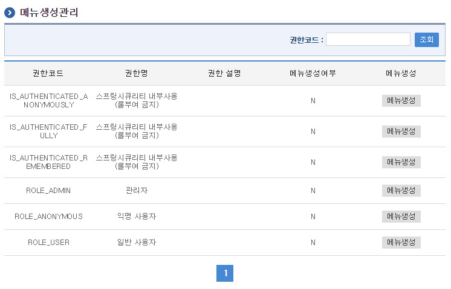
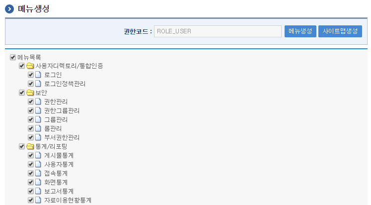
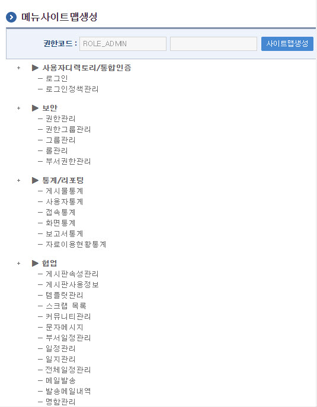

# 메뉴생성관리

## 개요

 메뉴생성관리는 시스템 관리자가 메뉴목록으로 조회된 트리형태의 메뉴를 각 사용자의 권한에 따라 메뉴사용 여부를 정의하여 로그인시 해당 사용자 권한을 확인 후 해당 권한 페이지만 메뉴에 나타나도록 관리한다.
 권한에 대한 자세한 내용은 [권한관리 기능](../security/authority-management-function.md)에 자세한 설명이 되어 있다.
 메뉴를 생성한 후 메뉴생성에 맞는 메뉴 사이트맵을 생성 할 수 있으며 사이트맵 생성은 jsp페이지로 만들어진다.

## 설명

### 패키지 참조 관계

 메뉴생성관리 패키지는 요소기술의 공통 패키지(cmm)와 프로그램관리 패키지에 대해서만 직접적인 함수적 참조 관계를 가진다. 하지만, 컴포넌트 배포 시 오류 없이 실행되기 위하여 패키지 간의 참조관계에 따라 메일연동 인터페이스, 바로가기메뉴관리, 메뉴관리, 사이트맵, 프로그램관리, 포맷/날짜/계산, 시스템(sim), 달력, 웹에디터, 우편번호 패키지와 함께 배포 파일을 구성한다.
- 패키지 간 참조 관계 : [시스템관리 Package Dependency](../intro/package-reference.md#시스템관리)

### 관련소스

| 유형 | 대상소스명 | 비고 |
| --- | --- | --- |
| Controller | egovframework.com.sym.mnu.mcm.web.EgovMenuCreateManageController.java | 메뉴생성을 위한 컨트롤러 클래스 |
| Service | egovframework.com.sym.mnu.mcm.service.EgovMenuCreateManageService.java | 메뉴생성을 위한 서비스 인터페이스 |
| ServiceImpl | egovframework.com.sym.mnu.mcm.service.impl.EgovMenuCreateManageServiceImpl.java | 메뉴생성을 위한 서비스 구현 클래스 |
| Model | egovframework.com.sym.mnu.mcm.service.MenuCreat.java | 메뉴생성을 위한 Model 클래스 |
| Model | egovframework.com.sym.mnu.mcm.service.MenuSiteMap.java | 메뉴사이트맵 생성을 위한 Model 클래스 |
| VO | egovframework.com.sym.mnu.mcm.service.MenuCreatVO.java | 메뉴생성을 위한 VO 클래스 |
| VO | egovframework.com.sym.mnu.mcm.service.MenuSiteMapVO.java | 메뉴사이트맵 생성을 위한 VO 클래스 |
| DAO | egovframework.com.sym.mnu.mcm.service.impl.MenuCreateManageDAO.java | 메뉴생성을 위한 데이터처리 클래스 |
| JSP | /WEB-INF/jsp/egovframework/com/sym/mnu/mcm/EgovMenuCreatManage.jsp | 메뉴생성을 관리 하기 위한 페이지 |
| JSP | /WEB-INF/jsp/egovframework/com/sym/mnu/mcm/EgovMenuCreat.jsp | 메뉴생성을 위한 페이지 |
| JSP | /WEB-INF/jsp/egovframework/com/sym/mnu/mcm/EgovMenuCreatSiteMap.jsp | 메뉴 사이트맵 생성을 위한 팝업 페이지 |
| QUERY XML | resources/egovframework/mapper/com/sym/mnu/mcm/EgovMenuCreat\_SQL\_mysql.xml | 메뉴생성 MySQL용 QUERY XML |
| QUERY XML | resources/egovframework/mapper/com/sym/mnu/mcm/EgovMenuCreat\_SQL\_oracle.xml | 메뉴생성 Oracle용 QUERY XML |
| QUERY XML | resources/egovframework/mapper/com/sym/mnu/mcm/EgovMenuCreat\_SQL\_tibero.xml | 메뉴생성 Tibero용 QUERY XML |
| QUERY XML | resources/egovframework/mapper/com/sym/mnu/mcm/EgovMenuCreat\_SQL\_altibase.xml | 메뉴생성 Altibase용 QUERY XML |
| QUERY XML | resources/egovframework/mapper/com/sym/mnu/mcm/EgovMenuSiteMap\_SQL\_cubrid.xml | 메뉴생성 Cubrid용 QUERY XML |
| QUERY XML | resources/egovframework/mapper/com/sym/mnu/mcm/EgovMenuSiteMap\_SQL\_maria.xml | 메뉴생성 Maria용 QUERY XML |
| QUERY XML | resources/egovframework/mapper/com/sym/mnu/mcm/EgovMenuSiteMap\_SQL\_postgres.xml | 메뉴생성 Postgres용 QUERY XML |
| QUERY XML | resources/egovframework/mapper/com/sym/mnu/mcm/EgovMenuSiteMap\_SQL\_goldilocks.xml | 메뉴생성 Goldilocks용 QUERY XML |
| Message properties | resources/egovframework/message/com/message-common\_ko.properties | 메뉴 및 사이트맵생성 Message properties |
| Message properties | resources/egovframework/message/com/sym/mnu/mpm/message\_ko.properties | 메뉴생성 관리 Message properties(한글) |
| Message properties | resources/egovframework/message/com/sym/mnu/mpm/message\_en.properties | 메뉴생성 관리 Message properties(영문) |

### 클래스 다이어그램

 

### 관련테이블

| 테이블명 | 테이블명(영문) | 비고 |
| --- | --- | --- |
| 메뉴생성내역 | COMTNAUTHORINFO | 메뉴생성 정보을 관리한다. |
| 사이트맵 | COMTNMENUCREATDTLS | 사이트맵 생성 정보을 관리한다. |

## 관련기능

 메뉴생성관리기능은 크게 메뉴생성 목록조회, 메뉴생성, 사이트맵생성 기능으로 분류된다.

### 메뉴생성 목록조회

#### 비즈니스 규칙

 메뉴생성 목록은 페이지 당 10건씩 조회되며 페이징은 10페이지씩 이루어진다.
 검색조건은 권한코드에 대하여 수행된다.
 신규 메뉴를 생성하기 위해서는 조회된 권한별 메뉴생성 버튼을 통해서  메뉴생성  화면으로 이동한다.
 조회된 메뉴생성관리 화면의 리스트중 메뉴생성여부를 통하여 권한별 메뉴 생성여부(Y,N)를 확인 할 수 있다.
 생성된 메뉴는  메뉴생성  화면으로 이동 후 다시 생성 할 수 있다.
 보안설정대상ID에 사용자ID를 입력 후 조회 시 해당 사용자ID의 권한코드가 조회된다.

#### 관련코드

 N/A

#### 관련화면 및 수행매뉴얼

| Action | URL | Controller method | QueryID |
| --- | --- | --- | --- |
| 조회 | /sym/mnu/mcm/EgovMenuCreatManageSelect.do | selectMenuCreatManagList | "menuManageDAO.selectMenuCreatManageList\_D", |
|  |  |  | "menuManageDAO.selectMenuCreatManageTotCnt\_S" |

 

### 메뉴생성

#### 비즈니스 규칙

 메뉴생성화면에서 해당 권한에 필요한 메뉴를 선택한 후 메뉴생성 버튼을 클릭하여 메뉴를 생성한다.

#### 관련코드

 N/A

#### 관련화면 및 수행매뉴얼

| Action | URL | Controller method | QueryID |
| --- | --- | --- | --- |
| 조회 | /sym/mnu/mcm/EgovMenuCreatSelect.do | selectMenuCreatList | "menuManageDAO.selectMenuCreatList\_D" |
| 등록 | /sym/mnu/mcm/EgovMenuCreatInsert.do | insertMenuCreatList | "menuMamenuManageDAO.insertMenuCreat\_S" |

 

 메뉴생성 : 체크박스에 선택된메뉴를 해당 권한의 메뉴로 생성된다.
 사이트맵생성 : 사이트맵 생성 팝업 화면을 호출한다.

### 사이트맵 생성

#### 비즈니스 규칙

 메뉴생성화면에서 생성된 메뉴를 바탕으로 사이트 맵이 생성되므로 반드시 메뉴가 생성되어 있어야 한다.

#### 관련코드

 N/A

#### 관련화면 및 수행매뉴얼

| Action | URL | Controller method | QueryID |
| --- | --- | --- | --- |
| 조회 | /sym/mnu/mcm/EgovMenuCreatSiteMapSelect.do | selectMenuCreatSiteMap | "menuManageDAO.selectMenuCreatSiteMapList\_D" |
| 등록 | /sym/mnu/mcm/EgovMenuCreatSiteMapInsert.do | selectMenuCreatSiteMapInsert | "menuManageDAO.selectMenuCreatSiteMapList\_D", |
|  |  |  | "menuManageDAO.insertSiteMap\_S" |

 webapp의 절대path를 지정해야 한다. 변경대상 소스(/sym/mnu/mcm/EgovMenuCreatSiteMap.jsp)에서 수정해야한다.

```javascript

/*절대 path 사이트맵이 저장될 장소의  절대 패스*/
var vRootPath    = "D:/egovframework/workspace/com/src/main/webapp";   // Window webapp 위치
var vRootPath    = "/product/jeus/webhome/was_com/egovframework-com-1_0/egovframework-com-1_0_war___"; // Unix webapp 위치
/* 절대 path내  사이트맵 jsp를 저장할 장소 지정 */
var vSiteMapPath = "/html/egovframework/com/uss/umt/";
```

 사이트맵생성 버튼 클릭시 사이트맵 생성화면에서 조회된 사이트맵이 jsp파일로 /webapp/html/egovframework/com/sym/mnu/mcm/ 디렉토리에 '해당권한코드_SiteMap.jsp'파일이 생성된다.

 

 사이트맵생성: 설정된 정보를 바탕으로 사이트맵을 생성한다.
