# 메뉴관리

## 개요

 메뉴관리는 프로그램목록에 등록된 프로그램 파일명을 메뉴로 생성하여 해당 화면을 사용 할 수 있도록 메뉴목록을 관리하는데 목적이 있다.
 최초 메뉴등록 시 프로그램파일과 메뉴목록을 엑셀파일로 일괄등록할 수 있도록 되어 있다.
 기능흐름

 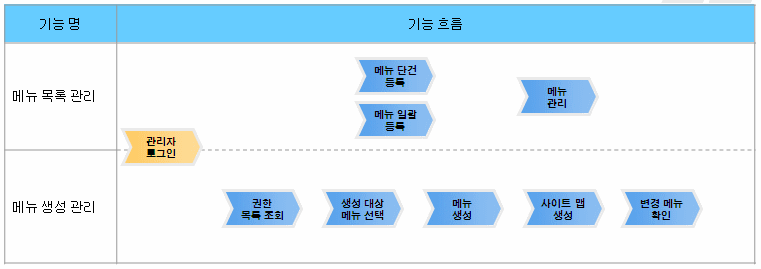

## 설명

### 패키지 참조 관계

 메뉴관리 패키지는 요소기술의 공통 패키지(cmm)와 프로그램관리 패키지에 대해서만 직접적인 함수적 참조 관계를 가진다. 하지만, 컴포넌트 배포 시 오류 없이 실행되기 위하여 패키지 간의 참조관계에 따라 메일연동 인터페이스, 바로가기메뉴관리, 메뉴생성관리, 사이트맵, 프로그램관리, 포맷/날짜/계산, 시스템(sim), 달력, 웹에디터, 우편번호 패키지와 함께 배포 파일을 구성한다.
- 패키지 간 참조 관계 : [시스템관리 Package Dependency](../intro/package-reference.md#시스템관리)

### 관련소스

| 유형 | 대상소스명 | 비고 |
| --- | --- | --- |
| Controller | egovframework.com.sym.mnu.mpm.web.EgovMenuManageController.java | 메뉴목록관리, 메뉴일괄생성, 메뉴리스트, 메뉴생성처리, 사이트맵 생성을 위한 컨트롤러 클래스 |
| Controller | egovframework.com.sym.mnu.mpm.web.EgovMainMenuManageController.java | 메인메뉴 링크처리 비즈니스 구현 컨트롤러 클래스 |
| Service | egovframework.com.sym.mnu.mpm.service.EgovMenuManageService.java | 메뉴목록관리, 메뉴일괄생성, 메뉴리스트, 메뉴생성처리, 사이트맵 생성을 위한 서비스 인터페이스 |
| ServiceImpl | egovframework.com.sym.mnu.mpm.service.impl.EgovMenuManageServiceImpl.java | 메뉴목록관리, 메뉴일괄생성, 메뉴리스트, 메뉴생성처리, 사이트맵 생성을 위한 서비스 구현 클래스 |
| VO | egovframework.com.sym.mnu.mpm.service.MenuManageVO.java | 메뉴목록관리를 위한 VO 클래스 |
| DAO | egovframework.com.sym.mnu.mpm.service.impl.MenuManageDAO.java | 메뉴목록관리, 메뉴일괄생성, 메뉴리스트, 메뉴생성처리, 사이트맵 생성을 위한 데이터처리 클래스 |
| JSP | /WEB-INF/jsp/egovframework/com/sym/mnu/mpm/EgovMenuManage.jsp | 메뉴목록 조회 및 멀티 삭제를 위한 목록조회 페이지 |
| JSP | /WEB-INF/jsp/egovframework/com/sym/mnu/mpm/EgovMenuRegist.jsp | 메뉴목록정보 등록을 위한 페이지 |
| JSP | /WEB-INF/jsp/egovframework/com/sym/mnu/mpm/EgovMenuDetailSelectUpdt.jsp | 메뉴목록 정보 상세조회 및 수정,삭제를 위한 페이지 |
| JSP | /WEB-INF/jsp/egovframework/com/sym/mnu/mpm/EgovMenuBndeRegist.jsp | 메뉴일괄생성을 위한 팝업 페이지 |
| JSP | /WEB-INF/jsp/egovframework/com/sym/prm/EgovFileNmSearch.jsp | 프로그램 파일명을 검색하기 위한 팝업 페이지 |
| JSP | /WEB-INF/jsp/egovframework/com/sym/mnu/mpm/EgovMenuList.jsp | 메뉴리스트 관리를 위한 페이지 |
| JSP | /WEB-INF/jsp/egovframework/com/sym/mnu/mpm/EgovMenuMvmn.jsp | 메뉴이동을 위한 팝업 페이지 |
| QUERY XML | resources/egovframework/mapper/com/sym/mnu/mpm/EgovMenuManage\_SQL\_mysql.xml | 메뉴관리 MySQL용 QUERY XML |
| QUERY XML | resources/egovframework/mapper/com/sym/mnu/mpm/EgovMenuManage\_SQL\_cubrid.xml | 메뉴관리 Cubrid용 QUERY XML |
| QUERY XML | resources/egovframework/mapper/com/sym/mnu/mpm/EgovMenuManage\_SQL\_oracle.xml | 메뉴관리 Oracle용 QUERY XML |
| QUERY XML | resources/egovframework/mapper/com/sym/mnu/mpm/EgovMenuManage\_SQL\_tibero.xml | 메뉴관리 Tibero용 QUERY XML |
| QUERY XML | resources/egovframework/mapper/com/sym/mnu/mpm/EgovMenuManage\_SQL\_altibase.xml | 메뉴관리 Altibase용 QUERY XML |
| QUERY XML | resources/egovframework/mapper/com/sym/mnu/mpm/EgovMenuManage\_SQL\_maria.xml | 메뉴관리 Maria용 QUERY XML |
| QUERY XML | resources/egovframework/mapper/com/sym/mnu/mpm/EgovMenuManage\_SQL\_postgres.xml | 메뉴관리 Postgres용 QUERY XML |
| QUERY XML | resources/egovframework/mapper/com/sym/mnu/mpm/EgovMenuManage\_SQL\_goldilocks.xml | 메뉴관리 Goldilocks용 QUERY XML |
| Message properties | resources/egovframework/message/com/message-common\_ko.properties | 메뉴관리 Message properties |
| Message properties | resources/egovframework/message/com/sym/mnu/mpm/message\_ko.properties | 메뉴관리 관리 Message properties(한글) |
| Message properties | resources/egovframework/message/com/sym/mnu/mpm/message\_en.properties | 메뉴관리 관리 Message properties(영문) |

### 클래스 다이어그램

 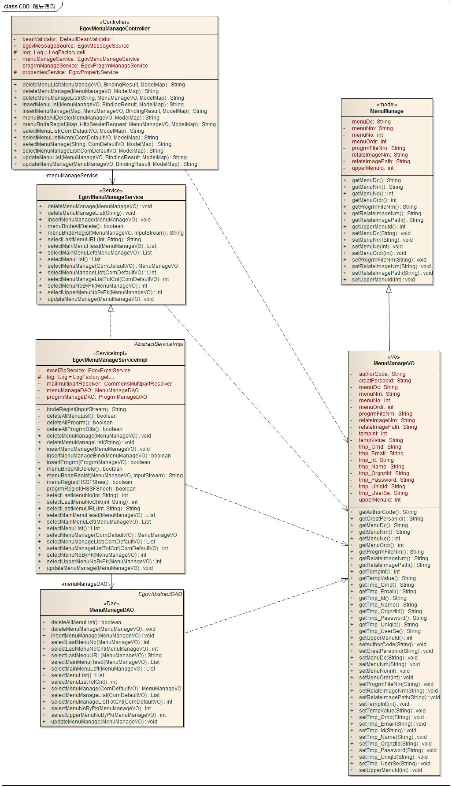

### 관련테이블

| 테이블명 | 테이블명(영문) | 비고 |
| --- | --- | --- |
| 메뉴정보 | COMTNMENUINFO | 메뉴목록 정보을 관리한다. |

## 관련기능

 메뉴관리는 메뉴목록조회, 메뉴 등록, 메뉴  상세조회/수정, 메뉴 일괄생성, 메뉴리스트관리로 구성되어 있다.

### 메뉴정보 목록조회

#### 비즈니스 규칙

 신규 메뉴를 등록하기 위해서는 상단의 등록 버튼을 통해서 메뉴정보 등록 화면으로 이동하고 기존 메뉴정보를 수정하고자 하는 경우 해당 메뉴명을 클릭하여 상세 조회 및 수정기능을 제공하는 메뉴상세조회/수정 화면으로 이동한다.
 메뉴 목록은 페이지 당 10건씩 조회되며 페이징은 10페이지씩 이루어진다.
 검색조건은 메뉴명에 대하여 수행된다.

#### 관련코드

 N/A

#### 관련화면 및 수행매뉴얼

| Action | URL | Controller method | QueryID |
| --- | --- | --- | --- |
| 조회 | /sym/mnu/mpm/EgovMenuManageSelect.do | selectMenuManageList | "menuManageDAO.selectMenuManageList\_D", |
|  |  |  | "menuManageDAO.selectMenuManageListTotCnt\_S" |

 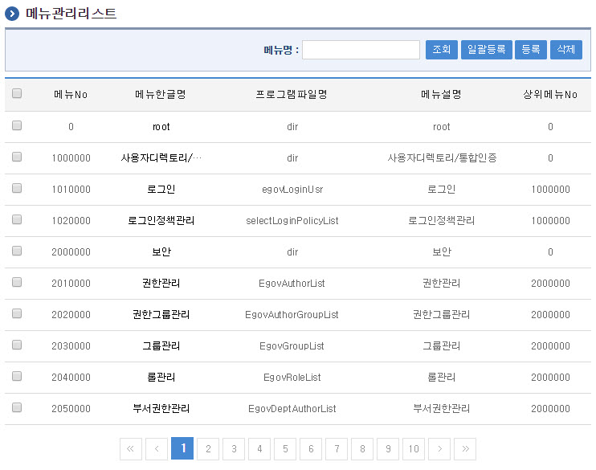

 조회 : 등록된 메뉴관리리스트을 조회한다.
 등록 : 신규 메뉴정보을 등록하기 위해서는 상단의 등록 버튼을 통해서 메뉴 등록 화면으로 이동한다.
 조회목록 선택 : 기존 메뉴정보를 수정하고자 하는 경우 해당 메뉴명를 클릭하여 상세 조회 및 수정기능을 제공하는 메뉴상세조회/수정 화면으로 이동한다.

### 메뉴정보 등록

#### 비즈니스 규칙

 메뉴 정보를 입력한 뒤 등록한다. 프로그램파일명 입력시 프로그램 파일명 옆 검색버튼을 클릭하여 프로그램 파일명 검색 팝업화면을 호출 파일명을 검색하여 해당 파일명 클릭하여 지정한다.

#### 관련코드

 N/A

#### 관련화면 및 수행매뉴얼

| Action | URL | Controller method | QueryID |
| --- | --- | --- | --- |
| 등록 | /sym/mnu/mpm/EgovMenuRegistInsert.do | insertMenuManage | "menuManageDAO.insertMenuManage\_S" |

 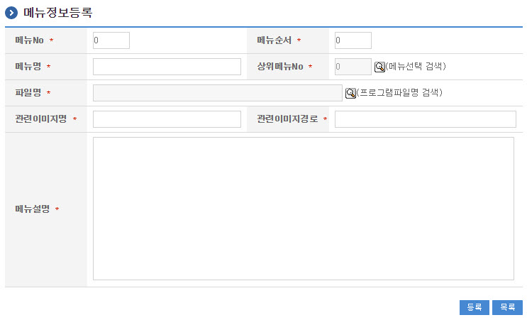

 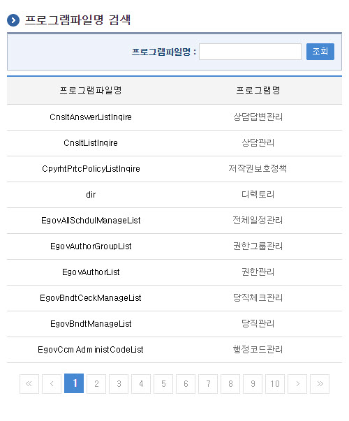

 목록 : 메뉴관리리스트 화면으로 이동한다.
 등록 : 신규 메뉴정보를 등록하기 위해서는 상단의 등록 버튼을 통해서 저장한다.
 검색 : 프로그램파일명을 검색하여 지정한다.

### 메뉴정보 상세조회/수정

#### 비즈니스 규칙

 메뉴정보를 변경한 후 저장한다.

#### 관련코드

 N/A

#### 관련화면 및 수행매뉴얼

| Action | URL | Controller method | QueryID |
| --- | --- | --- | --- |
| 수정 | /sym/mnu/mpm/EgovMenuDetailSelectUpdt.do" | updateMenuManage | "menuManageDAO.updateMenuManage\_S" |
| 상세조회 | /sym/mnu/mpm/EgovMenuManageListDetailSelect.do | selectMenuManage | "menuManageDAO.selectMenuManageList\_D" |

 다음 화면은 메뉴정보 상세조회 화면과 동일하다.

 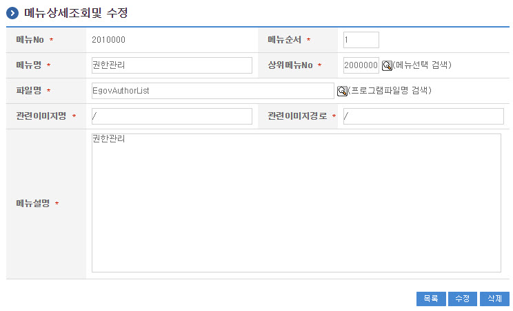

 목록 : 메뉴관리리스트 화면으로 이동한다.
 수정 : 기 등록된 메뉴정보를 수정하기 위해서는 상단의 수정 버튼을 통해서 저장한다.

### 메뉴정보 삭제

#### 비즈니스 규칙

 멀티 삭제 - 메뉴정보 목록을 조회한 뒤 삭제 대상을 체크박스로 선택하고, 삭제버튼을 클릭한다.
 단일 삭제 - 메뉴정보 상세조회/수정 화면에서 상세조회 삭제버튼을 클릭한다.

#### 관련코드

 N/A

#### 관련화면 및 수행매뉴얼

| Action | URL | Controller method | QueryID |
| --- | --- | --- | --- |
| 멀티삭제 | /sym/mnu/mpm/EgovMenuManageListDelete.do | deleteMenuManageList | "menuManageDAO.deleteMenuManage\_S" |
| 단일삭제 | /sym/mnu/mpm/EgovMenuManageDelete.do | deleteMenuManage | "menuManageDAO.deleteMenuManage\_S" |

##### 멀티 삭제

 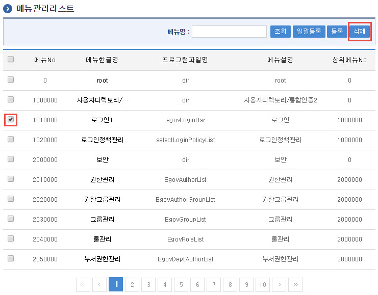

##### 단일 삭제

 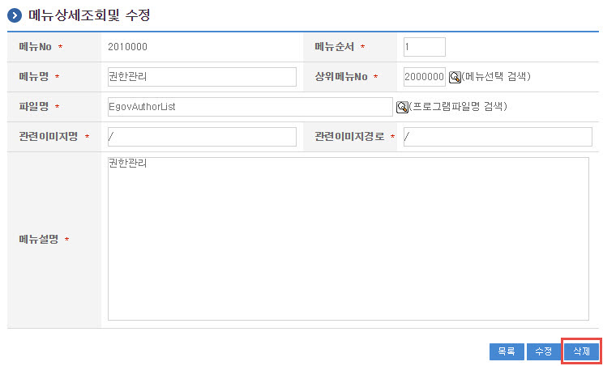

### 메뉴일괄생성

#### 비즈니스 규칙

 프로그램목록정보와 메뉴정보 목록을 엑셀파일로 정리한 내역을 배치처리하여 일괄등록처리 한다.
 최초메뉴를 목록을 관리 할 경우 편리하게 사용할수 있다.
 단 일괄생성을 할 경우 메뉴목록, 프로그램목록, 프로그램변경내역 테이블의 데이타는 모두 삭제 되므로 최초 메뉴를 등록 시에만 사용하도록 하며,
 기타 사용시는 주의를 요한다.

#### 관련코드

 N/A

#### 관련화면 및 수행매뉴얼

| Action | URL | Controller method | QueryID |
| --- | --- | --- | --- |
| 일괄생성 | /sym/mnu/mpm/EgovMenuBndeRegist.do | menuBndeRegist | "progrmManageDAO.insertProgrm\_S" |

 

 엑셀등록파일은 하나의 파일을 두개 탭으로 작성되며 각각의 정보는 아래와 같이 작성하여 일괄생성에서 등록한다.
 엑셀등록파일 - 프로그램목록정보

 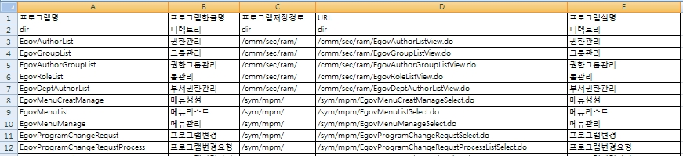

 엑셀등록파일 - 메뉴정보

 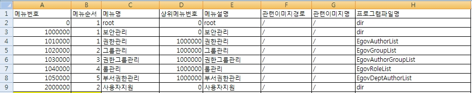

 다음은 메뉴일괄등록 엑셀파일 양식이다. 이를 이용하여 프로그램목록 및 메뉴목록을 일괄등록한다.

| 메뉴일괄 엑셀양식 | [batchmenubind\_메뉴샘플.xls 다운로드](https://www.egovframe.go.kr/wiki/lib/exe/fetch.php?media=egovframework:com:v2:sym:batchmenubind_메뉴샘플.xls) |
| --- | --- |

### 메뉴리스트 관리

#### 비즈니스 규칙

 메뉴리스트 정보를 조회한다.등록된 메뉴리스트에서 상위메뉴 입력시 검색버튼을 클릭하여 상위메뉴를 선택하여 입력한다.

#### 관련코드

 N/A

#### 관련화면 및 수행매뉴얼

| Action | URL | Controller method | QueryID |
| --- | --- | --- | --- |
| 조회 | /sym/mnu/mpm/EgovMenuListSelect.do | selectMenuList | "menuManageDAO.selectMenuListT\_D" |
| 등록 | /sym/mnu/mpm/EgovMenuListInsert.do | insertMenuManage | "menuManageDAO.insertMenuManage\_S" |
| 수정 | /sym/mnu/mpm/EgovMenuListUpdt.do | updateMenuManage | ""menuManageDAO.updateMenuManage\_S" |
| 삭제 | /sym/mnu/mpm/EgovMenuListDelete.do | deleteMenuManage | "menuManageDAO.deleteMenuManage\_S" |

 등록된 메뉴정보를 트리형태의 메뉴리스트로 등록된 메뉴를 확인 할 수 있다.

 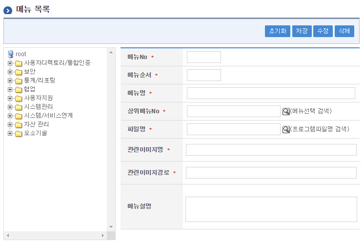

 초기화 : 화면의 필드의 내용을 초기화 한다. 초기화 후에는 내용을 입력후 등록만 가능하다. 단 메뉴목록선택시는 삭제 수정만 가능해진다.
 등록 : 신규 메뉴정보를 등록하기 위해서는 상단의 등록 버튼을 통해서 저장한다.
 수정 : 기 등록된 메뉴정보를 수정하기 위해서는 상단의 수정 버튼을 통해서 저장한다.
 삭제 : 메뉴정보 상세조회/수정 화면에서 상세조회 삭제버튼을 클릭한다.
 메뉴목록선택 : 화면 좌측 메뉴목록에서 해당 메뉴를 클릭하여 상세내용을 확인한다. 상세내용을 확인후 수정혹은 삭제가 가능해진다.
 프로그램파일명 검색 : 프로그램파일명을 프로그램파일검색 팝업화면에서 검색하여 지정한다.
 상위메뉴검색 : 상위메뉴 팝업 화면에서 상위메뉴를 선택하여 지정한다.

 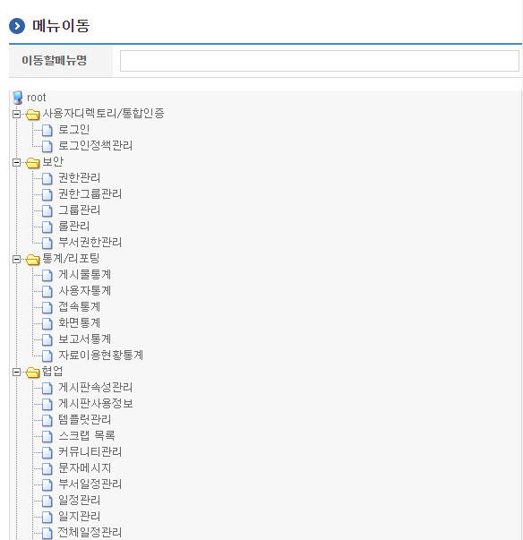

 프로그램파일명 입력시 프로그램 파일명 옆 검색버튼을 클릭하여 프로그램 파일명 검색 팝업화면을 호출 파일명을 검색하여 해당 파일명 클릭하여 지정한다.

 

 메뉴리스트에서 메뉴에 대한 정보를 등록, 수정, 삭제 처리를 할 수 있다.
