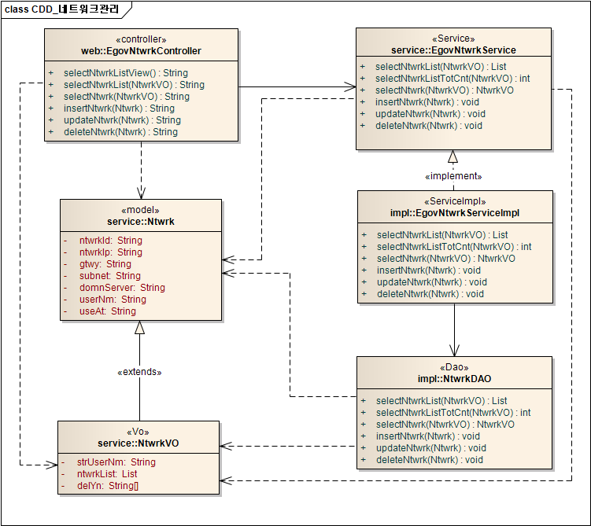
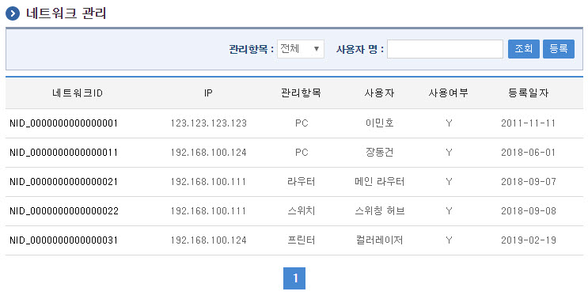
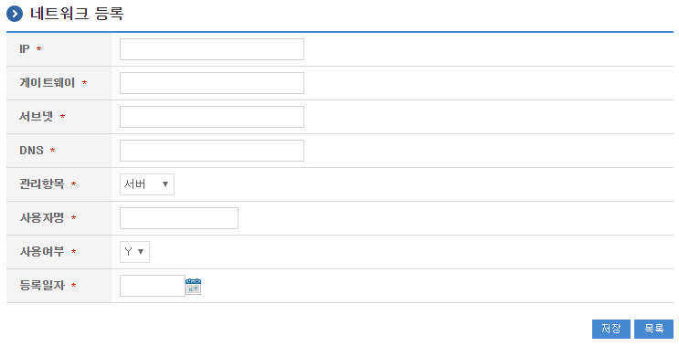
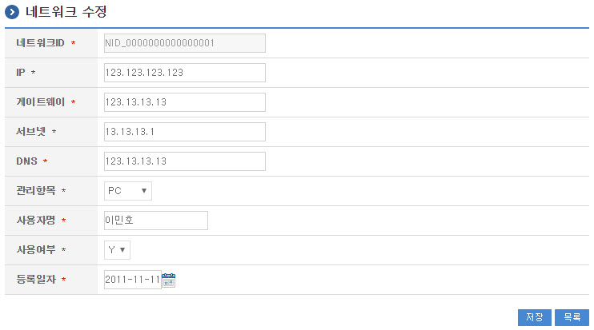
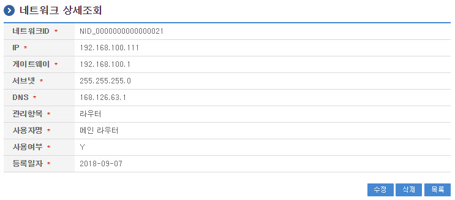

# 네트워크관리

## 개요

 네트워크관리는 서버자원이나 사용자 등에게 할당하기 위한 IP 등의 네트워크 정보를 관리하는 기능을 제공한다.

## 설명

 네트워크관리는 네트워크 정보를 관리하기 위한 목적으로 네트워크 정보의 등록, 수정, 삭제, 조회, 목록조회의 기능을 수반한다.

```text
  ① 네트워크목록조회 : 배치작업으로 정의된 정보를 최근 등록 순서대로 조회하고, 그 결과 목록을 화면에 반영한다.
  ② 네트워크등록 : 배치작업정보를 등록하고, 등록 결과를 조회한다.
  ③ 네트워크수정 : 기 등록된 배치작업정보의 항목들을 수정한다.
  ④ 네트워크삭제 : 기 등록된 배치작업정보를 삭제한다.
  ⑤ 네트워크상세조회 : 등록된 배치작업정보를 조회한다.
```

### 관련소스

| 유형 | 대상소스명 | 비고 |
| --- | --- | --- |
| Controller | egovframework.com.sym.sym.nwk.web.EgovNtwrkController.java | 네트워크관리를 위한 controller 클래스 |
| Service | egovframework.com.sym.sym.nwk.service.EgovNtwrkService.java | 네트워크관리를 위한 Service Interface |
| ServiceImpl | egovframework.com.sym.sym.nwk.service.impl.EgovNtwrkServiceImpl.java | 네트워크관리를 위한 서비스 구현 클래스 |
| DAO | egovframework.com.sym.sym.nwk.service.impl.NtwrkDAO.java | 네트워크관리를 위한 데이터처리 클래스 |
| Model | egovframework.com.sym.sym.nwk.service.Ntwrk.java | 네트워크관리를 위한 Model 클래스 |
| VO | egovframework.com.sym.sym.nwk.service.NtwrkVO.java | 네트워크관리를 위한 VO 클래스 |
| JSP | /WEB-INF/jsp/egovframework/com/sym/sym/nwk/EgovNtwrkList.jsp | 네트워크 목록조회를 위한 jsp페이지 |
| JSP | /WEB-INF/jsp/egovframework/com/sym/sym/nwk/EgovNtwrkRegist.jsp | 네트워크 등록를 위한 jsp페이지 |
| JSP | /WEB-INF/jsp/egovframework/com/sym/sym/nwk/EgovNtwrkUpdt.jsp | 네트워크 수정를 위한 jsp페이지 |
| JSP | /WEB-INF/jsp/egovframework/com/sym/sym/nwk/EgovNtwrkDetail.jsp | 등록된 네트워크를 조회하기 위한 jsp페이지 |
| QUERY XML | resources/egovframework/mapper/com/sym/sym/nwk/EgovNtwrk\_SQL\_mysql.xml | 네트워크관리 MySQL용 QUERY XML |
| QUERY XML | resources/egovframework/mapper/com/sym/sym/nwk/EgovNtwrk\_SQL\_oracle.xml | 네트워크관리 Oracle용 QUERY XML |
| QUERY XML | resources/egovframework/mapper/com/sym/sym/nwk/EgovNtwrk\_SQL\_tibero.xml | 네트워크관리 Tibero용 QUERY XML |
| QUERY XML | resources/egovframework/mapper/com/sym/sym/nwk/EgovNtwrk\_SQL\_altibase.xml | 네트워크관리 Altibase용 QUERY XML |
| QUERY XML | resources/egovframework/mapper/com/sym/sym/nwk/EgovNtwrk\_SQL\_cubrid.xml | 네트워크관리 Cubrid용 QUERY XML |
| QUERY XML | resources/egovframework/mapper/com/sym/sym/nwk/EgovNtwrk\_SQL\_maria.xml | 네트워크관리 Maria용 QUERY XML |
| QUERY XML | resources/egovframework/mapper/com/sym/sym/nwk/EgovNtwrk\_SQL\_postgres.xml | 네트워크관리 Postgres용 QUERY XML |
| QUERY XML | resources/egovframework/mapper/com/sym/sym/nwk/EgovNtwrk\_SQL\_goldilocks.xml | 네트워크관리 Goldilocks용 QUERY XML |
| Message properties | resources/egovframework/message/com/message-common\_ko.properties | 네트워크관리 Message properties |
| Message properties | resources/egovframework/message/com/sym/sym/nwk/message\_ko.properties | 네트워크관리를 위한 Message properties(한글) |
| Message properties | resources/egovframework/message/com/sym/sym/nwk/message\_en.properties | 네트워크관리를 위한 Message properties(영문) |
| Idgen XML | resources/egovframework/spring/com/idgn/context-idgn-Ntwrk.xml | 네트워크관리를 위한 Id생성 Idgen XML |

### 클래스 다이어그램

 

### 관련테이블

| 테이블명 | 테이블명(영문) | 비고 |
| --- | --- | --- |
| 네트워크정보 | COMTNNTWRKINFO | 서버자원이나 사용자 등에게 할당하기 위한 IP 등의 네트워크 정보를 관리한다. |

#### ID Generation 관련 DDL 및 DML

 ID Generation Service를 활용하기 위해서 Sequence 저장테이블인  COMTECOPSEQ에 NTWRK_ID 항목을 추가해야 한다.

```sql
    CREATE TABLE COMTECOPSEQ ( table_name varchar(16) NOT NULL, 
                               next_id DECIMAL(30) NOT NULL,
                               PRIMARY KEY (table_name)
    );
 
    INSERT INTO COMTECOPSEQ VALUES ('NTWRK_ID','0');
```

#### ID Generation 환경설정(context-idgn-Ntwrk.xml)

```xml
    <bean name="egovNtwrkIdGnrService" class="egovframework.rte.fdl.idgnr.impl.EgovTableIdGnrServiceImpl" destroy-method="destroy">
        <property name="dataSource" ref="egov.dataSource" />
        <property name="strategy"   ref="ntwrkIdStrategy" />
        <property name="blockSize"  value="10"/>
        <property name="table"      value="COMTECOPSEQ"/>
        <property name="tableName"  value="NTWRK_ID"/>
    </bean>
    <bean name="ntwrkIdStrategy" class="egovframework.rte.fdl.idgnr.impl.strategy.EgovIdGnrStrategyImpl">
        <property name="prefix"     value="NID_" />
        <property name="cipers"     value="16" />
        <property name="fillChar"   value="0" />
    </bean>
```

## 관련화면 및 수행메뉴얼

#### 네트워크 목록조회

| Action | URL | Controller method | QueryID |
| --- | --- | --- | --- |
| 조회 | /sym/sym/nwk/selectNtwrkList.do | selectNtwrkList | "ntwrkDAO.selectNtwrkList" |
|  |  |  | "ntwrkDAO.selectNtwrkListTotCnt" |

 네트워크 목록은 페이지당 10건씩 조회되며 페이징은 10페이지씩 이루어진다.
 검색조건은 관리항목, 사용자 명에 대해서 수행된다.

 

 조회 : 기 등록된 네트워크의 목록을 조회한다.
 등록 : 신규 네트워크를 등록하기 위해서는 상단의 등록 버튼을 통해서 네트워크 등록 화면으로 이동한다.
 상세조회 : 네트워크의 상세정보를 조회하기 위해 네트워크ID를 선택하여 네트워크 상세조회 화면으로 이동한다.

#### 네트워크 등록

| Action | URL | Controller method | QueryID |
| --- | --- | --- | --- |
| 등록 | /sym/sym/nwk/addNtwrk.do | insertNtwrk | "ntwrkDAO.insertNtwrk" |

 네트워크의 속성정보를 입력한 뒤 등록한다.

 

 저장 : 신규 네트워크를 등록하기 위해서는 네트워크 속성을 입력한 뒤 상단의 저장 버튼을 통해서 네트워크를 등록한다. 네트워크ID는 등록 시 자동으로 부여된다.
 조회 : 네트워크 상세조회 화면으로 이동한다.

#### 네트워크 수정

| Action | URL | Controller method | QueryID |
| --- | --- | --- | --- |
| 수정 | /sym/sym/nwk/updtNtwrk.do | updateNtwrk | "ntwrkDAO.updateNtwrk" |

 네트워크의 속성정보를 변경한 후 저장한다.

 

 저장 : 기 등록된 네트워크 속성을 수정한 뒤 상단의 저장 버튼을 통해서 네트워크를 수정한다.
 조회 : 네트워크 상세조회 화면으로 이동한다.

#### 네트워크 상세조회

| Action | URL | Controller method | QueryID |
| --- | --- | --- | --- |
| 상세조회 | /sym/sym/nwk/getNtwrk.do | selectNtwrk | "ntwrkDAO.selectNtwrk" |
| 삭제 | /sym/sym/nwk/removeNtwrk.do | deleteNtwrk | "ntwrkDAO.deleteNtwrk" |

 네트워크의 속성정보를 조회한다.

 

 수정 : 기 등록된 네트워크 속성을 수정한 뒤 상단의 수정 버튼을 통해서 네트워크수정화면으로 이동한다.
 삭제 : 기 등록된 네트워크를 삭제한다.
 목록 : 네트워크 목록조회 화면으로 이동한다.
