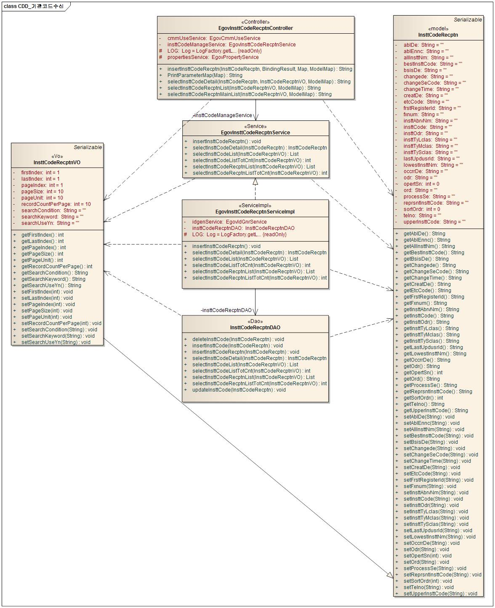
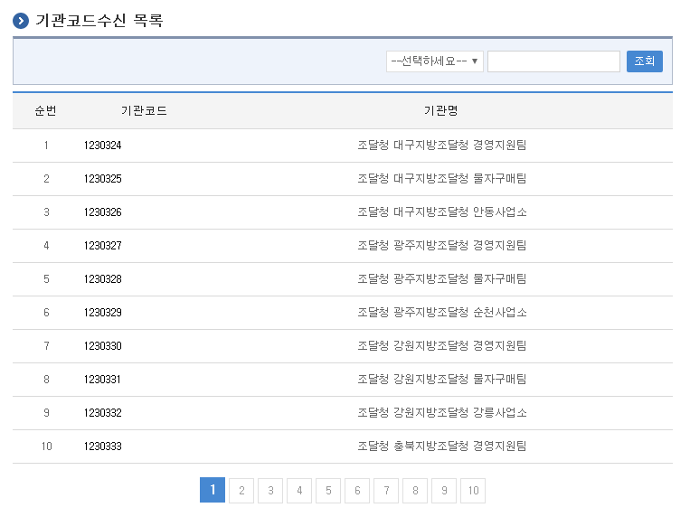
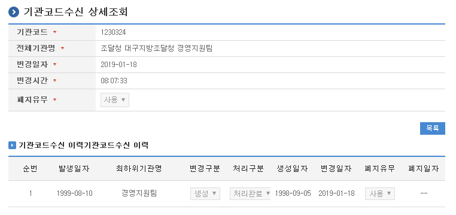

# 기관코드

## 개요

 기관코드수신은 기관코드의 변경정보를 시스템에서 주기적으로 수신 반영하고 변경사항을 관리하는 기능으로 구성되어 있다.

## 설명

### 패키지 참조 관계

 기관코드수신 패키지는 요소기술의 공통 패키지(cmm)에 대해서만 직접적인 함수적 참조 관계를 가진다.
 패키지 간 참조 관계 : [시스템관리 Package Dependency](../intro/package-reference.md/#시스템관리)

### 관련소스

| 유형 | 대상소스명 | 비고 |
| --- | --- | --- |
| Controller | egovframework.com.sym.ccm.icr.web.EgovInsttCodeRecptnController.java | 기관코드수신 관리를 위한 컨트롤러 클래스 |
| Service | egovframework.com.sym.ccm.icr.service.EgovInsttCodeRecptnService.java | 기관코드수신 관리를 위한 서비스 인터페이스 |
| ServiceImpl | egovframework.com.sym.ccm.icr.service.impl.EgovInsttCodeRecptnServiceImpl.java | 기관코드수신 관리를 위한  서비스구현 클래스 |
| Model | egovframework.com.sym.ccm.icr.service.InsttCodeRecptn.java | 기관코드수신 정보 Model 클래스 |
| VO | egovframework.com.sym.ccm.icr.service.InsttCodeRecptnVO.java | 기관코드수신 관리를 위한 VO 클래스 |
| DAO | egovframework.com.sym.ccm.icr.service.impl.InsttCodeRecptnDAO.java | 기관코드수신 정보 관리를 위한 데이터처리 클래스 |
| JSP | /WEB-INF/jsp/egovframework/com/sym/ccm/icr/EgovInsttCodeRecptnList.jsp | 기관코드수신 목록조회 페이지 |
| JSP | /WEB-INF/jsp/egovframework/com/sym/ccm/icr/EgovInsttCodeDetail.jsp | 기관코드 상세조회 페이지 |
| QUERY XML | resources/egovframework/mapper/com/sym/ccm/icr/EgovInsttCodeRecptn\_SQL\_mysql.xml | 기관코드 MySQL용 QUERY XML |
| QUERY XML | resources/egovframework/mapper/com/sym/ccm/icr/EgovInsttCodeRecptn\_SQL\_cubrid.xml | 기관코드 Cubrid용 QUERY XML |
| QUERY XML | resources/egovframework/mapper/com/sym/ccm/icr/EgovInsttCodeRecptn\_SQL\_oracle.xml | 기관코드 Oracle용 QUERY XML |
| QUERY XML | resources/egovframework/mapper/com/sym/ccm/icr/EgovInsttCodeRecptn\_SQL\_tibero.xml | 기관코드 Tibero용 QUERY XML |
| QUERY XML | resources/egovframework/mapper/com/sym/ccm/icr/EgovInsttCodeRecptn\_SQL\_altibase.xml | 기관코드 Altibase용 QUERY XML |
| QUERY XML | resources/egovframework/mapper/com/sym/ccm/icr/EgovInsttCodeRecptn\_SQL\_maria.xml | 기관코드 MariaDB용 QUERY XML |
| QUERY XML | resources/egovframework/mapper/com/sym/ccm/icr/EgovInsttCodeRecptn\_SQL\_postgres.xml | 기관코드 PostgreSQL용 QUERY XML |
| QUERY XML | resources/egovframework/mapper/com/sym/ccm/icr/EgovInsttCodeRecptn\_SQL\_goldilocks.xml | 기관코드 Goldilocks용 QUERY XML |
| Idgen XML | resources/egovframework/spring/com/idgn/context-idgn-InsttCodeRecptn.xml | 행정코드 Id생성 Idgen XML |
| Message properties | resources/egovframework/message/com/sym/ccm/icr/message\_ko.properties | 기관코드를 위한 Message properties(한글) |
| Message properties | resources/egovframework/message/com/sym/ccm/icr/message\_en.properties | 기관코드를 위한 Message properties(영문) |

### 클래스 다이어그램

 

### ID Generation

#### ID Generation 관련 DDL 및 DML

 ID Generation Service를 활용하기 위해서 Sequence 저장테이블인  COMTECOPSEQ에 INSTT_CODE_OPERT 항목을 추가해야 한다.

```sql
CREATE TABLE COMTECOPSEQ ( table_name varchar(16) NOT NULL,
           next_id DECIMAL(30) NOT NULL,
           PRIMARY KEY (table_name));
  INSERT INTO COMTECOPSEQ VALUES('INSTT_CODE_OPERT','0');
```

#### ID Generation 환경설정(context-idgn-InsttCodeRecptn.xml)

```xml
<bean name="egovInsttCodeRecptnIdGnrService"
		class="egovframework.rte.fdl.idgnr.impl.EgovTableIdGnrService"
		destroy-method="destroy">
		<property name="dataSource" ref="egov.dataSource" />
		<property name="blockSize" 	value="1"/>
		<property name="table"	   	value="COMTECOPSEQ"/>
		<property name="tableName"	value="INSTT_CODE_OPERT"/>
	</bean>
```

### 관련테이블

| 테이블명 | 테이블명(영문) | 비고 |
| --- | --- | --- |
| 기관코드 | COMTNINSTTCODE | 기관코드에 대한 정보 |
| 기관코드수신로그 | COMTNINSTTCODERECPTNLOG | 기관코드수신로그에 대한 정보 |

### 환경설정

 기관코드수신을 사용하기 위해서는 EDI 모듈을 실행시 필요한 정보를 설정하여야 한다.
 이를 지정하기 위해서는 globals.properties 속성 파일에 추가 속성을 설정하여야 한다.
 globals.properties에 관련된 내용은 요소기술 프로퍼티 및 명령어 쉘스크립트 부분을 참조한다.

 ```text
 // 기관코드수신용
 CNTC.INSTTCODE.DIR.rcv       = /home/gccedi/rcv/
 CNTC.INSTTCODE.DIR.rcvold    = /home/gccedi/rcvold/
 CNTC.INSTTCODE.DIR.bin       = /home/gccedi/bin/
 CNTC.INSTTCODE.CMD.edircv    = gcc_edircv
 CNTC.INSTTCODE.CMD.edircvmsg = gcc_edircvmsg
 CNTC.INSTTCODE.INFO.userid   = 서버인증서아이디
 CNTC.INSTTCODE.INFO.userpw   = 서버인증서패스워드
 ```

 EDI 모듈에 따라 cmd file 이 실행바이너리 파일이거나 쉘스크립트 파일이 올 수 있음.

#### 기관코드수신 scheduler 등록

 기관코드수신 및 반영은 스케줄러를 통해 반영된다. 해당 스케줄러를 등록하기 위해서는 …/spring/context-scheduling.xml(예시)에 다음과 같은 스케줄러를 등록한다.

```xml
<!-- 기관코드수신 처리 -->
    <bean id="insttCodeReceiver"
        class="org.springframework.scheduling.quartz.MethodInvokingJobDetailFactoryBean">
        <property name="targetObject" ref="InsttCodeRecptnService" />
        <property name="targetMethod" value="insertInsttCodeRecptn" />
        <property name="concurrent" value="false" />
    </bean>

    <bean id="insttCodeReceiverTrigger"
        class="org.springframework.scheduling.quartz.SimpleTriggerBean">
        <property name="jobDetail" ref="insttCodeReceiver" />
        <!-- 시작하고 1분후에 실행한다. (milisecond) -->
        <property name="startDelay" value="60000" />
        <!-- 매 60초마다 실행한다. (milisecond) 데몬 형식으로 계속 기동 중 -->
        <property name="repeatInterval" value="60000" />
    </bean>

    <bean id="insttCodeReceiverScheduler" class="org.springframework.scheduling.quartz.SchedulerFactoryBean">
        <property name="triggers">
            <list>
                <ref bean="insttCodeReceiverTrigger" />
            </list>
        </property>
    </bean>
```

## 관련기능

 기관코드는 기관코드 수신, 기관코드 수신 목록조회, 기관코드 상세조회 기능으로 구성되어 있다.

### 기관코드수신

 기관코드수신 연계시 연계항목에 따라 DB, Model, ServiceImpl…등 연계항목 관련사항을 수정하여야 한다.
 - ServiceImpl 예시
    ```
    // 실제 연계 항목 Mapping 작업
    insttCodeRecptn.setChangeSeCode     (strTmp       );    // 명령                       :: 변경구분코드
    insttCodeRecptn.setOccrrDe          (tokenData[ 1]);    // 날짜                       :: 발생일자
    insttCodeRecptn.setEtcCode          (tokenData[ 2]);    // 2자리코드 <적용:기타코드>     :: 기타코드
    insttCodeRecptn.setInsttCode        (tokenData[ 3]);    // 기관코드                    :: 기관코드
    insttCodeRecptn.setAllInsttNm       (tokenData[ 4]);    // 기관명(전체)                :: 전체기관명
    insttCodeRecptn.setLowestInsttNm    (tokenData[ 5]);    // 기관명(최하위)              :: 최하위기관명
    insttCodeRecptn.setInsttAbrvNm      (tokenData[ 6]);    // 기관명(약어)                :: 기관약칭명
    insttCodeRecptn.setOdr              (tokenData[ 7]);    // 차수                       :: 차수
    insttCodeRecptn.setOrd              (tokenData[ 8]);    // 서열                       :: 서열
    insttCodeRecptn.setInsttOdr         (tokenData[ 9]);    // 소속기관차수                :: 기관차수
    insttCodeRecptn.setUpperInsttCode   (tokenData[10]);    // 차상위기관코드               :: 상위기관코드
    insttCodeRecptn.setBestInsttCode    (tokenData[11]);    // 최상위기관코드               :: 최상위기관코드
    insttCodeRecptn.setReprsntInsttCode (tokenData[12]);    // 대표기관코드                :: 대표기관코드
    insttCodeRecptn.setInsttTyLclas     (tokenData[13]);    // 기관유형(대)                :: 기관유형대분류
    insttCodeRecptn.setInsttTyMclas     (tokenData[14]);    // 기관유형(중)                :: 기관유형중분류
    insttCodeRecptn.setInsttTySclas     (tokenData[15]);    // 기관유형(소)                :: 기관유형소분류
    insttCodeRecptn.setTelno            (tokenData[16]);    // 전화번호                    :: 전화번호
    insttCodeRecptn.setFxnum            (tokenData[17]);    // 팩스번호                    :: 팩스번호
    insttCodeRecptn.setCreatDe          (tokenData[18]);    // 생성일자                    :: 생성일자
    insttCodeRecptn.setAblDe            (tokenData[19]);    // 폐지일자                    :: 폐지일자
    insttCodeRecptn.setAblEnnc          (tokenData[20]);    // 폐지구분                    :: 폐지유무
    insttCodeRecptn.setChangede         (tokenData[21]);    // 변경일자                    :: 변경일자
    insttCodeRecptn.setChangeTime       (tokenData[22]);    // 변경시간                    :: 변경시간
    insttCodeRecptn.setBsisDe           (tokenData[23]);    // 기초날짜                    :: 기초일자
    insttCodeRecptn.setSortOrdr         (Integer.parseInt(tokenData[24]));
    // 트리순서(트리서열) <적용:정렬순서>:: 정렬순서
    ```

### 기관코드수신 목록조회

#### 비즈니스 규칙

 기관코드수신 목록은 페이지 당 10건씩 조회되며 페이징은 10페이지씩 이루어진다.
 검색조건은 기관코드수신명에 대해서 수행된다.

#### 관련코드

 N/A

#### 관련화면 및 수행매뉴얼

| Action | URL | Controller method | QueryID |
| --- | --- | --- | --- |
| 목록조회 | /sym/ccm/icr/getInsttCodeRecptnList.do | selectInsttCodeRecptnList | "InsttCodeRecptnDAO.selectInsttCodeRecptnList" |
|  |  |  | "InsttCodeRecptnDAO.selectInsttCodeRecptnListTotCnt" |

 페이지 당 검색 범위를 변경하고자 하는 경우
 context-properties.xml 파일의 pageUnit, pageSize를 변경한다.(단 해당 설정은 전체 공통서비스 기능에 영향을 미친다.)

 

 조회: 조회하기 위해서는 상단의 검색조건을 선택 후 해당하는 검색문자를 입력 후 조회 버튼을 클릭한다.

### 기관코드 상세 조회

#### 비즈니스 규칙

 상세조회에는 삭제 처리가 포함되어 있고 삭제가 성공하면 기관코드수신 목록 화면으로 이동한다.

#### 관련코드

 N/A

#### 관련화면 및 수행매뉴얼

| Action | URL | Controller method | QueryID |
| --- | --- | --- | --- |
| 상세조회 | /sym/ccm/icr/getInsttCodeDetail.do | EgovInsttCodeRecptnController | "InsttCodeRecptnDAO.selectInsttCodeDetail" |

 

 목록: 기관코드 목록 화면으로 이동한다.
