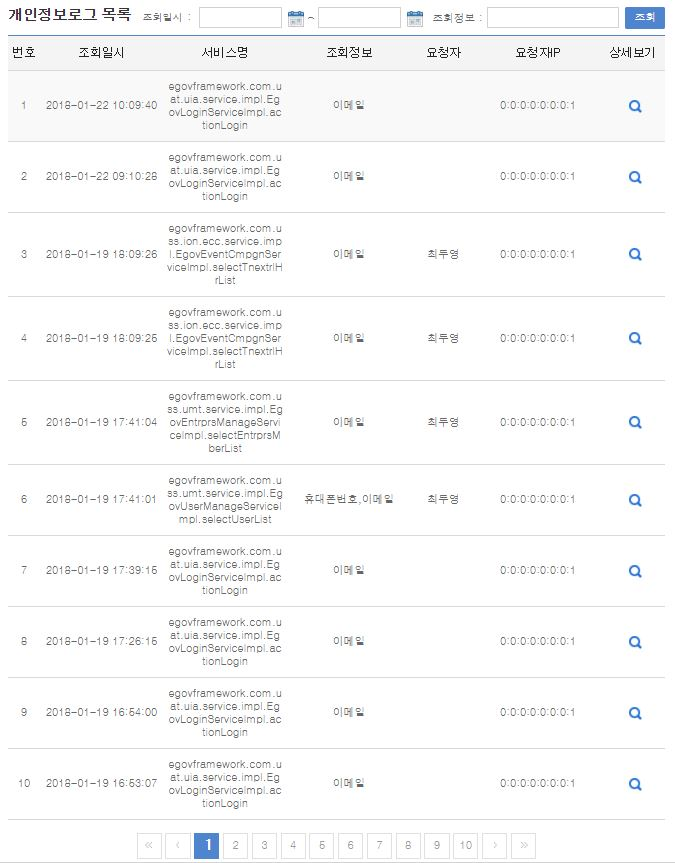
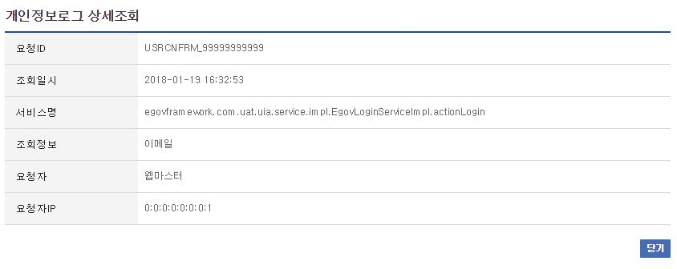

# 개인정보조회 로그관리

## 개요

 개인정보조회 로그관리는 사용자가 개인정보를 조회한 로그 정보를 검색, 조회하는 기능을 제공한다.

## 설명

 개인정보조회 로그관리는 개인정보조회로그의 등록, 조회, 목록의 기능을 수반한다.

 ① 개인정보조회 로그 등록 : 개인정보조회 정보를 등록한다. - AOP 기능을 이용
 ② 개인정보조회 로그 목록 : 개인정보조회 정보의 목록을 검색, 조회한다.
 ③ 개인정보조회 로그 조회 : 개인정보조회 정보의 상세내용을 조회한다.

### 패키지 참조 관계

 개인정보조회 로그관리 패키지는 요소기술의 공통(cmm) 패키지에 대해서만 직접적인 함수적 참조 관계를 가진다.
 패키지 간 참조 관계 : [시스템관리 Package Dependency](../intro/package-reference.md/#시스템관리)

### 관련소스

| 유형 | 대상소스명 | 비고 |
| --- | --- | --- |
| Controller | egovframework.com.sym.log.plg.web.EgovPrivacyLogController.java | 개인정보조회 로그 관리를 위한 컨트롤러 클래스 |
| Service | egovframework.com.sym.log.plg.service.EgovPrivacyLogService.java | 개인정보조회 로그 관리를 위한  서비스 인터페이스 |
| ServiceImpl | egovframework.com.sym.log.plg.service.impl.EgovPrivacyLogServiceImpl.java | 개인정보조회 로그 관리를 위한 서비스 구현 클래스 |
| Config | egovframework.com.sym.log.plg.service.EgovPrivacyConfig.java | 개인정보조회 로그 관련 JavaConfig (ID Generation 설정 포함) |
| Model | egovframework.com.sym.log.plg.service.PrivacyLog.java | 개인정보조회 로그 관리를 위한 VO 클래스 |
| DAO | egovframework.com.sym.log.plg.service.impl.PrivacyLogDAO.java | 개인정보조회 로그 관리를 위한 데이터처리 클래스 |
| Aspect | egovframework.com.sym.log.plg.service.EgovPrivacyLogAspect.java | 개인정보조회 로그 등록을 위한 Aspect 클래스 |
| JSP | /WEB-INF/jsp/egovframework/com/sym/log/plg/EgovPrivacyLogList.jsp | 개인정보조회 로그 목록을 위한 jsp페이지 |
| JSP | /WEB-INF/jsp/egovframework/com/sym/log/plg/EgovPrivacyLogDetail.jsp | 개인정보조회 로그 조회를 위한 jsp페이지 |
| Query XML | resources/egovframework/mapper/com/sym/log/plg/EgovPrivacyLog\_SQL\_altibase.xml | 개인정보조회 로그 관리를 위한 Altibase용 Query XML |
| Query XML | resources/egovframework/mapper/com/sym/log/plg/EgovPrivacyLog\_SQL\_cubrid.xml | 개인정보조회 로그 관리를 위한 Cubrid용 Query XML |
| Query XML | resources/egovframework/mapper/com/sym/log/plg/EgovPrivacyLog\_SQL\_maria.xml | 개인정보조회 로그 관리를 위한 MariaDB용 Query XML |
| Query XML | resources/egovframework/mapper/com/sym/log/plg/EgovPrivacyLog\_SQL\_mysql.xml | 개인정보조회 로그 관리를 위한 MySQL용 Query XML |
| Query XML | resources/egovframework/mapper/com/sym/log/plg/EgovPrivacyLog\_SQL\_oracle.xml | 개인정보조회 로그 관리를 위한 Oracle용 Query XML |
| Query XML | resources/egovframework/mapper/com/sym/log/plg/EgovPrivacyLog\_SQL\_postgres.xml | 개인정보조회 로그 관리를 위한 PostgreSQL용 Query XML |
| Query XML | resources/egovframework/mapper/com/sym/log/plg/EgovPrivacyLog\_SQL\_tibero.xml | 개인정보조회 로그 관리를 위한 Tibero용 Query XML |
| Query XML | resources/egovframework/mapper/com/sym/log/plg/EgovPrivacyLog\_SQL\_goldilocks.xml | 개인정보조회 로그 관리를 위한 Goldilocks용 Query XML |
| Message properties | resources/egovframework/message/com/sym/log/plg/message\_ko.properties | 개인정보조회로그 관리를 위한 Message properties(한글) |
| Message properties | resources/egovframework/message/com/sym/log/plg/message\_en.properties | 개인정보조회로그 관리를 위한 Message properties(영문) |

### ID Generation

#### ID Generation 관련 DDL 및 DML

 ID Generation Service를 활용하기 위해서 Sequence 저장테이블인 COMTECOPSEQ에 PRIVACYLOG_ID 항목을 추가한다.

```sql
CREATE TABLE COMTECOPSEQ (TABLE_NAME VARCHAR(20) NOT NULL,
	                  NEXT_ID NUMERIC(30) NULL,
	                  PRIMARY KEY (TABLE_NAME));
 
INSERT INTO COMTECOPSEQ VALUES('PRIVACYLOG_ID','1');
```

#### ID Generation 환경설정(EgovPrivacyConfig.java)

 JavaConfig 방식으로 EgovPrivacyConfig 상에 다음과 같은 설정을 적용(변경)한다.

```java
@Configuration
public class EgovPrivacyConfig {
@Resource(name = "egov.dataSource")
DataSource dataSource;
@Bean(destroyMethod = "destroy")
public EgovIdGnrService egovPrivacyLogIdGnrService() {
EgovIdGnrStrategyImpl strategy = new EgovIdGnrStrategyImpl();
strategy.setPrefix("PRVCY_");
strategy.setCipers(14);
strategy.setFillChar('0');
EgovTableIdGnrServiceImpl idGnrService = new EgovTableIdGnrServiceImpl();
idGnrService.setDataSource(dataSource);
idGnrService.setStrategy(strategy);
idGnrService.setBlockSize(10);
idGnrService.setTable("COMTECOPSEQ");
idGnrService.setTableName("PRIVACYLOG_ID");
return idGnrService;
}
}
```

#### ID Generation 환경설정(context-idgen.xml)

 또는 기존 방식과 같은 XML 기반의 ID Generation 서비스를 사용할 수 있다.

```xml
<bean name="egovPrivacyLogIdGnrService"
    class="egovframework.rte.fdl.idgnr.impl.EgovTableIdGnrService"
    destroy-method="destroy">
    <property name="dataSource" ref="dataSource" />
    <property name="strategy"   ref="privacyLogStrategy" />
    <property name="blockSize"  value="1"/>
    <property name="table"      value="COMTECOPSEQ"/>
    <property name="tableName"  value="PRIVACYLOG_ID"/>
  </bean>
 
  <bean name="privacyLogStrategy"
    class="egovframework.rte.fdl.idgnr.impl.strategy.EgovIdGnrStrategyImpl">
    <property name="prefix" value="PRVCY_" />
    <property name="cipers" value="14" />
    <property name="fillChar" value="0" />
  </bean>
```

### 관련 테이블

| 테이블명 | 테이블명(영문) | 비고 |
| --- | --- | --- |
| 개인정보조회로그 | COMTNPRIVACYLOG | 개인정보조회 정보를 관리한다. |

### AOP

#### context-privacylogaop.xml

```xml
<!--  Privacy Log Aspect -->
<bean id="privacyLog" class="egovframework.com.sym.log.plg.service.EgovPrivacyLogAspect">
	<property name="maxListCount" value="1" />
	<property name="target">
		<map>
               <entry key="mberNm" value="회원명"/>
               <entry key="moblphonNo" value="휴대폰번호"/>
               <entry key="emailAdres" value="이메일"/>
               <entry key="email" value="이메일"/>
               <entry key="orgnztNm" value="조직명"/>
		</map>
	</property>
</bean>
 
<aop:config>
	<aop:aspect id="privacyLogAspect" ref="privacyLog">
		<!--  service Method -->
		<aop:after-returning returning="returnVal" 
				pointcut="execution(public * egovframework.com..impl.*Impl.*(..)) 
			 &amp;&amp; ! execution(public * egovframework.com.cmm.service.impl.EgovUserDetailsSessionServiceImpl.*(..)) 
			 &amp;&amp; ! execution(public * egovframework.com.sec.ram.service.impl.EgovUserDetailsSecurityServiceImpl.*(..)) 
			 &amp;&amp; ! execution(public * egovframework.com.sym.log.plg.service.impl.EgovPrivacyLogServiceImpl.*(..))
			 &amp;&amp; ! execution(public * egovframework.com.sym.log.wlg.service.impl.EgovWebLogServiceImpl.*(..))
			 &amp;&amp; ! execution(public * egovframework.com.sym.log.lgm.service.impl.EgovSysLogServiceImpl.*(..))"
			 method="insertLog" />
		</aop:aspect>
		<!--  warning : 자체 서비스(EgovPrivacyLogServiceImpl) 및 내부 호출 서비스, 로그 처리 부분  제외 필요 -->
</aop:config>
```

 개인정보조회 로그 등록 기능구현을 위하여 AOP를 설정한다.
 관련된 설정은 다음과 같다.

| 속성 | 의미 | 비고 |
| --- | --- | --- |
| maxListCount | 리스트 형태로 조회된 경우 리스트에 대한 기록 건수 |  |
| target | Map으로 개인정보에 대한 속성(Map인 경우 key, VO의 경우 property에 해당)을 정의하고 기록 시에 사용된 한글명칭을 지정 | target은 List\<Map\>, List\<VO\>, Map, VO의 4가지 유형임 |
 pointcut 정의 부분은 대상에서 제외될 필요가 있는 서비스를 지정하며, 현재 위 4개의 서비스 호출은 반드시 제외시켜야 한다.

## 관련기능

 개인정보조회 로그관리는 개인정보조회 로그 목록조회, 개인정보조회 로그 상세조회 기능으로 구분된다.

### 개인정보조회 로그 목록조회

#### 비즈니스 규칙

 로그인로그 목록은 페이지 당 10건씩 조회되며 페이징은 10페이지씩 이루어진다. 검색조건은 발생일자와 조회데이터에 대해서 수행된다.

#### 관련코드

 N/A

#### 관련화면 및 수행매뉴얼

| Action | URL | Controller method | SQL Namespace | SQL QueryID |
| --- | --- | --- | --- | --- |
| 목록조회 | /sym/log/plg/SelectPrivacyLogList.do | selectPrivacyLogList | "PrivacyLog" | "selectPrivacyLogList" |
|  |  |  | "PrivacyLog" | "selectPrivacyLogListCount" |

 

 개인정보조회 로그 상세조회 기능을 수행하기 위해서는 상세보기 버튼을 클릭한다.

### 접속로그 상세조회

#### 비즈니스 규칙

 개인정보조회 로그 상세조회는 팝업창으로 구성되며, 닫기 버튼을 클릭하면 창을 닫는다.

#### 관련코드

 N/A

#### 관련화면 및 수행매뉴얼

| Action | URL | Controller method | SQL Namespace | SQL QueryID |
| --- | --- | --- | --- | --- |
| 상세조회 | /sym/log/plg/InqirePrivacyLog.do | selectWebLog | "PrivacyLog" | "selectPrivacyLog" |

 

## 참고자료

 실행환경 참조 : [AOP](/egovframe-runtime/foundation-layer-core/aop.md)
 실행환경 참조 : [ID Generation](/egovframe-runtime/foundation-layer/id-generation.md)

