# 프로그램관리

## 개요

 프로그램관리는 프로그램목록관리와 프로그램변경관리로 구성되어있다.
 프로그램목록관리는 프로그램목록을 관리가는 화면으로 메뉴를 구성하는데 필수 적인 요소로 메뉴관리와 연결되어 메뉴등록 시 프로그램목록에 등록된 프로그램명을 체크하여 등록하므로 메뉴등록 이전에 프로그램 목록이 정의 되어 있어야 한다.
 프로그램 변경관리는 시스템 관리자가 프로그램 변경관리화면에서 변경요청을 확인하여 반영여부 처리를 관리하는 화면으로 프로그램변경관리를 정의한다.
 기능흐름

 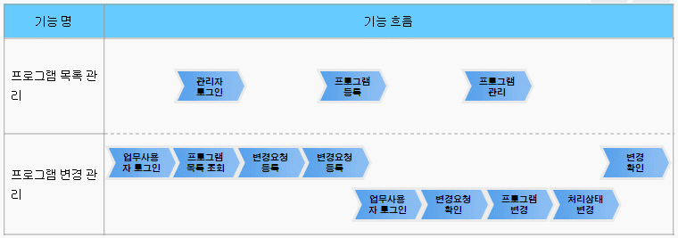

 프로그램관리 기능흐름

| 기능명 | 기능 흐름 |
| --- | --- |
| 프로그램목록관리 | 아이디/비밀번호 입력 → 로그인 요청 → 프로그램목록조회 → 프로그램목록 등록 → 프로그램목록 세부조회 |

 프로그램변경관리 기능흐름

| 기능명 | 기능 흐름 |
| --- | --- |
| 프로그램변경요청 | 아이디/비밀번호 입력 → 로그인 요청 → 프로그램변경요청조회 → 프로그램변경요청등록 → 변경요청사항 등록 → 프로그램변경요청 세부조회 |
| 프로그램변경요청처리 | 아이디/비밀번호 입력 → 로그인 요청 → 프로그램변경관리 조회 → 프로그램변경 세부조회 → 프로그램변경요청 처리사항 등록 → 프로그램변경요청 처리사항 자동메일 송부 |

## 설명

 프로그램 변경요청은 프로그램목록에 등록된 프로그램의 변경사항을 관리자에서 시스템에 반영을 요청하는 화면으로 프로그램변경에 대한 목록관리를 정의 한다.
 프로그램 변경이력은 프로그램 변경 요청에 따른 처리결과등의 이력을 조회하는 화면으로 프로그램변경이력목록, 프로그램변경이력상세 화면으로 구성되어 있다.

### 패키지 참조 관계

 프로그램관리 패키지는 요소기술의 공통 패키지(cmm) 패키지와 메일연동 인터페이스 패키지에 대해서 직접적인 함수적 참조 관계를 가진다. 하지만, 컴포넌트 배포 시 오류 없이 실행되기 위하여 패키지 간의 참조관계에 따라 메일연동 인터페이스, 바로가기메뉴관리, 메뉴생성관리, 사이트맵, 메뉴관리, 포맷/날짜/계산, 시스템(sim), 달력, 웹에디터, 우편번호 패키지와 함께 배포 파일을 구성한다.
- 패키지 간 참조 관계 : [시스템관리 Package Dependency](../intro/package-reference.md/#시스템관리)

### 관련소스

#### 프로그램 목록관리

| 유형 | 대상소스명 | 비고 |
| --- | --- | --- |
| Controller | egovframework.com.sym.prm.web.EgovProgrmManageController.java | 프로그램목록관리, 변경관리, 변경요청처리, 변경이력관리를 위한 컨트롤러 클래스 |
| Service | egovframework.com.sym.prm.service.EgovProgrmManageService.java | 프로그램목록관리, 변경관리, 변경요청처리, 변경이력관리를 위한 서비스 인터페이스 |
| ServiceImpl | egovframework.com.sym.prm.service.impl.EgovProgrmManageServiceImpl.java | 프로그램목록관리, 변경관리, 변경요청처리, 변경이력관리를 위한 서비스 구현 클래스 |
| Model | egovframework.com.sym.prm.service.ProgrmManage.java | 프로그램목록관리를 위한 Model 클래스 |
| Model | egovframework.com.sym.prm.service.ProgrmManageDtls.java | 변경관리, 변경요청처리, 변경이력관리를 위한 Model 클래스 |
| VO | egovframework.com.sym.prm.service.ProgrmManageVO.java | 프로그램목록관리를 위한 VO 클래스 |
| VO | egovframework.com.sym.prm.service.ProgrmManageDtlVO.java | 변경관리, 변경요청처리, 변경이력관리를 위한 VO 클래스 |
| DAO | egovframework.com.sym.prm.service.impl.ProgrmManageDAO.java | 프로그램목록관리, 변경관리, 변경요청처리, 변경이력관리를 위한 데이터처리 클래스 |
| JSP | /WEB-INF/jsp/egovframework/com/sym/prm/EgovProgramListManage.jsp | 프로그램목록 조회 및 멀티 삭제를 위한 목록조회 페이지 |
| JSP | /WEB-INF/jsp/egovframework/com/sym/prm/EgovProgramListRegist.jsp | 프로그램정보 등록의 위한 페이지 |
| JSP | /WEB-INF/jsp/egovframework/com/sym/prm/EgovProgramListDetailSelectUpdt.jsp | 프로그램 정보 상세조회 및 수정,삭제를 위한 페이지 |
| JSP | /WEB-INF/jsp/egovframework/com/sym/prm/EgovProgramChangeRequst.jsp | 프로그램 변경요청목록 조회를 위한 목록조회 페이지 |
| JSP | /WEB-INF/jsp/egovframework/com/sym/prm/EgovProgramChangRequstStre.jsp | 프로그램 변경요청을 등록하는 페이지 |
| JSP | /WEB-INF/jsp/egovframework/com/sym/prm/EgovProgramChangRequstDetailSelectUpdt.jsp | 프로그램변경요청 상세조회및 수정을 위한 페이지 |
| JSP | /WEB-INF/jsp/egovframework/com/sym/prm/EgovProgramChangeRequstProcess.jsp | 프로그램변경요청처리 목록 조회 페이지 |
| JSP | /WEB-INF/jsp/egovframework/com/sym/prm/EgovProgramChangRequstProcessDetailSelectUpdt.jsp | 프로그램 변경요청처리 상세조회및 수정을 위한 페이지 |
| JSP | /WEB-INF/jsp/egovframework/com/sym/prm/EgovProgramChgHst.jsp | 프로그램변경이력 목록 조회 페이지 |
| JSP | /WEB-INF/jsp/egovframework/com/sym/prm/EgovProgramChgHstDetail.jsp | 프로그램변경이력 목록 상세조회 페이지 |
| QUERY XML | resources/egovframework/mapper/com/sym/prm/EgovProgrmManage\_SQL\_mysql.xml | 프로그램 목록관리 MySQL용 QUERY XML |
| QUERY XML | resources/egovframework/mapper/com/sym/prm/EgovProgrmManage\_SQL\_oracle.xml | 프로그램 목록관리 Oracle용 QUERY XML |
| QUERY XML | resources/egovframework/mapper/com/sym/prm/EgovProgrmManage\_SQL\_tibero.xml | 프로그램 목록관리 Tibero용 QUERY XML |
| QUERY XML | resources/egovframework/mapper/com/sym/prm/EgovProgrmManage\_SQL\_altibase.xml | 프로그램 목록관리 Altibase용 QUERY XML |
| QUERY XML | resources/egovframework/mapper/com/sym/prm/EgovProgrmManage\_SQL\_cubrid.xml | 프로그램 목록관리 Cubrid용 QUERY XML |
| QUERY XML | resources/egovframework/mapper/com/sym/prm/EgovProgrmManage\_SQL\_maria.xml | 프로그램 목록관리 Maria용 QUERY XML |
| QUERY XML | resources/egovframework/mapper/com/sym/prm/EgovProgrmManage\_SQL\_postgres.xml | 프로그램 목록관리 Postgres용 QUERY XML |
| QUERY XML | resources/egovframework/mapper/com/sym/prm/EgovProgrmManage\_SQL\_goldilocks.xml | 프로그램 목록관리 Goldilocks용 QUERY XML |
| QUERY XML | resources/egovframework/mapper/com/sym/prm/EgovProgrmManageDtl\_SQL\_mysql.xml | 프로그램 변경관리 MySQL용 QUERY XML |
| QUERY XML | resources/egovframework/mapper/com/sym/prm/EgovProgrmManageDtl\_SQL\_oracle.xml | 프로그램 변경관리 Oracle용 QUERY XML |
| QUERY XML | resources/egovframework/mapper/com/sym/prm/EgovProgrmManageDtl\_SQL\_tibero.xml | 프로그램 변경관리 Tibero용 QUERY XML |
| QUERY XML | resources/egovframework/mapper/com/sym/prm/EgovProgrmManageDtl\_SQL\_altibase.xml | 프로그램 변경관리 Altibase용 QUERY XML |
| QUERY XML | resources/egovframework/mapper/com/sym/prm/EgovProgrmManageDtl\_SQL\_cubrid.xml | 프로그램 변경관리 Cubrid용 QUERY XML |
| QUERY XML | resources/egovframework/mapper/com/sym/prm/EgovProgrmManageDtl\_SQL\_maria.xml | 프로그램 변경관리 Maria용 QUERY XML |
| QUERY XML | resources/egovframework/mapper/com/sym/prm/EgovProgrmManageDtl\_SQL\_postgres.xml | 프로그램 변경관리 Postgres용 QUERY XML |
| QUERY XML | resources/egovframework/mapper/com/sym/prm/EgovProgrmManageDtl\_SQL\_goldilocks.xml | 프로그램 변경관리 Goldilocks용 QUERY XML |
| Message properties | resources/egovframework/message/com/message-common\_ko.properties | 프로그램관리 Message properties |
| Message properties | resources/egovframework/message/com/sym/prm/message\_ko.properties | 프로그램관리를 위한 Message properties(한글) |
| Message properties | resources/egovframework/message/com/sym/prm/message\_en.properties | 프로그램관리를 위한 Message properties(영문) |

### 클래스 다이어그램

 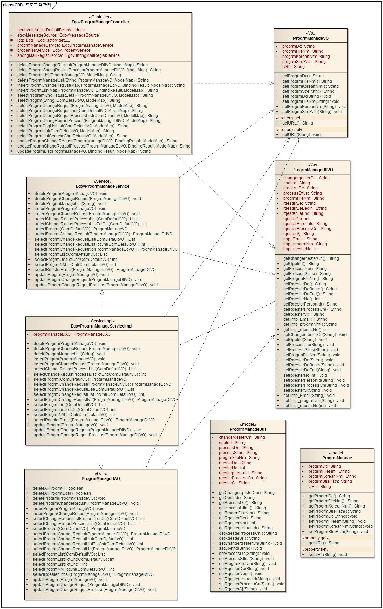

### 관련테이블

| 테이블명 | 테이블명(영문) | 비고 |
| --- | --- | --- |
| 프로그램목록 | COMTNPROGRMLIST | 프로그램목록을 관리한다. |
| 프로그램변경내역 | COMTHPROGRMCHANGEDTLS | 프로그램변경내역을 관리한다. |

## 관련기능

 프로그램관리는 프로그램 목록조회, 프로그램목록 등록, 프로그램목록 상세조회/수정, 프로그램목록 삭제, 프로그램 변경요청 조회, 프로그램 변경요청 등록, 프로그램 변경요청 상세조회/수정, 프로그램 변경요청 삭제, 프로그램 변경요청 처리 조회, 프로그램 변경요청 처리 상세화면, 프로그램 변경이력 조회, 프로그램 변경이력 상세화면 기능으로 구분된다.

### 프로그램 목록조회

#### 비즈니스 규칙

 신규 권한을 등록하기 위해서는 상단의 등록 버튼을 통해서 프로그램목록 등록 화면으로 이동하고 기존 프로그램목록정보를 수정하고자 하는 경우 해당 프로그램목록을 클릭하여 상세 조회 및 수정기능을 제공하는 프로그램목록 상세조회/수정 화면으로 이동한다.

#### 관련코드

 N/A

#### 관련화면 및 수행매뉴얼

| Action | URL | Controller method | QueryID |
| --- | --- | --- | --- |
| 조회 | /sym/prm/EgovProgramListManageSelect.do | selectProgrmList | "progrmManageDAO.selectProgrmList\_D", |
|  |  |  | "progrmManageDAO.selectProgrmListTotCnt\_S" |

 프로그램 목록은 페이지 당 10건씩 조회되며 페이징은 10페이지씩 이루어진다.
 검색조건은 프로그램한글명 대해서 수행된다.

 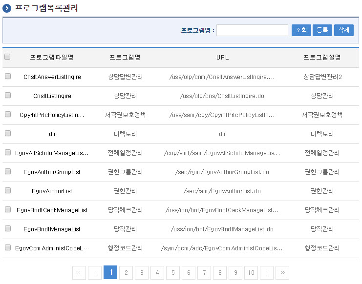

 조회 : 등록된 프로그램 목록을 조회한다.
 등록 : 신규 프로그램목록을 등록하기 위해서는 상단의 등록 버튼을 통해서 프로그램목록 등록 화면으로 이동한다.
 조회목록 선택 : 기존 프로그램목록을 수정하고자 하는 경우 해당 프로그램명를 클릭하여 상세 조회 및 수정기능을 제공하는 프로그램상세조회/수정 화면으로 이동한다.

### 프로그램목록 등록

#### 비즈니스 규칙

 프로그램목록 정보를 입력한 뒤 등록한다.

#### 관련코드

 N/A

#### 관련화면 및 수행매뉴얼

| Action | URL | Controller method | QueryID |
| --- | --- | --- | --- |
| 등록 | /sym/prm/EgovProgramListRegist.do | insertProgrmList | "progrmManageDAO.insertProgrm\_S" |

 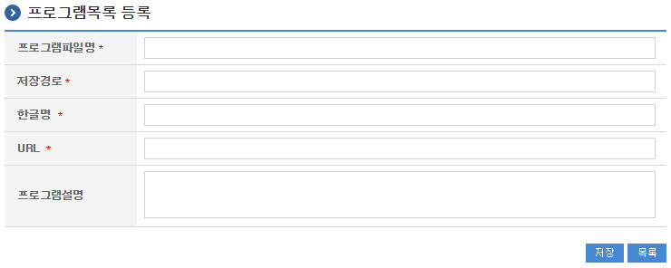

 목록 : 프로그램목록관리 화면으로 이동한다.
 등록 : 신규 프로그램목록을 등록하기 위해서는 상단의 등록 버튼을 통해서 저장한다.

### 프로그램목록 상세조회/수정

#### 비즈니스 규칙

 프로그램목록 정보를 변경한 후 저장한다.

#### 관련코드

 N/A

#### 관련화면 및 수행매뉴얼

| Action | URL | Controller method | QueryID |
| --- | --- | --- | --- |
| 수정 | /sym/prm/EgovProgramListDetailSelectUpdt.do | updateProgrmList | "progrmManageDAO.updateProgrm\_S" |
| 상세조회 | /sym/prm/EgovProgramListDetailSelect.do | selectProgrm | "progrmManageDAO.selectProgrmList\_D" |

 다음 화면은 프로그램목록 상세조회 화면과 동일하다.

 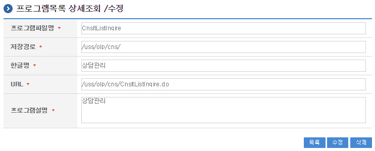

 목록 : 프로그램목록관리 화면으로 이동한다.
 수정 : 기 등록된 프로그램목록을 수정하기 위해서는 상단의 수정 버튼을 통해서 저장한다.

### 프로그램목록 삭제

#### 비즈니스 규칙

 멀티 삭제 - 프로그램목록을 조회한 뒤 삭제 대상을 체크박스로 선택하고, 삭제버튼을 클릭한다.
 단일 삭제 - 프로그램목록 상세조회/수정 화면에서 상세조회 삭제버튼을 클릭한다.

#### 관련코드

 N/A

#### 관련화면 및 수행매뉴얼

| Action | URL | Controller method | QueryID |
| --- | --- | --- | --- |
| 멀티삭제 | /sym/prm/EgovProgrmManageListDelete.do | deleteProgrmManageList | "progrmManageDAO.deleteProgrm\_S" |
| 단일삭제 | /sym/prm/EgovProgramListManageDelete.do | deleteProgrmList | "progrmManageDAO.deleteProgrm\_S" |

 멀티 삭제

 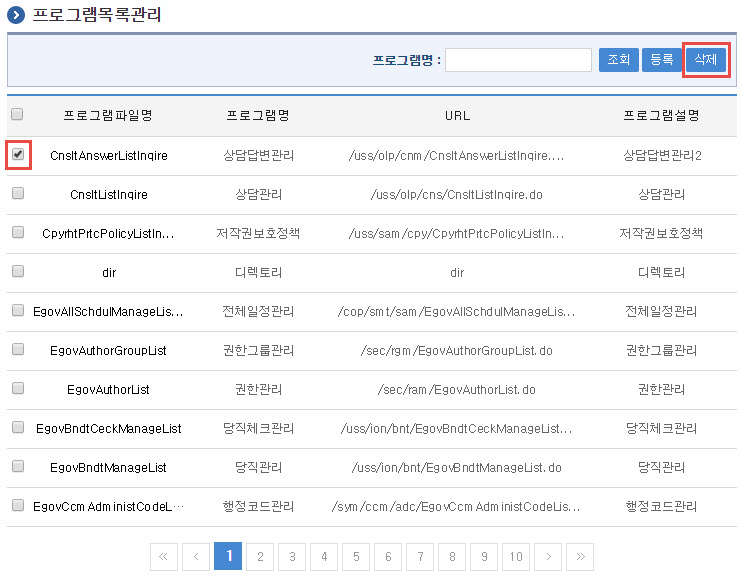

 선택 : 삭제하려는 목록을 체크박스로 설정한다. 멀티 삭제가 가능하다.
 삭제 : 기 등록된 프로그램목록을 단일 혹은 다건 삭제하기 위해서는 상단의 삭제 버튼을 통해서 삭제한다.
 단일 삭제

 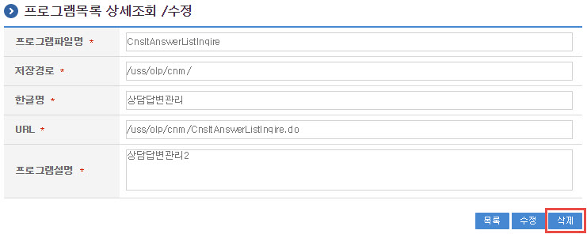

 삭제 : 기 등록된 프로그램목록을 삭제하기 위해서는 상단의 삭제 버튼을 통해서 삭제한다.

### 프로그램 변경요청 조회

#### 비즈니스 규칙

 신규 프로그램변경을 요청하기 위해서는 상단의 등록 버튼을 통해서 프로그램 변경요청 등록 화면으로 이동하고 기존 프로그램 변경요청 사항를 수정하고자 하는 경우 해당 프로그램 변경요청을 클릭하여 상세 조회 및 수정기능을 제공하는 프로그램 변경요청 상세조회/수정 화면으로 이동한다.

#### 관련코드

 N/A

#### 관련화면 및 수행매뉴얼

| Action | URL | Controller method | QueryID |
| --- | --- | --- | --- |
| 조회 | /sym/prm/EgovProgramChangeRequstSelect.do | selectProgrmChangeRequstList | "progrmManageDAO.selectProgrmChangeRequstList\_D", |
|  |  |  | "progrmManageDAO.selectProgrmChangeRequstListTotCnt\_S" |

 프로그램 변경요청 은 페이지 당 10건씩 조회되며 페이징은 10페이지씩 이루어진다.
 검색조건은 프로그램한글명 대해서 수행된다.

 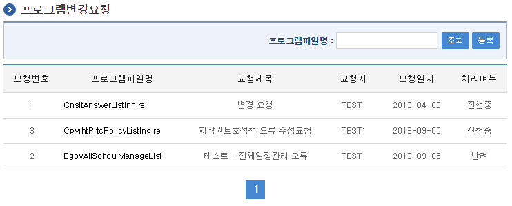

 조회 : 등록된 프로그램변경요청을 조회한다.
 등록 : 신규 프로그램변경요청을 등록하기 위해서는 상단의 등록 버튼을 통해서 프로그램변경요청 등록 화면으로 이동한다.
 조회목록 선택 : 기존 프로그램변경요청을 수정하고자 하는 경우 해당 프로그램명를 클릭하여 상세 조회 및 수정기능을 제공하는 프로그램변경요청상세조회/수정 화면으로 이동한다.

### 프로그램 변경요청 등록

#### 비즈니스 규칙

 프로그램변경요청 정보를 입력한 뒤 등록한다.

#### 관련코드

 N/A

#### 관련화면 및 수행매뉴얼

| Action | URL | Controller method | QueryID |
| --- | --- | --- | --- |
| 등록 | /sym/prm/EgovProgramChangRequstStre.do | insertProgrmChangeRequst | "progrmManageDAO.insertProgrmChangeRequst\_S" |

 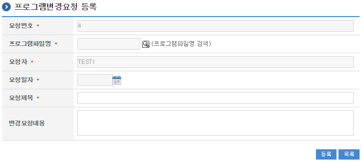

 검색 : 프로그램변경요청할 프로그램파일명을 검색하여 지정한다.
 달력 : 요청일자를 달력팝업에서 선택한다.
 목록 : 프로그램변경요청 화면으로 이동한다.
 등록 : 신규 프로그램변경요청을 등록하기 위해서는 하단의 등록 버튼을 통해서 저장한다.

### 프로그램 변경요청 상세조회/수정

#### 비즈니스 규칙

 프로그램변경요청 정보를 변경한 후 저장한다.

#### 관련코드

 N/A

#### 관련화면 및 수행매뉴얼

| Action | URL | Controller method | QueryID |
| --- | --- | --- | --- |
| 수정 | /sym/prm/EgovProgramChangRequstDetailSelectUpdt.do | updateProgrmChangeRequst | "progrmManageDAO.updateProgrmChangeRequst\_S" |
| 상세조회 | /sym/prm/EgovProgramChangRequstDetailSelect.do | selectProgrmChangeRequst | "proprogrmManageDAO.selectProgrmChangeRequstList\_D" |

 다음 화면은 프로그램변경요청 상세조회 화면과 동일하다.

 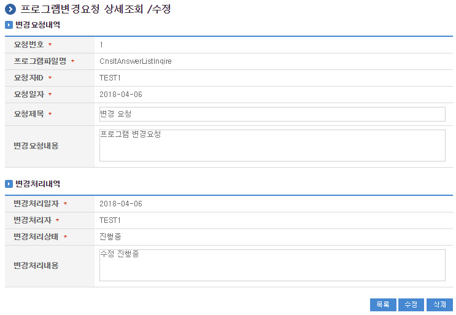

 목록 : 프로그램변경요청 화면으로 이동한다.
 수정 : 기 등록된 프로그램변경요청을 수정하기 위해서는 하단의 수정 버튼을 통해서 저장한다.
 프로그램변경요청 수정은 변경요청 신청한 신청자만 수정 할 수 있다.

### 프로그램 변경요청 삭제

#### 비즈니스 규칙

 프로그램 변경요청의 삭제를 수행한다.

#### 관련코드

 N/A

#### 관련화면 및 수행매뉴얼

| Action | URL | Controller method | QueryID |
| --- | --- | --- | --- |
| 삭제 | /sym/prm/EgovProgramChangRequstDelete.do | deleteProgrmChangeRequst | "progrmManageDAO.deleteProgrmChangeRequst\_S" |

 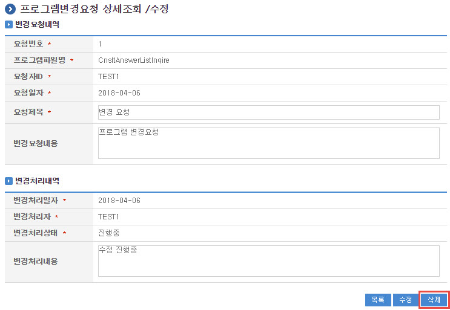

 삭제 : 기 등록된 프로그램변경요청을 삭제하기 위해서는 상단의 삭제 버튼을 통해서 삭제한다.
 프로그램변경요청 삭제는 변경요청 신청한 신청자만 삭제 할 수 있다.

### 프로그램 변경요청 처리 조회

#### 비즈니스 규칙

 프로그램변경요청을 처리하기 위해서는 해당 프로그램 변겨요청사항을 클릭하여 상세 조회 및 수정기능을 제공하는 프로그램변경요청처리 상세조회/수정 화면으로 이동한다.

#### 관련코드

 N/A

#### 관련화면 및 수행매뉴얼

| Action | URL | Controller method | QueryID |
| --- | --- | --- | --- |
| 조회 | /sym/prm/EgovProgramChangeRequstProcessListSelect.do | selectProgrmChangeRequstProcessList | "progrmManageDAO.selectChangeRequstProcessList\_D", |
|  |  |  | "progrmManageDAO.selectChangeRequstProcessListTotCnt\_S" |

 프로그램 변경요청 처리 목록은 페이지 당 10건씩 조회되며 페이징은 10페이지씩 이루어진다.
 검색조건은 프로그램한글명 대해서 수행된다.

 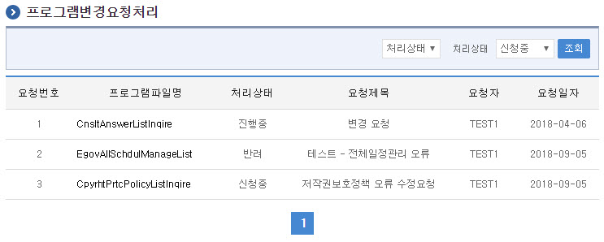

 검색조건 리스트박스 : 검색조건을 리스트박스에서 선택한다.(전체, 처리상태, 요청일자, 요청자)
 검색조건이 처리상태일 경우 : 처리상태 리스트박스에서 검색 조건을 선택한다.(신청중, 진행중, 반려, 처리완료)
 검색조건이 요청일자일 경우 : 요청일자를 검색 시작일자 ~ 검색 종료일자를 달력팝업을 통해 일자를 선택한다.
 검색조건이 신청자일 경우 : 신청자  ID를 입력하여 조회한다.
 조회 : 등록된 프로그램변경요청 사항을 조회한다.
 조회목록 선택 : 기존 프로그램변경요청 사항을 처리하고자 하는 경우 해당 프로그램명를 클릭하여 상세 조회 및 수정기능을 제공하는 프로그램변경요청처리 상세조회/수정 화면으로 이동한다.

### 프로그램 변경요청 처리 상세화면

#### 비즈니스 규칙

 프로그램변경요청처리 진행사항을 변경한 후 저장한다.

#### 관련코드

 N/A

#### 관련화면 및 수행매뉴얼

| Action | URL | Controller method | QueryID |
| --- | --- | --- | --- |
| 수정 | /sym/prm/EgovProgramChangRequstProcessDetailSelectUpdt.do | updateProgrmChangRequstProcess | "progrmManageDAO.updateProgrmChangeRequstProcess\_S" |
| 상세조회 | /sym/prm/EgovProgramChangRequstProcessDetailSelect.do | selectProgrmChangRequstProcess | "progrmManageDAO.selectProgrmChangeRequstList\_D" |

 다음 화면은 프로그램변경요청처리 상세조회 화면과 동일하다.

 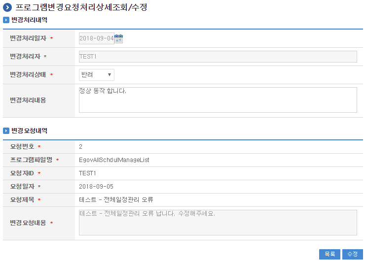

 달력 : 처리일자를 달력팝업에서 선택한다.
 목록 : 프로그램변경요청처리 화면으로 이동한다.
 수정 : 등록된 프로그램변경요청 사항을 처리하기 위해서는 진행사항을 지정후 하단의 수정 버튼을 통해서 저장한다.
 프로그램변경요청처리 수정 시 변경요청처리를 처리한 처리자만 수정 할 수 있다.

### 프로그램 변경이력 조회

#### 비즈니스 규칙

 프로그램 변경이력 목록은 페이지 당 10건씩 조회되며 페이징은 10페이지씩 이루어진다.
 검색조건은 프로그램한글명 대해서 수행된다.

#### 관련코드

 N/A

#### 관련화면 및 수행매뉴얼

| Action | URL | Controller method | QueryID |
| --- | --- | --- | --- |
| 조회 | /sym/prm/EgovProgramChgHstListSelect.do | selectProgrmChgHstList | "progrmManageDAO.selectProgrmChangeRequstList\_D", |
|  |  |  | "progrmManageDAO.selectProgrmChangeRequstListTotCnt\_S" |

 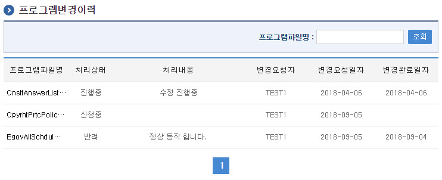

 조회 : 등록된 프로그램변경이력 사항을 조회한다.
 조회목록 선택 : 기존 프로그램변경요청 사항을 상세조회하고자 하는 경우 해당 프로그램명를 클릭하여 상세 조회기능을 제공하는 프로그램변경이력 상세조회 화면으로 이동한다.

### 프로그램 변경이력 상세화면

#### 비즈니스 규칙

 프로그램 변경이력 상세화면을 조회한다.

#### 관련코드

 N/A

#### 관련화면 및 수행매뉴얼

| Action | URL | Controller method | QueryID |
| --- | --- | --- | --- |
| 상세조회 | /sym/prm/EgovProgramChgHstListDetailSelect.do | selectProgramChgHstListDetail | "progrmManageDAO.selectProgrmChangeRequstList\_D" |

 다음 화면은 프로그램 변경이력 상세조회 화면과 동일하다.

 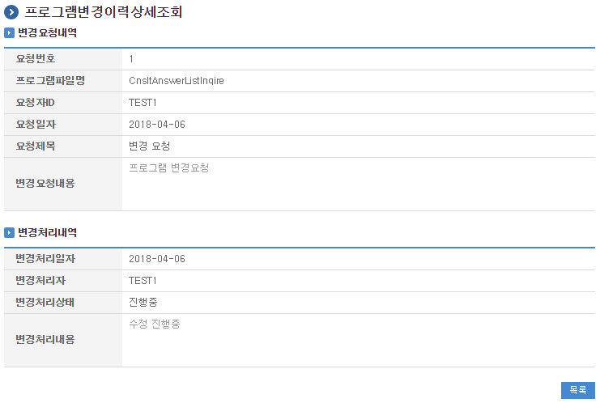

 목록 : 프로그램 변경이력  화면으로 이동한다.
