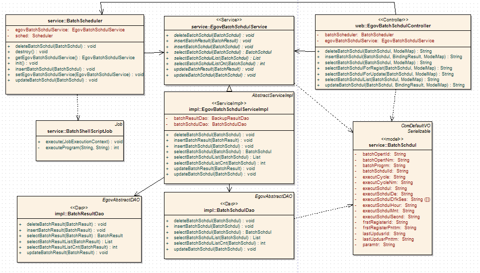
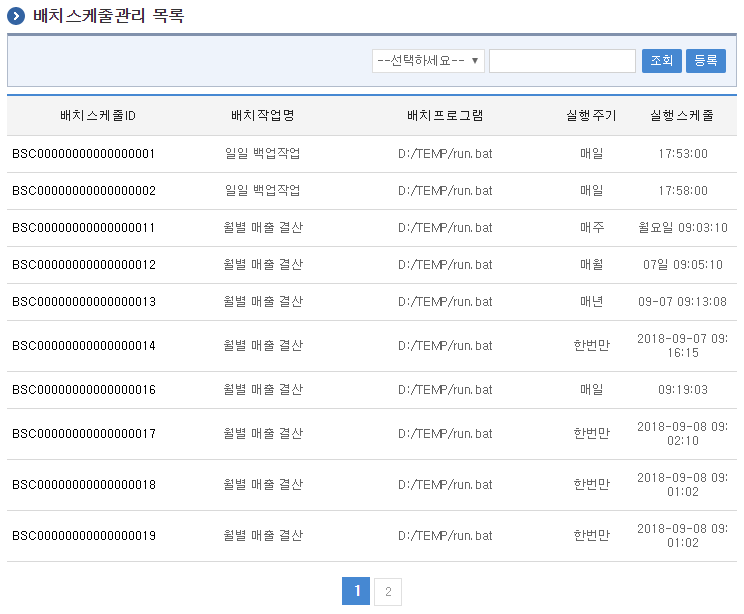
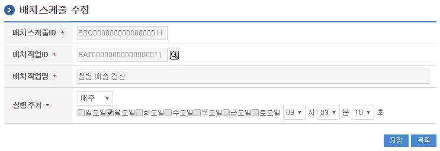
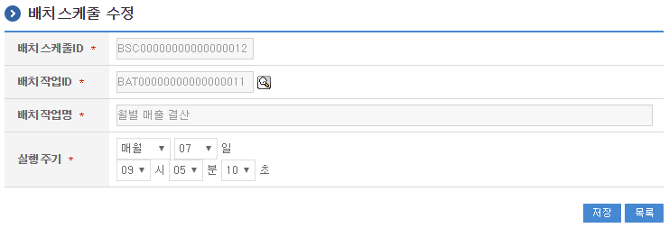

# 스케줄처리

## 개요

 배치스케줄처리는 배치작업을 실행하기위한 배치스케줄을 등록하는 기능을 제공한다.

## 설명

 배치스케줄처리는 배치스케줄을 등록하기 위한 목적으로 배치스케줄의 등록, 수정, 삭제, 조회, 목록조회의 기능을 수반한다.

```text
  ① 배치스케줄목록조회 : 배치스케줄으로 정의된 정보를 최근 등록 순서대로 조회하고, 그 결과 목록을 화면에 반영한다.
  ② 배치스케줄등록 : 배치스케줄정보를 등록하고, 등록 결과를 조회한다.
  ③ 배치스케줄수정 : 기 등록된 배치스케줄정보의 항목들을 수정한다.
  ④ 배치스케줄삭제 : 기 등록된 배치스케줄정보를 삭제한다.
  ⑤ 배치스케줄조회 : 등록된 배치스케줄정보를 조회한다.
```

### 관련소스

| 유형 | 대상소스명 | 비고 |
| --- | --- | --- |
| Controller | egovframework.com.sym.bat.web.EgovBatchSchdulController.java | 배치스케줄 관리를 위한 컨트롤러 클래스 |
| Service | egovframework.com.sym.bat.service.EgovBatchSchdulService.java | 배치스케줄 관리를 위한 서비스 인터페이스 |
| ServiceImpl | egovframework.com.sym.bat.service.impl.EgovBatchSchdulServiceImpl.java | 배치스케줄 관리를 위한 서비스 구현 클래스 |
| DAO | egovframework.com.sym.bat.service.impl.BatchSchdulDao.java | 배치스케줄 관리를 위한 데이터처리 클래스 |
| Model | egovframework.com.sym.bat.service.BatchSchdul.java | 배치스케줄 관리를 위한 Model 클래스 |
| JSP | /WEB-INF/jsp/egovframework/com/sym/bat/EgovBatchSchdulList.jsp | 배치스케줄 목록조회를 위한 jsp페이지 |
| JSP | /WEB-INF/jsp/egovframework/com/sym/bat/EgovBatchSchdulRegist.jsp | 배치스케줄 등록을 위한 jsp페이지 |
| JSP | /WEB-INF/jsp/egovframework/com/sym/bat/EgovBatchSchdulUpdt.jsp | 배치스케줄 수정을 위한 jsp페이지 |
| JSP | /WEB-INF/jsp/egovframework/com/sym/bat/EgovBatchSchdulDetail.jsp | 등록된 배치스케줄을 조회하기 위한 jsp페이지 |
| QUERY XML | resources/egovframework/mapper/com/sym/bat/EgovBatchSchdul\_SQL\_mysql.xml | 배치스케줄관리 MySQL용 QUERY XML |
| QUERY XML | resources/egovframework/mapper/com/sym/bat/EgovBatchSchdul\_SQL\_oracle.xml | 배치스케줄관리 Oracle용 QUERY XML |
| QUERY XML | resources/egovframework/mapper/com/sym/bat/EgovBatchSchdul\_SQL\_tibero.xml | 배치스케줄관리 Tibero용 QUERY XML |
| QUERY XML | resources/egovframework/mapper/com/sym/bat/EgovBatchSchdul\_SQL\_altibase.xml | 배치스케줄관리 Altibase용 QUERY XML |
| QUERY XML | resources/egovframework/mapper/com/sym/bat/EgovBatchSchdul\_SQL\_cubrid.xml | 배치스케줄관리 Cubrid용 QUERY XML |
| QUERY XML | resources/egovframework/mapper/com/sym/bat/EgovBatchSchdul\_SQL\_maria.xml | 배치스케줄관리 Maria용 QUERY XML |
| QUERY XML | resources/egovframework/mapper/com/sym/bat/EgovBatchSchdul\_SQL\_postgres.xml | 배치스케줄관리 Postgres용 QUERY XML |
| QUERY XML | resources/egovframework/mapper/com/sym/bat/EgovBatchSchdul\_SQL\_goldilocks.xml | 배치스케줄관리 Goldilocks용 QUERY XML |
| Message properties | resources/egovframework/message/com/message-common\_ko.properties | 배치스케줄관리 Message properties |
| Message properties | resources/egovframework/message/com/sym/bat/message\_ko.properties | 배치스케줄관리를 위한 Message properties(한글) |
| Message properties | resources/egovframework/message/com/sym/bat/message\_en.properties | 배치스케줄관리를 위한 Message properties(영문) |
| Idgen XML | resources/egovframework/spring/com/idgn/context-idgn-BatchOpert.xml | 배치스케줄관리를 위한 Id생성 Idgen XML |

### 클래스 다이어그램

 

### 관련테이블

| 테이블명 | 테이블명(영문) | 비고 |
| --- | --- | --- |
| 배치스케줄 | COMTNBATCHSCHDUL | 배치스케줄정보를 관리하기 위한 속성정보를 정의하고, 관리한다. |
| 배치스케줄요일 | COMTNBATCHSCHDULDFK | 배치스케줄요일정보를 관리하기 위한 속성정보를 정의하고, 관리한다. |

#### ID Generation 관련 DDL 및 DML

 ID Generation Service를 활용하기 위해서 Sequence 저장테이블인  COMTECOPSEQ에 BATCH_SCHDUL_ID 항목을 추가해야 한다.

```sql
    CREATE TABLE COMTECOPSEQ ( table_name varchar(16) NOT NULL, 
                               next_id DECIMAL(30) NOT NULL,
                               PRIMARY KEY (table_name)
    );
 
    INSERT INTO COMTECOPSEQ VALUES ('BATCH_SCHDUL_ID','0');
```

#### ID Generation 환경설정(context-idgn-BatchOpert.xml)

```xml
    <bean name="egovBatchSchdulIdGnrService" class="egovframework.rte.fdl.idgnr.impl.EgovTableIdGnrServiceImpl" destroy-method="destroy">
        <property name="dataSource" ref="egov.dataSource" />
        <property name="strategy"   ref="batchSchdulIdStrategy" />
        <property name="blockSize"  value="10"/>
        <property name="table"      value="COMTECOPSEQ"/>
        <property name="tableName"  value="BATCH_SCHDUL_ID"/>
    </bean>
    <bean name="batchSchdulIdStrategy" class="egovframework.rte.fdl.idgnr.impl.strategy.EgovIdGnrStrategyImpl">
        <property name="prefix"     value="BSC" />
        <property name="cipers"     value="17" />
        <property name="fillChar"   value="0" />
    </bean>
```

## 관련화면 및 수행메뉴얼

### 배치스케줄 목록조회

| Action | URL | Controller method | QueryID |
| --- | --- | --- | --- |
| 조회 | /sym/bat/getBatchSchdulList.do | selectBatchSchdulList | "BatchSchdulDAO.selectBatchSchdulList" |
| 조회 | /sym/bat/getBatchSchdulList.do | selectBatchSchdulList | "BatchSchdulDAO.selectBatchSchdulListCnt" |

 배치스케줄 목록은 페이지당 10건씩 조회되며 페이징은 10페이지씩 이루어진다.
 검색조건은 배치작업명,배치프로그램에 대해서 수행된다.

 

 조회 : 기 등록된 배치스케줄의 목록을 조회한다.
 등록 : 신규 배치스케줄을 등록하기 위해서는 상단의 등록 버튼을 통해서 배치스케줄 등록 화면으로 이동한다.

### 배치스케줄 등록

| Action | URL | Controller method | QueryID |
| --- | --- | --- | --- |
| 등록 | /sym/bat/addBatchSchdul.do | insertBatchSchdul | "BatchSchdulDAO.insertBatchSchdul" |

 배치스케줄의 속성정보를 입력한 뒤 등록한다.

 

 저장 : 신규 배치스케줄을 등록하기 위해서는 배치스케줄 속성을 입력한 뒤 상단의 저장 버튼을 통해서 배치스케줄을 등록한다.
 목록 : 배치스케줄 목록조회 화면으로 이동한다.

### 배치스케줄 수정

| Action | URL | Controller method | QueryID |
| --- | --- | --- | --- |
| 수정 | /sym/bat/updateBatchSchdul | updateBatchSchdul | "BatchSchdulDAO.updateBatchSchdul" |

 배치스케줄의 속성정보를 변경한 후 저장한다.

 

 저장 : 기 등록된 배치스케줄 속성을 수정한 뒤 상단의 저장 버튼을 통해서 배치스케줄정보를 수정한다.
 목록 : 배치스케줄 목록조회 화면으로 이동한다.

### 배치스케줄 상세조회

| Action | URL | Controller method | QueryID |
| --- | --- | --- | --- |
| 상세조회 | /sym/bat/getBatchSchdul.do | selectBatchSchdul | "BatchSchdulDAO.selectBatchSchdul" |
| 삭제 | /sym/bat/deleteBatchSchdul.do | deleteBatchSchdul | "BatchSchdulDAO.deleteBatchSchdul" |

 배치스케줄의 속성정보를 조회한다.

 

 수정 : 기 등록된 배치스케줄 속성을 수정한 뒤 상단의 수정 버튼을 통해서 배치스케줄수정화면으로 이동한다.
 삭제 : 기 등록된 배치스케줄정보를 삭제한다.
 목록 : 배치스케줄 목록조회 화면으로 이동한다.
