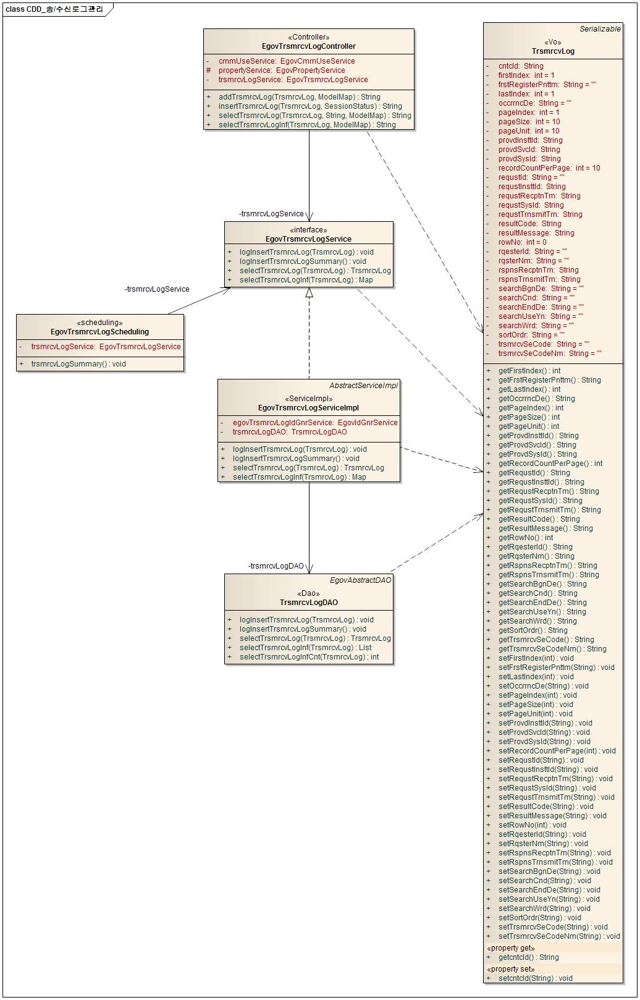
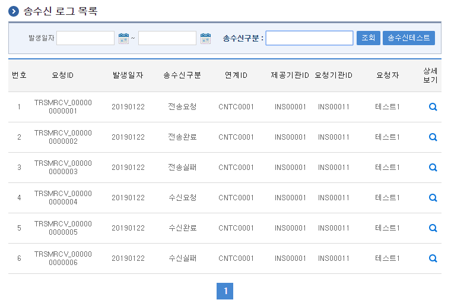
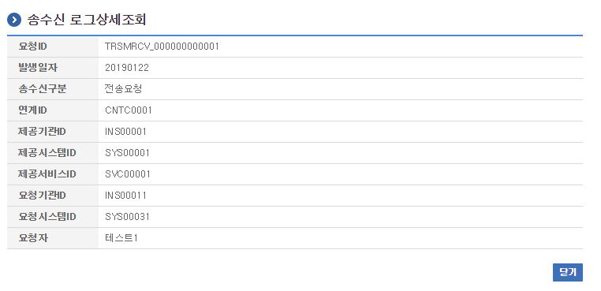
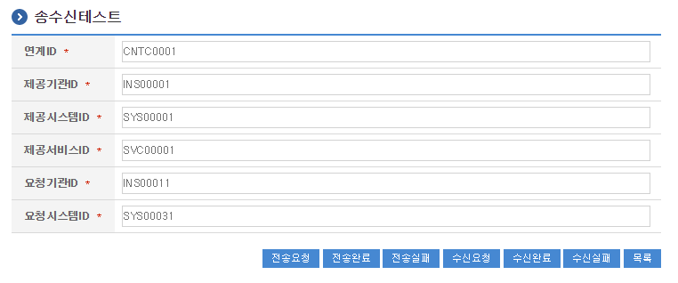

# 송수신로그관리

## 개요

 송수신로그관리는 시스템 연계시 발생하는 로그를 검색, 조회하는 기능을 제공한다.

## 설명

 송수신로그관리는 송수신로그의 등록, 조회, 목록, 삭제, 요약의 기능을 수반한다.

 ① 송수신로그등록 : 송수신로그정보를 등록한다.
 ② 송수신로그조회 : 송수신로그정보의 상세내용을 조회한다.
 ③ 송수신로그목록 : 송수신로그정보의 목록을 검색, 조회한다.
 ④ 송수신로그삭제 : 송수신로그정보를 삭제한다. - 실행환경의 Scheduling 기능을 이용
 ⑤ 송수신로그요약 : 송수신로그정보를 요약하여 Summary를 생성한다. - 실행환경의 Scheduling 기능을 이용

### 패키지 참조 관계

 송수신로그관리 패키지는 요소기술의 공통(cmm) 패키지에 대해서만 직접적인 함수적 참조 관계를 가진다. 하지만, 컴포넌트 배포 시 오류 없이 실행되기 위하여 패키지 간의 참조관계에 따라 송수신모니터링, 달력 패키지와 함께 배포 파일을 구성한다.
 패키지 간 참조 관계 : [시스템관리 Package Dependency](../intro/package-reference.md/#시스템관리)

### 관련소스

| 유형 | 대상소스명 | 비고 |
| --- | --- | --- |
| Controller | egovframework.com.sym.log.tlg.web.EgovTrsmrcvLogController.java | 송수신로그 관리를 위한 컨트롤러 클래스 |
| Service | egovframework.com.sym.log.tlg.service.EgovTrsmrcvLogService.java | 송수신로그 관리를 위한  서비스 인터페이스 |
| ServiceImpl | egovframework.com.sym.log.tlg.service.impl.EgovTrsmrcvLogServiceImpl.java | 송수신로그 관리를 위한 서비스 구현 클래스 |
| Model | egovframework.com.sym.log.tlg.service.TrsmrcvLog.java | 송수신로그 관리를 위한 클래스 |
| DAO | egovframework.com.sym.log.tlg.service.impl.TrsmrcvLogDAO.java | 송수신로그 관리를 위한 데이터처리 클래스 |
| Scheduler | egovframework.com.sym.log.tlg.service.EgovTrsmrcvLogScheduling.java | 송수신로그 삭제, 요약을 위한 Scheduling 클래스 |
| JSP | /WEB-INF/jsp/egovframework/com/sym/log/tlg/EgovTrsmrcvLogList.jsp | 송수신로그 목록을 위한 jsp페이지 |
| JSP | /WEB-INF/jsp/egovframework/com/sym/log/tlg/EgovTrsmrcvLogInqire.jsp | 송수신로그 조회를 위한 jsp페이지 |
| JSP | /WEB-INF/jsp/egovframework/com/sym/log/tlg/EgovTrsmrcvLogRegist.jsp | 송수신로그 등록을 위한 jsp페이지 |
| QUERY XML | resources/egovframework/mapper/com/sym/log/tlg/EgovTrsmrcvLog\_SQL\_mysql.xml | 송수신로그 관리 MySQL용 QUERY XML |
| QUERY XML | resources/egovframework/mapper/com/sym/log/tlg/EgovTrsmrcvLog\_SQL\_cubrid.xml | 송수신로그 관리 Cubrid용 QUERY XML |
| QUERY XML | resources/egovframework/mapper/com/sym/log/tlg/EgovTrsmrcvLog\_SQL\_oracle.xml | 송수신로그 관리 Oracle용 QUERY XML |
| QUERY XML | resources/egovframework/mapper/com/sym/log/tlg/EgovTrsmrcvLog\_SQL\_tibero.xml | 송수신로그 관리 Tibero용 QUERY XML |
| QUERY XML | resources/egovframework/mapper/com/sym/log/tlg/EgovTrsmrcvLog\_SQL\_altibase.xml | 송수신로그 관리 Altibase용 QUERY XML |
| QUERY XML | resources/egovframework/mapper/com/sym/log/tlg/EgovTrsmrcvLog\_SQL\_maria.xml | 송수신로그 관리 MariaDB용 QUERY XML |
| QUERY XML | resources/egovframework/mapper/com/sym/log/tlg/EgovTrsmrcvLog\_SQL\_postgres.xml | 송수신로그 관리 PostgreSQL용 QUERY XML |
| QUERY XML | resources/egovframework/mapper/com/sym/log/tlg/EgovTrsmrcvLog\_SQL\_goldilocks.xml | 송수신로그 관리 Goldilocks용 QUERY XML |
| Idgen XML | resources/egovframework/spring/com/idgn/context-idgn-TrsmrcvLog.xml | 송수신로그 관리 Id생성 Idgen XML |
| Message properties | resources/egovframework/message/com/sym/log/tlg/message\_ko.properties | 송수신로그 관리를 위한 Message properties(한글) |
| Message properties | resources/egovframework/message/com/sym/log/tlg/message\_en.properties | 송수신로그 관리를 위한 Message properties(영문) |

### 클래스 다이어그램

 

### ID Generation

#### ID Generation 관련 DDL 및 DML

 ID Generation Service를 활용하기 위해서 Sequence 저장테이블인 COMTECOPSEQ에 TRSMRCVLOG_ID 항목을 추가한다.

```sql
CREATE TABLE COMTECOPSEQ ( table_name varchar(16) NOT NULL, 
  		   next_id DECIMAL(30) NOT NULL,
  		   PRIMARY KEY (table_name));
 
  INSERT INTO COMTECOPSEQ VALUES('TRSMRCVLOG_ID','0');
```

#### ID Generation 환경설정(context-idgn-TrsmrcvLog.xml)

```xml
<bean name="egovTrsmrcvLogIdGnrService"
    class="egovframework.rte.fdl.idgnr.impl.EgovTableIdGnrService"
    destroy-method="destroy">
    <property name="dataSource" ref="dataSource" />
    <property name="strategy"   ref="trsmrcvLogStrategy" />
    <property name="blockSize"  value="1"/>
    <property name="table"      value="COMTECOPSEQ"/>
    <property name="tableName"  value="TRSMRCVLOG_ID"/>
  </bean>
 
  <bean name="trsmrcvLogStrategy"
    class="egovframework.rte.fdl.idgnr.impl.strategy.EgovIdGnrStrategyImpl">
    <property name="prefix" value="TRSMRCV_" />
    <property name="cipers" value="12" />
    <property name="fillChar" value="0" />
  </bean>
```

### 관련 테이블

| 테이블명 | 테이블명(영문) | 비고 |
| --- | --- | --- |
| 송수신로그 | COMTNTRSMRCVLOG | 송수신로그 정보를 관리한다. |
| 송수신로그요약 | COMTSTRSMRCVLOGSUMMARY | 송수신로그 요약정보를 관리한다. |

### Scheduling

#### context-scheduling-sym-log-tlg.xml (src/main/resources/egovframework/spring/com/context-scheduling-sym-log-tlg.xml)

```xml
<!-- 송수신 로그 요약  -->
  <bean id="trsmrcvLogging"
    class="org.springframework.scheduling.quartz.MethodInvokingJobDetailFactoryBean">
    <property name="targetObject" ref="egovLogManageScheduling" />
    <property name="targetMethod" value="trsmrcvLogSummary" />
    <property name="concurrent" value="false" />
  </bean>
 
  <!-- 송수신 로그 요약  트리거-->
  <bean id="trsmrcvLogTrigger"
    class="org.springframework.scheduling.quartz.SimpleTriggerBean">
    <property name="jobDetail" ref="trsmrcvLogging" />
    <!-- 시작하고 1분후에 실행한다. (milisecond) -->
    <property name="startDelay" value="60000" />
    <!-- 매 1시간마다 실행한다. (milisecond) -->
    <property name="repeatInterval" value="3600000" />
  </bean>
 
  <!-- 스케쥴러 등록-->
  <bean id="logSummaryScheduler" class="org.springframework.scheduling.quartz.SchedulerFactoryBean">
    <property name="triggers">
      <list>
        <ref bean="sysLogTrigger" />
        <ref bean="webLogTrigger" />
        <ref bean="trsmrcvLogTrigger" />
        <ref bean="userLogTrigger" />
      </list>
    </property>
  </bean>
```

 송수신로그 삭제, 요약 기능구현을 위하여 Scheduling을 설정한다.
 송수신로그 삭제, 요약 기능구현을 위하여 EgovTrsmrcvLogScheduling클래스를 생성한다.

 @Service("egovTrsmrcvLogScheduling")
 public class EgovTrsmrcvLogScheduling {
 @Resource(name="EgovTrsmrcvLogService")
 private EgovTrsmrcvLogService trsmrcvLogService;
 /**
 * 송수신 로그정보를 요약한다.
 * 전날의 로그를 요약하여 입력하고, 일주일전의 로그를 삭제한다.
 *
 * @param
 * @return
 * @throws Exception
 */
 public void trsmrcvLogSummary() throws Exception {
 trsmrcvLogService.logInsertTrsmrcvLogSummary();
 }
 }

## 관련기능

 송수신로그관리는 송수신로그 목록조회, 송수신로그 상세조회, 송수신로그 등록 기능으로 구분된다.

### 송수신로그 목록조회

#### 비즈니스 규칙

 송수신로그 목록은 페이지 당 10건씩 조회되며 페이징은 10페이지씩 이루어진다. 검색조건은 발생일자와 송수신구분에 대해서 수행된다.

#### 관련코드

 N/A

#### 관련화면 및 수행메뉴얼

| Action | URL | Controller method | QueryID |
| --- | --- | --- | --- |
| 목록조회 | /sym/log/tlg/SelectTrsmrcvLogList.do | selectTrsmrcvLogInf | "TrsmrcvLogDAO.selectTrsmrcvLogInf", |
|  |  |  | "TrsmrcvLogDAO.selectTrsmrcvLogInfCnt" |

 

 송수신로그 상세조회 기능을 수행하기 위해서는 상세보기 버튼을 클릭한다.
 송수신로그 등록 기능을 수행하기 위해서는 송수신테스트 버튼을 클릭한다.

### 송수신로그 상세조회

#### 비즈니스 규칙

 송수신로그 상세조회는 팝업창으로 구성되며, 닫기 버튼을 클릭하면 창을 닫는다.

#### 관련코드

 N/A

#### 관련화면 및 수행메뉴얼

| Action | URL | Controller method | QueryID |
| --- | --- | --- | --- |
| 상세조회 | /sym/log/tlg/InqireTrsmrcvLog.do | selectTrsmrcvLog | "TrsmrcvLogDAO.selectTrsmrcvLog" |

 

### 송수신로그 등록

#### 비즈니스 규칙

 송수신로그 등록은 정해진 테스트 값을 가지고 송수신구분값을 달리하여 테스트 데이터를 등록한다.

#### 관련코드

 N/A

#### 관련화면 및 수행메뉴얼

| Action | URL | Controller method | QueryID |
| --- | --- | --- | --- |
| 등록 | /sym/log/tlg/InsertTrsmrcvLog.do | insertTrsmrcvLog | "TrsmrcvLogDAO.logInsertTrsmrcvLog" |

 

 송수신로그 등록은 테스트를 위한 기능이며, 실제 프로젝트에 적용시에는 해당 프로젝트의 연계표준에 맞춰 등록 기능을 만들어주어야 한다.
 전송요청 버튼을 클릭하면 송수신구분 : "전송요청"에 대하여 테스트를 한다.
 전송완료 버튼을 클릭하면 송수신구분 : "전송완료"에 대하여 테스트를 한다.
 전송실패 버튼을 클릭하면 송수신구분 : "전송실패"에 대하여 테스트를 한다.
 수신요청 버튼을 클릭하면 송수신구분 : "수신요청"에 대하여 테스트를 한다.
 수신완료 버튼을 클릭하면 송수신구분 : "수신완료"에 대하여 테스트를 한다.
 수신실패 버튼을 클릭하면 송수신구분 : "수신실패"에 대하여 테스트를 한다.
 목록 버튼을 클릭하면 송수신로그 목록조회 페이지로 이동한다.

## 참고자료

 실행환경 참조 : Scheduling
 실행환경 참조 : ID Generation
