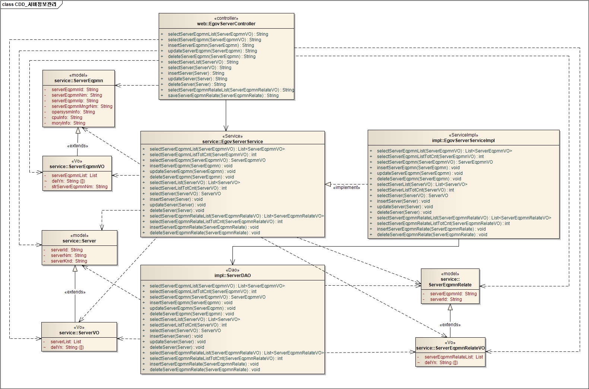
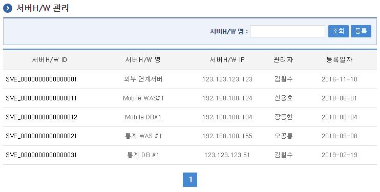
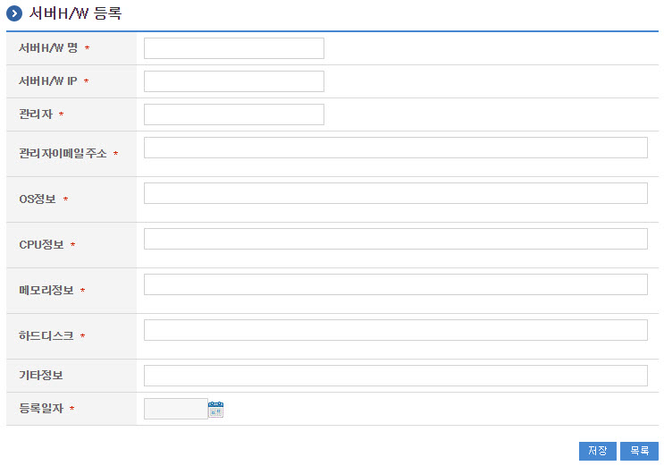
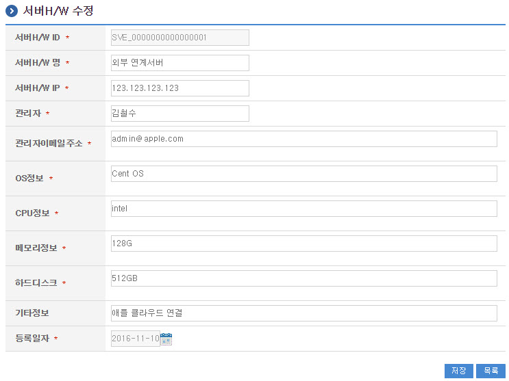
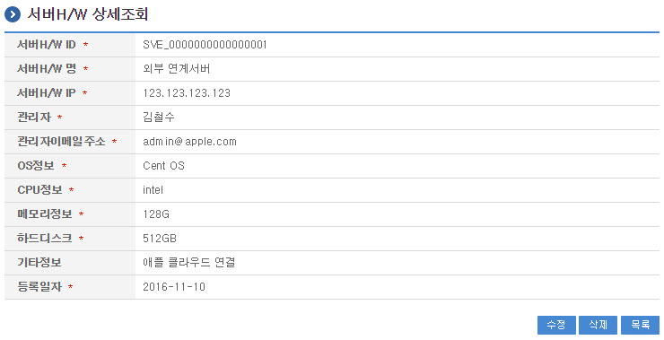
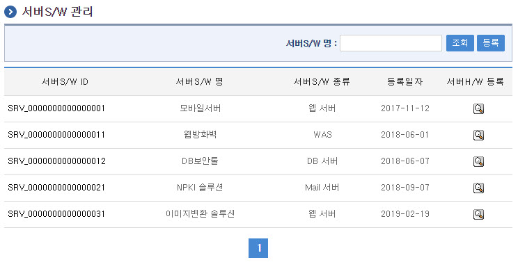
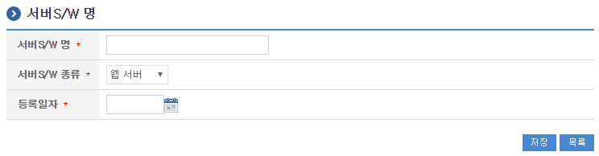
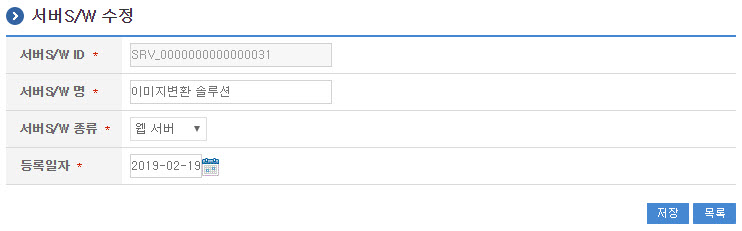
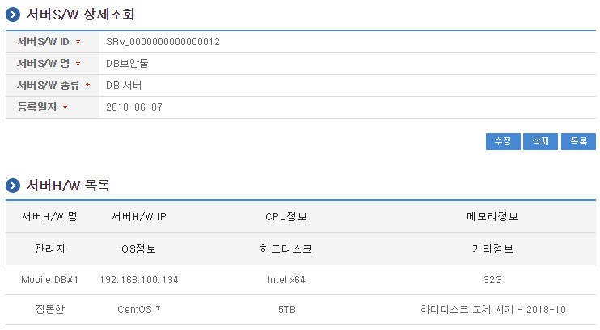
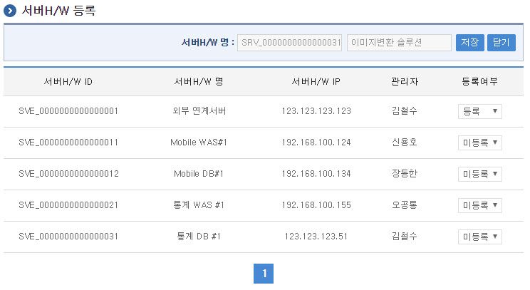

# 서버정보관리

## 개요

 서버장비관리는 웹서버, WAS서버, DB서버 등 시스템을 구성하는 서버의 정보를 관리하는 기능을 제공한다.

## 설명

 서버정보관리는 서버 정보를 관리하기 위한 목적으로 서버정보 및 서버장비정보의 등록, 수정, 삭제, 조회, 목록조회의 기능을 수반한다.

```text
  ① 서버장비목록조회 : 서버장비로 정의된 정보를 최근 등록 순서대로 조회하고, 그 결과 목록을 화면에 반영한다.
  ② 서버장비등록 : 서버장비정보를 등록하고, 등록 결과를 조회한다.
  ③ 서버장비수정 : 기 등록된 서버장비정보의 항목들을 수정한다.
  ④ 서버장비삭제 : 기 등록된 서버장비정보를 삭제한다.
  ⑤ 서버장비상세조회 : 등록된 서버장비정보를 조회한다. 
  ⑥ 서버정보목록조회 : 서버로 정의된 정보를 최근 등록 순서대로 조회하고, 그 결과 목록을 화면에 반영한다.
  ⑦ 서버정보등록 : 서버정보를 등록하고, 등록 결과를 조회한다.
  ⑧ 서버정보수정 : 기 등록된 서버정보의 항목들을 수정한다.
  ⑨ 서버정보삭제 : 기 등록된 서버정보를 삭제한다.
  ⑩ 서버정보상세조회 : 등록된 서버정보를 조회한다. 
  ⑪ 서버장비관계등록(삭제) : 선택된 서버에 해당하는 서버의 장비를 등록(삭제)한다.
```

#### 관련소스

| 유형 | 대상소스명 | 비고 |
| --- | --- | --- |
| Controller | egovframework.com.sym.sym.srv.web.EgovServerController.java | 서버정보관리를 위한 controller 클래스 |
| Service | egovframework.com.sym.sym.srv.service.EgovServerService.java | 서버정보관리를 위한 Service Interface |
| ServiceImpl | egovframework.com.sym.sym.srv.service.impl.EgovServerServiceImpl.java | 서버정보관리를 위한 서비스 구현 클래스 |
| DAO | egovframework.com.sym.sym.srv.service.impl.ServerDAO.java | 서버정보관리를 위한 데이터처리 클래스 |
| Model | egovframework.com.sym.sym.srv.service.Server.java | 서버정보 관리를 위한 Model 클래스 |
| Model | egovframework.com.sym.sym.srv.service.ServerEqpmn.java | 서버장비 관리를 위한 Model 클래스 |
| Model | egovframework.com.sym.sym.srv.service.ServerEqpmnRelate.java | 서버장비관계 관리를 위한 Model 클래스 |
| VO | egovframework.com.sym.sym.srv.service.ServerVO.java | 서버정보 관리를 위한 VO 클래스 |
| VO | egovframework.com.sym.sym.srv.service.ServerEqpmnVO.java | 서버장비 관리를 위한 VO 클래스 |
| VO | egovframework.com.sym.sym.srv.service.ServerEqpmnRelateVO.java | 서버장비관계 관리를 위한 VO 클래스 |
| JSP | /WEB-INF/jsp/egovframework/com/sym/sym/srv/EgovServerList.jsp | 서버정보 목록조회를 위한 jsp페이지 |
| JSP | /WEB-INF/jsp/egovframework/com/sym/sym/srv/EgovServerRegist.jsp | 서버정보 등록를 위한 jsp페이지 |
| JSP | /WEB-INF/jsp/egovframework/com/sym/sym/srv/EgovServerUpdt.jsp | 서버정보 수정를 위한 jsp페이지 |
| JSP | /WEB-INF/jsp/egovframework/com/sym/sym/srv/EgovServerDetail.jsp | 등록된 서버정보를 조회하기 위한 jsp페이지 |
| JSP | /WEB-INF/jsp/egovframework/com/sym/sym/srv/EgovServerEqpmnList.jsp | 서버장비정보 목록조회를 위한 jsp페이지 |
| JSP | /WEB-INF/jsp/egovframework/com/sym/sym/srv/EgovServerEqpmnRegist.jsp | 서버장비정보 등록를 위한 jsp페이지 |
| JSP | /WEB-INF/jsp/egovframework/com/sym/sym/srv/EgovServerEqpmnUpdt.jsp | 서버장비정보 수정를 위한 jsp페이지 |
| JSP | /WEB-INF/jsp/egovframework/com/sym/sym/srv/EgovServerEqpmnDetail.jsp | 등록된 서버장비정보를 조회하기 위한 jsp페이지 |
| JSP | /WEB-INF/jsp/egovframework/com/sym/sym/srv/EgovServerEqpmnRelateRegist.jsp | 등록된 서버장비관계를 등록하기 위한 jsp페이지 |
| QUERY XML | resources/egovframework/mapper/com/sym/sym/srv/EgovServer\_SQL\_mysql.xml | 서버정보관리 MySQL용 QUERY XML |
| QUERY XML | resources/egovframework/mapper/com/sym/sym/srv/EgovServer\_SQL\_oracle.xml | 서버정보관리 Oracle용 QUERY XML |
| QUERY XML | resources/egovframework/mapper/com/sym/sym/srv/EgovServer\_SQL\_tibero.xml | 서버정보관리 Tibero용 QUERY XML |
| QUERY XML | resources/egovframework/mapper/com/sym/sym/srv/EgovServer\_SQL\_altibase.xml | 서버정보관리 Altibase용 QUERY XML |
| QUERY XML | resources/egovframework/mapper/com/sym/sym/srv/EgovServer\_SQL\_cubrid.xml | 서버정보관리 Cubrid용 QUERY XML |
| QUERY XML | resources/egovframework/mapper/com/sym/sym/srv/EgovServer\_SQL\_maria.xml | 서버정보관리 Maria용 QUERY XML |
| QUERY XML | resources/egovframework/mapper/com/sym/sym/srv/EgovServer\_SQL\_postgres.xml | 서버정보관리 Postgres용 QUERY XML |
| QUERY XML | resources/egovframework/mapper/com/sym/sym/srv/EgovServer\_SQL\_goldilocks.xml | 서버정보관리 Goldilocks용 QUERY XML |
| Message properties | resources/egovframework/message/com/message-common\_ko.properties | 서버정보관리 Message properties |
| Message properties | resources/egovframework/message/com/sym/sym/srv/message\_ko.properties | 서버정보관리를 위한 Message properties(한글) |
| Message properties | resources/egovframework/message/com/sym/sym/srv/message\_en.properties | 서버정보관리를 위한 Message properties(영문) |
| Idgen XML | resources/egovframework/spring/com/idgn/context-idgn-Server.xml | 서버정보관리를 위한 Id생성 Idgen XML |

#### 클래스 다이어그램

 

#### 관련테이블

| 테이블명 | 테이블명(영문) | 비고 |
| --- | --- | --- |
| 서버정보 | COMTNSERVERINFO | 웹서버, WAS서버, DB서버 등 시스템을 구성하는 서버의 정보를 관리한다. |
| 서버장비정보 | COMTNSERVEREQPMNINFO | 서버장비의 속성을 관리한다. |
| 서버장비관계 | COMTNSERVEREQPMNRELATE | 서버와 서버장비와의 관계를 관리한다. |

#### ID Generation 관련 DDL 및 DML

 ID Generation Service를 활용하기 위해서 Sequence 저장테이블인  COMTECOPSEQ에 SERVER_ID, SEVEQ_ID 항목을 추가해야 한다.

```sql
    CREATE TABLE COMTECOPSEQ ( table_name varchar(16) NOT NULL, 
                               next_id DECIMAL(30) NOT NULL,
                               PRIMARY KEY (table_name)
    );
 
    INSERT INTO COMTECOPSEQ VALUES ('SERVER_ID','0');
    INSERT INTO COMTECOPSEQ VALUES ('SEVEQ_ID','0');
```

#### ID Generation 환경설정(context-idgn-Server.xml)

```xml
    <!-- 서버 ID -->
    <bean name="egovServerIdGnrService" class="egovframework.rte.fdl.idgnr.impl.EgovTableIdGnrServiceImpl" destroy-method="destroy">
        <property name="dataSource" ref="egov.dataSource" />
        <property name="strategy"   ref="ServerIdStrategy" />
        <property name="blockSize"  value="10"/>
        <property name="table"      value="COMTECOPSEQ"/>
        <property name="tableName"  value="SERVER_ID"/>
    </bean>
    <bean name="ServerIdStrategy" class="egovframework.rte.fdl.idgnr.impl.strategy.EgovIdGnrStrategyImpl">
        <property name="prefix"     value="SRV_" />
        <property name="cipers"     value="16" />
        <property name="fillChar"   value="0" />
    </bean> 
 
    <!-- 서버장비 ID -->
    <bean name="egovServerEqpmnIdGnrService" class="egovframework.rte.fdl.idgnr.impl.EgovTableIdGnrServiceImpl" destroy-method="destroy">
        <property name="dataSource" ref="egov.dataSource" />
        <property name="strategy"   ref="ServerEqpmnIdStrategy" />
        <property name="blockSize"  value="10"/>
        <property name="table"      value="COMTECOPSEQ"/>
        <property name="tableName"  value="SEVEQ_ID"/>
    </bean>
    <bean name="ServerEqpmnIdStrategy" class="egovframework.rte.fdl.idgnr.impl.strategy.EgovIdGnrStrategyImpl">
        <property name="prefix"     value="SVE_" />
        <property name="cipers"     value="16" />
        <property name="fillChar"   value="0" />
    </bean>
```

## 관련화면 및 수행메뉴얼

#### 서버H/W 관리

| Action | URL | Controller method | QueryID |
| --- | --- | --- | --- |
| 조회 | /sym/sym/srv/selectServerEqpmnList.do | selectServerEqpmnList | "serverDAO.selectServerEqpmnList" |
|  |  |  | "serverDAO.selectServerEqpmnListTotCnt" |

 서버H/W 목록은 페이지당 10건씩 조회되며 페이징은 10페이지씩 이루어진다.
 검색조건은 서버H/W 명에 대해서 수행된다.

 

 조회 : 기 등록된 서버H/W의 목록을 조회한다.
 등록 : 신규 서버H/W를 등록하기 위해서는 상단의 등록 버튼을 통해서 서버H/W 등록 화면으로 이동한다.
 상세조회 : 서버H/W의 상세정보를 조회하기 위해 서버H/W ID를 선택하여 서버H/W 상세조회 화면으로 이동한다.

#### 서버H/W 등록

| Action | URL | Controller method | QueryID |
| --- | --- | --- | --- |
| 등록 | /sym/sym/srv/addServerEqpmn.do | insertServerEqpmn | "serverDAO.insertServerEqpmn" |

 서버H/W의 속성정보를 입력한 뒤 등록한다.

 

 저장 : 신규 서버H/W를 등록하기 위해서는 서버H/W 속성을 입력한 뒤 상단의 저장 버튼을 통해서 서버H/W를 등록한다.
 조회 : 서버H/W 상세조회 화면으로 이동한다.

#### 서버H/W 수정

| Action | URL | Controller method | QueryID |
| --- | --- | --- | --- |
| 수정 | /sym/sym/srv/updtServerEqpmn.do | updateServerEqpmn | "serverDAO.updateServerEqpmn" |

 서버H/W의 속성정보를 변경한 후 저장한다.

 

 저장 : 기 등록된 서버H/W 속성을 수정한 뒤 상단의 저장 버튼을 통해서 서버H/W를 수정한다.
 조회 : 서버H/W 상세조회 화면으로 이동한다.

#### 서버H/W 상세조회

| Action | URL | Controller method | QueryID |
| --- | --- | --- | --- |
| 상세조회 | /sym/sym/srv/getServerEqpmn.do | selectServerEqpmn | "serverDAO.selectServerEqpmn" |
| 삭제 | /sym/sym/srv/removeServerEqpmn.do | deleteServerEqpmn | "serverDAO.deleteServerEqpmn" |

 서버H/W의 속성정보를 조회한다.

 

 수정 : 기 등록된 서버H/W 속성을 수정한 뒤 상단의 수정 버튼을 통해서 서버H/W 수정화면으로 이동한다.
 삭제 : 기 등록된 서버H/W를 삭제한다.
 목록 : 서버H/W 목록조회 화면으로 이동한다.

#### 서버S/W 관리

| Action | URL | Controller method | QueryID |
| --- | --- | --- | --- |
| 조회 | /sym/sym/srv/selectServerEqpmnList.do | selectServerList | "serverDAO.selectServerList" |
|  |  |  | "serverDAO.selectServerListTotCnt" |

 서버S/W 목록은 페이지당 10건씩 조회되며 페이징은 10페이지씩 이루어진다.
 검색조건은 서버S/W 명에 대해서 수행된다.

 

 조회 : 기 등록된 서버S/W의 목록을 조회한다.
 등록 : 신규 서버S/W를 등록하기 위해서는 상단의 등록 버튼을 통해서 서버S/W 등록 화면으로 이동한다.
 상세조회 : 서버S/W의 상세정보를 조회하기 위해 서버S/W ID를 선택하여 서버S/W 상세조회 화면으로 이동한다.

#### 서버S/W 등록

| Action | URL | Controller method | QueryID |
| --- | --- | --- | --- |
| 등록 | /sym/sym/srv/addServer.do | insertServer | "serverDAO.insertServer" |

 서버S/W의 속성정보를 입력한 뒤 등록한다.

 

 저장 : 신규 서버S/W를 등록하기 위해서는 서버S/W 속성을 입력한 뒤 상단의 저장 버튼을 통해서 서버S/W를 등록한다.
 조회 : 서버S/W 상세조회 화면으로 이동한다.

#### 서버S/W 수정

| Action | URL | Controller method | QueryID |
| --- | --- | --- | --- |
| 수정 | /sym/sym/srv/updtServer.do | updateServer | "serverDAO.updateServer" |

 서버S/W의 속성정보를 변경한 후 저장한다.

 

 저장 : 기 등록된 서버S/W 속성을 수정한 뒤 상단의 저장 버튼을 통해서 서버S/W를 수정한다.
 조회 : 서버S/W 상세조회 화면으로 이동한다.

#### 서버S/W 상세조회

| Action | URL | Controller method | QueryID |
| --- | --- | --- | --- |
| 상세조회 | /sym/sym/srv/getServer.do | selectServer | "serverDAO.selectServer" |
| 삭제 | /sym/sym/srv/removeServer.do | deleteServer | "serverDAO.deleteServer" |

 서버S/W의 속성정보를 조회한다.

 

 수정 : 기 등록된 서버S/W 속성을 수정한 뒤 상단의 수정 버튼을 통해서 서버S/W 수정화면으로 이동한다.
 삭제 : 기 등록된 서버S/W를 삭제한다.
 목록 : 서버S/W 목록조회 화면으로 이동한다.

#### 서버H/W 등록(삭제)

| Action | URL | Controller method | QueryID |
| --- | --- | --- | --- |
| 조회 | /sym/sym/srv/selectServerEqpmnRelateList.do | selectServerEqpmnRelateList | "serverDAO.selectServerEqpmnRelateList" |
|  |  |  | "serverDAO.selectServerEqpmnRelateListTotCnt" |
| 등록 | /sym/sym/srv/saveServerEqpmnRelate.do | saveServerEqpmnRelate | "serverDAO.insertServerEqpmnRelate" |
| 미등록 |  |  | "serverDAO.deleteServerEqpmnRelate" |

 조회조건상의 서버S/W(명)에 해당하는 서버H/W를 등록(미등록) 처리를 한다.

 

 조회 : 서버H/W 목록을 조회한다.
 저장 : 서버H/W를 등록하기 위해서는 등록여부 속성을 입력한 뒤 상단의 저장 버튼을 통해서 서버H/W를 등록한다.
 목록 : 서버S/W 목록조회 화면으로 이동한다.
