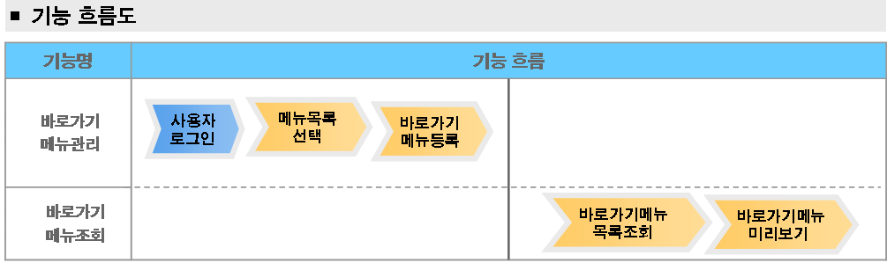
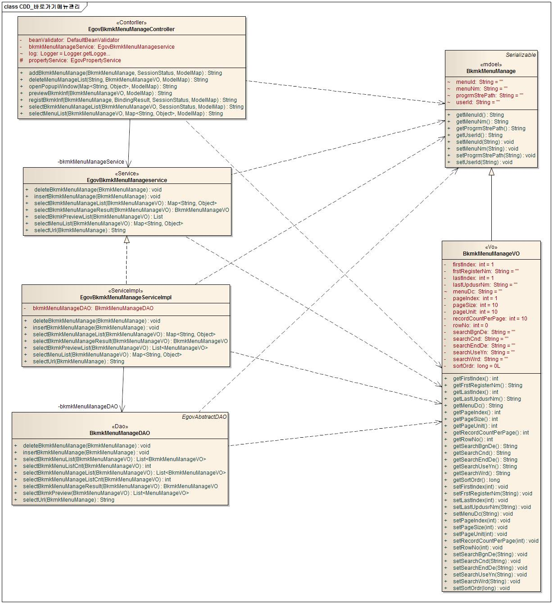
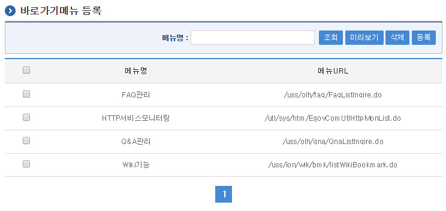
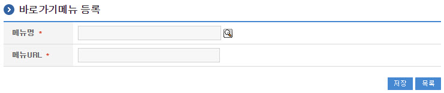
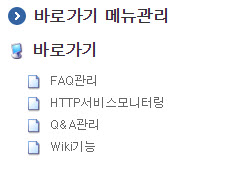
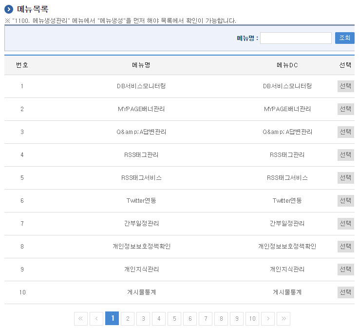

# 바로가기메뉴관리

## 개요

 사용자가 접근할수 있는 권한의 메뉴를 링크로서 한번에 갈수 있도록 바로가기메뉴를 관리할 수 있는 기능을 제공한다.
 바로가기메뉴를 등록하여 활용하는 방법은 사용자가 접근할수 있는 메뉴들의 목록을 표시하는 팝업창에서 메뉴를 선택하여 등록할수가 있다.
 기능흐름

 

## 설명

### 패키지 참조 관계

 바로가기메뉴관리 패키지는 요소기술의 공통 패키지(cmm)와 프로그램관리 패키지에 대해서만 직접적인 함수적 참조 관계를 가진다. 하지만, 컴포넌트 배포 시 오류 없이 실행되기 위하여 패키지 간의 참조관계에 따라 메일연동 인터페이스, 메뉴관리, 메뉴생성관리, 사이트맵, 프로그램관리, 포맷/날짜/계산, 시스템(sim), 달력, 웹에디터, 우편번호 패키지와 함께 배포 파일을 구성한다.
- 패키지 간 참조 관계 : [시스템관리 Package Dependency](../intro/package-reference.md#시스템관리)

### 관련소스

| 유형 | 대상소스 | 비고 |
| --- | --- | --- |
| Controller | egovframework.com.sym.mnu.bmm.web.EgovBkmkMenuManageController.java | 바로가기메뉴 관리를 위한 컨트롤러 클래스 |
| Service | egovframework.com.sym.mnu.bmm.service.EgovBkmkMenuManageService.java | 바로가기메뉴 관리를 위한 서비스 인터페이스 |
| ServiceImpl | egovframework.com.sym.mnu.bmm.service.impl.EgovBkmkMenuManageServiceImpl.java | 바로가기메뉴 관리를 위한 서비스 구현 클래스 |
| Model | egovframework.com.sym.mnu.bmm.service.BkmkMenuManage.java | 바로가기메뉴 관리를 위한 모델 클래스 |
| VO | egovframework.com.sym.mnu.bmm.service.BkmkMenuManageVO.java | 바로가기메뉴 관리를 위한 VO 클래스 |
| DAO | egovframework.com.sym.mnu.bmm.service.impl.BkmkMenuManageDAO.java | 바로가기메뉴 관리를 위한 데이터처리 클래스 |
| JSP | /WEB-INF/jsp/egovframework/com/sym/mnu/bmm/EgovBkmkMenuManageRegist.jsp | 바로가기메뉴 등록을 위한 jsp페이지 |
| JSP | /WEB-INF/jsp/egovframework/com/sym/mnu/bmm/EgovBkmkMenuManageList.jsp | 조회가능한 바로가기메뉴목록을 조회하기 위한 jsp페이지 |
| JSP | /WEB-INF/jsp/egovframework/com/sym/mnu/bmm/EgovBkmkMenuPopup.jsp | 바로가기메뉴에 등록할 기존 메뉴들을 조회하여 선택하기 위한 jsp페이지 |
| JSP | /WEB-INF/jsp/egovframework/com/sym/mnu/bmm/EgovBookMarkMenuPopup.jsp | 바로가기메뉴를 미리보기형태로 보여주기 위한 팝업 jsp페이지 |
| QUERY XML | resources/egovframework/mapper/com/sym/mnu/bmm/EgovBkmkMenuManage\_SQL\_mysql.xml | 바로가기메뉴 MySQL용 QUERY XML |
| QUERY XML | resources/egovframework/mapper/com/sym/mnu/bmm/EgovBkmkMenuManage\_SQL\_oracle.xml | 바로가기메뉴 Oracle용 QUERY XML |
| QUERY XML | resources/egovframework/mapper/com/sym/mnu/bmm/EgovBkmkMenuManage\_SQL\_tibero.xml | 바로가기메뉴 Tibero용 QUERY XML |
| QUERY XML | resources/egovframework/mapper/com/sym/mnu/bmm/EgovBkmkMenuManage\_SQL\_altibase.xml | 바로가기메뉴 Altibase용 QUERY XML |
| QUERY XML | resources/egovframework/mapper/com/sym/mnu/bmm/EgovBkmkMenuManage\_SQL\_cubrid.xml | 바로가기메뉴 Cubrid용 QUERY XML |
| QUERY XML | resources/egovframework/mapper/com/sym/mnu/bmm/EgovBkmkMenuManage\_SQL\_maria.xml | 바로가기메뉴 Maria용 QUERY XML |
| QUERY XML | resources/egovframework/mapper/com/sym/mnu/bmm/EgovBkmkMenuManage\_SQL\_postgres.xml | 바로가기메뉴 Posgres용 QUERY XML |
| QUERY XML | resources/egovframework/mapper/com/sym/mnu/bmm/EgovBkmkMenuManage\_SQL\_goldilocks.xml | 바로가기메뉴 Goldilocks용 QUERY XML |
| Message properties | resources/egovframework/message/com/sym/mnu/bmm/message\_ko.properties | 바로가기메뉴 Message properties(한글) |
| Message properties | resources/egovframework/message/com/sym/mnu/bmm/message\_en.properties | 바로가기메뉴 Message properties(영문) |

### 클래스다이어그램

 

### 관련테이블

| 테이블명 | 테이블명(영문) | 비고 |
| --- | --- | --- |
| 바로가기메뉴정보속성 | COMTNBKMKMENUMANAGERESULT | 바로가기메뉴의 속성정보를 관리한다. |

## 관련기능

 바로가기메뉴 관리는 바로가기메뉴를 생성하는 바로가기메뉴등록 기능, 사용자가 등록한 바로가기메뉴를 확인하고 조회할수 있는바로가기메뉴 목록조회 기능, 내가 등록한 바로가기메뉴를 미리보기할수 있는 바로가기메뉴 미리보기 기능의 3가지 기능을 제공한다.

### 바로가기메뉴 목록조회

#### 비즈니스 규칙

 바로가기메뉴 목록은 페이지당 10건씩 조회되며 페이징은 10페이지씩 이루어진다.
 바로가기메뉴를 삭제하기 위해서는 삭제할 메뉴를 체크박스로 체크한 이후에 삭제 버튼을 클릭을 하면 삭제가 이루어진다.

#### 관련코드

 N/A

#### 관련화면 및 수행매뉴얼

| Action | URL | Controller method | QueryID |
| --- | --- | --- | --- |
| 목록조회 | /sym/mnu/bmm/selectBkmkMenuManageList.do | selectBkmkMenuManageList | "BkmkMenuManageDAO.selectBkmkMenuManageList", |
|  |  |  | "BkmkMenuManageDAO.selectBkmkMenuManageListCnt" |

 검색조건은 메뉴명에 대해서 수행된다. 페이지당 검색 범위를 변경하고자 하는 경우
 context-properties.xml 파일의 pageUnit, pageSize를 변경한다.
 (단 해당 설정은 전체 공통서비스 기능에 영향을 미친다.)

 

 미리보기: 미리보기 팝업 화면을 호출한다.
 등록: 등록하기 위해서는 상단의 등록 버튼을 통해서 바로가기메뉴관리 등록 화면으로 이동한다.
 삭제: 삭제하기 위해서는 해당 목록의 체크박스를 선택 후 삭제 버튼을 클릭한다.

### 바로가기메뉴 등록

#### 비즈니스 규칙

 메뉴목록 조회팝업 에서 바로가기메뉴에 등록할 메뉴를 선택하면 자동으로 메뉴명과 URL이 자동 매핑이 된다. 등록버튼을 통하여 등록을 성공할시에 바로가기메뉴 목록조회 화면으로 이동한다.

#### 관련코드

 N/A

#### 관련화면 및 수행매뉴얼

| Action | URL | Controller method | QueryID |
| --- | --- | --- | --- |
| 등록 | /sym/mnu/bmm/registBkmkInf.do | registBkmkInf | "BkmkMenuManageDAO.insertBkmkMenuManage" |

 

 등록메뉴 목록조회에는 사용자가 접근권한이 가능한 메뉴들만 조회하고 보여지게 설정되어 있다.

### 바로가기메뉴 미리보기

#### 비즈니스 규칙

 바로가기메뉴 미리보기에서 메뉴명을 클릭할 시에는 선택된 메뉴에 해당하는 화면으로 부모창이 이동을 하게 된다.

#### 관련코드

 N/A

#### 관련화면 및 수행매뉴얼

| Action | URL | Controller method | QueryID |
| --- | --- | --- | --- |
| 미리보기 | /sym/mnu/bmm/previewBkmkInf.do | previewBkmkInf | "BkmkMenuManageDAO.selectBkmkMenuManageList", |
|  |  |  | "BkmkMenuManageDAO.selectBkmkMenuManageListCnt" |

 

### 메뉴목록 조회팝업

#### 비즈니스 규칙

 주소록등록 이나 주소록 조회수정 에서 기등록된 사용자나 명함을 조회하여 주소록 구성원으로 선택하여 등록 시킬수 있는 화면을 제공한다.

#### 관련코드

 N/A

#### 관련화면 및 수행매뉴얼

| Action | URL | Controller method | QueryID |
| --- | --- | --- | --- |
| 조회팝업 | /sym/mnu/bmm/selectMenuList.do | selectMenuList | "BkmkMenuManageDAO.selectBkmkMenuList", |
|  |  |  | "BkmkMenuManageDAO.selectBkmkMenuListCnt" |

 

 사용자가 접근권한이 있는 메뉴와, 바로가기메뉴에 기등록되지 않은 메뉴들을 조회할수 있다.
