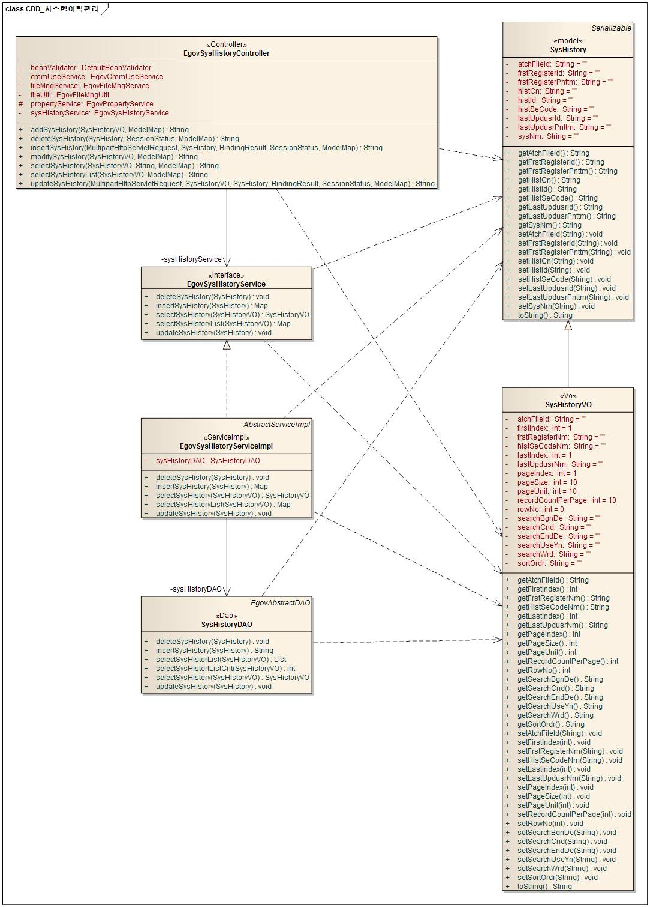
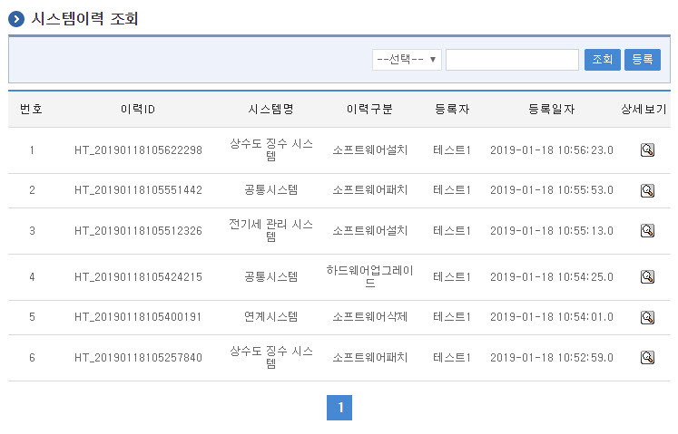
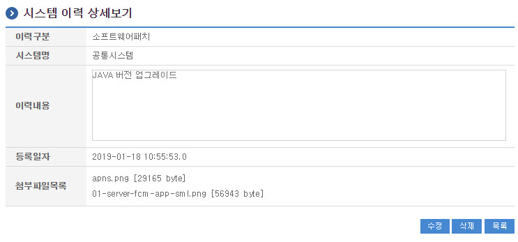
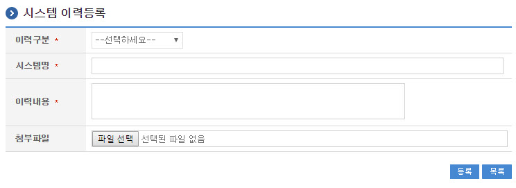
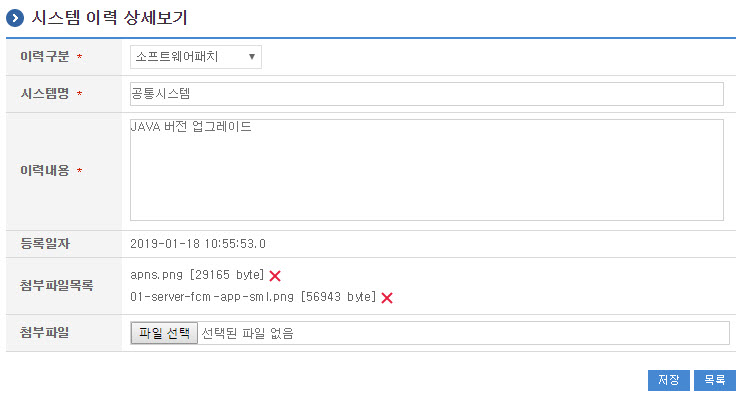

# 시스템이력관리

## 개요

 시스템이력관리는 시스템을 관리하면서 등록한 각종 이력을 검색, 조회하는 기능을 제공한다.

## 설명

 시스템이력관리는 시스템이력의 등록, 조회, 목록, 삭제, 수정의 기능을 수반한다.

```text
  ① 시스템이력등록 : 시스템이력정보를 등록한다.
  ② 시스템이력조회 : 시스템이력정보의 상세내용을 조회한다.
  ③ 시스템이력목록 : 시스템이력정보의 목록을 검색, 조회한다.
  ④ 시스템이력삭제 : 시스템이력정보를 삭제한다.
  ⑤ 시스템이력수정 : 시스템이력정보를 수정한다.
```

### 패키지 참조 관계

 시스템이력관리 패키지는 요소기술의 공통(cmm) 패키지와 포맷/계산/변환(fcc) 패키지에 대해서 직접적인 함수적 참조 관계를 가진다. 하지만, 컴포넌트 배포 시 오류 없이 실행되기 위하여 패키지 간의 참조관계에 따라 달력 패키지와 함께 배포 파일을 구성한다.
- 패키지 간 참조 관계 : [시스템관리 Package Dependency](../intro/package-reference.md#시스템관리)

### 관련소스

| 유형 | 대상소스명 | 비고 |
| --- | --- | --- |
| Controller | egovframework.com.sym.log.slg.web.EgovSysHistoryController.java | 시스템이력 관리를 위한 컨트롤러 클래스 |
| Service | egovframework.com.sym.log.slg.service.EgovSysHistoryService.java | 시스템이력 관리를 위한 서비스 인터페이스 |
| ServiceImpl | egovframework.com.sym.log.slg.service.impl.EgovSysHistoryServiceImpl.java | 시스템이력 관리를 위한 서비스 구현 클래스 |
| Model | egovframework.com.sym.log.slg.service.SysHistory.java | 시스템이력 관리를 위한 Model 클래스 |
| VO | egovframework.com.sym.log.slg.service.SysHistoryVO.java | 시스템이력 관리를 위한 VO 클래스 |
| DAO | egovframework.com.sym.log.slg.service.impl.SysHistoryDAO.java | 시스템이력 관리를 위한 데이터처리 클래스 |
| JSP | /WEB-INF/jsp/egovframework/com/sym/log/slg/EgovSysHistList.jsp | 시스템이력 목록을 위한 jsp페이지 |
| JSP | /WEB-INF/jsp/egovframework/com/sym/log/slg/EgovSysHistInqire.jsp | 시스템이력 조회를 위한 jsp페이지 |
| JSP | /WEB-INF/jsp/egovframework/com/sym/log/slg/EgovSysHistRegist.jsp | 시스템이력 등록을 위한 jsp페이지 |
| JSP | /WEB-INF/jsp/egovframework/com/sym/log/slg/EgovSysHistUpdt.jsp | 시스템이력 수정을 위한 jsp페이지 |
| QUERY XML | resources/egovframework/mapper/com/sym/log/slg/EgovSysHist\_SQL\_mysql.xml | 시스템이력 관리 MySQL용 QUERY XML |
| QUERY XML | resources/egovframework/mapper/com/sym/log/slg/EgovSysHist\_SQL\_cubrid.xml | 시스템이력 관리 Cubrid용 QUERY XML |
| QUERY XML | resources/egovframework/mapper/com/sym/log/slg/EgovSysHist\_SQL\_oracle.xml | 시스템이력 관리 Oracle용 QUERY XML |
| QUERY XML | resources/egovframework/mapper/com/sym/log/slg/EgovSysHist\_SQL\_tibero.xml | 시스템이력 관리 Tibero용 QUERY XML |
| QUERY XML | resources/egovframework/mapper/com/sym/log/slg/EgovSysHist\_SQL\_altibase.xml | 시스템이력 관리 Altibase용 QUERY XML |
| QUERY XML | resources/egovframework/mapper/com/sym/log/slg/EgovSysHist\_SQL\_maria.xml | 시스템이력 관리 Maria용 QUERY XML |
| QUERY XML | resources/egovframework/mapper/com/sym/log/slg/EgovSysHist\_SQL\_postgres.xml | 시스템이력 관리 Postgres용 QUERY XML |
| QUERY XML | resources/egovframework/mapper/com/sym/log/slg/EgovSysHist\_SQL\_goldilocks.xml | 시스템이력 관리 Goldilocks용 QUERY XML |
| Message properties | resources/egovframework/message/com/sym/log/slg/message\_ko.properties | 시스템이력 관리 Message properties(한글) |
| Message properties | resources/egovframework/message/com/sym/log/slg/message\_en.properties | 시스템이력 관리 Message properties(영문) |

### 클래스 다이어그램

 

### 관련 테이블

| 테이블명 | 테이블명(영문) | 비고 |
| --- | --- | --- |
| 시스템이력 | COMTHSYSHIST | 시스템이력 정보를 관리한다. |

## 관련기능

 시스템 이력관리는 시스템이력 목록조회, 시스템이력 상세조회, 시스템이력 등록, 시스템이력 수정 기능으로 구분된다.

### 시스템이력 목록조회

#### 비즈니스 규칙

 시스템이력 목록은 페이지 당 10건씩 조회되며 페이징은 10페이지씩 이루어진다.
 검색조건은 시스템명과 이력구분에 대해서 수행된다.

#### 관련코드

 N/A

#### 관련화면 및 수행메뉴얼

| Action | URL | Controller method | QueryID |
| --- | --- | --- | --- |
| 목록조회 | /sym/log/slg/SelectSysHistoryList.do | selectSysHistoryList | "SysHistoryDAO.selectSysHistoryList", |
|  |  |  | "SysHistoryDAO.selectSysHistoryListCnt" |

 

 시스템이력 상세조회 기능을 수행하기 위해서는 상세보기 버튼을 클릭한다.
 시스템이력 등록 기능을 수행하기 위해서는 등록 버튼을 클릭한다.

### 시스템이력 상세조회

#### 비즈니스 규칙

 시스템이력 목록의 상세조회 내용을 보여준다.

#### 관련코드

 N/A

#### 관련화면 및 수행메뉴얼

| Action | URL | Controller method | QueryID |
| --- | --- | --- | --- |
| 상세조회 | /sym/log/slg/InqireSysHistory.do | selectSysHistory | "SysHistoryDAO.selectSysHistory" |

 

 수정 버튼을 클릭하면 시스템이력 수정 화면으로 이동한다.
 삭제 버튼을 클릭하면 시스템이력 삭제 기능을 수행한다.
 목록 버튼을 클릭하면 시스템이력 목록조회 화면으로 이동한다.

### 시스템이력 등록

#### 비즈니스 규칙

 시스템이력 등록 기능을 수행한다.

#### 관련코드

 N/A

#### 관련화면 및 수행메뉴얼

| Action | URL | Controller method | QueryID |
| --- | --- | --- | --- |
| 상세조회 | /sym/log/slg/InsertSysHistory.do | insertSysHistory | "SysHistoryDAO.insertSysHistory" |

 

 등록 버튼을 클릭하면 시스템이력 등록 기능을 수행한다.
 목록 버튼을 클릭하면 시스템이력 목록조회 화면으로 이동한다.

### 시스템이력 수정

#### 비즈니스 규칙

 시스템 이력의 수정 기능을 제공한다.

#### 관련코드

 N/A

#### 관련화면 및 수행메뉴얼

| Action | URL | Controller method | QueryID |
| --- | --- | --- | --- |
| 상세조회 | /sym/log/slg/UpdateSysHistory.do | updateSysHistory | "SysHistoryDAO.updateSysHistory" |

 

 수정 버튼을 클릭하면 시스템이력 수정 기능을 수행한다.
 목록 버튼을 클릭하면 시스템이력 목록조회 화면으로 이동한다.
