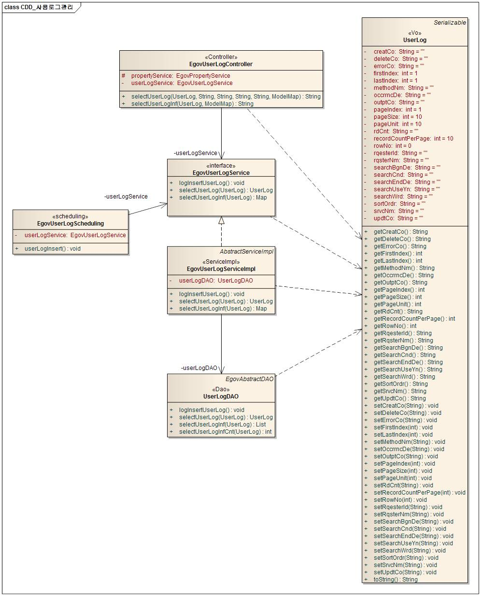
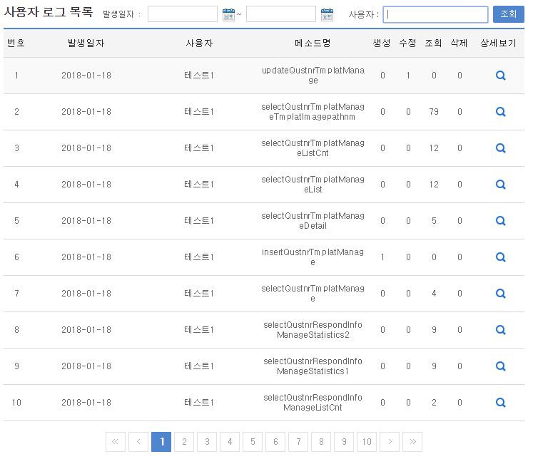
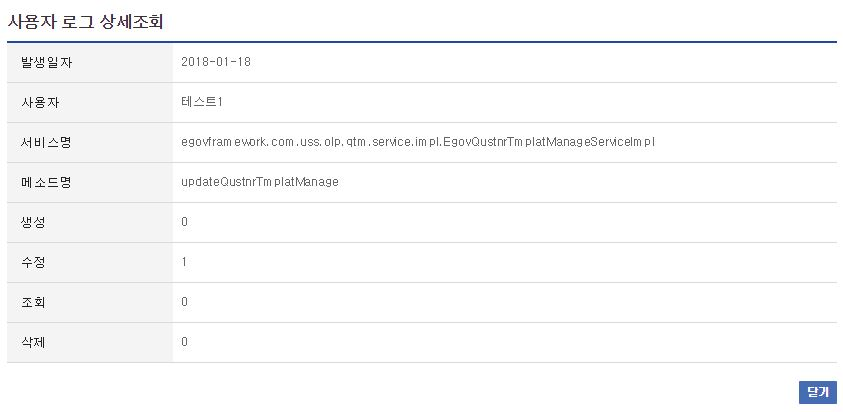

# 사용로그관리

## 개요

 사용자로그조회는 사용자가 시스템의 서비스를 이용한 로그를 검색, 조회하는 기능을 제공한다.

## 설명

 사용자로그조회는 사용자로그의 등록, 조회, 목록의 기능을 수반한다.

 ① 사용자로그등록 : 사용자로그정보를 등록한다. - 실행환경의 Scheduling 기능을 이용
 ② 사용자로그조회 : 사용자로그정보의 상세내용을 조회한다.
 ③ 사용자로그목록 : 사용자로그정보의 목록을 검색, 조회한다.

### 패키지 참조 관계

 사용로그관리 패키지는 요소기술의 공통(cmm) 패키지에 대해서만 직접적인 함수적 참조 관계를 가진다.
 패키지 간 참조 관계 : [시스템관리 Package Dependency](../intro/package-reference.md/#시스템관리)

### 관련소스

| 유형 | 대상소스명 | 비고 |
| --- | --- | --- |
| Controller | egovframework.com.sym.log.ulg.web.EgovUserLogController.java | 사용로그 관리를 위한 컨트롤러 클래스 |
| Service | egovframework.com.sym.log.ulg.service.EgovUserLogService.java | 사용로그 관리를 위한  서비스 인터페이스 |
| ServiceImpl | egovframework.com.sym.log.ulg.service.impl.EgovUserLogServiceImpl.java | 사용로그 관리를 위한 서비스 구현 클래스 |
| Model | egovframework.com.sym.log.ulg.service.UserLog.java | 사용로그 관리를 위한 클래스 |
| DAO | egovframework.com.sym.log.ulg.service.impl.UserLogDAO.java | 사용로그 관리를 위한 데이터처리 클래스 |
| Scheduler | egovframework.com.sym.log.ulg.service.EgovUserLogScheduling.java | 사용로그 삭제, 요약을 위한 Scheduling 클래스 |
| JSP | /WEB-INF/jsp/egovframework/com/sym/log/ulg/EgovUserLogList.jsp | 사용로그 목록을 위한 jsp페이지 |
| JSP | /WEB-INF/jsp/egovframework/com/sym/log/ulg/EgovUserLogDetail.jsp | 사용로그 조회를 위한 jsp페이지 |
| Query XML | resources/egovframework/mapper/com/sym/log/ulg/EgovUserLog\_SQL\_altibase.xml | 사용로그 관리를 위한 Altibase용 Query XML |
| Query XML | resources/egovframework/mapper/com/sym/log/ulg/EgovUserLog\_SQL\_cubrid.xml | 사용로그 관리를 위한 Cubrid용 Query XML |
| Query XML | resources/egovframework/mapper/com/sym/log/ulg/EgovUserLog\_SQL\_maria.xml | 사용로그 관리를 위한 MariaDB용 Query XML |
| Query XML | resources/egovframework/mapper/com/sym/log/ulg/EgovUserLog\_SQL\_mysql.xml | 사용로그 관리를 위한 MySQL용 Query XML |
| Query XML | resources/egovframework/mapper/com/sym/log/ulg/EgovUserLog\_SQL\_oracle.xml | 사용로그 관리를 위한 Oracle용 Query XML |
| Query XML | resources/egovframework/mapper/com/sym/log/ulg/EgovUserLog\_SQL\_postgres.xml | 사용로그 관리를 위한 PostgreSQL용 Query XML |
| Query XML | resources/egovframework/mapper/com/sym/log/ulg/EgovUserLog\_SQL\_tibero.xml | 사용로그 관리를  위한 Tibero용 Query XML |
| Query XML | resources/egovframework/mapper/com/sym/log/ulg/EgovUserLog\_SQL\_goldilocks.xml | 사용로그 관리를  위한 Goldilocks용 Query XML |
| Scheduler XML | resources/egovframework/spring/com/scheduling/context-scheduling-sym-log-ulg.xml | 사용로그관리 Scheduler 설정 XML |
| Message properties | resources/egovframework/message/com/sym/log/ulg/message\_ko.properties | 사용로그 관리를 위한 Message properties(한글) |
| Message properties | resources/egovframework/message/com/sym/log/ulg/message\_en.properties | 사용로그 관리를 위한 Message properties(영문) |

### 클래스 다이어그램

 

### 관련테이블

| 테이블명 | 테이블명(영문) | 비고 |
| --- | --- | --- |
| 사용로그 | COMTNUSERLOG | 사용로그 정보를 관리한다. |

### Scheduling

#### context-scheduling-sym-log-ulg.xml  (src/main/resources/egovframework/spring/com/scheduling/context-scheduling-sym-log-ulg.xml)

```xml
<!-- 사용자 로그 생성  -->
	<bean id="userLogging" class="org.springframework.scheduling.quartz.MethodInvokingJobDetailFactoryBean">
		<property name="targetObject" ref="egovUserLogScheduling" />
		<property name="targetMethod" value="userLogInsert" />
		<property name="concurrent" value="false" />
	</bean>
 
	<!-- 사용자 로그 생성  트리거-->
	<bean id="userLogTrigger" class="org.springframework.scheduling.quartz.SimpleTriggerFactoryBean">
		<property name="jobDetail" ref="userLogging" />
		<!-- 시작하고 1분후에 실행한다. (milisecond) -->
		<property name="startDelay" value="60000" />
		<!-- 매 1시간마다 실행한다. (milisecond) -->
		<property name="repeatInterval" value="3600000" />
	</bean>
 
 
	<!-- 사용자 로그 생성 스케줄러 -->
	<bean id="userLogScheduler" class="org.springframework.scheduling.quartz.SchedulerFactoryBean">
		<property name="triggers">
			<list>
				<ref bean="userLogTrigger" />				
			</list>
		</property>
	</bean>
```

 사용로그 등록 기능구현을 위하여 Scheduling을 설정한다.
 사용로그 등록 기능구현을 위하여 EgovUserLogScheduling 클래스를 생성한다.

```java
@Service("egovUserLogScheduling")
public class EgovUserLogScheduling extends EgovAbstractServiceImpl {
@Resource(name="EgovUserLogService")
private EgovUserLogService userLogService;
/**
* 사용자 로그정보를 생성한다.
*
* @param
* @return
* @throws Exception
*/
public void userLogInsert() throws Exception {
userLogService.logInsertUserLog();
}
```

## 관련기능

 사용자로그관리는 사용자로그 목록조회, 사용자로그 상세조회 기능으로 구분된다.

### 사용자로그 목록조회

#### 비즈니스 규칙

 사용자로그 목록은 페이지 당 10건씩 조회되며 페이징은 10페이지씩 이루어진다. 검색조건은 발생일자와 사용자에 대해서 수행된다.

#### 관련코드

 N/A

#### 관련화면 및 수행매뉴얼

| Action | URL | Controller method | SQL Namespace | SQL QueryID |
| --- | --- | --- | --- | --- |
| 목록조회 | /sym/log/ulg/SelectUserLogList.do | selectUserLogInf | "UserLog" | "selectUserLogInf" |
|  |  |  | "UserLog" | "selectUserLogInfCnt" |

 

 사용로그 상세조회 기능을 수행하기 위해서는 상세보기 버튼을 클릭한다.

### 사용자로그 상세조회

#### 비즈니스 규칙

 사용자로그 상세조회는 팝업창으로 구성되며, 닫기 버튼을 클릭하면 창을 닫는다.

#### 관련코드

 N/A

#### 관련화면 및 수행매뉴얼

| Action | URL | Controller method | SQL Namespace | SQL QueryID |
| --- | --- | --- | --- | --- |
| 상세조회 | /sym/log/ulg/SelectUserLogDetail.do | selectUserLog | "UserLog" | "selectUserLog" |

 

## 참고자료

 실행환경 참조 : Scheduling
