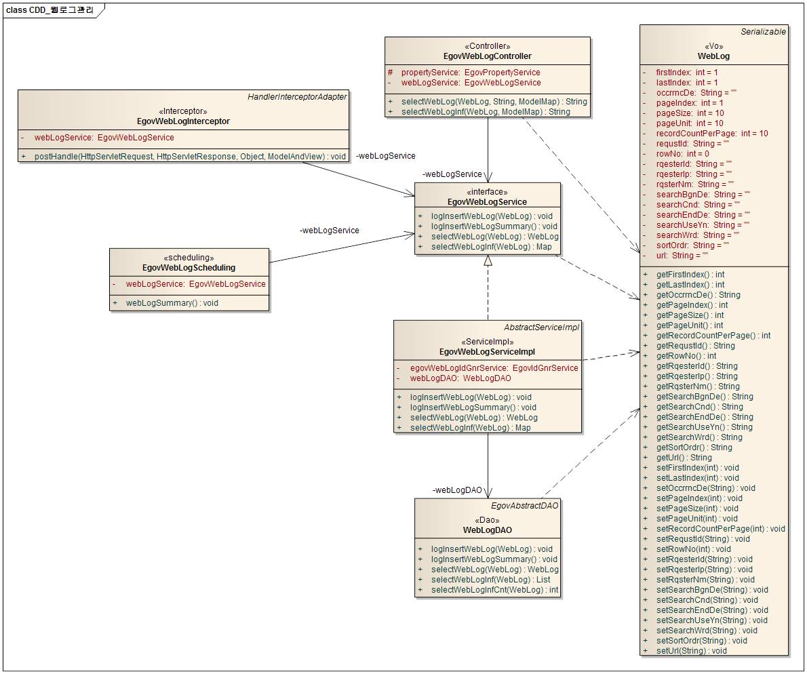
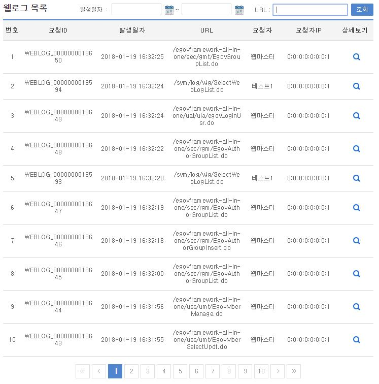
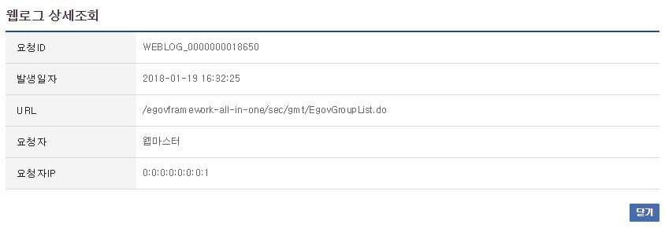

# 웹로그관리

## 개요

 웹로그관리는 사용자의 웹페이지 접근시 발생하는 각종 로그를 검색, 조회하는 기능을 제공한다.

## 설명

 웹로그관리는 웹로그의 등록, 조회, 목록, 삭제, 요약의 기능을 수반한다.

 ① 웹로그등록 : 웹로그정보를 등록한다. - Interceptor 기능을 이용
 ② 웹로그조회 : 웹로그정보의 상세내용을 조회한다.
 ③ 웹로그목록 : 웹로그정보의 목록을 검색, 조회한다.
 ④ 웹로그삭제 : 웹로그정보를 삭제한다. - 실행환경의 Scheduling 기능을 이용
 ⑤ 웹로그요약 : 웹로그정보를 요약하여 Summary를 생성한다. - 실행환경의 Scheduling 기능을 이용

### 패키지 참조 관계

 웹로그관리 패키지는 요소기술의 공통(cmm) 패키지에 대해서만 직접적인 함수적 참조 관계를 가진다.
 패키지 간 참조 관계 : [시스템관리 Package Dependency](../intro/package-reference.md/#시스템관리)

### 관련소스

| 유형 | 대상소스명 | 비고 |
| --- | --- | --- |
| Controller | egovframework.com.sym.log.wlg.web.EgovWebLogController.java | 웹로그 관리를 위한 컨트롤러 클래스 |
| Service | egovframework.com.sym.log.wlg.service.EgovWebLogService.java | 웹로그 관리를 위한  서비스 인터페이스 |
| ServiceImpl | egovframework.com.sym.log.wlg.service.impl.EgovWebLogServiceImpl.java | 웹로그 관리를 위한 서비스 구현 클래스 |
| Model | egovframework.com.sym.log.wlg.service.WebLog.java | 웹로그 관리를 위한 Model 클래스 |
| DAO | egovframework.com.sym.log.wlg.service.impl.WebLogDAO.java | 웹로그 관리를 위한 데이터처리 클래스 |
| Interceptor | egovframework.com.sym.log.wlg.web.EgovWebLogInterceptor.java | 웹로그 등록을 위한 Interceptor 클래스 |
| Scheduler | egovframework.com.sym.log.wlg.service.EgovWebLogScheduling.java | 웹로그 삭제, 요약을 위한 Scheduling 클래스 |
| JSP | /WEB-INF/jsp/egovframework/com/sym/log/wlg/EgovWebLogList.jsp | 웹로그 목록을 위한 jsp페이지 |
| JSP | /WEB-INF/jsp/egovframework/com/sym/log/wlg/EgovWebLogDetail.jsp | 웹로그 조회를 위한 jsp페이지 |
| Query XML | resources/egovframework/mapper/com/sym/log/wlg/EgovWebLog\_SQL\_altibase.xml | 웹로그 관리를 위한 Altibase용 Query XML |
| Query XML | resources/egovframework/mapper/com/sym/log/wlg/EgovWebLog\_SQL\_cubrid.xml | 웹로그 관리를 위한 Cubrid용 Query XML |
| Query XML | resources/egovframework/mapper/com/sym/log/wlg/EgovWebLog\_SQL\_maria.xml | 웹로그 관리를 위한 MariaDB용 Query XML |
| Query XML | resources/egovframework/mapper/com/sym/log/wlg/EgovWebLog\_SQL\_mysql.xml | 웹로그 관리를 위한 MySQL용 Query XML |
| Query XML | resources/egovframework/mapper/com/sym/log/wlg/EgovWebLog\_SQL\_oracle.xml | 웹로그 관리를 위한 Oracle용 Query XML |
| Query XML | resources/egovframework/mapper/com/sym/log/wlg/EgovWebLog\_SQL\_postgres.xml | 웹로그 관리를  위한 PostgreSQL용 Query XML |
| Query XML | resources/egovframework/mapper/com/sym/log/wlg/EgovWebLog\_SQL\_tibero.xml | 웹로그 관리를 위한 Tibero용 Query XML |
| Query XML | resources/egovframework/mapper/com/sym/log/wlg/EgovWebLog\_SQL\_goldilocks.xml | 웹로그 관리를 위한 Goldilocks용 Query XML |
| Idgen XML | resources/egovframework/spring/com/idgn/context-idgn-WebLog.xml | 웹로그 관리 Id생성 Idgen XML |
| Message properties | resources/egovframework/message/com/sym/log/wlg/message\_ko.properties | 웹로그 관리를 위한 Message properties(한글) |
| Message properties | resources/egovframework/message/com/sym/log/wlg/message\_en.properties | 웹로그 관리를 위한 Message properties(영문) |

### 클래스 다이어그램

 

### ID Generation

#### ID Generation 관련 DDL 및 DML

 ID Generation Service를 활용하기 위해서 Sequence 저장테이블인 COMTECOPSEQ에 WEBLOG_ID 항목을 추가한다.

```sql
CREATE TABLE COMTECOPSEQ(TABLE_NAME VARCHAR(20) NOT NULL,
	                    NEXT_ID NUMERIC(30) NULL,
	                    PRIMARY KEY (TABLE_NAME));
 
  INSERT INTO COMTECOPSEQ VALUES('WEBLOG_ID','1');
```

#### ID Generation 환경설정(context-idgn-WebLog.xml)

```xml
<bean name="egovWebLogIdGnrService" class="egovframework.rte.fdl.idgnr.impl.EgovTableIdGnrServiceImpl" destroy-method="destroy">
        <property name="dataSource" ref="egov.dataSource" />
        <property name="strategy"   ref="webLogStrategy" />
        <property name="blockSize"  value="10"/>
        <property name="table"      value="COMTECOPSEQ"/>
        <property name="tableName"  value="WEBLOG_ID"/>
    </bean>
    <bean name="webLogStrategy" class="egovframework.rte.fdl.idgnr.impl.strategy.EgovIdGnrStrategyImpl">
        <property name="prefix"   value="WEBLOG_" />
        <property name="cipers"   value="13" />
        <property name="fillChar" value="0" />
    </bean>
```

### 관련 테이블

| 테이블명 | 테이블명(영문) | 비고 |
| --- | --- | --- |
| 웹로그 | COMTNWEBLOG | 웹로그 정보를 관리한다. |
| 웹로그요약 | COMTSWEBLOGSUMMARY | 웹로그 요약정보를 관리한다. |

### Interceptor

#### egov-com-servlet.xml

```xml
<bean id="egovWebLogInterceptor" class="egovframework.com.sym.log.wlg.web.EgovWebLogInterceptor" />
 
  <bean class="org.springframework.web.servlet.mvc.method.annotation.RequestMappingHandlerMapping">
    <property name="interceptors">
      <list>
        <ref bean="egovWebLogInterceptor" />
      </list>
    </property> 
  </bean>
```

 웹로그 등록 기능구현을 위하여 Interceptor를 설정한다.
 웹로그 등록 기능구현을 위하여 EgovWebLogInterceptor 클래스를 생성한다.

 package egovframework.com.sym.log.wlg.web;
 import egovframework.com.cmm.LoginVO;
 import egovframework.com.cmm.util.EgovUserDetailsHelper;
 import egovframework.com.sym.log.wlg.service.EgovWebLogService;
 import egovframework.com.sym.log.wlg.service.WebLog;
 import javax.annotation.Resource;
 import javax.servlet.http.HttpServletRequest;
 import javax.servlet.http.HttpServletResponse;
 import org.springframework.web.servlet.ModelAndView;
 import org.springframework.web.servlet.handler.HandlerInterceptorAdapter;
 public class EgovWebLogInterceptor extends HandlerInterceptorAdapter {
 @Resource(name="EgovWebLogService")
 private EgovWebLogService webLogService;
 /**
 * 웹 로그정보를 생성한다.
 *
 * @param HttpServletRequest request, HttpServletResponse response, Object handler
 * @return
 * @throws Exception
 */
 @Override
 public void postHandle(HttpServletRequest request,
 HttpServletResponse response, Object handler, ModelAndView modeAndView) throws Exception {
 WebLog webLog = new WebLog();
 String reqURL = request.getRequestURI();
 String uniqId = ";
 /* Authenticated  */
 Boolean isAuthenticated = EgovUserDetailsHelper.isAuthenticated();
 if(isAuthenticated.booleanValue()) {
 LoginVO user = (LoginVO)EgovUserDetailsHelper.getAuthenticatedUser();
 uniqId = user.getUniqId();
 }
 webLog.setUrl(reqURL);
 webLog.setRqesterId(uniqId);
 webLog.setRqesterIp(request.getRemoteAddr());
 webLogService.logInsertWebLog(webLog);
 }
 }

### Scheduling

#### context-scheduling-sym-log-wlg.xml (src/main/resources/egovframework/spring/com/scheduling/context-scheduling-sym-log-wlg.xml)

```xml
<!-- 웹 로그 요약  -->
	<bean id="webLogging" class="org.springframework.scheduling.quartz.MethodInvokingJobDetailFactoryBean">
		<property name="targetObject" ref="egovWebLogScheduling" />
		<property name="targetMethod" value="webLogSummary" />
		<property name="concurrent" value="false" />
	</bean>
 
	<!-- 웹 로그 요약  트리거-->
	<bean id="webLogTrigger" class="org.springframework.scheduling.quartz.SimpleTriggerFactoryBean">
		<property name="jobDetail" ref="webLogging" />
		<property name="startDelay" value="60000" />
		<property name="repeatInterval" value="3600000" />
	</bean>
 
	<!-- 웹 로그 요약 스케줄러 -->
	<bean id="webLogScheduler" class="org.springframework.scheduling.quartz.SchedulerFactoryBean">
		<property name="triggers">
			<list>
				<ref bean="webLogTrigger" />				
			</list>
		</property>
	</bean>
```

 웹로그 삭제, 요약 기능구현을 위하여 Scheduling을 설정한다.
 웹로그 삭제, 요약 기능구현을 위하여 EgovWebLogScheduling 클래스를 생성한다.

 @Service("egovWebLogScheduling")
 public class EgovWebLogScheduling extends EgovAbstractServiceImpl {
 @Resource(name="EgovWebLogService")
 private EgovWebLogService webLogService;
 /**
 * 웹 로그정보를 요약한다.
 * 전날의 로그를 요약하여 입력하고, 6개월전의 로그를 삭제한다.
 *
 * @param
 * @return
 * @throws Exception
 */
 public void webLogSummary() throws Exception {
 webLogService.logInsertWebLogSummary();
 }
 }

## 관련기능

 웹로그관리는 웹로그 목록조회, 웹로그 상세조회 기능으로 구분된다.

### 웹로그 목록조회

#### 비즈니스 규칙

 웹로그 목록은 페이지 당 10건씩 조회되며 페이징은 10페이지씩 이루어진다.
 검색조건은 발생일자와 URL에 대해서 수행된다.

#### 관련코드

 N/A

#### 관련화면 및 수행메뉴얼

| Action | URL | Controller method | SQL Namespace | SQL QueryID |
| --- | --- | --- | --- | --- |
| 목록조회 | /sym/log/wlg/SelectWebLogList.do | selectWebLogInf | "WebLog" | "selectWebLogInf" |
|  |  |  | "WebLog" | "selectWebLogInfCnt" |

 

 웹로그 상세조회 기능을 수행하기 위해서는 상세보기 버튼을 클릭한다.

### 웹로그 상세조회

#### 비즈니스 규칙

 웹로그 목록의 상세조회 페이지를 보여준다.

#### 관련코드

 N/A

#### 관련화면 및 수행메뉴얼

| Action | URL | Controller method | SQL Namespace | SQL QueryID |
| --- | --- | --- | --- | --- |
| 상세조회 | /sym/log/wlg/SelectWebLogDetail.do | selectWebLog | "WebLog" | "selectWebLog" |

 웹로그 상세조회는 팝업창으로 구성되며, 닫기 버튼을 클릭하면 창을 닫는다.

 

## 참고자료

 실행환경 참조 : Interceptor
 실행환경 참조 : Scheduling
 실행환경 참조 : ID Generation
