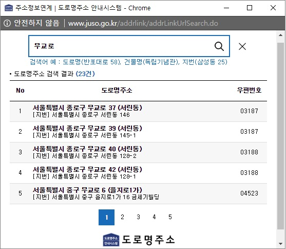
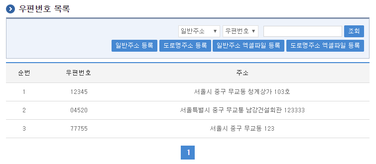
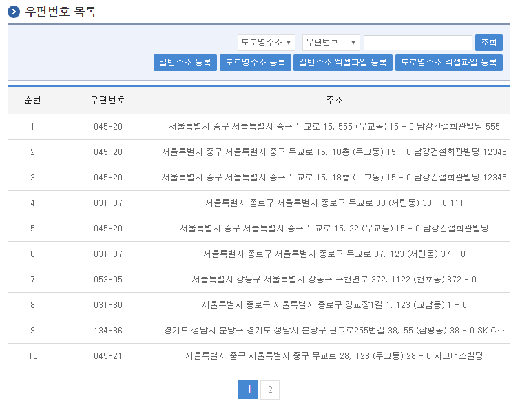
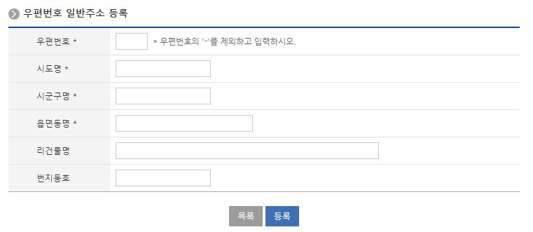
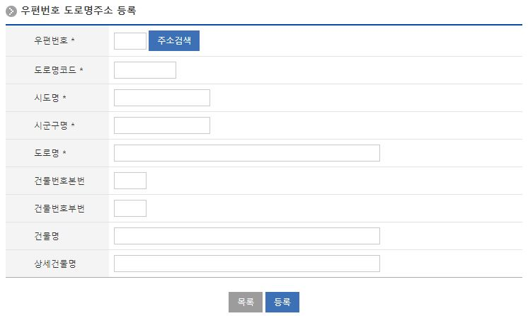
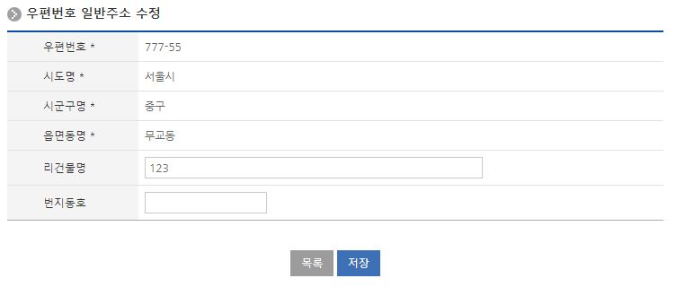
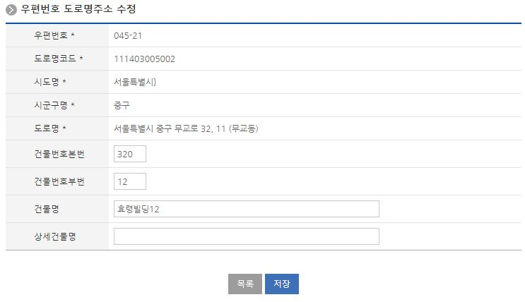
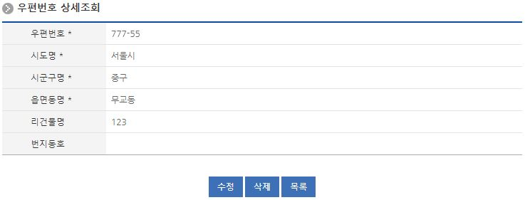
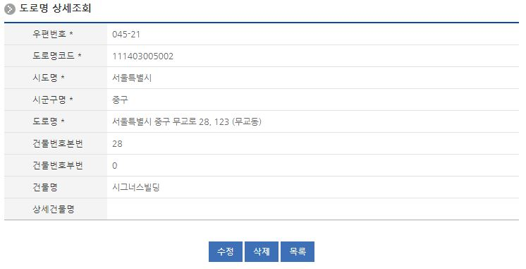

# 도로명 주소찾기, 우편번호관리

## 개요

 도로명주소 안내시스템(https://www.juso.go.kr/) 연계를 통해 우편번호와 주소를 관리하고 도로명 찾기 기능을 팝업창으로 제공하여 우편번호 및 주소 등록 시 활용 할 수 있도록 하고 팝업화면을 호출할 수 있는 활용 예시를 제공한다.

## 설명

### 패키지 참조 관계

 우편번호 패키지는 요소기술의 공통 패키지(cmm)에 대해서만 직접적인 함수적 참조 관계를 가진다.
- 패키지 간 참조 관계 : [시스템관리 Package Dependency](../intro/package-reference.md/#시스템관리)

### 관련소스

| 유형 | 대상소스명 | 비고 |
| --- | --- | --- |
| Controller | egovframework.com.sym.ccm.zip.web.EgovCcmZipManageController.java | 우편번호 관리를 위한 컨트롤러 클래스 |
| Service | egovframework.com.sym.ccm.zip.service.EgovCcmZipManageService.java | 우편번호 관리를 위한 서비스 인터페이스 |
| Service | egovframework.com.sym.ccm.zip.service.EgovCcmRdnmadZipManageService.java | 도로명주소 관리를 위한 서비스 인터페이스 |
| ServiceImpl | egovframework.com.sym.ccm.zip.service.impl.EgovCcmZipManageServiceImpl.java | 우편번호 관리를 위한 위한 서비스구현 클래스 |
| ServiceImpl | egovframework.com.sym.ccm.zip.service.impl.EgovCcmRdnmadZipServiceImpl.java | 도로명주소 관리를 위한 위한 서비스구현 클래스 |
| ServiceImpl | egovframework.com.sym.ccm.zip.service.impl.EgovCcmExcelZipMapping.java | 우편번호 엑셀파일의 일괄 등록 처리를 위한 위한 서비스구현 매핑 클래스 |
| ServiceImpl | egovframework.com.sym.ccm.zip.service.impl.EgovCcmExcelRdnmadZipMapping.java | 도로명주소 엑셀파일의 일괄 등록 처리를 위한 위한 서비스구현 매핑 클래스 |
| Model | egovframework.com.sym.ccm.zip.service.Zip.java | 우편번호 정보 Model 클래스 |
| VO | egovframework.com.sym.ccm.zip.service.ZipVO.java | 우편번호 관리를 위한 VO 클래스 |
| DAO | egovframework.com.sym.ccm.zip.service.impl.ZipManageDAO.java | 우편번호 정보 관리를 위한 데이터처리 클래스 |
| DAO | egovframework.com.sym.ccm.zip.service.impl.RdnmadZipDAO.java | 도로명주소 정보 관리를 위한 데이터처리 클래스 |
| JSP | /WEB-INF/jsp/egovframework/com/sym/ccm/zip/EgovCcmExcelZipRegist.jsp | 우편번호 엑셀파일의 일괄 등록 처리를 위한 JSP 페이지 |
| JSP | /WEB-INF/jsp/egovframework/com/sym/ccm/zip/EgovCcmZipDetail.jsp | 우편번호 상세보기를 위한 JSP 페이지 |
| JSP | /WEB-INF/jsp/egovframework/com/sym/ccm/zip/EgovCcmZipList.jsp | 우편번호 목록을 위한 JSP 페이지 |
| JSP | /WEB-INF/jsp/egovframework/com/sym/ccm/zip/EgovCcmZipModify.jsp | 우편번호 수정을 위한 JSP 페이지 |
| JSP | /WEB-INF/jsp/egovframework/com/sym/ccm/zip/EgovCcmZipRegist.jsp | 우편번호 등록을 위한 JSP 페이지 |
| JSP | /WEB-INF/jsp/egovframework/com/sym/ccm/zip/EgovCcmZipSearchList.jsp | 우편번호 찾기 팝업 내용을 위한 JSP 페이지 |
| JSP | /WEB-INF/jsp/egovframework/com/sym/ccm/zip/EgovCcmZipSearchPopup.jsp | 우편번호 찾기 팝업을 위한 JSP 페이지 |
| QUERY XML | resources/egovframework/mapper/com/sym/ccm/zip/EgovZipManage\_SQL\_mysql.xml | 우편번호 MySQL용 QUERY XML |
| QUERY XML | resources/egovframework/mapper/com/sym/ccm/zip/EgovRdnmadZip\_SQL\_mysql.xml | 도로명주소 MySQL용 QUERY XML |
| QUERY XML | resources/egovframework/mapper/com/sym/ccm/zip/EgovZipManage\_SQL\_cubrid.xml | 우편번호 Cubrid용 QUERY XML |
| QUERY XML | resources/egovframework/mapper/com/sym/ccm/zip/EgovRdnmadZip\_SQL\_cubrid.xml | 도로명주소 Cubrid용 QUERY XML |
| QUERY XML | resources/egovframework/mapper/com/sym/ccm/zip/EgovZipManage\_SQL\_oracle.xml | 우편번호 Oracle용 QUERY XML |
| QUERY XML | resources/egovframework/mapper/com/sym/ccm/zip/EgovRdnmadZip\_SQL\_oracle.xml | 도로명주소 Oracle용 QUERY XML |
| QUERY XML | resources/egovframework/mapper/com/sym/ccm/zip/EgovZipManage\_SQL\_tibero.xml | 우편번호 Tibero용 QUERY XML |
| QUERY XML | resources/egovframework/mapper/com/sym/ccm/zip/EgovRdnmadZip\_SQL\_tibero.xml | 도로명주소 Tibero용 QUERY XML |
| QUERY XML | resources/egovframework/mapper/com/sym/ccm/zip/EgovZipManage\_SQL\_altibase.xml | 우편번호 Altibase용 QUERY XML |
| QUERY XML | resources/egovframework/mapper/com/sym/ccm/zip/EgovRdnmadZip\_SQL\_altibase.xml | 도로명주소 Altibase용 QUERY XML |
| QUERY XML | resources/egovframework/mapper/com/sym/ccm/zip/EgovZipManage\_SQL\_maria.xml | 우편번호 MariaDB용 QUERY XML |
| QUERY XML | resources/egovframework/mapper/com/sym/ccm/zip/EgovRdnmadZip\_SQL\_maria.xml | 도로명주소 MariaDB용 QUERY XML |
| QUERY XML | resources/egovframework/mapper/com/sym/ccm/zip/EgovZipManage\_SQL\_postgres.xml | 우편번호 PostgreSQL용 QUERY XML |
| QUERY XML | resources/egovframework/mapper/com/sym/ccm/zip/EgovRdnmadZip\_SQL\_postgres.xml | 도로명주소 PostgreSQL용 QUERY XML |
| QUERY XML | resources/egovframework/mapper/com/sym/ccm/zip/EgovZipManage\_SQL\_goldilocks.xml | 우편번호 Goldilocks용 QUERY XML |
| QUERY XML | resources/egovframework/mapper/com/sym/ccm/zip/EgovRdnmadZip\_SQL\_goldilocks.xml | 도로명주소 Goldilocks용 QUERY XML |
| Message properties | resources/egovframework/message/com/sym/ccm/zip/message\_ko.properties | 우편번호관리를 위한 Message properties(한글) |
| Message properties | resources/egovframework/message/com/sym/ccm/zip/message\_en.properties | 우편번호관리를 위한 Message properties(영문) |

### 관련테이블

| 테이블명 | 테이블명(영문) | 비고 |
| --- | --- | --- |
| 우편번호 | COMTCZIP | 우편번호 정보를 관리한다. |

### 환경설정

 우편번호 엑셀파일 등록 기능을 활용하기 위하여 필요한 항목 및 그 환경 설정은 다음과 같다.

#### context-excel.xml

```xml
    <bean id="excelZipService"	class="egovframework.rte.fdl.excel.impl.EgovExcelServiceImpl">
       <property name="propertyPath" value="excelInfo.xml" />
       <property name="mapClass" value="egovframework.com.sym.ccm.zip.service.impl.EgovCcmExcelZipMapping" />
       <property name="sqlMapClient" ref="egov.sqlMapClient" />
    </bean>
 
    <bean id="excelRdnmadZipService"	class="egovframework.rte.fdl.excel.impl.EgovExcelServiceImpl">
        <property name="propertyPath" value="excelInfo.xml" />
        <property name="mapClass" value="egovframework.com.sym.ccm.zip.service.impl.EgovCcmExcelRdnmadZipMapping" />
        <property name="sqlMapClient" ref="egov.sqlMapClient" />
    </bean>
```

 우편번호 엑셀 파일을 등록하기 위하여 실행환경의 엑셀서비스 구현 클래스를 등록하여 사용한다.
 우편번호 등록을 위한 맵핑 클래스를 등록한다.

#### context-common.xml

```xml
<!-- custom multi file resolver -->    
<bean id="local.MultiCommonsMultipartResolver"
  class="egovframework.com.cmm.web.EgovMultipartResolver">
    <property name="maxUploadSize" value="100000000" />
    <property name="maxInMemorySize" value="100000000" />
</bean>
 
<!-- choose one from above and alias it to the name Spring expects -->
<alias name="local.MultiCommonsMultipartResolver" alias="multipartResolver" />
```

 우편번호 엑셀 파일을 등록하기 위하여 파일 등록 처리를 사용한다.

## 관련기능

 우편번호 관련기능은 우편번호 주소찾기, 우편번호관리는 우편번호 찾기, 우편번호 목록조회, 우편번호 등록, 우편번호 엑셀파일 등록, 우편번호 수정, 우편번호 상세조회 기능으로 구분된다.
 도로명 관련기능은 도로명 주소찾기, 도로명관리는 도로명 찾기, 도로명 목록조회, 도로명 등록, 도로명 엑셀파일 등록, 도로명 수정, 도로명 상세조회 기능으로 구분된다.

### 우편번호, 도로명 찾기

#### 비즈니스 규칙

 우편번호 찾기 팝업 호출을 위하여 상기 환경설정까지 완료한 후 다음사항을 적용한다.

#### 관련코드

 N/A

#### 관련화면 및 수행매뉴얼

 도로명 주소연계 서비스의 우편번호/도로명 찾기 팝업 호출을 위하여 EgovAdressPop.jsp 를 해당 페이지(EgovCcmZipRegist.jsp)에서 호출 한다.

```javascript
function goAddSearch() {
    var pop = window.open("<c:url value='/sym/ccm/zip/EgovAdressPop.do' />","pop","width=570,height=420, 
    scrollbars=yes, resizable=yes"); 
}
```

 우편번호/도로명 주소를 사용할 값을 폼에 입력 후 위 샘플 소스처럼 호출 하여 사용한다.
 우편번호는 5자리를 받고, '-'를 생략하여 받는다.

 

 조회: 조회하기 위해서는 상단의 검색창에 검색문자를 입력 후

 

 버튼을 클릭한다.

### 우편번호/도로명 목록조회

#### 비즈니스 규칙

 우편번호/도로명 목록은 페이지 당 10건씩 조회되며 페이징은 10페이지씩 이루어진다.
 검색조건은 우편번호, 시도명, 시군구명, 읍면동명, 리건물명, 상세건물명(도로명)에 대해서 수행된다.

#### 관련코드

 N/A

#### 관련화면 및 수행매뉴얼

| Action | URL | Controller method | QueryID |
| --- | --- | --- | --- |
| 목록조회 | /sym/ccm/zip/EgovCcmZipList.do | selectZipList | "ZipManageDAO.selectZipList" |
|  |  |  | "ZipManageDAO.selectZipListTotCnt" |

 페이지 당 검색 범위를 변경하고자 하는 경우
 context-properties.xml 파일의 pageUnit, pageSize를 변경한다.(단 해당 설정은 전체 공통서비스 기능에 영향을 미친다.)

 

 조회: 조회하기 위해서는 상단의 검색조건을 선택 후 해당하는 검색문자를 입력 후 조회 버튼을 클릭한다.
 일반주소 등록: 등록하기 위해서는 상단의 등록버튼을 통해서 우편번호 일반주소 등록 페이지로 이동한다.
 도로명주소 등록: 등록하기 위해서는 상단의 등록버튼을 통해서 우편번호 도로명주소 등록 페이지로 이동한다.
 일반주소 엑셀파일 등록: 우편번호 엑셀 파일의 양식을 이용하여 우편번호를 등록할 수 있는 페이지로 이동한다.
 도로명주소 엑셀파일 등록: 우편번호 엑셀 파일의 양식을 이용하여 우편번호를 등록할 수 있는 페이지로 이동한다.
 목록클릭: 우편번호 상세조회 화면으로 이동한다.

 

 조회: 조회하기 위해서는 상단의 검색조건을 선택 후 해당하는 검색문자를 입력 후 조회 버튼을 클릭한다.
 일반주소 등록: 등록하기 위해서는 상단의 등록버튼을 통해서 우편번호 일반주소 등록 페이지로 이동한다.
 도로명주소 등록: 등록하기 위해서는 상단의 등록버튼을 통해서 우편번호 도로명주소 등록 페이지로 이동한다.
 일반주소 엑셀파일 등록: 우편번호 엑셀 파일의 양식을 이용하여 우편번호를 등록할 수 있는 페이지로 이동한다.
 도로명주소 엑셀파일 등록: 우편번호 엑셀 파일의 양식을 이용하여 우편번호를 등록할 수 있는 페이지로 이동한다.
 목록클릭: 도로명 주소 상세조회 화면으로 이동한다.

### 우편번호 등록

#### 비즈니스 규칙

 우편번호에 대한 상세내용을 등록한다. 등록이 성공하면 우편번호 목록 화면으로 이동한다.

#### 관련코드

 N/A

#### 관련화면 및 수행매뉴얼

| Action | URL | Controller method | QueryID |
| --- | --- | --- | --- |
| 등록 | /sym/ccm/zip/EgovCcmZipRegist.do | insertZip | "ZipManageDAO.insertZip" |

 

 목록: 우편번호 목록 화면으로 이동한다.
 저장: 입력한 우편번호 정보들이 저장 처리된다.

 

 목록: 도로명 주소 목록 화면으로 이동한다.
 저장: 입력한 도로명 정보들이 저장 처리된다.

### 우편번호 엑셀파일 등록

#### 비즈니스 규칙

 등록이 성공하면 우편번호 목록 화면으로 이동한다.

#### 관련코드

 N/A

#### 관련화면 및 수행매뉴얼

| Action | URL | Controller method | QueryID |
| --- | --- | --- | --- |
| 등록 | /sym/ccm/zip/EgovCcmExcelZipRegist.do | insertExcelZip | "ZipManageDAO.deleteAllZip" |

 다음의 우편번호 엑셀 파일의 양식을 이용하여 우편번호를 등록한다.

##### 주소 목록 업로드 양식

| 구분 | 샘플 업로드 양식파일 다운로드 |
| --- | --- |
| 우편번호 엑셀양식 | [우편번호 엑셀양식 다운로드](https://www.egovframe.go.kr/wiki/lib/exe/fetch.php?media=egovframework:com:v2:sym:zipcode.xls) |
| 도로명주소 엑셀양식 | [도로명주소 엑셀양식 다운로드](https://www.egovframe.go.kr/wiki/lib/exe/fetch.php?media=egovframework:com:v2:sym:rdmnzipcode.xls) |

##### 우편번호 및 주소 참고사이트

| 구분 | 참고사이트 |
| --- | --- |
| 우편번호 DB 다운로드 | [https://www.epost.go.kr/search/zipcode/jibunAddressDown.jsp](https://www.epost.go.kr/search/zipcode/jibunAddressDown.jsp) |
| 도로명 주소 | [https://www.juso.go.kr](https://www.juso.go.kr) |

#### 도로명코드 엑셀양식 참조자료

 도로명주소안내 사이트에서 대표지번으로 다운받으면 txt파일로 내려받게 된다.('|'(파이프) 구분자로 한 텍스트 포멧임)

| 법정동 | 시도 | 시군구 | 읍명동 | 리 | 산여부 | 지번 | 본번 | 도로명코드 | 도로명 | 지하여부 | 건물번호[본번] | 건물번호[지번] | 건물명 | 상세건물명 | 건물관리번호 | 읍면동일련번호 | 행정동코드 | 행정동명 | 우편번호 | 우편번호일련번호 | 다량배달처명 |
| --- | --- | --- | --- | --- | --- | --- | --- | --- | --- | --- | --- | --- | --- | --- | --- | --- | --- | --- | --- | --- | --- |
| 1168010100 | 서울특별시 | 강남구 | 역삼동 |  | 0 | 642 | 6 | 116803121022 | 논현로 | 0 | 507 | 0 | 성지하이츠3 |  | 1168010100106420000000000 | 1 | 1168064000 | 역삼1동 | 135717 | 3 | 성지하이츠3차빌딩 |

 도로명주소 엑셀양식에 맞추어서 넣으면 된다.

| 도로명코드 | 일련번호 | 시도 | 시군구 | 도로명 | 건물번호[본번] | 건물번호[부번] | 건물명 | 상세건물명 | 우편번호 | 등록ID |
| --- | --- | --- | --- | --- | --- | --- | --- | --- | --- | --- |
| 116803121022 | 1 | 서울특별시 | 강남구 | 논현로 | 507 | 0 | 성지하이츠3 |  | 135717 | SYSTEM |

 ※ 일변번호는 중복을 피하기 위한 일련번호로 1번부터 중복없이 순서대로 입력한다.

#### 우편번호/도로명 엑셀등록

 

 목록: 우편번호 목록 화면으로 이동한다.
 저장: 엑셀양식으로 입력한 우편번호 정보들이 저장 처리된다.

 

 목록: 도로명 목록 화면으로 이동한다.
 저장: 엑셀양식으로 입력한 도로명 정보들이 저장 처리된다.

### 우편번호 수정

#### 비즈니스 규칙

 수정이 성공하면 우편번호 목록 화면으로 이동한다.

#### 관련코드

 N/A

#### 관련화면 및 수행매뉴얼

| Action | URL | Controller method | QueryID |
| --- | --- | --- | --- |
| 수정 | /sym/ccm/zip/EgovCcmZipModify.do | updateZip | "ZipManageDAO.updateZip" |

 

 저장: 수정된 정보들이 저장 처리된다.
 목록: 우편번호 목록 화면으로 이동한다.

 

 저장: 수정된 정보들이 저장 처리된다.
 목록: 도로명 목록 화면으로 이동한다.

### 우편번호/도로명 상세 조회

#### 비즈니스 규칙

 상세조회에는 삭제 처리가 포함되어 있고 삭제가 성공하면 우편번호 목록 화면으로 이동한다.

#### 관련코드

 N/A

#### 관련화면 및 수행매뉴얼

| Action | URL | Controller method | QueryID |
| --- | --- | --- | --- |
| 상세조회 | /sym/ccm/zip/EgovCcmZipDetail.do | selectZipDetail | "ZipManageDAO.selectZipDetail" |
| 삭제 | /sym/ccm/zip/EgovCcmZipRemove.do | deleteZip | "ZipManageDAO.deleteZip" |

 

 수정: 수정버튼 클릭 시 우편번호 수정 화면으로 이동한다.
 삭제: 삭제버튼 클릭 시 삭제여부를 확인하는 메시지를 보여주고 삭제처리를 할 수 있다.
 목록: 우편번호 목록 화면으로 이동한다.

 

 수정: 수정버튼 클릭 시 도로명 주소 수정 화면으로 이동한다.
 삭제: 삭제버튼 클릭 시 삭제여부를 확인하는 메시지를 보여주고 삭제처리를 할 수 있다.
 목록: 도로명 주소 목록 화면으로 이동한다.

## 참고자료

 실행환경 참조 : [excel](/egovframe-runtime/foundation-layer/excel.md)
