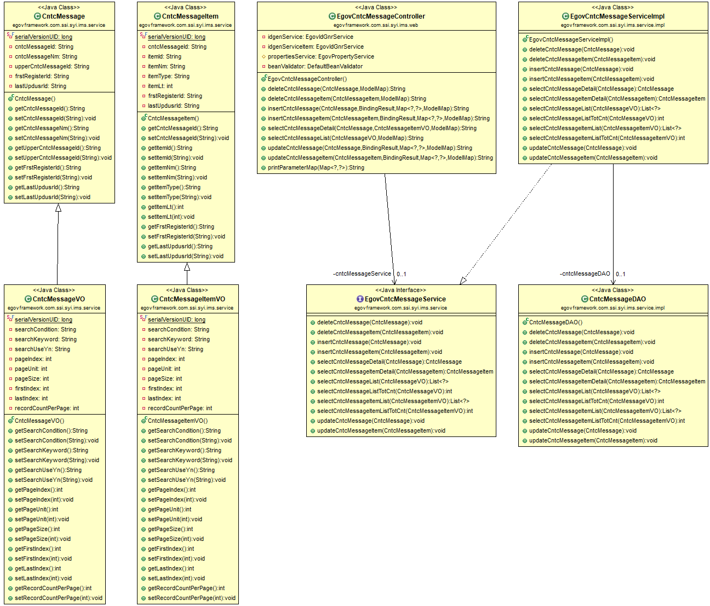
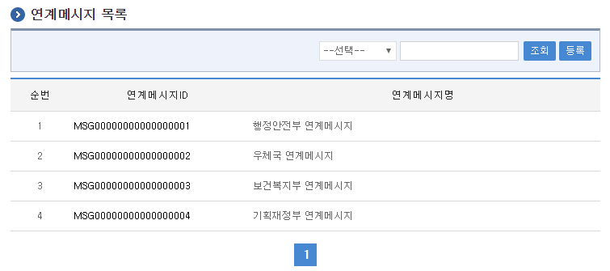
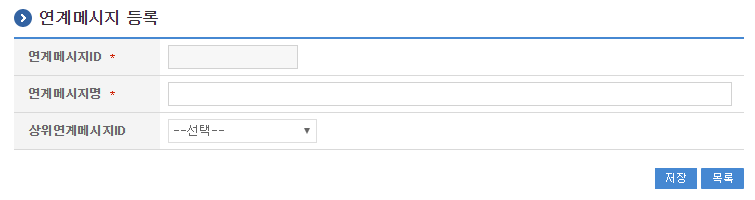
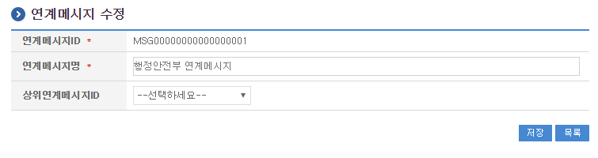
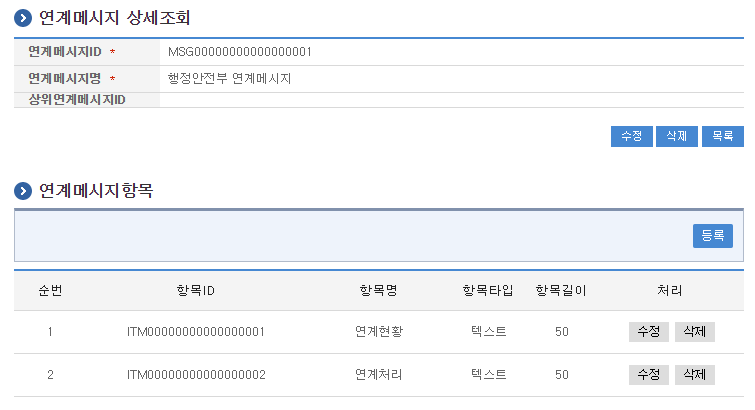
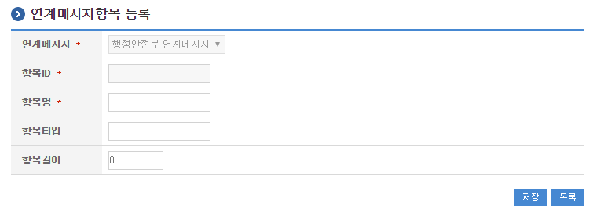
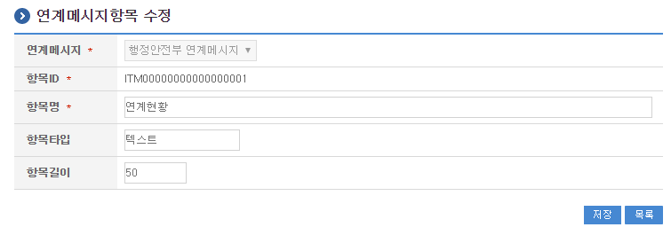

# 연계메시지관리

## 개요

 연계메시지, 연계메시지항목, 연계서비스에 관한 정보를 등록하고 관리하는 기능을 수행한다.

## 설명

### 패키지 참조 관계

 연계메시지관리 패키지는 요소기술의 공통(cmm) 패키지에만 직접적인 함수적 참조 관계를 가진다. 하지만, 컴포넌트 배포 시 오류 없이 실행되기 위하여 패키지 간의 참조관계에 따라 연계기관관리, 시스템연계관리, 연계현황관리, 달력 패키지와 함께 배포 파일을 구성한다.
 패키지 간 참조 관계 : [시스템관리 Package Dependency](../intro/package-reference.md/#시스템관리)

### 관련소스

| 유형 | 대상소스명 | 비고 |
| --- | --- | --- |
| Controller | egovframework.com.ssi.syi.ims.web.EgovCntcMessageController.java | 연계메시지 관리를 위한 컨트롤러 클래스 |
| Service | egovframework.com.ssi.syi.ims.service.EgovCntcMessageService.java | 연계메시지 관리를 위한 서비스 인터페이스 |
| ServiceImpl | egovframework.com.ssi.syi.ims.service.impl.EgovCntcMessageServiceImpl.java | 연계메시지 관리를 위한  서비스구현 클래스 |
| Model | egovframework.com.ssi.syi.ims.service.CntcMessage.java | 연계메시지 정보 Model 클래스 |
| Model | egovframework.com.ssi.syi.ims.service.CntcMessageItem.java | 연계메시지항목 정보 Model 클래스 |
| VO | egovframework.com.ssi.syi.ims.service.CntcMessageVO.java | 연계메시지 관리를 위한 VO 클래스 |
| VO | egovframework.com.ssi.syi.ims.service.CntcMessageItemVO.java | 연계메시지항목 관리를 위한 VO 클래스 |
| DAO | egovframework.com.ssi.syi.ims.service.impl.CntcMessageDAO.java | 연계메시지 관리를 위한 데이터처리 클래스 |
| JSP | /WEB-INF/jsp/egovframework/com/ssi/syi/ims/EgovCntcMessageList.jsp | 연계메시지 목록조회 페이지 |
| JSP | /WEB-INF/jsp/egovframework/com/ssi/syi/ims/EgovCntcMessageRegist.jsp | 연계메시지 등록 페이지 |
| JSP | /WEB-INF/jsp/egovframework/com/ssi/syi/ims/EgovCntcMessageItemRegist.jsp | 연계메시지항목 등록 페이지 |
| JSP | /WEB-INF/jsp/egovframework/com/ssi/syi/ims/EgovCntcMessageUpdt.jsp | 연계메시지 수정 페이지 |
| JSP | /WEB-INF/jsp/egovframework/com/ssi/syi/ims/EgovCntcMessageItemUpdt.jsp | 연계메시지항목 수정 페이지 |
| JSP | /WEB-INF/jsp/egovframework/com/ssi/syi/ims/EgovCntcMessageDetail.jsp | 연계메시지 상세조회 페이지 |
| Query XML | resources/egovframework/mapper/com/ssi/syi/ims/EgovCntcMessage\_SQL\_altibase.xml | 연계메시지 관리를 위한 Altibase용 Query XML |
| Query XML | resources/egovframework/mapper/com/ssi/syi/ims/EgovCntcMessage\_SQL\_cubrid.xml | 연계메시지 관리를 위한 Cubrid용 Query XML |
| Query XML | resources/egovframework/mapper/com/ssi/syi/ims/EgovCntcMessage\_SQL\_maria.xml | 연계메시지 관리를 위한 MariaDB용 Query XML |
| Query XML | resources/egovframework/mapper/com/ssi/syi/ims/EgovCntcMessage\_SQL\_mysql.xml | 연계메시지 관리를 위한 MySQL용 Query XML |
| Query XML | resources/egovframework/mapper/com/ssi/syi/ims/EgovCntcMessage\_SQL\_oracle.xml | 연계메시지 관리를 위한 Oracle용 Query XML |
| Query XML | resources/egovframework/mapper/com/ssi/syi/ims/EgovCntcMessage\_SQL\_postgres.xml | 연계메시지 관리를 위한 PostgreSQL용 Query XML |
| Query XML | resources/egovframework/mapper/com/ssi/syi/ims/EgovCntcMessage\_SQL\_tibero.xml | 연계메시지 관리를 위한 Tibero용 Query XML |
| Query XML | resources/egovframework/mapper/com/ssi/syi/ims/EgovCntcMessage\_SQL\_goldilocks.xml | 연계메시지 관리를 위한 Goldilocks용 Query XML |
| Message properties | resources/egovframework/message/com/ssi/syi/ims/message\_en.properties | 연계메시지 관리를 위한 Message properties(영문) |
| Message properties | resources/egovframework/message/com/ssi/syi/ims/message\_ko.properties | 연계메시지 관리를 위한 Message properties(한글) |
| Idgen XML | resources/egovframework/spring/com/idgn/context-idgn-CntcMessage.xml | 연계메시지 관리를 위한 Id생성 Idgen XML |

### 클래스 다이어그램

 

### ID Generation

#### ID Generation 관련 DDL 및 DML

 ID Generation Service를 활용하기 위해서 Sequence 저장테이블인  COMTECOPSEQ에 CNTC_MESSAGE_ID, ITEM_ID 항목을 추가해야 한다.

```sql
CREATE TABLE COMTECOPSEQ ( table_name varchar(16) NOT NULL, 
                               next_id DECIMAL(30) NOT NULL,
                               PRIMARY KEY (table_name)
    );
 
    INSERT INTO COMTECOPSEQ VALUES ('CNTC_MESSAGE_ID','0');
    INSERT INTO COMTECOPSEQ VALUES ('ITEM_ID','0');
```

#### ID Generation 환경설정(context-idgn-CntcMessage.xml)

```xml
<!-- 연계메시지 -->
    <bean name="egovCntcMessageIdGnrService" class="egovframework.rte.fdl.idgnr.impl.EgovTableIdGnrServiceImpl" destroy-method="destroy">
        <property name="dataSource" ref="egov.dataSource" />
        <property name="strategy"   ref="egovCntcMessageIdMsgtrategy" />
        <property name="blockSize"  value="10" />
        <property name="table"      value="COMTECOPSEQ" />
        <property name="tableName"  value="CNTC_MESSAGE_ID" />
    </bean>
    <bean name="egovCntcMessageIdMsgtrategy" class="egovframework.rte.fdl.idgnr.impl.strategy.EgovIdGnrStrategyImpl">
        <property name="prefix"     value="MSG" />
        <property name="cipers"     value="17" />
        <property name="fillChar"   value="0" />
    </bean>
 
    <!-- 연계메시지항목 -->
    <bean name="egovCntcMessageItemIdGnrService" class="egovframework.rte.fdl.idgnr.impl.EgovTableIdGnrServiceImpl" destroy-method="destroy">
        <property name="dataSource" ref="egov.dataSource" />
        <property name="strategy"   ref="egovCntcMessageItemIdMsgtrategy" />
        <property name="blockSize"  value="10" />
        <property name="table"      value="COMTECOPSEQ" />
        <property name="tableName"  value="ITEM_ID" />
    </bean>
    <bean name="egovCntcMessageItemIdMsgtrategy" class="egovframework.rte.fdl.idgnr.impl.strategy.EgovIdGnrStrategyImpl">
        <property name="prefix"     value="ITM" />
        <property name="cipers"     value="17" />
        <property name="fillChar"   value="0" />
    </bean>
```

### 관련테이블

| 테이블명 | 테이블명(영문) | 비고 |
| --- | --- | --- |
| 연계메시지 | COMTNCNTCMESSAGE | 연계메시지에 대한 정보 |
| 연계메시지항목 | COMTNCNTCMESSAGEITEM | 연계메시지항목에 대한 정보 |

## 관련기능

 연계메시지관리는 연계메시지 목록조회, 연계메시지 등록, 연계메시지 수정, 연계메시지 상세조회, 연계메시지항목 등록, 연계메시지항목 수정 기능으로 구성되어 있다.

### 연계메시지 목록조회

#### 비즈니스 규칙

 연계메시지 목록은 페이지당 10건씩 조회되며 페이징은 10페이지씩 이루어진다.
 검색조건은 연계메시지명에 대해서 수행된다.

#### 관련코드

 N/A

#### 관련화면 및 수행매뉴얼

| Action | URL | Controller method | QueryID |
| --- | --- | --- | --- |
| 목록조회 | /ssi/syi/ims/getCntcMessageList.do | selectCntcMessageList | "CntcMessageDAO.selectCntcMessageList", |
|  |  |  | "CntcMessageDAO.selectCntcMessageListTotCnt" |

 페이지당 검색 범위를 변경하고자 하는 경우
 context-properties.xml 파일의 pageUnit, pageSize를 변경한다.(단 해당 설정은 전체 공통서비스 기능에 영향을 미친다.)

 

 조회: 조회하기 위해서는 상단의 검색조건을 선택 후 해당하는 검색문자를 입력 후 조회 버튼을 클릭한다.
 등록: 등록하기 위해서는 상단의 등록 버튼을 통해서 연계메시지 등록 화면으로 이동한다.
 목록클릭: 연계메시지 상세조회 화면으로 이동한다.

### 연계메시지 등록

#### 비즈니스 규칙

 연계메시지에 대한 상세내용을 등록한다.
 등록이 성공하면 연계메시지목록 화면으로 이동한다.
 연계메시지 등록 시 선행작업으로 연계메시지, 연계메시지항목, 연계서비스, 연계메시지, 연계메시지항목이 등록되어 있어야 한다.

#### 관련코드

 N/A

#### 관련화면 및 수행매뉴얼

| Action | URL | Controller method | QueryID |
| --- | --- | --- | --- |
| 등록 | /ssi/syi/ims/addCntcMessage.do | insertCntcMessage | "CntcMessageDAO.insertCntcMessage" |

 

 저장: 입력한 연계메시지 정보들이 저장 처리된다.
 목록: 연계메시지 목록 화면으로 이동한다.

### 연계메시지 수정

#### 비즈니스 규칙

 수정이 성공하면 연계메시지목록 화면으로 이동한다.

#### 관련코드

 N/A

#### 관련화면 및 수행매뉴얼

| Action | URL | Controller method | QueryID |
| --- | --- | --- | --- |
| 수정 | /ssi/syi/ims/updateCntcMessage.do | updateCntcMessage | "CntcMessageDAO.updateCntcMessage" |

 

 저장: 수정된 정보들이 저장 처리된다.
 목록: 연계메시지 목록 화면으로 이동한다.

### 연계메시지 상세 조회

#### 비즈니스 규칙

 상세조회에는 삭제 처리가 포함되어 있고 삭제가 성공하면 연계메시지목록 화면으로 이동한다.

#### 관련코드

 N/A

#### 관련화면 및 수행매뉴얼

| Action | URL | Controller method | QueryID |
| --- | --- | --- | --- |
| 상세조회 | /ssi/syi/ims/getCntcMessageDetail.do | selectCntcMessageDetail | "CntcMessageDAO.selectCntcMessageDetail" |
| 연계메시지삭제 | /ssi/syi/ims/removeCntcMessage.do | deleteCntcMessage | "CntcMessageDAO.deleteCntcMessage" |
| 연계메시지항목삭제 | /ssi/syi/ims/removeCntcMessageItem.do | deleteCntcMessageItem | "CntcMessageDAO.deleteCntcMessageItem" |

 

 연계메시지 수정: 수정버튼 클릭 시 연계메시지 수정 화면으로 이동한다.
 연계메시지 삭제: 삭제버튼 클릭 시 삭제여부를 확인하는 메시지를 보여주고 연계메시지를 삭제처리를 할 수 있다.
 연계메시지 목록: 연계메시지 목록 화면으로 이동한다.
 연계메시지항목 수정: 연계메시지항목 수정 화면으로 이동한다.
 연계메시지항목 삭제:삭제버튼 클릭 시 삭제여부를 확인하는 메시지를 보여주고 연계메시지 항목을 삭제처리를 할 수 있다.

### 연계메시지항목 등록

#### 비즈니스 규칙

 연계메시지항목에 대한 상세내용을 등록한다.
 등록이 성공하면 연계메시지상세 화면으로 이동한다.
 연계메시지항목 등록 시 선행작업으로 연계메시지항목, 연계메시지항목, 연계서비스, 연계메시지, 연계메시지항목이 등록되어 있어야 한다.

#### 관련코드

 N/A

#### 관련화면 및 수행매뉴얼

| Action | URL | Controller method | QueryID |
| --- | --- | --- | --- |
| 등록 | /ssi/syi/ims/addCntcMessageItem.do | insertCntcMessageItem | "CntcMessageDAO.insertCntcMessageItem" |

 

 저장: 입력한 연계메시지항목 정보들이 저장 처리된다.
 목록: 연계메시지항목 목록 화면으로 이동한다.

### 연계메시지항목 수정

#### 비즈니스 규칙

 수정이 성공하면 연계메시지상세 화면으로 이동한다.

#### 관련코드

 N/A

#### 관련화면 및 수행매뉴얼

| Action | URL | Controller method | QueryID |
| --- | --- | --- | --- |
| 수정 | /ssi/syi/ims/updateCntcMessageItem.do | updateCntcMessageItem | "CntcMessageDAO.updateCntcMessageItem" |

 

 저장: 수정된 정보들이 저장 처리된다.
 목록: 연계메시지항목 목록 화면으로 이동한다.

## 참고자료

 실행환경 참조 : [ID Generation Service](/egovframe-runtime/foundation-layer/id-generation.md)
