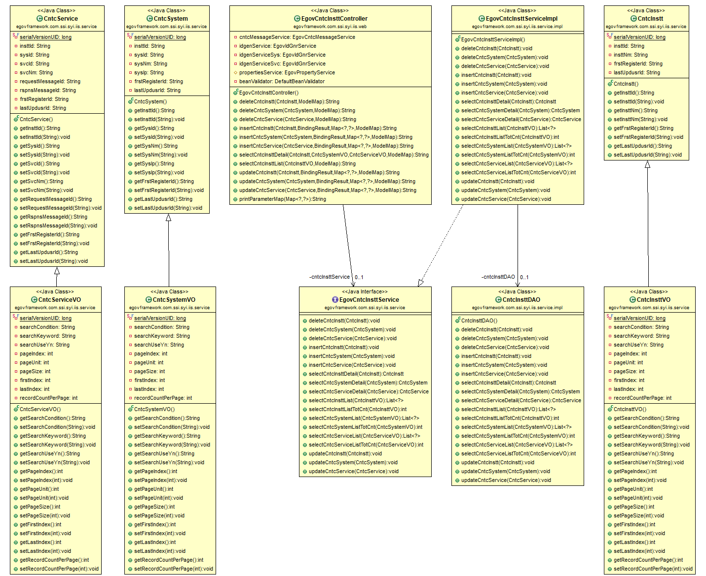
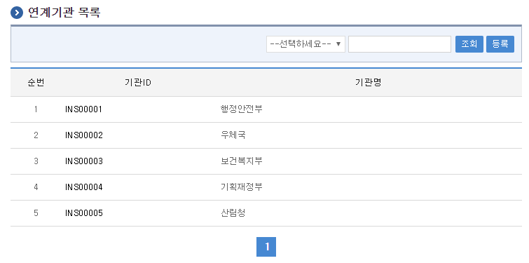
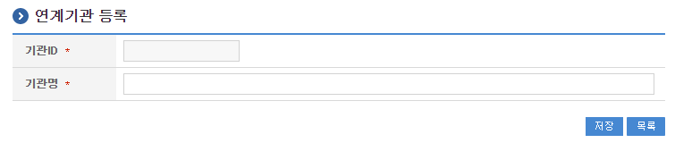
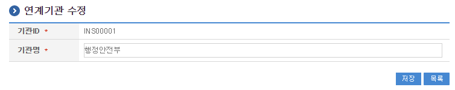
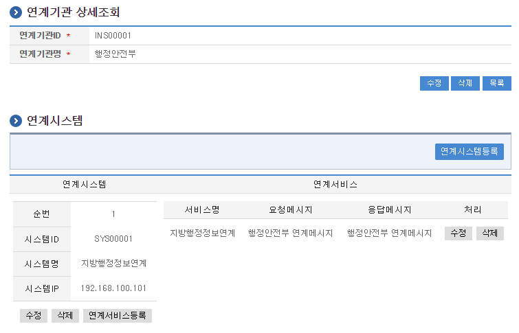
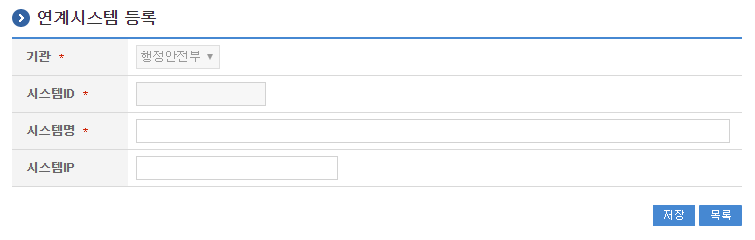
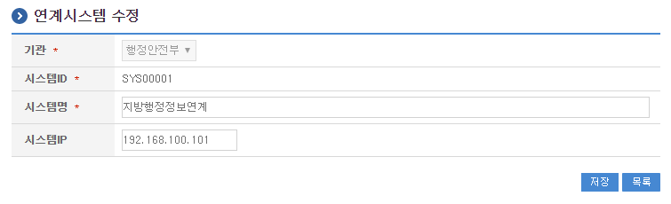
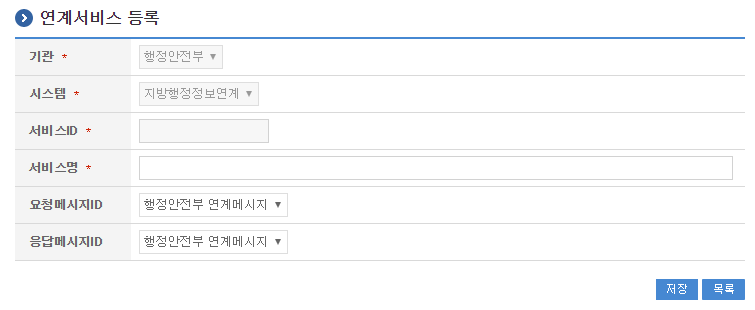
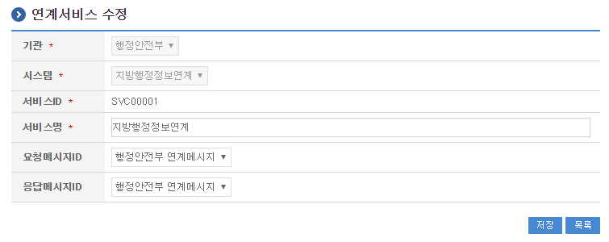

# 연계기관관리

## 개요

 연계기관, 연계시스템, 연계서비스에 관한 정보를 등록하고 관리하는 기능을 수행한다.

## 설명

### 패키지 참조 관계

 연계기관관리 패키지는 요소기술의 공통(cmm) 패키지에만 직접적인 함수적 참조 관계를 가진다. 하지만, 컴포넌트 배포 시 오류 없이 실행되기 위하여 패키지 간의 참조관계에 따라 연계메시지관리, 시스템연계관리, 연계현황관리, 달력 패키지와 함께 배포 파일을 구성한다.
 패키지 간 참조 관계 : [시스템관리 Package Dependency](../intro/package-reference.md#시스템관리)

### 관련소스

| 유형 | 대상소스명 | 비고 |
| --- | --- | --- |
| Controller | egovframework.com.ssi.syi.iis.web.EgovCntcInsttController.java | 연계기관 관리를 위한 컨트롤러 클래스 |
| Service | egovframework.com.ssi.syi.iis.service.EgovCntcInsttService.java | 연계기관 관리를 위한 서비스 인터페이스 |
| ServiceImpl | egovframework.com.ssi.syi.iis.service.impl.EgovCntcInsttServiceImpl.java | 연계기관 관리를 위한  서비스구현 클래스 |
| Model | egovframework.com.ssi.syi.iis.service.CntcInstt.java | 연계기관 정보 Model 클래스 |
| Model | egovframework.com.ssi.syi.iis.service.CntcSystem.java | 연계시스템 정보 Model 클래스 |
| Model | egovframework.com.ssi.syi.iis.service.CntcService.java | 연계서비스 정보 Model 클래스 |
| VO | egovframework.com.ssi.syi.iis.service.CntcInsttVO.java | 연계기관 관리를 위한 VO 클래스 |
| VO | egovframework.com.ssi.syi.iis.service.CntcSystemVO.java | 연계시스템 관리를 위한 VO 클래스 |
| VO | egovframework.com.ssi.syi.iis.service.CntcServiceVO.java | 연계서비스 관리를 위한 VO 클래스 |
| DAO | egovframework.com.ssi.syi.iis.service.impl.CntcInsttDAO.java | 연계기관 정보 관리를 위한 데이터처리 클래스 |
| JSP | /WEB-INF/jsp/egovframework/com/ssi/syi/iis/EgovCntcInsttList.jsp | 연계기관 목록조회 페이지 |
| JSP | /WEB-INF/jsp/egovframework/com/ssi/syi/iis/EgovCntcInsttRegist.jsp | 연계기관 등록 페이지 |
| JSP | /WEB-INF/jsp/egovframework/com/ssi/syi/iis/EgovCntcSystemRegist.jsp | 연계시스템 등록 페이지 |
| JSP | /WEB-INF/jsp/egovframework/com/ssi/syi/iis/EgovCntcServiceRegist.jsp | 연계서비스 등록 페이지 |
| JSP | /WEB-INF/jsp/egovframework/com/ssi/syi/iis/EgovCntcInsttUpdt.jsp | 연계기관 수정 페이지 |
| JSP | /WEB-INF/jsp/egovframework/com/ssi/syi/iis/EgovCntcSystemUpdt.jsp | 연계시스템 수정 페이지 |
| JSP | /WEB-INF/jsp/egovframework/com/ssi/syi/iis/EgovCntcServiceUpdt.jsp | 연계서비스 수정 페이지 |
| JSP | /WEB-INF/jsp/egovframework/com/ssi/syi/iis/EgovCntcInsttDetail.jsp | 연계기관 상세조회 페이지 |
| Query XML | resources/egovframework/mapper/com/ssi/syi/iis/EgovCntcInstt\_SQL\_altibase.xml | 연계기관 관리를 위한 Altibase용 Query XML |
| Query XML | resources/egovframework/mapper/com/ssi/syi/iis/EgovCntcInstt\_SQL\_cubrid.xml | 연계기관 관리를 위한 Cubrid용 Query XML |
| Query XML | resources/egovframework/mapper/com/ssi/syi/iis/EgovCntcInstt\_SQL\_maria.xml | 연계기관 관리를 위한 MariaDB용 Query XML |
| Query XML | resources/egovframework/mapper/com/ssi/syi/iis/EgovCntcInstt\_SQL\_mysql.xml | 연계기관 관리를 위한 MySQL용 Query XML |
| Query XML | resources/egovframework/mapper/com/ssi/syi/iis/EgovCntcInstt\_SQL\_oracle.xml | 연계기관 관리를 위한 Oracle용 Query XML |
| Query XML | resources/egovframework/mapper/com/ssi/syi/iis/EgovCntcInstt\_SQL\_postgres.xml | 연계기관 관리를 위한 PostgreSQL용 Query XML |
| Query XML | resources/egovframework/mapper/com/ssi/syi/iis/EgovCntcInstt\_SQL\_tibero.xml | 연계기관 관리를 위한 Tibero용 Query XML |
| Query XML | resources/egovframework/mapper/com/ssi/syi/iis/EgovCntcInstt\_SQL\_goldilocks.xml | 연계기관 관리를 위한 Goldilocks용 Query XML |
| Message properties | resources/egovframework/message/com/ssi/syi/iis/message\_en.properties | 연계기관 관리를 위한 Message properties(영문) |
| Message properties | resources/egovframework/message/com/ssi/syi/iis/message\_ko.properties | 연계기관 관리를 위한 Message properties(한글) |
| Idgen XML | resources/egovframework/spring/com/idgn/context-idgn-CntcInstt.xml | 연계기관 관리 Id생성 Idgen XML |

### 클래스 다이어그램

 

### ID Generation

#### ID Generation 관련 DDL 및 DML

 ID Generation Service를 활용하기 위해서 Sequence 저장테이블인  COMTECOPSEQ에 INSTT_ID, SYS_ID, SVC_ID 항목을 추가해야 한다.

```sql
CREATE TABLE COMTECOPSEQ ( table_name varchar(16) NOT NULL, 
                               next_id DECIMAL(30) NOT NULL,
                               PRIMARY KEY (table_name)
    );
 
    INSERT INTO COMTECOPSEQ VALUES ('INSTT_ID','0');
    INSERT INTO COMTECOPSEQ VALUES ('SYS_ID','0');
    INSERT INTO COMTECOPSEQ VALUES ('SVC_ID','0');
```

#### ID Generation 환경설정(context-idgn-CntcInstt.xml)

```xml
<!-- 연계기관 -->
    <bean name="egovCntcInsttIdGnrService" class="egovframework.rte.fdl.idgnr.impl.EgovTableIdGnrServiceImpl" destroy-method="destroy">
        <property name="dataSource" ref="egov.dataSource" />
        <property name="strategy"   ref="egovCntcInsttIdMsgtrategy" />
        <property name="blockSize"  value="10" />
        <property name="table"      value="COMTECOPSEQ" />
        <property name="tableName"  value="INSTT_ID" />
    </bean>
    <bean name="egovCntcInsttIdMsgtrategy" class="egovframework.rte.fdl.idgnr.impl.strategy.EgovIdGnrStrategyImpl">
        <property name="prefix"     value="INS" />
        <property name="cipers"     value="5" />
        <property name="fillChar"   value="0" />
    </bean>
 
    <!-- 연계시스템 -->
    <bean name="egovCntcSystemIdGnrService" class="egovframework.rte.fdl.idgnr.impl.EgovTableIdGnrServiceImpl" destroy-method="destroy">
        <property name="dataSource" ref="egov.dataSource" />
        <property name="strategy"   ref="egovCntcSystemIdMsgtrategy" />
        <property name="blockSize"  value="10" />
        <property name="table"      value="COMTECOPSEQ" />
        <property name="tableName"  value="SYS_ID" />
    </bean>
    <bean name="egovCntcSystemIdMsgtrategy" class="egovframework.rte.fdl.idgnr.impl.strategy.EgovIdGnrStrategyImpl">
        <property name="prefix"     value="SYS" />
        <property name="cipers"     value="5" />
        <property name="fillChar"   value="0" />
    </bean>
 
    <!-- 연계서비스 -->
    <bean name="egovCntcServiceIdGnrService" class="egovframework.rte.fdl.idgnr.impl.EgovTableIdGnrServiceImpl" destroy-method="destroy">
        <property name="dataSource" ref="egov.dataSource" />
        <property name="strategy"   ref="egovCntcServiceIdMsgtrategy" />
        <property name="blockSize"  value="10" />
        <property name="table"      value="COMTECOPSEQ" />
        <property name="tableName"  value="SVC_ID" />
    </bean>
    <bean name="egovCntcServiceIdMsgtrategy" class="egovframework.rte.fdl.idgnr.impl.strategy.EgovIdGnrStrategyImpl">
        <property name="prefix"     value="SVC" />
        <property name="cipers"     value="5" />
        <property name="fillChar"   value="0" />
    </bean>
```

### 관련테이블

| 테이블명 | 테이블명(영문) | 비고 |
| --- | --- | --- |
| 연계기관 | COMTNCNTCINSTT | 연계기관에 대한 정보 |
| 연계시스템 | COMTNCNTCSYSTEM | 연계시스템에 대한 정보 |
| 연계서비스 | COMTNCNTCSERVICE | 연계서비스에 대한 정보 |

## 관련기능

 연계기관관리는 연계기관관리 목록조회, 연계기관관리 등록, 연계기관관리 수정, 연계기관관리 상세조회, 연계시스템 등록, 연계시스템 수정, 연계서비스 등록, 연계서비스 수정 기능으로 구성되어 있다.

### 연계기관 목록조회

#### 비즈니스 규칙

 연계기관 목록은 페이지당 10건씩 조회되며 페이징은 10페이지씩 이루어진다.
 검색조건은 연계기관명에 대해서 수행된다.

#### 관련코드

 N/A

#### 관련화면 및 수행매뉴얼

| Action | URL | Controller method | QueryID |
| --- | --- | --- | --- |
| 목록조회 | /ssi/syi/iis/getCntcInsttList.do | selectCntcInsttList | "CntcInsttDAO.selectCntcInsttList" |

 페이지당 검색 범위를 변경하고자 하는 경우
 context-properties.xml 파일의 pageUnit, pageSize를 변경한다.(단 해당 설정은 전체 공통서비스 기능에 영향을 미친다.)

 

 조회: 조회하기 위해서는 상단의 검색조건을 선택 후 해당하는 검색문자를 입력 후 조회 버튼을 클릭한다.
 등록: 등록하기 위해서는 상단의 등록 버튼을 통해서 연계기관 등록 화면으로 이동한다.
 목록클릭: 연계기관 상세조회 화면으로 이동한다.

### 연계기관 등록

#### 비즈니스 규칙

 연계기관에 대한 상세내용을 등록한다.
 등록이 성공하면 연계기관목록 화면으로 이동한다.
 연계기관 등록 시 선행작업으로 연계기관, 연계시스템, 연계서비스, 연계메시지, 연계메시지항목이 등록되어 있어야 한다.

#### 관련코드

 N/A

#### 관련화면 및 수행매뉴얼

| Action | URL | Controller method | QueryID |
| --- | --- | --- | --- |
| 등록 | /ssi/syi/iis/addCntcInstt.do | insertCntcInstt | "CntcInsttDAO.insertCntcInstt" |

 

 저장: 입력한 연계기관 정보들이 저장 처리된다.
 목록: 연계기관 목록 화면으로 이동한다.

### 연계기관 수정

#### 비즈니스 규칙

 수정이 성공하면 연계기관목록 화면으로 이동한다.

#### 관련코드

 N/A

#### 관련화면 및 수행매뉴얼

| Action | URL | Controller method | QueryID |
| --- | --- | --- | --- |
| 수정 | /ssi/syi/iis/updateCntcInstt.do | updateCntcInstt | "CntcInsttDAO.updateCntcInstt" |

 

 저장: 수정된 정보들이 저장 처리된다.
 목록: 연계기관 목록 화면으로 이동한다.

### 연계기관 상세 조회

#### 비즈니스 규칙

 상세조회에는 삭제 처리가 포함되어 있고 삭제가 성공하면 연계기관목록 화면으로 이동한다.

#### 관련코드

 N/A

#### 관련화면 및 수행매뉴얼

| Action | URL | Controller method | QueryID |
| --- | --- | --- | --- |
| 상세조회 | /ssi/syi/iis/getCntcInsttDetail.do | selectCntcInsttDetail | "CntcInsttDAO.selectCntcInsttDetail" |
| 연계기관삭제 | /ssi/syi/iis/removeCntcInstt.do | deleteCntcInstt | "CntcInsttDAO.deleteCntcInstt" |
| 연계시스템삭제 | /ssi/syi/iis/removeCntcSystem.do | deleteCntcSystem | "CntcInsttDAO.deleteCntcSystem" |
| 연계서비스삭제 | /ssi/syi/iis/removeCntcService.do | deleteCntcService | "CntcInsttDAO.deleteCntcService" |

 

### 연계시스템 등록

 연계시스템 등록 시 선행작업으로 연계시스템, 연계시스템, 연계서비스, 연계메시지, 연계메시지항목이 등록되어 있어야 한다.

#### 비즈니스 규칙

 메뉴정보를 변경한 후 저장한다.

#### 관련코드

 N/A

#### 관련화면 및 수행매뉴얼

| Action | URL | Controller | Controller method | QueryID |
| --- | --- | --- | --- | --- |
| 등록 | /ssi/syi/iis/addCntcSystem.do | EgovCntcInsttController | insertCntcSystem | /ssi/syi/iis/EgovCntcSystemRegist |

 연계시스템에 대한 상세내용을 등록한다.
 등록이 성공하면 연계기관상세 화면으로 이동한다.

 

 저장: 입력한 연계시스템 정보들이 저장 처리된다.
 목록: 연계시스템 목록 화면으로 이동한다.

### 연계시스템 수정

#### 비즈니스 규칙

 메뉴정보를 변경한 후 저장한다.

#### 관련코드

 N/A

#### 관련화면 및 수행매뉴얼

| Action | URL | Controller | Controller method | QueryID |
| --- | --- | --- | --- | --- |
| 수정 | /ssi/syi/iis/updateCntcSystem.do | EgovCntcInsttController | updateCntcSystem | /ssi/syi/iis/EgovCntcSystemUpdt |

 수정이 성공하면 연계기관상세 화면으로 이동한다.

 

 저장: 수정된 정보들이 저장 처리된다.
 목록: 연계시스템 목록 화면으로 이동한다.

### 연계서비스 등록

#### 비즈니스 규칙

 연계서비스에 대한 상세내용을 등록한다.
 등록이 성공하면 연계기관상세 화면으로 이동한다.
 연계서비스 등록 시 선행작업으로 연계서비스, 연계서비스, 연계서비스, 연계메시지, 연계메시지항목이 등록되어 있어야 한다.

#### 관련코드

 N/A

#### 관련화면 및 수행매뉴얼

| Action | URL | Controller method | QueryID |
| --- | --- | --- | --- |
| 등록 | /ssi/syi/iis/addCntcService.do | insertCntcService | "CntcInsttDAO.insertCntcService" |

 

 저장: 입력한 연계서비스 정보들이 저장 처리된다.
 목록: 연계서비스 목록 화면으로 이동한다.

### 연계서비스 수정

#### 비즈니스 규칙

 수정이 성공하면 연계기관상세 화면으로 이동한다.

#### 관련코드

 N/A

#### 관련화면 및 수행매뉴얼

| Action | URL | Controller method | QueryID |
| --- | --- | --- | --- |
| 수정 | /ssi/syi/iis/updateCntcService.do | updateCntcService | "CntcInsttDAO.updateCntcService" |

 

 저장: 수정된 정보들이 저장 처리된다.
 목록: 연계서비스 목록 화면으로 이동한다.
