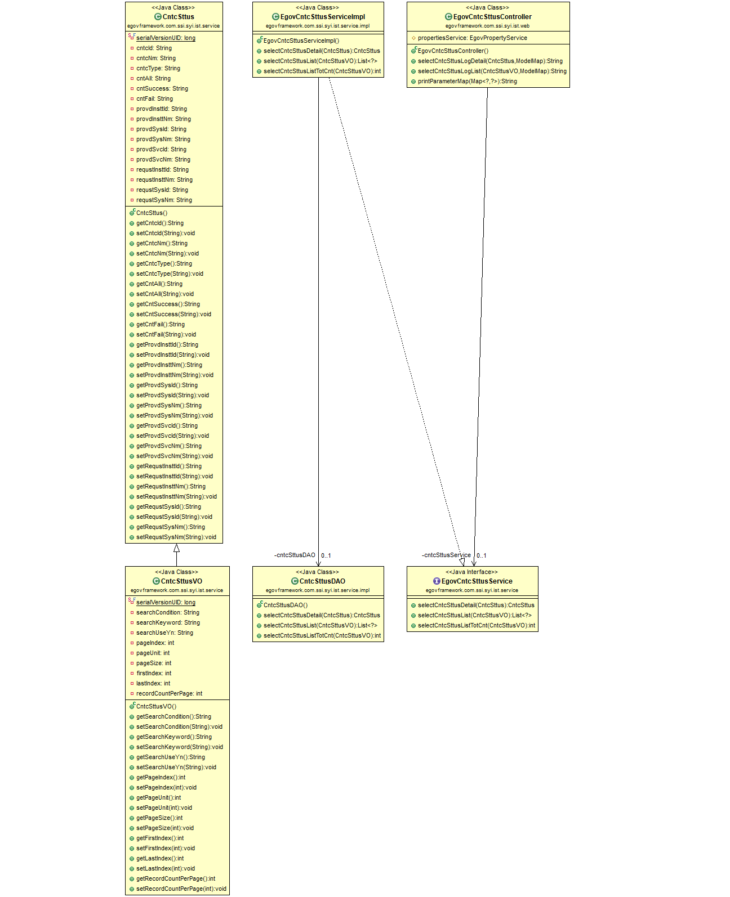
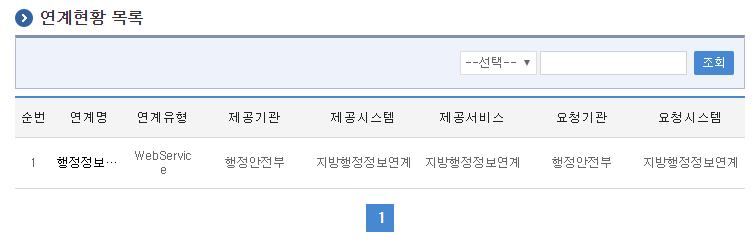
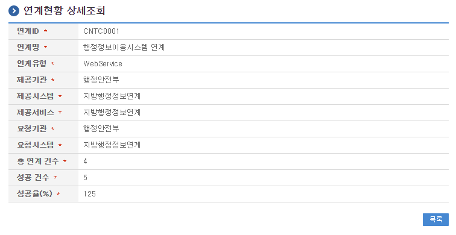

# 연계현황관리

## 개요

 연계현황, 연계시스템, 연계서비스에 관한 정보를 등록하고 관리하는 기능을 수행한다.

## 설명

### 패키지 참조 관계

 연계현황관리 패키지는 어떤 패키지와도 직접적인 함수적 참조 관계를 갖진 않지만, 컴포넌트 배포 시 오류 없이 실행되기 위하여 패키지 간의 참조관계에 따라 요소기술의 공통(cmm), 연계메시지관리, 연계기관관리, 시스템연계관리, 달력 패키지와 함께 배포 파일을 구성한다.

- 패키지 간 참조 관계 : [시스템관리 Package Dependency](../intro/package-reference.md/#시스템관리)

### 관련소스

| 유형 | 대상소스명 | 비고 |
| --- | --- | --- |
| Controller | egovframework.com.ssi.syi.ist.web.EgovCntcSttusController.java | 연계현황 관리를 위한 컨트롤러 클래스 |
| Service | egovframework.com.ssi.syi.ist.service.EgovCntcSttusService.java | 연계현황 관리를 위한 서비스 인터페이스 |
| ServiceImpl | egovframework.com.ssi.syi.ist.service.impl.EgovCntcSttusServiceImpl.java | 연계현황 관리를 위한 서비스구현 클래스 |
| Model | egovframework.com.ssi.syi.ist.service.CntcSttus.java | 연계현황 정보 Model 클래스 |
| VO | egovframework.com.ssi.syi.ist.service.CntcSttusVO.java | 연계현황 관리를 위한 VO 클래스 |
| DAO | egovframework.com.ssi.syi.ist.service.impl.CntcSttusDAO.java | 연계현황 정보 관리를 위한 데이터처리 클래스 |
| JSP | /WEB-INF/jsp/egovframework/com/ssi/syi/ist/EgovCntcSttusList.jsp | 연계현황 목록조회 페이지 |
| JSP | /WEB-INF/jsp/egovframework/com/ssi/syi/ist/EgovCntcSttusDetail.jsp | 연계현황 상세조회 페이지 |
| Query XML | resources/egovframework/mapper/com/ssi/syi/ist/EgovCntcSttus\_SQL\_altibase.xml | 연계현황 관리를 위한 Altibase용 Query XML |
| Query XML | resources/egovframework/mapper/com/ssi/syi/ist/EgovCntcSttus\_SQL\_cubrid.xml | 연계현황 관리를 위한 Cubrid용 Query XML |
| Query XML | resources/egovframework/mapper/com/ssi/syi/ist/EgovCntcSttus\_SQL\_maria.xml | 연계현황 관리를 위한 MariaDB용 Query XML |
| Query XML | resources/egovframework/mapper/com/ssi/syi/ist/EgovCntcSttus\_SQL\_mysql.xml | 연계현황 관리를 위한 MySQL용 Query XML |
| Query XML | resources/egovframework/mapper/com/ssi/syi/ist/EgovCntcSttus\_SQL\_oracle.xml | 연계현황 관리를 위한 Oracle용 Query XML |
| Query XML | resources/egovframework/mapper/com/ssi/syi/ist/EgovCntcSttus\_SQL\_postgres.xml | 연계현황 관리를 위한 PostgreSQL용 Query XML |
| Query XML | resources/egovframework/mapper/com/ssi/syi/ist/EgovCntcSttus\_SQL\_tibero.xml | 연계현황 관리를 위한 Tibero용 Query XML |
| Query XML | resources/egovframework/mapper/com/ssi/syi/ist/EgovCntcSttus\_SQL\_goldilocks.xml | 연계현황 관리를 위한 Goldilocks용 Query XML |
| Message properties | resources/egovframework/message/com/ssi/syi/ist/message\_en.properties | 연계현황 관리를 위한 Message properties(영문) |
| Message properties | resources/egovframework/message/com/ssi/syi/ist/message\_ko.properties | 연계현황 관리를 위한 Message properties(한글) |

### 클래스 다이어그램

 

### 관련테이블

| 테이블명 | 테이블명(영문) | 비고 |
| --- | --- | --- |
| 시스템연계 | COMTNSYSTEMCNTC | 시스템연계에 대한 정보 |
| 송수신로그 | COMTNTRSMRCVLOG | 송수신로그에 대한 정보 |

## 관련기능

 연계현황 관리는 연계현황 목록조회, 상세조회의 기능으로 구성되어 있다.

### 연계현황 목록조회

#### 비즈니스 규칙

 연계현황 목록은 페이지당 10건씩 조회되며 페이징은 10페이지씩 이루어진다.  
검색조건은 연계현황명에 대해서 수행된다.

#### 관련코드

 N/A

#### 관련화면 및 수행매뉴얼

| Action | URL | Controller method | QueryID |
| --- | --- | --- | --- |
| 목록조회 | /ssi/syi/ist/getCntcSttusList.do | selectCntcSttusLogList | "CntcSttusDAO.selectCntcSttusList", "CntcSttusDAO.selectCntcSttusListTotCnt" |

 

 페이지당 검색 범위를 변경하고자 하는 경우 context-properties.xml 파일의 pageUnit, pageSize를 변경한다.(단 해당 설정은 전체 공통서비스 기능에 영향을 미친다.)  
조회: 조회하기 위해서는 상단의 검색조건을 선택 후 해당하는 검색문자를 입력 후 조회 버튼을 클릭한다.  
목록클릭: 연계현황 상세조회 화면으로 이동한다.  

### 연계현황 상세 조회

#### 비즈니스 규칙

 상세조회에는 삭제 처리가 포함되어 있고 삭제가 성공하면 연계현황 목록 화면으로 이동한다.

#### 관련코드

 N/A

#### 관련화면 및 수행매뉴얼

| Action | URL | Controller method | QueryID |
| --- | --- | --- | --- |
| 상세조회 | /ssi/syi/ist/getCntcSttusDetail.do | selectCntcSttusLogDetail | "CntcSttusDAO.selectCntcSttusDetail" |

 

 목록: 연계현황 목록 화면으로 이동한다.  

## 참고자료

- 송수신 로그 참조 : [송수신로그조회](../system-management/send-receive-log-management.md)
