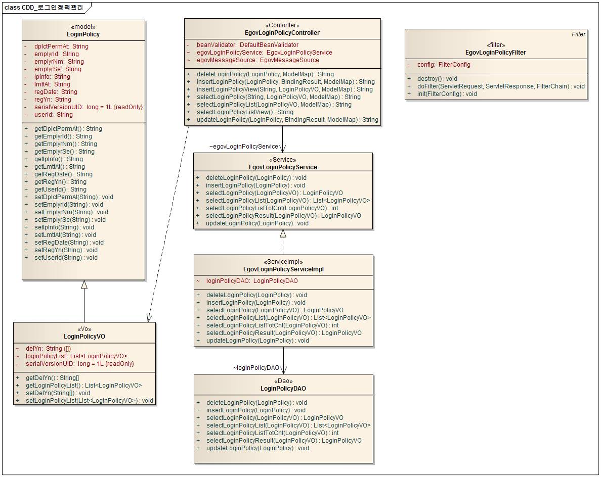
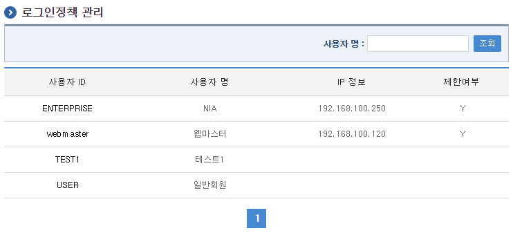
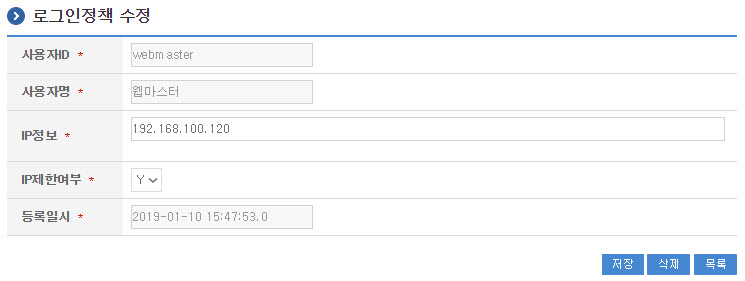

# 로그인정책 관리

## 개요

 **로그인정책관리**는 특정 IP에 대한 로그인 제한과 같은 사용자 로그인 정책을 정의하고, 정의된 정책에 맞게 로그인을 제한하는 기능을 제공한다.

## 설명

 **로그인정책관리**는 로그인정책정보를 등록하여 모든 사용자에게 로그인에 대한 정책을 관리하기 위한 목적으로 로그인정책정보의 **등록, 수정, 삭제, 조회, 목록조회**의 기능을 수반한다.

```bash
  ① 로그인정책목록조회 : 사용자 로그인 정책으로 정의된 정보를 최근 등록 순서대로 조회하고, 그 결과를 화면에 반영한다.
  ② 로그인정책등록 : 사용자 로그인 정책으로 정의된 항목을 입력하고, 정합성을 체크한 뒤 저장한다.
  ③ 로그인정책수정 : 정의된 사용자 로그인 정책에 대한 변경항목을 수정 후 저장한다.
  ④ 로그인정책삭제 : 기 등록된 사용자 로그인 정책을 삭제한다.
  ⑤ 로그인정책반영결과조회 : 등록된 사용자 로그인 정책을 운영시스템에 반영하고 그 결과를 조회한다.
 
```

### 패키지 참조 관계

 로그인정책관리 패키지는 요소기술의 공통(cmm) 패키지와 로그인 패키지에 대해서 직접적인 함수적 참조 관계를 가진다. 하지만, 컴포넌트 배포 시 오류 없이 실행되기 위하여 패키지 간의 참조관계에 따라 패키지와 포맷/날짜/계산, 메일연동 인터페이스, 시스템 패키지와 함께 배포 파일을 구성한다.

- 패키지 간 참조 관계 : [사용자디렉토리/통합인증 Package Dependency](../intro/package-reference.md)

### 관련소스

| 유형 | 대상소스명 | 비고 |
| --- | --- | --- |
| Controller | egovframework.com.uat.uap.web.EgovLoginPolicyController.java | 로그인정책 관리를 위한 컨트롤러 클래스 |
| Service | egovframework.com.uat.uap.service.EgovLoginPolicyService.java | 로그인정책 관리를 위한 서비스 인터페이스 |
| ServiceImpl | egovframework.com.uat.uap.service.impl.EgovLoginPolicyServiceImpl.java | 로그인정책 관리를 위한 서비스 구현 클래스 |
| Filter | egovframework.com.uat.uap.filter.EgovLoginPolicyFilter.java | 로그인 정책 체크 필터 |
| Model | egovframework.com.uat.uap.service.LoginPolicy.java | 로그인정책 관리를 위한 Model 클래스 |
| VO | egovframework.com.uat.uap.service.LoginPolicyVO.java | 로그인정책 관리를 위한 VO 클래스 |
| DAO | egovframework.com.uat.uap.service.impl.LoginPolicyDAO.java | 로그인정책 관리를 위한 데이터처리 클래스 |
| JSP | /WEB-INF/jsp/egovframework/com/uat/uap/EgovLoginPolicyList.jsp | 로그인정책 목록조회를 위한 jsp페이지 |
| JSP | /WEB-INF/jsp/egovframework/com/uat/uap/EgovLoginPolicyRegist.jsp | 로그인정책 등록를 위한 jsp페이지 |
| JSP | /WEB-INF/jsp/egovframework/com/uat/uap/EgovLoginPolicyUpdt.jsp | 로그인정책 수정를 위한 jsp페이지 |
| QUERY XML | resources/egovframework/mapper/com/uat/uap/EgovLoginPolicy\_SQL\_mysql.xml | 로그인정책 MySQL용 QUERY XML |
| QUERY XML | resources/egovframework/mapper/com/uat/uap/EgovLoginPolicy\_SQL\_cubrid.xml | 로그인정책 Cubrid용 QUERY XML |
| QUERY XML | resources/egovframework/mapper/com/uat/uap/EgovLoginPolicy\_SQL\_oracle.xml | 로그인정책 Oracle용 QUERY XML |
| QUERY XML | resources/egovframework/mapper/com/uat/uap/EgovLoginPolicy\_SQL\_tibero.xml | 로그인정책 Tibero용 QUERY XML |
| QUERY XML | resources/egovframework/mapper/com/uat/uap/EgovLoginPolicy\_SQL\_altibase.xml | 로그인정책 Altibase용 QUERY XML |
| QUERY XML | resources/egovframework/mapper/com/uat/uap/EgovLoginPolicy\_SQL\_maria.xml | 로그인정책 Maria용 QUERY XML |
| QUERY XML | resources/egovframework/mapper/com/uat/uap/EgovLoginPolicy\_SQL\_postgres.xml | 로그인정책 Postgres용 QUERY XML |
| QUERY XML | resources/egovframework/mapper/com/uat/uap/EgovLoginPolicy\_SQL\_goldilocks.xml | 로그인정책 Goldilocks용 QUERY XML |
| Validator Rule XML | resources/egovframework/validator/validator-rules.xml | Validator Rule을 정의한 XML |
| Validator XML | resources/egovframework/validator/com/uat/uap/EgovLoginPolicy.xml | 로그인정책 Validator XML |
| Message properties | resources/egovframework/message/com/uat/uap/message\_ko.properties | 로그인정책을 위한 Message properties(한글) |
| Message properties | resources/egovframework/message/com/uat/uap/message\_en.properties | 로그인정책을 위한 Message properties(영문) |

### 클래스 다이어그램

 

### 관련테이블

| 테이블명 | 테이블명(영문) | 비고 |
| --- | --- | --- |
| 로그인정책 | COMTNLOGINPOLICY | 사용자 로그인 정책에 맞게 로그인을 제한하는 기능을 위한 속성을 관리한다. |

### 환경설정

 로그인정책관리 기능의 구현하기 위해서는 web.xml 파일에 아래와 같이 filter가 정의되어 있어야 한다. 초기 제공되는 web.xml 파일은 해당 영역이 주석처리되어 있으므로 로그인정책관리 컴포넌트를 사용하는 경우에는 주석을 풀어주어야 한다.

```xml
<!-- 0. 로그인 정책 컴포넌트용 필터 -->
    <filter>
        <filter-name>LoginPolicyFilter</filter-name>
        <filter-class>egovframework.com.uat.uap.filter.EgovLoginPolicyFilter</filter-class>
    </filter>
    <filter-mapping>
        <filter-name>LoginPolicyFilter</filter-name>
        <url-pattern>/uat/uia/actionLogin.do</url-pattern>
    </filter-mapping>
```

## 관련기능

 로그인정책관리는 **로그인정책 목록조회**, **로그인정책 등록**, **로그인정책 상세조회 및 수정** 기능으로 구분되어 있다.

### 로그인정책 목록조회

#### 비즈니스 규칙

 검색조건은 사용자명 대해서 수행된다. 로그인정책 목록은 페이지당 10건씩 조회되며 페이징은 10페이지씩 이루어진다.

#### 관련코드

 N/A

#### 관련화면 및 수행매뉴얼

| Action | URL | Controller method | QueryID |
| --- | --- | --- | --- |
| 목록조회 | /uat/uap/selectLoginPolicyList.do | selectLoginPolicyList | “loginPolicyDAO.selectLoginPolicyList”, <br> “loginPolicyDAO.selectLoginPolicyListTotCnt” |

 

 조회 : 기 등록된 로그인정책 목록을 조회한다.  
등록 : 신규 로그인정책를 등록하기 위해서는 IP 정보가 없는 사용자ID를 선택하여 **로그인정책 등록** 화면으로 이동한다.  
목록클릭 : **로그인정책 상세조회** 화면으로 이동한다.

### 로그인정책 상세조회 및 수정

#### 비즈니스 규칙

 상세조회 화면에서 로그인정책의 속성정보를 변경한 후 저장할 수 있다.

#### 관련코드

 N/A

#### 관련화면 및 수행매뉴얼

| Action | URL | Controller method | QueryID |
| --- | --- | --- | --- |
| 상세조회 | /uat/uap/getLoginPolicy.do | selectLoginPolicy | “loginPolicyDAO.selectLoginPolicy” |
| 수정 | /uat/uap/updtLoginPolicy.do | updateLoginPolicy | “loginPolicyDAO.updateLoginPolicy” |
| 삭제 | /uat/uap/removeLoginPolicy.do | deleteLoginPolicy | “loginPolicyDAO.deleteLoginPolicy” |

 

 저장 : 기 등록된 로그인정책 속성을 수정한 뒤 하단의 **저장 버튼**을 통해서 로그인정책정보를 수정한다.  
삭제 : 기 등록된 로그인정책정보를 삭제한다.  
목록 : 로그인정책 목록조회 화면으로 이동한다.
