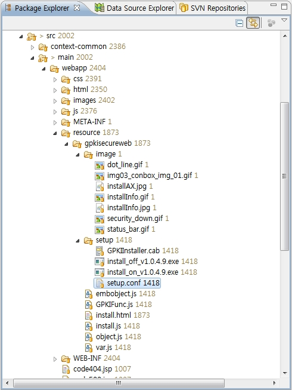
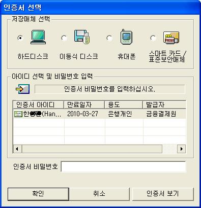

---
  title: 인증서로그인
  linkTitle: 인증서로그인
  description: "인증서로그인은 기존 GPKI 인증서 로그인과 동일한 기능을 제공한다."
  url: common-component/user-authentication/certificate-login
  menu:
    depth:
      weight: 1
      parent: user-authentication
      identifier: certificate-login
  ---
  
  

# 인증서로그인

## 개요

 인증서로그인은 기존 **[GPKI 인증서 로그인](https://www.egovframe.go.kr/wiki/doku.php?id=egovframework:gpki_%EC%9D%B8%EC%A6%9D%EC%84%9C_%EB%A1%9C%EA%B7%B8%EC%9D%B8)**과 동일한 기능을 제공한다. 다만, GPKI 인증서 로그인의 경우 행정전자서명 인증관리센터에서 배포하는 표준보안 API를 사용한다. 해당 API와 관련한 구체적인 사항은 GPKI 인증서 로그인 서비스의 [개요](https://www.egovframe.go.kr/wiki/doku.php?id=egovframework:gpki_%EC%9D%B8%EC%A6%9D%EC%84%9C_%EB%A1%9C%EA%B7%B8%EC%9D%B8#개요) 또는 [전제조건](https://www.egovframe.go.kr/wiki/doku.php?id=egovframework:gpki_%EC%9D%B8%EC%A6%9D%EC%84%9C_%EB%A1%9C%EA%B7%B8%EC%9D%B8#전제조건) 등을 참조한다.

## 설명

 인증서로그인를 행정전자서명 인증관리센터([www.gpki.go.kr](http://www.gpki.go.kr))에서 제공하는 GPKISecureWeb 모듈을 통해 인증서로그인 기능을 제공한다. (NPKI 및 GPKI 지원)

### 패키지 참조 관계

 로그인 패키지는 요소기술의 공통(cmm) 패키지에 대해서만 직접적인 함수적 참조 관계를 가진다. 하지만, 컴포넌트 배포 시 오류 없이 실행되기 위하여 패키지 간의 참조관계에 따라 패키지와 포맷/날짜/계산, 메일연동 인터페이스, 시스템 패키지와 함께 배포 파일을 구성한다.

- 패키지 간 참조 관계 : [사용자디렉토리/통합인증 Package Dependency](https://www.egovframe.go.kr/wiki/doku.php?id=egovframework:com:v2:init_pkg_dependency#사용자디렉토리_통합인증)

### 관련소스

| 유형 | 대상소스명 | 비고 |
| --- | --- | --- |
| Controller | egovframework.com.uat.uia.web.EgovLoginController.java | 일반 로그인, 인증서 로그인을 처리하는 컨트롤러 클래스 |
| Service | egovframework.com.uat.uia.service.EgovLoginService.java | 일반 로그인, 인증서 로그인을 처리하는 비즈니스 인터페이스 클래스 |
| ServiceImpl | egovframework.com.uat.uia.service.impl.EgovLoginServiceImpl.java | 일반 로그인, 인증서 로그인을 처리하는 비즈니스 구현 클래스 |
| VO | egovframework.com.cmm.SessionVO.java | 세션을 위한 VO 클래스 |
| VO | egovframework.com.cmm.LoginVO.java | 로그인을 위한 VO 클래스 |
| DAO | egovframework.com.uat.uia.service.impl.LoginDAO.java | 일반 로그인, 인증서 로그인을 처리하는 DAO 클래스 |
| JSP | WEB\_INF/jsp/egovframework/com/uat/uia/EgovGpkiIssu.jsp | 인증서 안내를 위한 JSP 페이지 |
| JSP | WEB\_INF/jsp/egovframework/com/uat/uia/EgovGpkiRegist.jsp | Login 인증 JSP 페이지 |
| Query XML | resources/egovframework/mapper/com/uat/uia/EgovLoginUsr\_SQL\_mysql.xml | 일반 로그인, 인증서 로그인을 위한 MySQL용 Query XML |
| Query XML | resources/egovframework/mapper/com/uat/uia/EgovLoginUsr\_SQL\_oracle.xml | 일반 로그인, 인증서 로그인을 위한 Oracle용 Query XML |
| Query XML | resources/egovframework/mapper/com/uat/uia/EgovLoginUsr\_SQL\_tibero.xml | 일반 로그인, 인증서 로그인을 위한 Tibero용 Query XML |
| Query XML | resources/egovframework/mapper/com/uat/uia/EgovLoginUsr\_SQL\_altibase.xml | 일반 로그인, 인증서 로그인을 위한 Altibase용 Query XML |
| Query XML | resources/egovframework/mapper/com/uat/uia/EgovLoginUsr\_SQL\_cubrid.xml | 일반 로그인, 인증서 로그인을 위한 Cubrid용 Query XML |
| Query XML | resources/egovframework/mapper/com/uat/uia/EgovLoginUsr\_SQL\_maria.xml | 일반 로그인, 인증서 로그인을 위한 Maria용 Query XML |
| Query XML | resources/egovframework/mapper/com/uat/uia/EgovLoginUsr\_SQL\_postgres.xml | 일반 로그인, 인증서 로그인을 위한 Postgres용 Query XML |
| Query XML | resources/egovframework/mapper/com/uat/uia/EgovLoginUsr\_SQL\_goldilocks.xml | 일반 로그인, 인증서 로그인을 위한 Goldilocks용 Query XML |
| Message properties | resources/egovframework/message/com/message-common\_ko\_KR.properties | 일반 로그인, 인증서 로그인을 위한 Message properties |

 위의 클래스 중 Controller의 경우는 전자정부 표준프레임워크에서의 테스트 수행을 위한 컨트롤러 클래스로서 실제 적용시에는 해당 기능들을 적용 Web MVC 프레임워크 기반으로 전환하면 된다. 혹 MVC 프레임워크가 적용되어 있지 않더라고 servlet 기반 또는 해당되는 JSP로 쉽게 전환할 수 있다.

### 클래스다이어그램

 

### web.xml 설정

 CertProcessFilter 및 CertProcessRequestWrapper의 경우는 전자정부 표준프레임워크의 HTMLTagFilter(egovframework.rte.ptl.mvc.filter.HTMLTagFilter)를 사용할 경우 다음과 같이 web.xml에 같이 추가를 해주어야 한다. HTMLTagFilter는 request 파라미터들에 대하여 자동으로 tag를 변환하는데 인증서로그인 처리 부분은 이 부분이 제외되어야 하기 때문이다.

```xml
    <filter>
        <filter-name>HTMLTagFilter</filter-name>
        <filter-class>
            egovframework.rte.ptl.mvc.filter.HTMLTagFilter
        </filter-class>
    </filter>
    <filter-mapping>
        <filter-name>HTMLTagFilter</filter-name>
        <url-pattern>*.do</url-pattern>
    </filter-mapping>
 
    <!-- Restoration from HTMLTagFilter's action (certification login) -->
    <filter>
        <filter-name>CertProcessFilter</filter-name>
        <filter-class>
            egovframework.com.utl.sec.filter.CertProcessFilter
        </filter-class>
    </filter>
    <filter-mapping>
        <filter-name>CertProcessFilter</filter-name>
        <url-pattern>/utl/sec/certLogin.do</url-pattern>
    </filter-mapping>
    <filter-mapping>
        <filter-name>CertProcessFilter</filter-name>
        <url-pattern>/utl/sec/certInfoPopup.do</url-pattern>
    </filter-mapping>
```

 위에서 HTMLTagFilter filter가 적용되지 않은 경우는 위 CertProcessFilter filter도 적용할 필요는 없다.

### 환경설정

 우선 행정안전부로부터 제공받은 GPKISecureWeb 모듈을 다음 경로상에 위치시킨다.

```bash
/src/main/webapp/resource/gpkisecureweb
```

 적용된 예는 다음과 같다.

 

 해당 모듈과 같이 제공되는 가이드에 의하면 일부 파일을 변경해 주어야 하나 현재의 인증서로그인 모듈을 적용할 경우 다음의 setup.conf만 수정하면된다.

- /resources/gpkisecureweb/setup/setup.conf

```bash
[Install_Info]
InstallDir 	= GPKISecureWeb
ServerAddr      = 192.168.100.101:80
SetupFilePath   = /resource/gpkisecureweb/setup/install_on_v1.0.4.9.exe
Version 	= 1049
```

 위에서 ServerAddr 부분만 현재 사이트의 IP 및 Port를 지정하면 된다. 주의하여야 할 것은 해당 파일은 EUC-KR로 배포가 되어야 인증서로그인 ActiveX가 정상적으로 설치된다.

#### GPKI API 설치파일 확인

 먼저 GPKI 인증서 로그인 기능을 위해서는 행정전자서명 인증관리센터([https://www.gpki.go.kr](https://www.gpki.go.kr))에서 시스템에 맞는 GPKI API를 신청하여 발급받아야 한다. 서버에 구성해놓은 표준보안 API는 IBM AIX용으로 WINDOWS계열이나 다른 유닉스 시스템에서 사용할 수는 없다.

##### 표준 API 구성요소

| 구분 | 형태 | 파일명/폴더 | 설명 |
| --- | --- | --- | --- |
| 표준API Native모듈 | 라이브러리 | libgpkiapi64.a | IBM AIX용 (행정용) |
| 표준API Native모듈 | 라이브러리 | libgpkiapi64\_jni.a | IBM AIX용 (행정용) |
| 표준API Native모듈 | 라이브러리 | libibmldap64n.a | IBM AIX용 (민간용) |
| 환경파일(conf) | 환경파일 | gpkiapi.conf | 인증서 검증에 필요한 정보 포함 |
| 테스트프로그램(sample) | 코드 | /java | Cert.java, Cms.java, Crypto.java, Ivs.java, Main.java, Tsa.java, Util.java (소스 코드) |
| 테스트프로그램(sample) | 실행파일 | /class | /Sample (테스트 프로그램을 돌리기 위해서 필요한 데이터)  
Cert.class, Cms.class, Crypto.class, Ivs.class, Main.class, Tsa.class, Util.class (테스트 프로그램) |
| 표준API | jar파일 | libgpkiapi\_jni.jar | 표준보안 API |

##### 클래스, 라이브러리 경로 설정

```bash
export GPKI_HOME=/product/jeus/egovProps/libgpkiapi
export CLASSPATH=$GPKI_HOME/libgpkiapi_jni.jar:$CLASSPATH
export LIBPATH=/product/jeus/egovProps/libgpkiapi/gpkiapi
export PATH=$PATH:/product/jeus/egovProps/libgpkiapi/gpkiapi

```

 JAVA용 표준보안API (libgpkiapi\_jni.jar)를 사용하기 위해서는 jar 파일이 클래스 경로에 잡혀있어야 하며, JAVA용 표준보안API에서 호출하는 JNI 파일의 경로를 잡아주어야 한다.이 때, 이 JNI 파일은 C/C++용 표준보안API와 LDAP 라이브러리와 연결되어있어 이 두 라이브러리의 경로도 잡아주어야 한다.

##### 인증서 위치 (예시)

```bash
/product/jeus/egovProps/gpkisecureweb/certs/SVR..._env.cer
/product/jeus/egovProps/gpkisecureweb/certs/SVR..._env.key
/product/jeus/egovProps/gpkisecureweb/certs/NPKIRootCA1.der
/product/jeus/egovProps/gpkisecureweb/certs/GPKIRootCA1.der

```

#### 프로퍼티 파일 설정

 다음의 dsjdf.properties 파일의 경우는 사용자 홈 디렉토리에 위치시킨다. Windows의 경우는 보통 “C:\\Documents and Settings\\\[사용자계정\]“가, Unix 계정은 로그인 시 들어가는 디렉토리(보통 ”/home/\[사용자계정\]”)가 홈 디렉토리가 된다.

 또는 WAS 기동 스크립트 상에 다음과 같이 특정 위치의 dsjdf.properties 파일을 지정할 수 있다.

```bash
java ... -Dcom.dsjdf.config.file="/product/jeus/egovProps/gpkisecureweb/conf/dsjdf.properties"

```

##### dsjdf.properties

```properties
#[Log 관련]
logger.driver=com.dsjdf.jdf.DefaultLoggerWriter
 
#[로그를 남기는 디렉토리]
#Log directory의 Absolute Path
logger.dir=/product/jeus/egovProps/gpkisecureweb/log
 
#[로그레벨]
logger.sys.trace=false
logger.err.trace=true
logger.warn.trace=false
logger.info.trace=true
logger.debug.trace=false
logger.autoflush=true
 
#[프로젝트 설정파일 or Server 설정파일]
pbf.propertiesFile=/product/jeus/egovProps/gpkisecureweb/conf/gpkisecureweb.properties
```

 본 파일은 DSJDF 환경설정을 하는 파일로써, DSJDF의 Config 에서 불러들일 때 사용된다. 본 파일은 DSJDF 를 이용한 Application 을 구동시에 java -D 옵션을 주어 com.dsjdf.jdf.config.file 값에 본 파일의 절대경로를 적어주어야 정상작동된다. 또는 Web Application Server의 root 폴더내에 존재시키면 된다. logger.dir=/product/jeus/egovProps/gpkisecureweb/log 설정을 통해 GPKI 인증 관련 로그파일을 쌓아둘 수 있다.

##### gpkisecureweb.properties

```properties
#==================================================================================
# 본 파일은 Servlet, JSP일 경우 GPKISecureWeb 환경설정을 하는 파일로써 
# WAS 내 JavaBean 디렉토리를 Root 로 하여 /conf/gpkisecureweb.properties
# 에 위치해야하며, 그렇지 않을 경우 GPKISecureWEBConfigException 을 발생시킨다.
# 본 파일설치위치는 아래와 같다
#   => 웹서버/WAS 내 [GPKISecureWeb 설치 디렉토리]/conf/gpkisecureweb.properties
#===================================================================================
#GPKI 서버인증서 위치 //변경시 WAS를 재구동 해야한다.
#GPKI 서버인증서의 Absolute Path
GPKISecureWeb.CertFilePathName = /product/jeus/egovProps/gpkisecureweb/certs/SVR131..._env.cer
GPKISecureWeb.PrivateKeyFilePathName = /product/jeus/egovProps/gpkisecureweb/certs/SVR131..._env.key
GPKISecureWeb.PrivateKeyPasswd = test
 
#GPKI API 경로 설정
GPKISecureWeb.gpkiapi.ConfFilePath=/product/jeus/egovProps/gpkisecureweb/conf
GPKISecureWeb.CheckChallenge = yes
 
# ROOTCA 인증서의 갯수
GPKISecureWeb.TrustedROOTCACert.count=2
 
# ROOTCA 인증서 위치
# ROOTCA 인증서는 유효기간이 지나기 전에 업데이트를 해주어야 한다.
# ROOTCA 인증서는 해당 위치의 인증서를 (윈도우상에서) 더블클릭하면, 화면상의
# 유효기간을 확인할 수 있다.
# ROOTCA 인증서는 LDAP 브라우저를 이용하여 획득할 수 있으며,
# GPKI 의 경우 ldap://152.99.56.86:389 에서 CN=Root CA,OU=GPKI,O=Government of Korea,C=KR 을,
# NPKI 의 경우 ldap://dir.signkorea.com:389 에서 CN=KISA RootCA 1,OU=Korea Certification Authority Central,O=KISA,C=KR 에
# 대한 LDAP 의 cACertificate;binary 엔트리에서 다운로드 받는다.
# ROOTCA 인증서 위치는 ROOTCA 인증서의 갯수 만큼 생성해야 한다.
GPKISecureWeb.TrustedROOTCACert.FilePathName.1 = /product/jeus/egovProps/gpkisecureweb/certs/NPKIRootCA1.der
GPKISecureWeb.TrustedROOTCACert.FilePathName.2 = /product/jeus/egovProps/gpkisecureweb/certs/GPKIRootCA1.der
```

 위에서 설정을 해주어야 할 부분은 #GPKI 서버인증서 위치 와 #GPKI API 경로 설정 부분이다. 인증서는 한 서버당 한 개씩 가지고 있으며 위에서 설정한 것처럼 2개(cer파일과 key파일)이 있다. 아래 보이는 것은 인증서의 비밀번호이다. Gpkiapi.confFilePath에는 gpki.conf와 gpkiapi.conf파일이 반드시 있어야 한다. gpkiapi.conf는 표준 API에서 제공되는 파일이며, gpki.conf파일은 GPKIClientActiveX를 설치한 경로내에 존재하는 파일이다.

## 관련기능

### 인증서 로그인

#### 비즈니스 규칙

 인증서로그인 또는 인증서등록 페이지 등에서 인증서 선택화면이 나타난다.

#### 관련코드

 N/A

#### 관련화면 및 수행매뉴얼

| Action | URL | Controller method | JSP |
| --- | --- | --- | --- |
| 로그인화면 | /uat/uia/egovLoginUsr.do | loginUsrView | “egovframework/com/uat/uia/EgovLoginUsr.jsp” |
| 인증서로그인 | /uat/uia/actionCrtfctLogin.do | actionCrtfctLogin | “egovframework/com/uat/uia/EgovLoginUsr.jsp” |
| 인증서안내화면 | /uat/uia/egovGpkiIssu.do | gpkiIssuView | “egovframework/com/uat/uia/EgovGpkiIssu.jsp” |

 