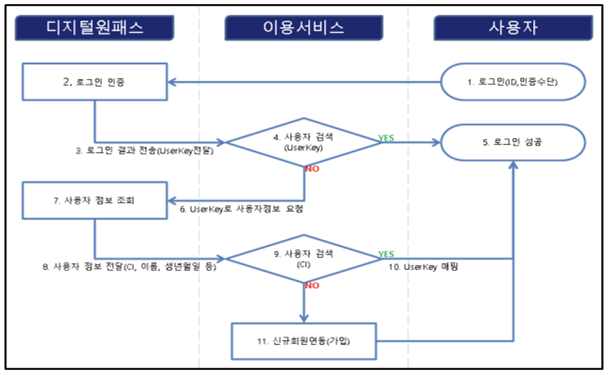
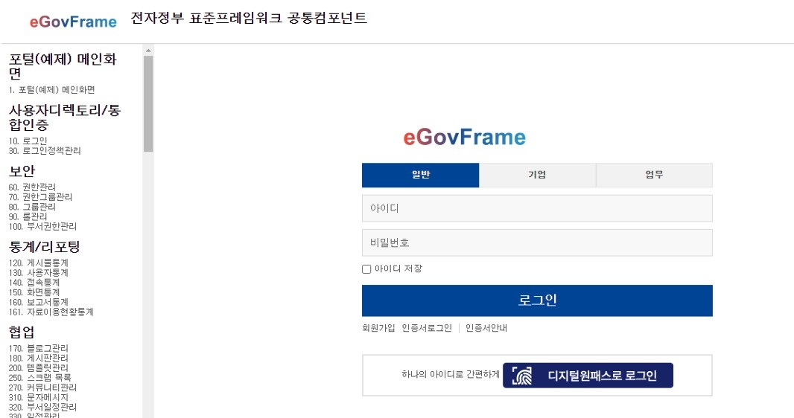
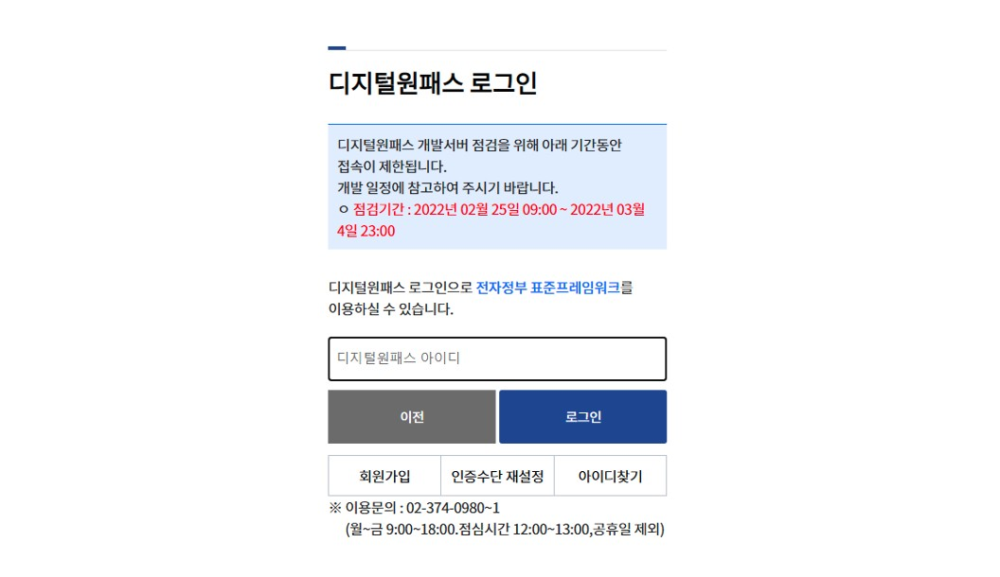
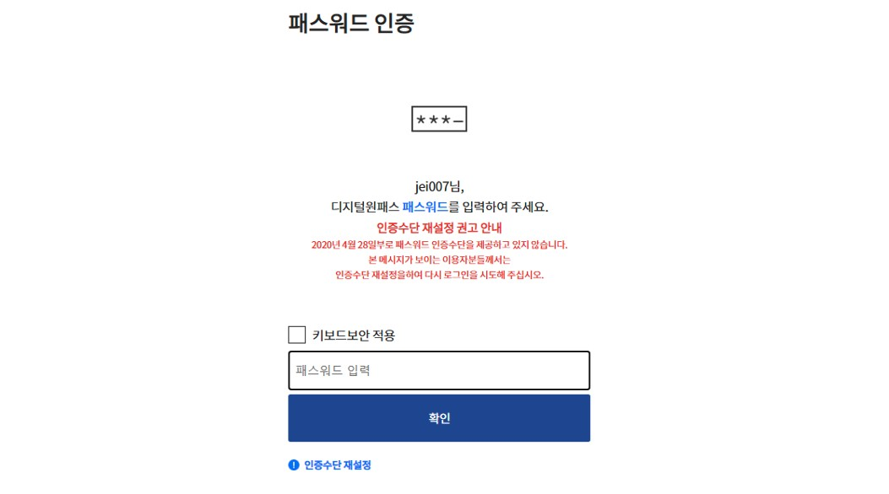

# 디지털원패스

## 개요

- 디지털원패스는 하나의 아이디로 본인이 선택한 인증수단을 사용하여 안전하고 편리하게 여러 전자정부 서비스를 이용할 수 있는 인증서비스이다.
- 전자정부 서비스 이용 시 웹사이트마다 아이디를 일일이 기억할 필요없이 하나의 디지털원패스 아이디를 통해 여러 전자정부 서비스를 이용할 수 있다.
- 디지털원패스는 모바일인증(지문/안면/공인인증서/간편번호(PIN)/패턴), 공인인증서, 문자(SMS)인증의 인증수단을 지원한다.
- 디지털원패스는 행정안전부(디지털안전정책과), 한국지역정보개발원(정보인증부)로 공문을 통해 신청 후 연계모듈을 제공받아야 한다.

- 디지털원패스 [홈페이지](https://www.onepass.go.kr/)
- 표준프레임워크는 연계모듈을 이용한 애플리케이션 개발에 활용할 수 있는 예제를 제공한다.

## 설명

### 관련소스

| 유형 | 대상소스명 | 비고 |
| --- | --- | --- |
| 연계용 환경설정 | onepass.properties | 디지털원패스 환경설정 파일 |
| 연계용 모듈 | egovframework/onepass/onepass.jks | 디지털원패스 SSL 인증서 키 체인 스토어(연계모듈에 포함) |
| 연계용 모듈 | egovframework/onepass/pubkey\_share.der | 디지털원패스 서명검증 파일(공개키)(연계모듈에 포함) |
| 연계용 모듈 | WEB-INF/lib/onepass-client-2.0.0.jar | 디지털원패스 라이브러리(연계모듈에 포함) |
| Controller | egovframework.com.uss.umt.onepass.web.EgovOnepassController.java | 디지털원패스 연동 처리 |
| Controller | egovframework.com.uss.umt.web.EgovMberManageController.java | 디지털원패스 연동해지 처리 |
| Controller | egovframework.com.uss.umt.web.EgovEntrprsManageController.java | 디지털원패스 연동해지 처리 |
| Service | egovframework.com.uss.umt.onepass.service.EgovOnepassService.java | 디지털원패스 연동 처리 |
| ServiceImpl | egovframework.com.uss.umt.onepass.serviceImpl.EgovOnepassServiceImpl.java | 디지털원패스 연동 처리 |
| DAO | egovframework.com.uss.umt.onepass.serviceImpl.EgovOnepassDAO.java | 디지털원패스 연동 처리 |
| Property | egovframework/message/com/uss/umt/onepass/message\_en.properties | 디지털원패스 메시지처리 |
| Property | egovframework/message/com/uss/umt/onepass/message\_ko.properties | 디지털원패스 메시지처리 |
| XML | egovframework/mapper/com/uat/uia/EgovOnepass\_SQL\_altibase.xml | 디지털원패스 인증 회원 조회 |
| XML | egovframework/mapper/com/uat/uia/EgovOnepass\_SQL\_cubrid.xml | 디지털원패스 인증 회원 조회 |
| XML | egovframework/mapper/com/uat/uia/EgovOnepass\_SQL\_maria.xml | 디지털원패스 인증 회원 조회 |
| XML | egovframework/mapper/com/uat/uia/EgovOnepass\_SQL\_mysql.xml | 디지털원패스 인증 회원 조회 |
| XML | egovframework/mapper/com/uat/uia/EgovOnepass\_SQL\_oracle.xml | 디지털원패스 인증 회원 조회 |
| XML | egovframework/mapper/com/uat/uia/EgovOnepass\_SQL\_tibero.xml | 디지털원패스 인증 회원 조회 |
| XML | egovframework/mapper/com/uat/uia/EgovOnepass\_SQL\_postgres.xml | 디지털원패스 인증 회원 조회 |
| XML | egovframework/mapper/com/uat/uia/EgovOnepass\_SQL\_goldilocks.xml | 디지털원패스 인증 회원 조회 |
| JSP | WEB-INF/jsp/egovframework/com/cmm/error/onepassAccessDenied.jsp | 디지털원패스 에러페이지 |
| JSP | WEB-INF/jsp/egovframework/com/uat/uia/EgovLoginUsr.jsp | 로그인 화면 |
| JSP | WEB-INF/jsp/egovframework/com/uss/umt/onepass/onepassLogin.jsp | 디지털원패스 로그인/로그아웃 모듈 |
| JSP | WEB-INF/jsp/egovframework/com/uss/umt/onepass/onepassResult.jsp | 디지털원패스 결과 메시지 출력 후 메인화면으로 이동 |
| JSP | WEB-INF/jsp/egovframework/com/uss/umt/EgovEntrprsMberSelectUpdt.jsp | 디지털원패스 연동해지 처리 |
| JSP | WEB-INF/jsp/egovframework/com/uss/umt/EgovMberSelectUpdt.jsp | 디지털원패스 연동해지 처리 |
| CSS | css/egovframework/com/com.css | 디지털원패스 에러페이지 css 추가 |
| Image | images/egovframework/com/uat/uia/onepass.png | 디지털원패스 로그인 이미지 |

### 환경설정

- 위키가이드의 [공통컴포넌트 시작하기](https://www.egovframe.go.kr/wiki/doku.php?id=egovframework:dev4.3:imp:editor:common_component)를 참고하여 공통컴포넌트를 설치한다.
- 디지털원패스 신청 후 받은 연계모듈 중 디지털원패스 SSL 인증서 키 체인 스토어(onepass.jks) 및 서명검증 파일(pubkey\_share.der)을 공통컴포넌트 프로젝트에 추가한다.

- 추가할 위치는 위의 관련소스 부분을 참고한다.
- onepass.properties 파일에 개발환경에 맞게 환경설정한다.

```properties
### 표준프레임워크 onepass.properties 예제 ###
# Site URL : 사이트의 URL
onepass.site.url=https://192.168.1.2:9443/egovframework-all-in-one/
# Site ID : 사이트의 ID(디지털원패스에서 발급)
onepass.site.id=**********
# AES secretKey(length:16) : AES 암호화 키(디지털원패스에서 발급)
aes.secretKey=**********
# PublicKey path(절대경로)
keys.public.path=C:eGovFrameDevworkspaceallinonesrcmainresourcesegovframeworkonepasspubkey_share.der
# SSL jks path(상대경로)
ssl.keystore=egovframework/onepass/onepass.jks
# ACS path : SAML로그인 요청 후 응답처리 경로(사이트의 로그인 처리를 위한 경로)
onepass.site.path.acs=/uat/uia/onepass/onepassCallback.do
# IDP URL : 디지털원패스 IDP URL
onepass.idp.url=https://saml.egaf2017.com
# Potal URL : API 서버 URL
onepass.potal.url=https://www.egaf2017.com
```

### 연계 구성

- 프로젝트의 로그인 화면에 디지털원패스 연동 버튼을 추가한 후 표준프레임워크의 예제를 참고하여 연동모듈을 구성한다.
- 디지털원패스를 이용한 연동 프로세스는 연계순서도를 통해 확인할 수 있다

 

## 관련 기능

### 사용자 인증 처리

#### 비즈니스 규칙

 디지털원패스 사용자 인증 화면으로 이동한다.

#### 관련코드

```java
@RequestMapping(value="/uat/uia/onepass/onepassLogin.do", method=RequestMethod.POST)
public String onepassLogin(HttpServletRequest request, HttpServletResponse response, ModelMap model) {
	String serviceType = request.getParameter("serviceType");
	String action = null;
	String inputName = null;
	String inputValue = null;
	String pageType = OnepassRequestHandler.pageType(request);
 
	try {
		if ("LOGIN".equals(serviceType)) {
			action = OnepassRequestHandler.LOGIN_DEST;
			inputName = OnepassRequestHandler.LOGIN_INPUT_NAME;
			inputValue = OnepassRequestHandler.login();
		} else if ("LOGOUT".equals(serviceType)) {
			action = OnepassRequestHandler.logoutDest(request);
			inputName = OnepassRequestHandler.LOGOUT_INPUT_NAME;
			inputValue = OnepassRequestHandler.logout(request);
		} else {
			action = request.getContextPath()+"/index.do";
			inputName = "";
			inputValue = "";
		}
	} catch (Exception e) {
		return "egovframework/com/cmm/error/onepassAccessDenied";
	}
 
	model.addAttribute("redirectUrl", action);
	model.addAttribute("inputName", inputName);
	model.addAttribute("inputValue", inputValue);
	model.addAttribute("pageType", pageType);
 
	return "egovframework/com/uat/uia/onepass/onepassLogin";
}
```

- 공통컴포넌트 디지털원패스 인증 버튼 예

 

- 디지털원패스 인증 연계 예1

 

- 디지털원패스 인증 연계 예2

 

### 인증 완료 후 응답 처리

#### 비즈니스 규칙

 디지털원패스 인증 완료 후 응답받는 callback 메소드로 인증된 사용자 정보를 처리한다.

#### 관련코드

```java
@RequestMapping(value="/uat/uia/onepass/onepassCallback.do", method=RequestMethod.POST)
public String onepassCallback(HttpServletRequest request, HttpServletResponse response, ModelMap model) throws Exception {
	// 인증체크
	OnepassResponse onepassResponse = OnepassResponseHandler.check(request);
 
	// 인증 성공
	if (onepassResponse.getStatus() == STATUS.SUCCESS  && onepassResponse.getResultCode() == RESULT_CODE.SUCCESS) {
 
		// type 이 LOGIN
		if (onepassResponse.getType() == TYPE.LOGIN) {
			String userKey = onepassResponse.getUserKey();
			String intfToken = onepassResponse.getIntfToken();
 
			// 인증 후 사용자 정보 조회
			ApiSendHandler apiSendHandler = new ApiSendHandler();
			OnepassUserResponse findOnepassUser = apiSendHandler.findUser(userKey, intfToken);
 
			// 사용자 정보 조회 성공
			if (findOnepassUser != null && findOnepassUser.getStatus() == USER_STATUS.USE) {
 
				// 디지털원패스 사용자 정보 - 신규회원일 경우 이 정보를 이용할 수 있음
				LOGGER.info("getId:{}", findOnepassUser.getId()); // 사용자의 ID (최대 30자)
				LOGGER.info("getName:{}", findOnepassUser.getName()); // 사용자의 이름 (최대 70자)
				LOGGER.info("getUserKey:{}", findOnepassUser.getUserKey()); // 사용자 유일값인 user key 가 전달된다. (최대 50자)
				LOGGER.info("getCi:{}", findOnepassUser.getCi()); // 사용자의 CI (최대 255자)
				LOGGER.info("getBirth:{}", findOnepassUser.getBirth()); // 사용자의 생년월일 (최대 8자)
				LOGGER.info("getPhone:{}", findOnepassUser.getPhone()); // 사용자의 휴대전화번호 (최대 14자)
				LOGGER.info("getEmail:{}", findOnepassUser.getEmail()); // 사용자의 E-mail (최대 70자)
				LOGGER.info("getSex:{}", findOnepassUser.getSex()); // 사용자의 성별 (남:M, 여:F)
				LOGGER.info("getNation:{}", findOnepassUser.getNation()); // 내외국인 구분(내국인:L, 외국인:F)
 
				// 기관 아이디 조회
				int usedCnt = egovOnepassService.onePassCheckIdDplct(findOnepassUser.getId());
 
				// 기관 아이디 조회 성공
				if (usedCnt > 0) {
					// 디지털원패스에서 받은 아이디로 회원정보 조회 후 세션 저장
					LoginVO resultVO = loginService.onepassLogin(findOnepassUser.getId());
					resultVO.setOnepassUserkey(userKey);
					resultVO.setOnepassIntfToken(intfToken);
					request.getSession().setAttribute("loginVO", resultVO);
 
					// 로그인 인증세션 추가
					request.getSession().setAttribute("accessUser", resultVO.getUserSe().concat(resultVO.getId()));
					model.addAttribute("resultMessage", egovMessageSource.getMessageArgs("digital.onepass.connect.success", new Object[]{resultVO.getId()}));
					model.addAttribute("redirectUrl", request.getContextPath()+"/index.do");
					return "egovframework/com/uat/uia/onepass/onepassResult";
				}
				// 기관 아이디 조회 실패
				else {
					model.addAttribute("resultMessage", egovMessageSource.getMessage("digital.onepass.connect.join.failure"));
					model.addAttribute("redirectUrl", request.getContextPath()+"/index.do");
					return "egovframework/com/uat/uia/onepass/onepassResult";
				}
			}
			// 사용자 정보 조회 실패
			else {
				model.addAttribute("resultMessage", egovMessageSource.getMessage("digital.onepass.connect.user.infomation.failure"));
				model.addAttribute("redirectUrl", request.getContextPath()+"/index.do");
				return "egovframework/com/uat/uia/onepass/onepassResult";
			}
		}
		// type 이 LOGIN 이 아님
		else {
			model.addAttribute("resultMessage", egovMessageSource.getMessage("digital.onepass.connect.athentication.failure"));
			model.addAttribute("redirectUrl", request.getContextPath()+"/index.do");
			return "egovframework/com/uat/uia/onepass/onepassResult";
		}
	}
	// 인증 실패
	else {
		model.addAttribute("resultMessage", egovMessageSource.getMessage("digital.onepass.connect.athentication.failure"));
		model.addAttribute("redirectUrl", request.getContextPath()+"/index.do");
		return "egovframework/com/uat/uia/onepass/onepassResult";
	}
}
```

### 연동 해제

#### 비즈니스 규칙

 디지털원패스와의 연동을 해제한다.

#### 관련코드

```java
@RequestMapping(value="/uat/uia/onepass/onepassCancel.do", method=RequestMethod.POST)
public String onepassCancel(HttpServletRequest request, HttpServletResponse response, ModelMap model) throws Exception {
	ApiSendHandler apiSendHandler = new ApiSendHandler();
	String userKey = request.getParameter("userKey");
	String intfToken = request.getParameter("intfToken");
 
	OnepassUserResponse onepassUser = apiSendHandler.InterLockRelease(userKey, intfToken);
 
	if (Objects.isNull(onepassUser)) {
		onepassUser = new OnepassUserResponse();
		model.addAttribute("resultMessage", egovMessageSource.getMessage("digital.onepass.connect.athentication.failure"));
		model.addAttribute("redirectUrl", request.getContextPath()+"/uat/uia/actionLogout.do");
		return "egovframework/com/uat/uia/onepass/onepassResult";
	} else {
		if (onepassUser.getProcess_result() == PROCESS_RESULT.SUCESS) {
			model.addAttribute("resultMessage", egovMessageSource.getMessage("digital.onepass.disconnect.success"));
			model.addAttribute("redirectUrl", request.getContextPath()+"/uat/uia/actionLogout.do");
			return "egovframework/com/uat/uia/onepass/onepassResult";
		} else {
			model.addAttribute("resultMessage", egovMessageSource.getMessage("digital.onepass.connect.user.infomation.failure"));
			model.addAttribute("redirectUrl", request.getContextPath()+"/uat/uia/actionLogout.do");
			return "egovframework/com/uat/uia/onepass/onepassResult";
		}
	}
}
```