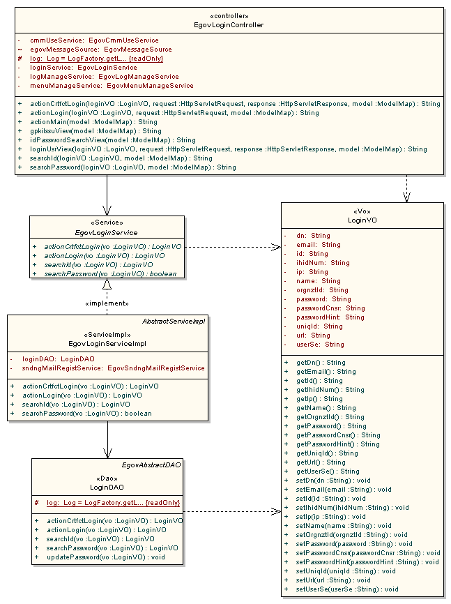

# 아이디/비밀번호 찾기 서비스

## 개요

 사용자의 분류(일반 회원, 기업 회원, 업무 사용자) 공통으로 적용시킬 수 있는 아이디와 비밀번호를 찾기 조건을 도출하여 기능을 제공한다.
 아이디 찾기 : 이름, 이메일주소
 비밀번호 찾기 : 아이디, 이름, 이메일주소, 비밀번호힌트, 비밀번호정답

#### 기능흐름

| 기능명 | 기능 흐름 |
| --- | --- |
| 아이디 찾기 | 찾기조건 입력 → 아이디찾기 요청 → 조건에 맞는 사용자 조회 → 아이디 조회 |
| 비밀번호 찾기 | 찾기조건 입력 → 비밀번호찾기 요청 → 조건에 맞는 사용자 조회 → 임시비밀번호생성 → 임시비밀번호저장 → 임시비밀번호메일발송 → 발송완료메시지 조회 |

## 설명

 일반적으로 아이디는 특정 조건으로 바로 확인이 가능하나, 비밀번호는 보편적으로 복호화될 수 없는 암호화 알고리즘으로 인코딩되어 데이터베이스에 저장되는 형태로 구성한다. 때문에 암호화된 비밀번호를 다시 사용하지 못하므로 임시 비밀번호를 생성하고 이를 인코딩한 데이터를 데이터베이스에 저장한 뒤 이메일로 임시 비밀번호를 발송하는 형태를 갖는다. 본 아이디/비밀번호 찾기 서비스에서도 이와같은 방식으로 처리하도록 기능을 제시한다.

#### 관련소스

| 유형 | 대상소스명 | 비고 |
| --- | --- | --- |
| Controller | egovframework.com.uat.uia.web.EgovLoginController.java | 로그인을 위한 컨트롤러 클래스 |
| Service | egovframework.com.uat.uia.service.EgovLoginService.java | 로그인을 위한 서비스 인터페이스 |
| Service | egovframework.com.cop.ems.service.EgovSndngMailRegistService.java | 임시메일발송을 위한 서비스 인터페이스 |
| Service | egovframework.com.utl.sim.service.EgovFileScrty.java | 암호화를 위한 요소기술 클래스 |
| Service | egovframework.com.utl.fcc.service.EgovStringUtil.java | 임의 문자 생성을 위한 요소기술 클래스 |
| Service | egovframework.com.utl.fcc.service.EgovNumberUtil.java | 임의 숫자 생성을 위한 요소기술 클래스 |
| ServiceImpl | egovframework.com.uat.uia.service.impl.EgovLoginServiceImpl.java | 로그인을 위한 서비스 구현 클래스 |
| VO | egovframework.com.cmm.LoginVO.java | 로그인을 위한 VO 클래스 |
| DAO | egovframework.com.uat.uia.service.impl.LoginDAO.java | 로그인을 위한 데이터 처리 클래스 |
| Query XML | resources/egovframework/mapper/com/uat/uia/EgovLoginUsr_SQL_[DB].xml | 로그인을 위한 Query XML |
| JSP | WEB_INF/jsp/egovframework/cmm/uat/uia/EgovIdPasswordSearch.jsp | 아이디/비밀번호찾기 페이지 |

#### 클래스 다이어그램

 

#### 관련테이블

| 테이블명 | 테이블명(영문) | 비고 |
| --- | --- | --- |
| 업무사용자 | COMTNEMPLYRINFO | 업무사용자 정보를 관리 |
| 기업회원 | COMTNENTRPRSMBER | 기업회원 정보를 관리 |
| 일반회원 | COMTNGNRLMBER | 일반회원 정보를 관리 |
| 발송메일 | COMTHEMAILDSPTCHMANAGE | 발송메일 정보를 관리 |

## 관련화면 및 수행매뉴얼

#### 아이디 찾기

| Action | URL | Controller method | QueryID |
| --- | --- | --- | --- |
| 아이디조회 | /uat/uia/searchId.do | searchId | loginDAO.searchId |

 업무구분, 이름, 이메일주소 정보를 가지고 사용자 아이디를 조회한다.

#### 비밀번호 찾기

| Action | URL | Controller method | QueryID |
| --- | --- | --- | --- |
| 비밀번호조회 | /uat/uia/searchPassword.do | searchPassword | loginDAO.searchPassword |
| 비밀번호힌트조회 | /uat/uia/egovIdPasswordSearch.do | idPasswordSearchView |  |

 아이디, 이름, 이메일, 비밀번호 힌트, 비밀번호 정답 정보를 갖고 사용자 정보를 조회하고 임시 비밀번호를 메일 발송한다.

 
 1. 아이디 찾기
 업무구분 선택: 사용자 업무구분을 선택한다.
 이름 입력: 이름을 입력한다.
 이메일 입력: 이메일을 입력한다.
 아이디 찾기: 업무구분, 이름, 이메일 정보를 통해 사용자 아이디를 조회한다.
 2. 비밀번호 찾기
 업무구분 선택: 사용자 업무구분을 선택한다.
 아이디 입력: 아이디를 입력한다.
 이름 입력: 이름을 입력한다.
 이메일 입력: 이메일을 입력한다.
 비밀번호힌트 선택: 회원가입시 등록한 비밀번호 힌트를 선택한다.
 비밀번호정답 입력: 비밀번호힌트에 대한 정답을 입력한다.
 비밀번호 찾기: 업무구분, 아이디, 이름, 이메일, 비밀번호 힌트, 비밀번호 정답을 통해 사용자 임시 비밀번호를 생성하고 메일 발송한다.

## 참고자료

 비밀번호 메일 발송: 전자우편연계
