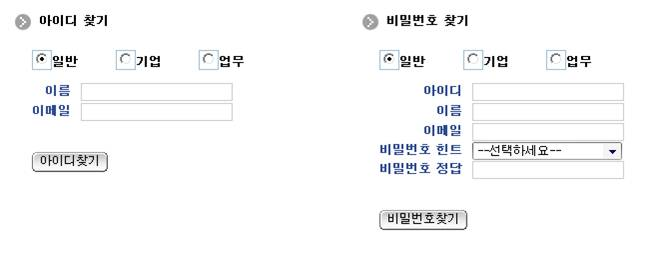

# 아이디 찾기

## 비즈니스 규칙

 일반 회원, 기업 회원, 업무담당자 세 개의 사용자 구분에 따라 이름, 이메일 정보를 갖고 아이디를 찾기 처리할 수 있다.

## 관련코드

### jsp

```html
 
1. 사용자 업무구분
<tr>
  <td><input name="rdoSlctUsr" type=radio value=radio checked onClick="fnCheckUsrId('GNR');">일반</td>
  <td><input name="rdoSlctUsr" type=radio value=radio unchecked onClick="fnCheckUsrId('ENT');">기업</td>
  <td><input name="rdoSlctUsr" type=radio value=radio unchecked onClick="fnCheckUsrId('USR');">업무</td>
</tr>
 
2. 아이디를 찾기위한 조건 : 이름, 이메일주소
<tr>
  <td class="required_text" nowrap>이름&nbsp;&nbsp;</td>
  <td><input type="text" name="name"/></td>
</tr>
<tr>
  <td class="required_text" nowrap>이메일&nbsp;&nbsp;</td>
  <td><input type="text" name="email"/></td>
</tr>
```text

### controller

```java
// 1. 아이디 찾기
LoginVO resultVO = loginService.searchId(loginVO);
 
if (resultVO != null && resultVO.getId() != null && !resultVO.getId().equals("")) {
	model.addAttribute("resultInfo", "아이디는 " + resultVO.getId() + " 입니다.");
	return "cmm/uat/uia/EgovIdPasswordResult";
} else {
	model.addAttribute("resultInfo", egovMessageSource.getMessage("fail.common.idsearch"));
	return "cmm/uat/uia/EgovIdPasswordResult";
}
```

 입력한 이름과 이메일을 가지고 사용자 테이블에서 아이디를 조회한다.

## 관련화면 및 수행매뉴얼

### 1. 아이디 찾기

| Action | URL | Controller method | QueryID |
| --- | --- | --- | --- |
| 아이디조회 | /uat/uia/searchId.do | searchId | loginDAO.searchId |

 업무구분, 이름, 이메일주소 정보를 가지고 사용자 아이디를 조회한다.

 
 업무구분 선택: 사용자 업무구분을 선택한다.
 이름 입력: 이름을 입력한다.
 이메일 입력: 이메일을 입력한다.
 아이디 찾기: 업무구분, 이름, 이메일 정보를 통해 사용자 아이디를 조회한다.
