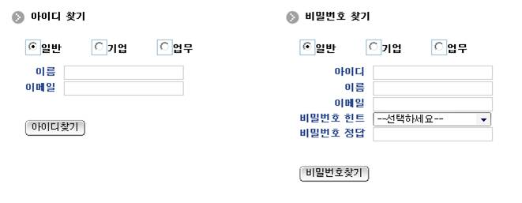

# 비밀번호 찾기

## 비즈니스 규칙

 일반 회원, 기업 회원, 업무담당자 세 개의 사용자 구분에 따라 아이디, 이름, 이메일, 비밀번호 힌트, 비밀번호 정답 정보를 갖고 임시 비밀번호를 메일발송 처리할 수 있다.
 다섯 개 조건이 모두 일치하고 상태가 정상(`P`)인 사용자만 처리 대상이 되며, 조건에 맞는 사용자가 없으면 실패 메시지를 출력한다.
 사용자 구분별 조회 대상 테이블은 [아이디 찾기](./find-id.md)와 동일하다.

## 관련코드

### 요청 VO

 비밀번호 찾기 입력값은 `SearchPasswordRequestVO`로 전달되며, 필수 입력과 이메일 형식은 Bean Validation 어노테이션으로 검증한다.

```java
// egovframework.com.cmm.SearchPasswordRequestVO
public class SearchPasswordRequestVO extends BaseRequestVO {

    /** 아이디 */
    @EgovNullCheck
    private String id;

    /** 이름 */
    @EgovNullCheck
    private String name;

    /** 이메일주소 */
    @EgovNullCheck
    @EgovEmailCheck
    private String email;

    /** 비밀번호 힌트 */
    @EgovNullCheck
    private String passwordHint;

    /** 비밀번호 정답 */
    @EgovNullCheck
    private String passwordCnsr;
}
```

### jsp

```html
<!-- 1. 사용자 업무구분 : 탭 선택 시 hidden 필드 userSe 값이 변경된다. -->
<form:form name="passwordForm" modelAttribute="searchPasswordRequestVO"
           action="${pageContext.request.contextPath}/uat/uia/searchPassword.do" method="post">
<div class="login_type">
  <ul>
    <li><a id="pwGnr" onClick="fnCheckUsrPassword('GNR');" class="on">일반</a></li>
    <li><a id="pwEnt" onClick="fnCheckUsrPassword('ENT');">기업</a></li>
    <li><a id="pwUsr" onClick="fnCheckUsrPassword('USR');">업무</a></li>
  </ul>
</div>

<!-- 2. 비밀번호 힌트 공통코드를 조회하여 콤보박스 형태로 선택 -->
<select name="passwordHint">
  <option selected value=''>--선택하세요--</option>
  <c:forEach var="result" items="${pwhtCdList}" varStatus="status">
  <option value='<c:out value="${result.code}"/>'><c:out value="${result.codeNm}"/></option>
  </c:forEach>
</select>

<input name="userSe" type="hidden" value="GNR">
</form:form>
```

 아이디·이름·이메일·비밀번호 정답 입력항목과 서버측 검증 오류 메시지 출력 방식은 [아이디 찾기](./find-id.md)와 동일하며,
 오류 메시지는 `searchPasswordRequestVO`의 `BindingResult`에서 조회한다.

### controller

```java
// egovframework.com.uat.uia.web.EgovLoginController

// 1. 비밀번호 힌트 공통코드 조회 (idPasswordSearchView)
ComDefaultCodeVO vo = new ComDefaultCodeVO();
vo.setCodeId("COM022");
List<CmmnDetailCode> code = cmmUseService.selectCmmCodeDetail(vo);
model.addAttribute("pwhtCdList", code);

// 2. 비밀번호 찾기 (searchPassword)
//    @Valid 검증 통과 후 SearchPasswordRequestVO의 값을 LoginVO로 복사하여 호출한다.
boolean result = loginService.searchPassword(loginVO);

if (result) {
    model.addAttribute("resultInfo", "임시 비밀번호를 발송하였습니다.");
    return "egovframework/com/uat/uia/EgovIdPasswordResult";
} else {
    model.addAttribute("resultInfo", egovMessageSource.getMessage("fail.common.pwsearch"));
    return "egovframework/com/uat/uia/EgovIdPasswordResult";
}
```

 컨트롤러 클래스에서 비밀번호 힌트 공통코드(`COM022`) 목록을 조회하여 화면에 보여준다.
 입력받은 아이디, 이름, 이메일, 비밀번호 힌트, 비밀번호 정답 정보를 갖고 임시 비밀번호를 메일 발송한다.
 이름과 비밀번호 정답은 공백을 제거한 뒤 조회 조건으로 사용한다.

### service

```java
// egovframework.com.uat.uia.service.impl.EgovLoginServiceImpl

// 1. 아이디, 이름, 이메일주소, 비밀번호 힌트, 비밀번호 정답이 DB와 일치하는 사용자 Password를 조회한다.
LoginVO loginVO = loginDAO.searchPassword(vo);
if (loginVO == null || loginVO.getPassword() == null || "".equals(loginVO.getPassword())) {
    return false;
}

// 2. 임시 비밀번호를 생성한다.(영+영+숫+영+영+숫+영+영=8자리)
String newpassword = "";
for (int i = 1; i <= 8; i++) {
    // 영자
    if (i % 3 != 0) {
        newpassword += EgovStringUtil.getRandomStr('a', 'z');
    // 숫자
    } else {
        newpassword += EgovNumberUtil.getRandomNum(0, 9);
    }
}

// 3. 임시 비밀번호를 암호화하여 DB에 저장한다.
LoginVO pwVO = new LoginVO();
String enpassword = EgovFileScrty.encryptPassword(newpassword, vo.getId());
pwVO.setId(vo.getId());
pwVO.setPassword(enpassword);
pwVO.setUserSe(vo.getUserSe());
loginDAO.updatePassword(pwVO);

// 4. 임시 비밀번호를 이메일 발송한다.(메일연동솔루션 활용)
SndngMailVO sndngMailVO = new SndngMailVO();
sndngMailVO.setDsptchPerson("webmaster");
sndngMailVO.setRecptnPerson(vo.getEmail());
sndngMailVO.setSj("[MOIS] 임시 비밀번호를 발송했습니다.");
sndngMailVO.setEmailCn("고객님의 임시 비밀번호는 " + newpassword + " 입니다.");
sndngMailVO.setAtchFileId("");

result = sndngMailRegistService.insertSndngMail(sndngMailVO);
```

 서비스 구현 클래스에서 입력받은 아이디, 이름, 이메일, 비밀번호 힌트, 비밀번호 정답 정보를 갖고 사용자 정보를 조회한다.
 조회 결과가 없으면 `false`를 반환하여 실패 메시지를 출력한다.
 영어, 숫자 혼용 8자리 임시 비밀번호를 생성한 뒤 아이디를 salt로 사용하여 암호화하고, 데이터베이스에 비밀번호를 수정한다.
 이때 비밀번호 최종변경시점(`CHG_PWD_LAST_PNTTM`)도 함께 갱신된다.
 임시 비밀번호는 요소기술 중 발송요청메일 등록 기능(`EgovSndngMailRegistService.insertSndngMail()`)을 사용하여 전송하며,
 메일 발송 등록 성공 여부가 그대로 처리 결과로 반환된다.
 비밀번호 이메일 발송은 전자우편연계 기능을 참조한다.

## 관련화면 및 수행매뉴얼

### 2. 비밀번호 찾기

| Action | URL | Controller method | QueryID |
| --- | --- | --- | --- |
| 비밀번호조회 | /uat/uia/searchPassword.do | searchPassword | LoginUsr.searchPassword |
| 비밀번호힌트조회 | /uat/uia/egovIdPasswordSearch.do | idPasswordSearchView |  |

 아이디, 이름, 이메일, 비밀번호 힌트, 비밀번호 정답 정보를 갖고 사용자 정보를 조회하고 임시 비밀번호를 메일 발송한다.

 
 업무구분 선택: 사용자 업무구분을 선택한다.
 아이디 입력: 아이디를 입력한다.
 이름 입력: 이름을 입력한다.
 이메일 입력: 이메일을 입력한다.
 비밀번호힌트 선택: 회원가입시 등록한 비밀번호 힌트를 선택한다.
 비밀번호정답 입력: 비밀번호힌트에 대한 정답을 입력한다.
 비밀번호 찾기: 업무구분, 아이디, 이름, 이메일, 비밀번호 힌트, 비밀번호 정답을 통해 사용자 임시 비밀번호를 생성하고 메일 발송한다.
