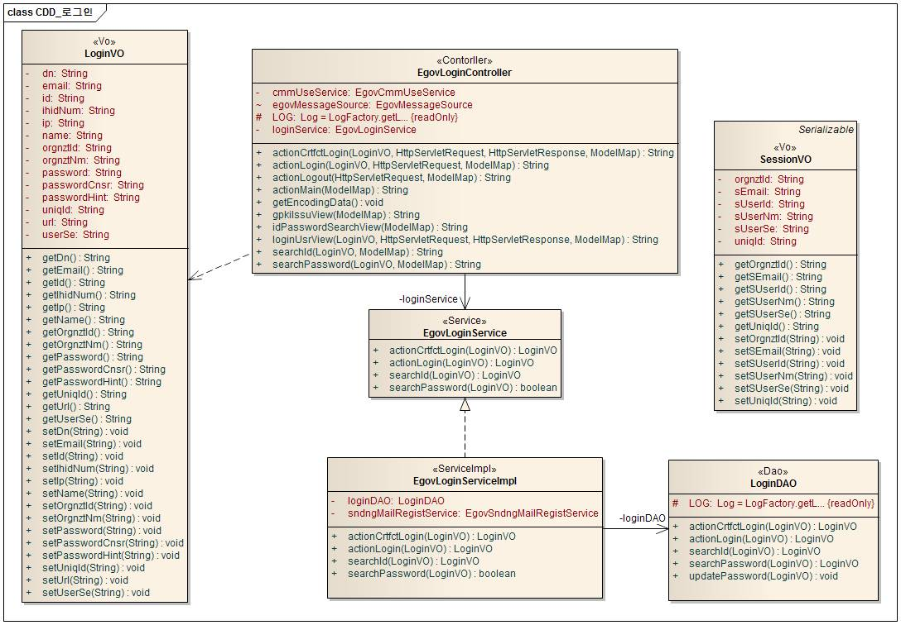
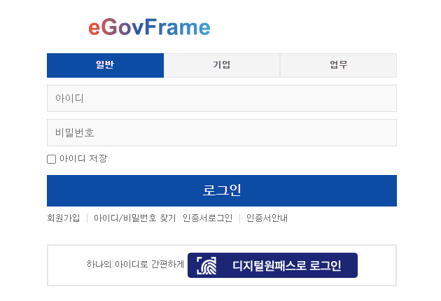

# 일반 로그인 서비스

## 개요

 로그인 방식은 가입시 작성한 아이디와 비밀번호를 통한 로그인(이하 일반로그인)이다. 일반로그인은 사용자의 분류(일반 회원, 기업 회원, 업무 사용자)에 따라 접속하는 화면이 다르게 구성되어 있다.

- 기능흐름

| 기능명      | 기능 흐름                                                                                                                                                                                                               |
| ----------- | ----------------------------------------------------------------------------------------------------------------------------------------------------------------------------------------------------------------------- |
| 일반 로그인 | 아이디/비밀번호 입력 → 로그인 요청 →*****권한조회*****  → *****세션설정*****  → *****로그인로그 생성*****  → *****권한별 메뉴설정*****  → 권한별 화면로딩 |

- 로그인 컴포넌트 사용시 보안 고려사항

 제공되는 로그인 컴포넌트는 구간 암호화(Browser와 서버 사이의 암호화)를 제공하지 않는다.(이는 서버 측 컴포넌트이므로 구간 암호화를 제공할 수 없다.) 이를 위해서는 공통 컴포넌트를 이용하여 구현할 때 별도의 구간 암호화 솔루션을 도입하거나 로그인 요청에 대하여 SSL을 적용하는 방식으로 로그인 정보의 보안을 유지할 것을 권장한다.

## 설명

 시스템 사용자의 접근을 허락하고 보안상의 목적으로, 시스템 또는 응용프로그램에 접속을 시도하는 사용자에 대한 정보의 확보를 지원하기 위한 서비스 컴포넌트로, 로그인한 사용자의 로그인 정보(사용자ID/패스워드)를 입력받아 기존에 저장된 사용자 정보를 조회하여 사용자의 인증을 처리하는 방식이다.

### 패키지 참조 관계

 로그인 패키지는 요소기술의 공통(cmm) 패키지에 대해서만 직접적인 함수적 참조 관계를 가진다. 하지만, 컴포넌트 배포 시 오류 없이 실행되기 위하여 패키지 간의 참조관계에 따라 패키지와 포맷/날짜/계산, 메일연동 인터페이스, 시스템 패키지와 함께 배포 파일을 구성한다.

- 패키지 간 참조 관계 : [사용자디렉토리/통합인증 Package Dependency](https://www.egovframe.go.kr/wiki/doku.php?id=egovframework:com:v2:init_pkg_dependency#사용자디렉토리_통합인증)

### 관련소스

| 유형               | 대상소스명                                                                   | 비고                                              |
| ------------------ | ---------------------------------------------------------------------------- | ------------------------------------------------- |
| Controller         | egovframework.com.uat.uia.web.EgovLoginController.java                       | 일반 로그인을 처리하는 컨트롤러 클래스            |
| Service            | egovframework.com.uat.uia.service.EgovLoginService.java                      | 일반 로그인을 처리하는 비즈니스 인터페이스 클래스 |
| ServiceImpl        | egovframework.com.uat.uia.service.impl.EgovLoginServiceImpl.java             | 일반 로그인을 처리하는 비즈니스 구현 클래스       |
| VO                 | egovframework.com.cmm.SessionVO.java                                         | 세션을 위한 VO 클래스                             |
| VO                 | egovframework.com.cmm.LoginVO.java                                           | 로그인을 위한 VO 클래스                           |
| DAO                | egovframework.com.uat.uia.service.impl.LoginDAO.java                         | 일반 로그인을 처리하는 DAO 클래스                 |
| JSP                | WEB\_INF/jsp/egovframework/com/uat/uia/EgovLoginUsr.jsp                      | Login 인증 JSP 페이지                             |
| JSP                | WEB\_INF/jsp/egovframework/com/uat/uia/EgovIdPasswordSearch.jsp              | 아이디/비밀번호 찾기를 위한 JSP 페이지            |
| JSP                | WEB\_INF/jsp/egovframework/com/uat/uia/EgovIdPasswordResult.jsp              | 아이디/비밀번호 찾기 결과 JSP 페이지              |
| Query XML          | resources/egovframework/mapper/com/uat/uia/EgovLoginUsr\_SQL\_mysql.xml      | 일반 로그인을위한 MySQL용 Query XML               |
| Query XML          | resources/egovframework/mapper/com/uat/uia/EgovLoginUsr\_SQL\_oracle.xml     | 일반 로그인을 위한 Oracle용 Query XML             |
| Query XML          | resources/egovframework/mapper/com/uat/uia/EgovLoginUsr\_SQL\_tibero.xml     | 일반 로그인을 위한 Tibero용 Query XML             |
| Query XML          | resources/egovframework/mapper/com/uat/uia/EgovLoginUsr\_SQL\_altibase.xml   | 일반 로그인을 위한 Altibase용 Query XML           |
| Query XML          | resources/egovframework/mapper/com/uat/uia/EgovLoginUsr\_SQL\_cubrid.xml     | 일반 로그인을 위한 Cubrid용 Query XML             |
| Query XML          | resources/egovframework/mapper/com/uat/uia/EgovLoginUsr\_SQL\_maria.xml      | 일반 로그인을 위한 Maria용 Query XML              |
| Query XML          | resources/egovframework/mapper/com/uat/uia/EgovLoginUsr\_SQL\_postgres.xml   | 일반 로그인을 위한 Postgres용 Query XML           |
| Query XML          | resources/egovframework/mapper/com/uat/uia/EgovLoginUsr\_SQL\_goldilocks.xml | 일반 로그인을 위한 Goldilocks용 Query XML         |
| Message properties | resources/egovframework/message/com/message-common\_ko.properties            | 일반 로그인을 위한 Message properties(한글)       |
| Message properties | resources/egovframework/message/com/message-common\_en.properties            | 일반 로그인을 위한 Message properties(영문)       |

### 클래스다이어그램

 

### 관련테이블

| 테이블명   | 테이블명(영문)   | 비고                                                                                                                                                                                     |
| ---------- | ---------------- | ---------------------------------------------------------------------------------------------------------------------------------------------------------------------------------------- |
| 일반회원   | COMTNGNRLMBER    | 일반회원 정보를 관리한다. <br> 주민등록번호(IHIDNUM) 컬럼이 존재하나 데이터 저장 및 조회 로직에서는 제외되어 있으므로 <br> 필요시 **암호화**하여 구현해야 함                |
| 기업회원   | COMTNENTRPRSMBER | 기업회원 정보를 관리한다. <br> 신청인주민등록번호(APPLCNT_IHIDNUM) 컬럼이 존재하나 데이터 저장 및 조회 로직에서는 제외되어 있으므로, <br> 필요시 **암호화**하여 구현해야 함 |
| 업무사용자 | COMTNEMPLYRINFO  | 업무사용자 정보를 관리한다.                                                                                                                                                              |

### 환경설정

 일반로그인 기능의 구현 방식에는 세션을 이용한 인증방식과 스프링 시큐리티 프레임워크를 이용한 인증 두가지 방식이 존재한다. 이에 대한 설정은 context-egovuserdetailshelper.xml과 web.xml파일의 수정을 통해 변경할 수 있으며 로그인 후 이동할 페이지에 대한 설정은 globals.properties 파일의 설정을 통해 수정할 수 있다.

#### 로그인 성공 후 이동 페이지 설정

 로그인이 성공적으로 수행되었을 경우 이후 이동할 페이지에 대한 설정은 globals.properties 파일의 `lobals.MainPage` 프러퍼티 값을 통해 설정할수 있다. 아래와 같이 설정할 수 있으며 사용자가 로그인에 성공한 경우 /EgovContent.do 페이지로 이동하게 된다.

```bash
# MainPage Setting
Globals.MainPage = /EgovContent.do
```

#### 세션방식 설정

1) context-egovuserdetailshelper.xml 수정 : 아래와 같이 `egovUserDetailsSessionService`빈 설정의 주석을 해제한 후 `egovUserDetailsHelper` 빈의 `egovUserDetailsService` 프러퍼티에 `egovUserDetailsSessionService`빈을 등록하면 된다.
   \- beans의 profile속성은 Spring f/w ver 3.1부터 추가되었으며, Spring Container에서 bean적용이 달리 적용되도록 하는데 쓰인다.
   Bean Definition Profiles - [bean_definition_profiles](https://www.egovframe.go.kr/wiki/doku.php?id=egovframework:rte2:fdl:ioc_container:bean_definition_profiles)
   \- 그리고 globals.properties에서 `Globals.Auth = session` 이나 `Globals.Auth = security` 를 통해서 사용자의 로그인시 인증방식을 세션방식 또는 Spring security 방식으로 결정할 수 있다.
   Server Security 설정 간소화 - [xmlschema](https://www.egovframe.go.kr/wiki/doku.php?id=egovframework:rte3:fdl:server_security:xmlschema)

```xml
<beans profile="session">  
	<!--인증된 유저의 LoginVO, 권한, 인증 여부를 확인 할 수있는 서비스 클래스-->
	<bean id="egovUserDetailsHelper" class="egovframework.com.cmm.util.EgovUserDetailsHelper">
            <property name="egovUserDetailsService">
        	<!-- 원하는 bean id를 아래에 ref 태그에 적용한다 -->
                <ref bean="egovUserDetailsSessionService" />
            </property>
        </bean>
 
        <!-- 세션을 이용한 인증을 사용하는 빈 -->
        <bean id="egovUserDetailsSessionService" class="egovframework.com.cmm.service.impl.EgovUserDetailsSessionServiceImpl"/>
</beans>
```

 세션방식은 controller에서 아래와 같은 코드를 추가함으로써 접근제어를 할 수 있다.

```bash
	model.addAttribute("message", egovMessageSource.getMessage("fail.common.login"));
	return "egovframework/com/uat/uia/EgovLoginUsr";
```

2) web.xml 수정 : 수정사항 없이 디폴트 설정대로 사용하면 된다.(아래의 스프링 시큐리티 관련 설정이 모두 주석이 되어 있는 상태)

#### 스프링 시큐리티 프레임워크를 이용하는 설정

 스프링 시큐리티관련 설정이 반드시 포함되어야 한다. **context-security.xml** 파일은 src/main/resources/egovframework/spring/com 폴더 아래 위치해야 한다.

1) context-egovuserdetailshelper.xml 수정 : 아래와 같이 `egovUserDetailsSecurityService` 빈 설정의 주석을 해제한 후 `egovUserDetailsHelper` 빈의 `egovUserDetailsService` 프러퍼티에 `egovUserDetailsSecurityService` 빈을 등록하면 된다.

```xml
<beans profile="security">  
	<!--인증된 유저의 LoginVO, 권한, 인증 여부를 확인 할 수있는 서비스 클래스-->
	<bean id="egovUserDetailsHelper" class="egovframework.com.cmm.util.EgovUserDetailsHelper">
            <property name="egovUserDetailsService">
        	<!-- 원하는 bean id를 아래에 ref 태그에 적용한다 -->
                <ref bean="egovUserDetailsSecurityService" />
            </property>
        </bean>
        <!-- 2. 스프링 시큐리티를 이용한 인증을 사용할 빈 -->
        <bean id="egovUserDetailsSecurityService" class="egovframework.com.sec.ram.service.impl.EgovUserDetailsSecurityServiceImpl"/>
</beans>
```

2) web.xml 수정 : 아래 설정 부분의 주석을 해제 하면 된다. `EgovSpringSecurityLoginFilter` 필터의 경우 로그인 인증이 실패할 경우 사용자에게 되돌려지 화면을 파라미터로 입력받고 있다. `loginURL` 파라미터값에 로그인 실패시에 리턴될 url경로를 입력하면 된다.

### 인증방식 변경 및 확장

 세션 및 스프링 시큐리티 이외의 방식을 사용해서 인증방식을 사용하려는 경우 `EgovUserDetailsService` 인터페이스를 구현해서 사용할 수 있다.

```java
package egovframework.com.cmm.service;
 
public interface EgovUserDetailsService {
 
	/**
	 * 인증된 사용자객체를 VO형식으로 가져온다.
	 * @return Object - 사용자 ValueObject
	 */
	public Object getAuthenticatedUser();
 
	/**
	 * 인증된 사용자의 권한 정보를 가져온다.
	 * 예) [ROLE_ADMIN, ROLE_USER, ROLE_A, ROLE_B, ROLE_RESTRICTED, IS_AUTHENTICATED_FULLY, IS_AUTHENTICATED_REMEMBERED, IS_AUTHENTICATED_ANONYMOUSLY]
	 * @return List - 사용자 권한정보 목록
	 */
	public List<String> getAuthorities();
 
	/**
	 * 인증된 사용자 여부를 체크한다.
	 * @return Boolean - 인증된 사용자 여부(TRUE / FALSE)
	 */
	public [Boolean](http://www.google.com/search?hl=en&q=allinurl%3Aboolean+java.sun.com&btnI=I%27m%20Feeling%20Lucky) isAuthenticated(); 
 
}
```

 `EgovUserDetailsService` 구현 클래스를 적용하기 위해서는 먼저 `EgovUserDetailsService` 구현 클래스를 빈으로 등록 시킨후 `egovUserDetailsHelper` 빈 설정시에 `egovUserDetailsService` 프러퍼티 값에 `EgovUserDetailsService` 구현 클래스를 매핑해야 한다.

### 세션을 이용한 인증 구현 예

 `getAuthenticatedUser()` 메서드는 인증된 사용자 정보를 가지고 있는 VO 객체를 반환한다. 공통컴포넌트에서는 모든 사용자 정보를 `egovframework.com.cmm.LoginVO` 클래스를 이용해서 활용 하므로 `egovframework.com.cmm.LoginVO` 객체를 반환하도록 메서드를 구현하면 된다. 아래의 예제는 스프링 프레임워크를 활용하여 세션에서 loginVO 객체를 얻어 반환하는 예제이다.

```java
public Object getAuthenticatedUser() {
 
      return RequestContextHolder.getRequestAttributes().getAttribute("loginVO", RequestAttributes.SCOPE_SESSION);
 
}
```

 `getAuthorities()` 메서드는 사용자가 가지고 있는 권한을 List 객체에 담아 반환한다. 권한 관리 패키지에서 사용할 수 있는 권한 정보를 List에 담아 반환하면 되며 아래의 예제는 임의적으로 권한 정보를 List에 넣어 반환하고 있다.

```java
public List<String> getAuthorities() {
 
	List<String> listAuth = new ArrayList<String>();
	listAuth.add("IS_AUTHENTICATED_ANONYMOUSLY");
	listAuth.add("IS_AUTHENTICATED_FULLY");
	listAuth.add("IS_AUTHENTICATED_REMEMBERED");
	listAuth.add("ROLE_ADMIN");
	listAuth.add("ROLE_ANONYMOUS");
	listAuth.add("ROLE_RESTRICTED");
	listAuth.add("ROLE_USER");
 
	return listAuth;
}
```

 `isAuthenticated()`메서드는 현재 사용자가 인증된 사용자인지 점검하기 위해 사용된다. 아래의 예제는 세션에 `loginVO` 값이 있는지 체크를 통해 인증여부를 검사하고 있다.

```java
public [Boolean](http://www.google.com/search?hl=en&q=allinurl%3Aboolean+java.sun.com&btnI=I%27m%20Feeling%20Lucky) isAuthenticated() {
 
 
	if (RequestContextHolder.getRequestAttributes() == null) {
		return false;
 
	} else {
 
		if (RequestContextHolder.getRequestAttributes().getAttribute(
				"loginVO", RequestAttributes.SCOPE_SESSION) == null) {
			return false;
		} else {
			return true;
		}
	}
 
 
}
```

 \* 참조 : 세션을 이용해 인증 서비스를 구현한 공통컴포넌트의 `egovframework.com.cmm.service.impl.EgovUserDetailsSessionServiceImpl` 클래스

## 관련기능

### 사용자 일반 로그인

#### 비즈니스 규칙

 일반 로그인은 아이디와 비밀번호를 가지고 사용자 구분별 사용자정보를 조회한다.
조회된 사용자 정보를 통해 로그인 로그를 생성한다.

#### 관련코드

 N/A

#### 관련화면 및 수행매뉴얼

| Action     | URL                      | Controller method | SQL Namespace | SQL QueryID           |
| ---------- | ------------------------ | ----------------- | ------------- | --------------------- |
| 로그인화면 | /uat/uia/egovLoginUsr.do | loginUsrView      |               |                       |
| 일반로그인 | /uat/uia/actionLogin.do  | actionLogin       | “LoginUsr”  | “actionCrtfctLogin” |

 

- 업무구분 선택: 사용자 업무구분을 선택한다.
- 아이디 입력: 아이디를 입력한다.
- 비밀번호 입력: 비밀번호를 입력한다.
- 로그인: 아이디와 비밀번호를 통해 사용자 로그인 인증 작업을 수행한다.
- 회원가입: 선택한 업무구분에 맞는 회원가입 페이지로 이동한다.
- 아이디/비밀번호찾기: 아이디와 비밀번호 찾기 페이지로 이동한다.
- 아이디저장: 다음 접속시 아이디 정보를 기억한다.

 ※ 제공되는 초기 데이터에는 테스트용 사용자 정보가 포함되어 있다.(*****대소문자*****  유의)

| 구분       | ID         | PW       | 비고            |
| ---------- | ---------- | -------- | --------------- |
| 일반사용자 | USER       | rhdxhd12 | 영문으로 공통12 |
| 기업사용자 | ENTERPRISE | rhdxhd12 | 영문으로 공통12 |
| 업무사용자 | TEST1      | rhdxhd12 | 영문으로 공통12 |
|            | webmaster  | rhdxhd12 | 영문으로 공통12 |
