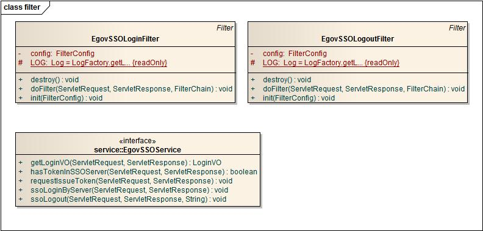

# SSO 연계 서비스

## 개요

 SSO 연계 서비스는 독립된 사이트간의 인증 공유를 위해 3rd party SSO 솔루션을 활용할 수 있는 인터페이스를 제공한다.

## 설명

 3rd party SSO 솔루션을 활용하여 인증 서비스를 구축할 때 SSO 에이전트와 표준프레임워크 인증 시스템간의 인터페이스를 정의한다. 3rd party SSO 솔루션은 인터페이스 구현을 통해 표준프레임워크에서 인증 공유를 위한 SSO에이전트 기능을 사용할 수 있게 해준다.

### 패키지 참조 관계

 SSO 연게 서비스는 요소기술의 공통(cmm) 패키지와 일반 로그인 패키지(uat.uia)에 대해서만 직접적인 함수적 참조 관계를 가지며 일반 로그인 패키지(uat.uia)에 포함되어 배포된다.

### 관련소스

| 유형 | 대상소스명 | 비고 |
| --- | --- | --- |
| Service | egovframework.com.uat.uia.sso.service.EgovSSOService.java | SSO연계 서비스 인터페이스를 정의하는 클래스 |
| Filter | egovframework.com.uat.uia.sso.filter.EgovSSOLoginFilter.java | SSO서버와 연계를 통해 SSO 인증을 실행하는 필터 클래스 |
| Filter | egovframework.com.uat.uia.sso.filter.EgovSSOLogoutFilter.java | 로그아웃 요청시 SSO서버의 글로벌 로그아웃을 처리해 주는 필터 클래스 |

### 클래스다이어그램

 

### 구현예제

#### 공통 컴포넌트 SSO 연계 서비스를 이용하여 국가대표포털 통합인증 시스템에 사용된 SSO 솔루션을 공통컴포넌트의 인증 시스템과 연동한 예제이며 상세 구현 예제는 아래와 같다.

 [example.zip](https://www.egovframe.go.kr/wiki/lib/exe/fetch.php?media=egovframework:com:v2:uat:example.zip)

- 통합 인증 서버에 인증된 토큰이 존재하는지 체크하는 메서드 구현

```java
    /**
	 * SSO 통합 인증 서버에 인증여부를 확인 하는 메서드
	 * 
	 */
	public boolean hasTokenInSSOServer(ServletRequest request,
			ServletResponse response) {
		SSORspData rspData = ssoService.ssoGetLoginData((HttpServletRequest)request);
		String uid = rspData.getUID();

		if(uid == null || uid.equals("")){
			return false;
		}else{
			return true;
		}
	}
```

- 통합 인증 서버에 새로운 토큰 발급을 요청하는 메서드 구현

```java
    /**
	 * SSO 통합 인증 서버에 인증 토큰 생성을 요청하는 메서드
	 * 
	 */
	public void requestIssueToken(ServletRequest request, ServletResponse response) throws Exception {

		String serverIp = "";
    	String userIp = "";
    	String rtrURL = "";
    	String clientPort = "";

		serverIp = InetAddress.getLocalHost().getHostAddress();
		userIp = EgovClntInfo.getClntIP((HttpServletRequest)request);
		clientPort = ":" + request.getServerPort();	
    	rtrURL = ((HttpServletRequest)request).getRequestURI();


    	LoginVO loginVO = (LoginVO)((HttpServletRequest)request).getSession().getAttribute("loginVO");	

		ssoService.ssoReqIssueToken((HttpServletRequest)request, // 서블릿 요청 객체
			    (HttpServletResponse)response,	// 서블릿 응답 객체
                "form-based",			// 인증 방법
                loginVO.getUniqId(),				// 유니크아이디
                loginVO.getUserSe(),			// 아이디 식별정보
                "",		// SSN
                "http://" + serverIp + clientPort + rtrURL, // return url
                userIp,		// client ip
                serverIp);			// agent ip
	}
```

- 통합 인증 서버에 인증된 토큰을 이용한 로컬 인증을 수행하는 메서드 구현

```java
     /**
	 * SSO 통합 인증 서버에 인증이 된 경우 인증 서버의 토큰을 활용하여 로컬 로그인을 처리하는 메서드
	 * 
	 */
	public void ssoLoginByServer(ServletRequest request,
			ServletResponse response) throws Exception {
		SSORspData rspData = ssoService.ssoGetLoginData((HttpServletRequest)request);

		LoginVO loginVO = new LoginVO();
		loginVO.setUniqId(rspData.getUID());
		loginVO.setUserSe(rspData.getCN());

		//로컬 로그인 작성
		loginVO = loginService.actionLoginByEsntlId(loginVO);


		//((HttpServletRequest)request).getSession().setAttribute("uid", rspData.getUID());

		//스프링 시큐리티 로그인
		((HttpServletResponse)response).sendRedirect("/j_spring_security_check?j_username=" + loginVO.getUserSe() + loginVO.getId() + "&j_password=" + loginVO.getUniqId());
		//((HttpServletRequest)request).getRequestDispatcher("/j_spring_security_check?j_username=" + loginVO.getUserSe() + loginVO.getId() + "&j_password=" +                loginVO.getUniqId()).forward(request, response);


	}
```

- 통합 인증 서버의 토큰 정보를 바탕으로 LoginVO 객체를 생성하는 메서드 구현

```java
    /**
	 * 토큰 정보를 바탕으로  loginVO 객체를 생성하는 메서드
	 * 
	 */
	public LoginVO getLoginVO(ServletRequest request, ServletResponse response){
		SSORspData rspData = ssoService.ssoGetLoginData((HttpServletRequest)request);

		LoginVO loginVO = new LoginVO();
		loginVO.setUniqId(rspData.getUID());
		loginVO.setUserSe(rspData.getCN());

		return  loginVO;
	}
```

- 통합 인증 서버에 글로벌 로그아웃(토큰 삭제)을 요청하는 메서드 구현

```java
    /**
	 * SSO 인증 정보를 삭제하는 Global Logout을 처리한다.
	 * returnURL : Global Logout후 돌아가는 URL주소
	 * @throws IOException 
	 * 
	 */
	public void ssoLogout(ServletRequest request, ServletResponse response, String returnURL) throws IOException{
		((HttpServletResponse)response).sendRedirect("/exam/sso/globalLogout.do?returnURL=" + returnURL);
	}
```