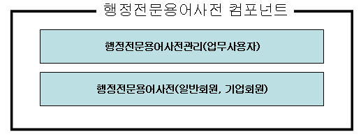
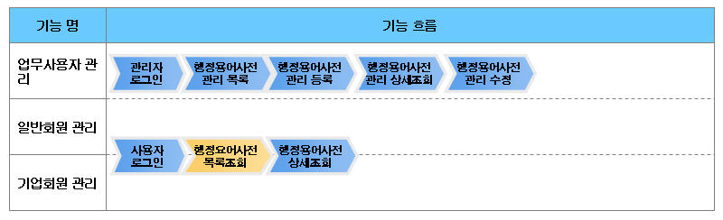
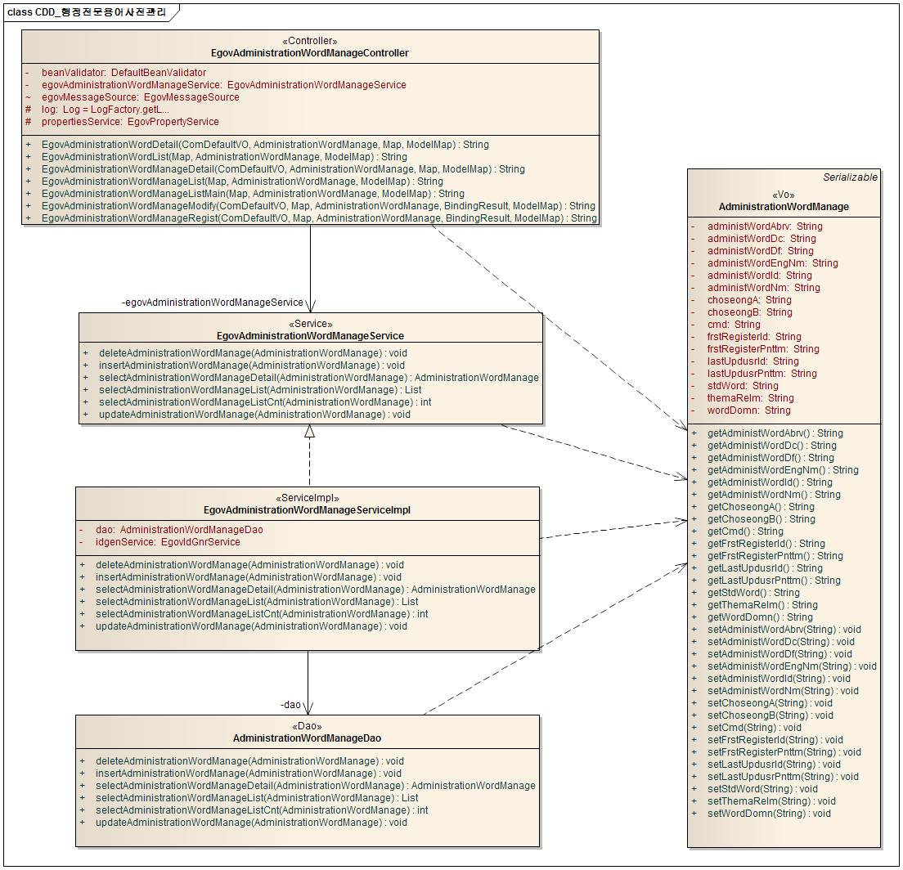
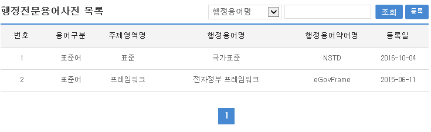
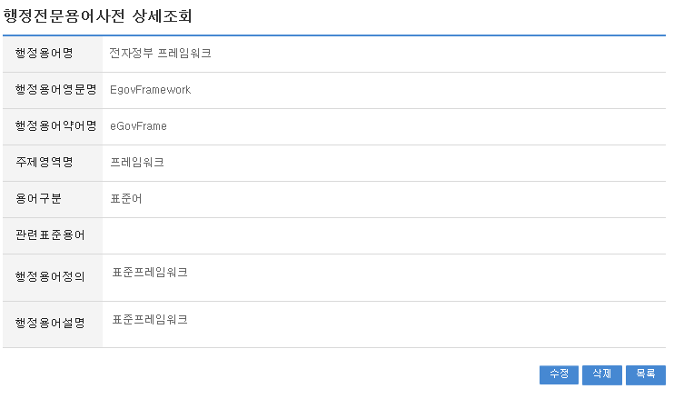
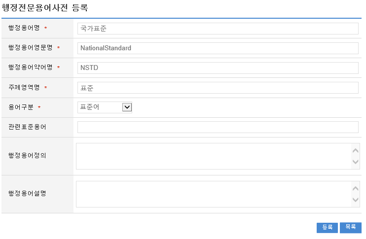
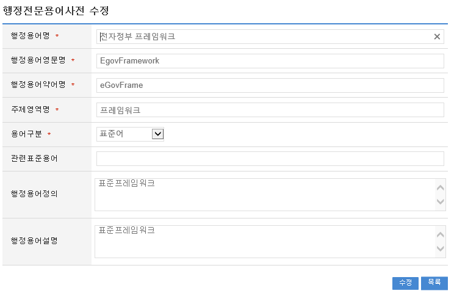

# 행정전문용어사전관리

## 개요

 관리자가 행정전문용어사전 등록,검색 관리 할 수 있는 기능을 제공한다.
 컴포넌트 구성

 

 기능흐름

 

## 설명

### 패키지 참조 관계

 행정전문용어사전관리 패키지는 요소기술의 공통 패키지(cmm)에 대해서만 직접적인 함수적 참조 관계를 가진다.
 패키지 간 참조 관계 : [사용자지원 Package Dependency](../intro/package-reference.md/#사용자지원)

### 관련소스

| 유형 | 대상소스명 | 비고 |
| --- | --- | --- |
| Controller | egovframework.com.uss.olh.awm.web.EgovAdministrationWordController.java | 행정전문용어사전관리 Controller Class |
| Service | egovframework.com.uss.olh.awm.service.EgovAdministrationWordService.java | 행정전문용어사전관리 Service Class |
| Model | egovframework.com.uss.olh.awm.service.AdministrationWordVO.java | 행정전문용어사전관리 Model Class |
| ServiceImpl | egovframework.com.uss.olh.awm.service.impl.EgovAdministrationWordServiceImpl.java | 행정전문용어사전관리 ServiceImpl Class |
| DAO | egovframework.com.uss.olh.awm.service.impl.EgovAdministrationWordDAO.java | 행정전문용어사전관리 Dao Class |
| JSP | /WEB-INF/jsp/egovframework/com/uss/olh/awm/EgovAdministrationWordManageList.jsp | 행정전문용어사전관리 목록조회 페이지 |
| JSP | /WEB-INF/jsp/egovframework/com/uss/olh/awm/EgovAdministrationWordRegist.jsp | 행정전문용어사전관리 등록 페이지 |
| JSP | /WEB-INF/jsp/egovframework/com/uss/olh/awm/EgovAdministrationWordUpdt.jsp | 행정전문용어사전관리 수정 페이지 |
| JSP | /WEB-INF/jsp/egovframework/com/uss/olh/awm/EgovAdministrationWordManageDetail.jsp | 행정전문용어사전관리 상세조회 페이지 |
| JSP | /WEB-INF/jsp/egovframework/com/uss/olh/awm/EgovAdministrationWordList.jsp | 행정전문용어사전 목록조회 페이지 |
| JSP | /WEB-INF/jsp/egovframework/com/uss/olh/awm/EgovAdministrationWordDetail.jsp | 행정전문용어사전 상세조회 페이지 |
| Query XML | resources/egovframework/mapper/com/uss/olh/awm/EgovAdministrationWord\_SQL\_altibase.xml | 행정전문용어사전관리를 위한 Altibase용 Query XML |
| Query XML | resources/egovframework/mapper/com/uss/olh/awm/EgovAdministrationWord\_SQL\_cubrid.xml | 행정전문용어사전관리를 위한 Cubrid용 Query XML |
| Query XML | resources/egovframework/mapper/com/uss/olh/awm/EgovAdministrationWord\_SQL\_maria.xml | 행정전문용어사전관리를 위한 MariaDB용 Query XML |
| Query XML | resources/egovframework/mapper/com/uss/olh/awm/EgovAdministrationWord\_SQL\_mysql.xml | 행정전문용어사전관리를 위한 MySQL용 Query XML |
| Query XML | resources/egovframework/mapper/com/uss/olh/awm/EgovAdministrationWord\_SQL\_oracle.xml | 행정전문용어사전관리를 위한 Oracle용 Query XML |
| Query XML | resources/egovframework/mapper/com/uss/olh/awm/EgovAdministrationWord\_SQL\_postgres.xml | 행정전문용어사전관리를 위한 PostgreSQL용 Query XML |
| Query XML | resources/egovframework/mapper/com/uss/olh/awm/EgovAdministrationWord\_SQL\_tibero.xml | 행정전문용어사전관리를 위한 Tibero용 Query XML |
| Query XML | resources/egovframework/mapper/com/uss/olh/awm/EgovAdministrationWord\_SQL\_goldilocks.xml | 행정전문용어사전관리를 위한 Goldilocks용 Query XML |
| Message properties | resources/egovframework/message/com/uss/olh/awm/message\_ko.properties | 행정전문용어사전관리를 위한 Message properties(한글) |
| Message properties | resources/egovframework/message/com/uss/olh/awm/message\_en.properties | 행정전문용어사전관리를 위한 Message properties(영문) |
| Idgen XML | resources/egovframework/spring/com/idgn/context-idgn-AdministrationWord.xml | 행정전문용어사전관리 Id생성 Idgen XML |

### 클래스 다이어그램

 

### ID Generation

#### ID Generation 관련 DDL 및 DML

 ID Generation Service를 활용하기 위해서 Sequence 저장테이블인  COMTECOPSEQ에 ADMINIST_WORD_ID 항목을 추가해야 한다.

```sql
CREATE TABLE COMTECOPSEQ ( table_name varchar(16) NOT NULL, 
  		   next_id DECIMAL(30) NOT NULL,
  		   PRIMARY KEY (table_name));
 
  INSERT INTO COMTECOPSEQ VALUES('ADMINIST_WORD_ID','0');
```

#### ID Generation 환경설정(context-idgn-AdministrationWord.xml)

```xml
<bean name="egovAdministrationWordIdGnrService"
		class="egovframework.rte.fdl.idgnr.impl.EgovTableIdGnrService"
		destroy-method="destroy">
		<property name="dataSource" ref="egov.dataSource" />
		<property name="strategy" ref="administrationWordIdMsgtrategy" />
		<property name="blockSize" 	value="1"/>
		<property name="table"	   	value="COMTECOPSEQ"/>
		<property name="tableName"	value="ADMINIST_WORD_ID"/>
	</bean>
	<bean name="administrationWordIdMsgtrategy"
		class="egovframework.rte.fdl.idgnr.impl.strategy.EgovIdGnrStrategyImpl">
		<property name="prefix" value="ADMINIST_" />
		<property name="cipers" value="11" />
		<property name="fillChar" value="0" />
	</bean>
```

### 관련테이블

| 테이블명 | 테이블명(영문) | 비고 |
| --- | --- | --- |
| 행정전문용어사전관리 | COMTNADMINISTRATIONWORD | 행정전문용어사전을 관리한다. |

## 관련기능

 행정전문용어사전관리기능은 크게 행정전문용어사전관리 목록조회, 행정전문용어사전관리 상세조회, 행정전문용어사전관리 내용등록, 행정전문용어사전관리 내용수정기능으로 구성되어 있다.

### 행정전문용어사전관리 목록조회

#### 비즈니스 규칙

 관리자가 기(記) 등록된 행정전문용어사전관리 정보를 리스트 형태로 조회 할 수 있고, 등록버튼을 클릭하여 등록화면으로 이동할 수 있다.

#### 관련코드

 N/A

#### 관련화면 및 수행매뉴얼

| Action | URL | Controller method | SQL Namespace | SQL QueryID |
| --- | --- | --- | --- | --- |
| 목록조회 | /uss/olh/awm/selectAdministrationWordList.do | selectAdministrationWordList | "AdministrationWord" | "selectAdministrationWordList" |
|  |  |  | "AdministrationWord" | "selectAdministrationWordListCnt" |

 

 등록: 등록하기 위해서는 상단의 등록 버튼을 통해서 행정전문용어사전관리 등록 화면으로 이동한다.
 목록 최근검색어명: 행정전문용어사전관리 상세조회 화면으로 이동한다

### 행정전문용어사전관리 상세조회

#### 비즈니스 규칙

 행정전문용어사전관리 목록에서 목록 클릭 시 이동되는 화면으로 행정전문용어사전관리에 대한 상세정보를 보여준다.

#### 관련코드

 N/A

#### 관련화면 및 수행매뉴얼

| Action | URL | Controller method | SQL Namespace | SQL QueryID |
| --- | --- | --- | --- | --- |
| 상세조회 | /uss/olh/awm/selectAdministrationWordDetail.do | selectAdministrationWordDetail | "AdministrationWord" | "selectAdministrationWordDetail" |
| 삭제 | /uss/olh/awm/deleteAdministrationWord.do | deleteAdministrationWord | "AdministrationWord" | "deleteAdministrationWord" |

 

 삭제: 삭제버튼 클릭 시 삭제여부를 확인하는 메시지를 보여주고 삭제처리를 할 수 있다.
 목록: 행정전문용어사전관리 목록 화면으로 이동한다.
 수정: 수정버튼 클릭 시 행정전문용어사전관리 수정 화면으로 이동한다.

### 행정전문용어사전관리 내용등록

#### 비즈니스 규칙

 행정전문용어사전관리에 관한 기본정보를 입력 저장처리한다. 입력명 우측의 빨간* 표시는 반드시 입력해야할 항목을 표시한다.

#### 관련코드

 N/A

#### 관련화면 및 수행매뉴얼

| Action | URL | Controller method | SQL Namespace | SQL QueryID |
| --- | --- | --- | --- | --- |
| 등록화면 | /uss/olh/awm/insertAdministrationWordView.do | insertAdministrationWordView |  |  |
| 등록 | /uss/olh/awm/insertAdministrationWord.do | insertAdministrationWord | "AdministrationWord" | "insertAdministrationWord" |

 

 목록: 행정전문용어사전관리 목록 화면으로 이동한다.
 저장: 입력한 행정전문용어사전관리 정보들이 저장 처리된다.

### 행정전문용어사전관리 내용수정

#### 비즈니스 규칙

 행정전문용어사전 내용을 수정한다. 입력명 우측의 빨간* 표시는 수정 시 반드시 입력해야 할 항목을 표시한다.

#### 관련코드

 N/A

#### 관련화면 및 수행매뉴얼

| Action | URL | Controller method | SQL Namespace | SQL QueryID |
| --- | --- | --- | --- | --- |
| 등록화면 | /uss/olh/awm/updateAdministrationWordView.do | updateAdministrationWordView | "AdministrationWord" | "selectAdministrationWordDetail" |
| 등록 | /uss/olh/awm/updateAdministrationWord.do | updateAdministrationWord | "AdministrationWord" | "updateAdministrationWord" |

 

 수정: 수정된 정보들이 수정 처리된다.
 목록: 행정전문용어사전관리 목록 화면으로 이동한다.
