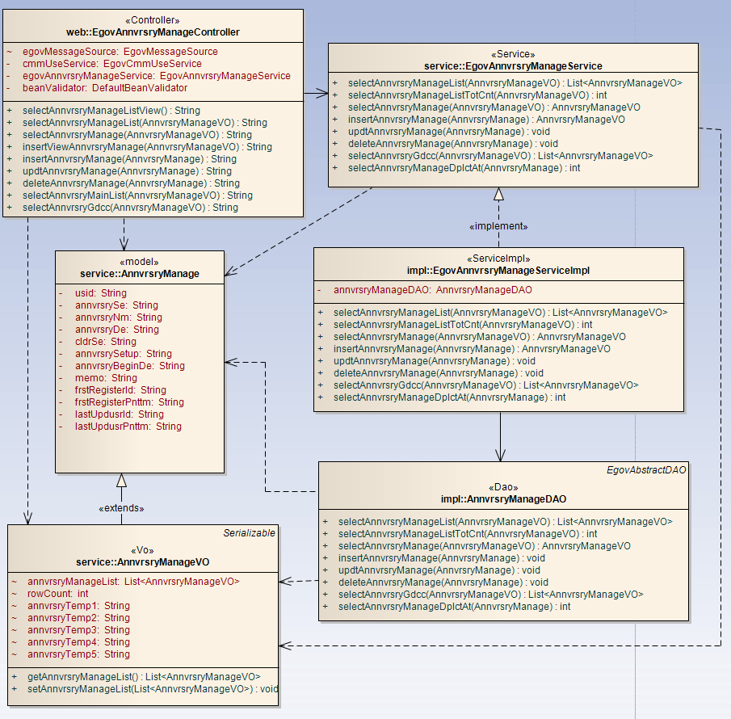
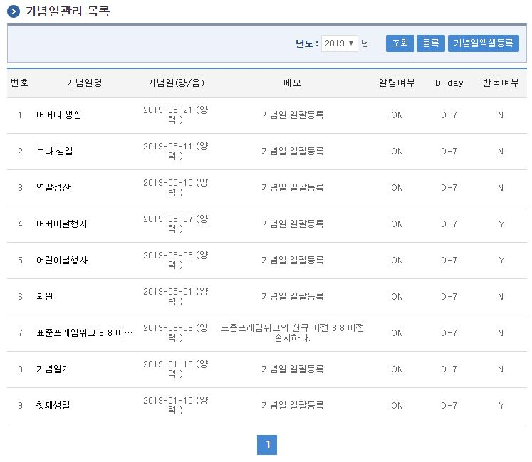
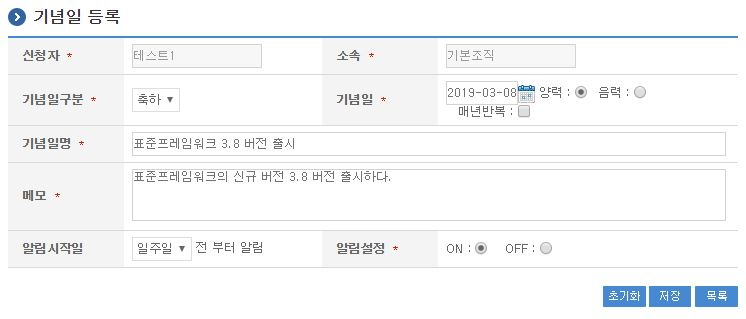
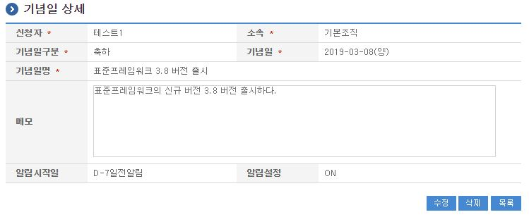
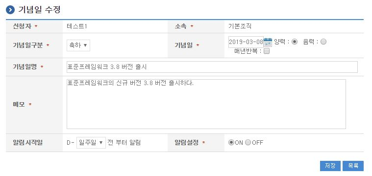
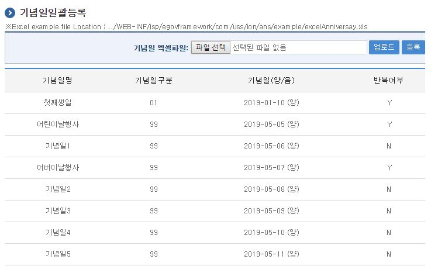
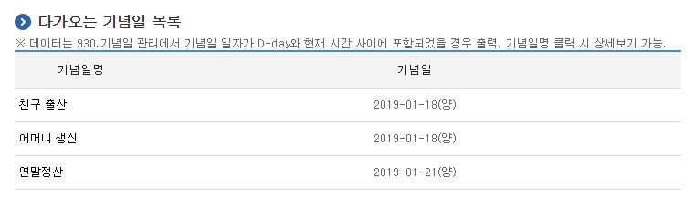
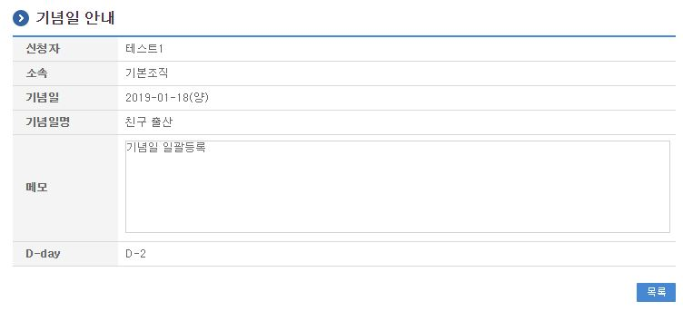

# 기념일관리

## 개요

 기념일관리는 시스템에서 기념일을 관리하는 기능으로 알림설정에 맞춰 기념일 알림기능을 제공한다.

## 설명

 기념일관리는 기념일을 등록하기 위한 목적으로 기념일 등록, 수정, 삭제, 조회, 목록조회, 기념일 알림창의 기능을 수반한다.

 ① 기념일관리목록 : 기념일관리 정보를 최근 등록 순서대로 조회하고, 그 결과 목록을 화면에 반영한다.
 ② 기념일등록 : 기념일 정보를 등록하고, 등록 결과를 조회한다.
 ③ 기념일수정 : 기 등록된 기념일정보의 항목들을 수정한다.
 ④ 기념일삭제 : 기 등록된 기념일정보를 삭제한다.
 ⑤ 기념일상세조회 : 등록된 기념일 상세정보를 조회한다.
 ⑥ 기념일엑셀등록 : 기념일정보를 엑셀에 저장된 내용을 일괄로 등록 처리한다.

### 관련소스

| 유형 | 대상소스명 | 비고 |
| --- | --- | --- |
| Controller | egovframework.com.uss.ion.ans.web.EgovAnnvrsryManageController.java | 기념일 관리를 위한 컨트롤러 클래스 |
| Service | egovframework.com.uss.ion.ans.service.EgovAnnvrsryManageService.java | 기념일 관리를 위한  서비스 인터페이스 |
| ServiceImpl | egovframework.com.uss.ion.ans.service.impl.EgovAnnvrsryManageServiceImpl.java | 기념일 관리를 위한 서비스 구현 클래스 |
| DAO | egovframework.com.uss.ion.ans.service.impl.AnnvrsryManageDAO.java | 기념일 관리를 위한 데이터처리 클래스 |
| VO | egovframework.com.uss.ion.ans.service.AnnvrsryManageVO.java | 기념일 관리를 위한 VO 클래스 |
| Model | egovframework.com.uss.ion.ans.service.AnnvrsryManage.java | 기념일 관리를 위한 Model 클래스 |
| JSP | /WEB-INF/jsp/egovframework/com/uss/ion/ans/EgovAnnvrsryManageList.jsp | 기념일 목록조회를 위한 jsp페이지 |
| JSP | /WEB-INF/jsp/egovframework/com/uss/ion/ans/EgovAnnvrsryRegist.jsp | 기념일 등록를 위한 jsp페이지 |
| JSP | /WEB-INF/jsp/egovframework/com/uss/ion/ans/EgovAnnvrsryDetail.jsp | 등록된 기념일를 상세조회/반영하기 위한 jsp페이지 |
| JSP | /WEB-INF/jsp/egovframework/com/uss/ion/ans/EgovAnnvrsryUpdt.jsp | 기념일 수정를 위한 jsp페이지 |
| JSP | /WEB-INF/jsp/egovframework/com/uss/ion/ans/EgovAnnvrsryGdcc.jsp | 기념일 안내페이지를 확인하기 위한 jsp페이지 |
| JSP | /WEB-INF/jsp/egovframework/com/uss/ion/ans/EgovAnnvrsryMainList.jsp | 기념일 목록 확인을 위한 jsp페이지 |
| Query XML | resources/egovframework/mapper/com/uss/ion/ans/EgovAnnvrsryManage\_SQL\_altibase.xml | 기념일관리 Altibase XML |
| Query XML | resources/egovframework/mapper/com/uss/ion/ans/EgovAnnvrsryManage\_SQL\_cubrid.xml | 기념일관리 Cubrid XML |
| Query XML | resources/egovframework/mapper/com/uss/ion/ans/EgovAnnvrsryManage\_SQL\_mysql.xml | 기념일관리 MySQL XML |
| Query XML | resources/egovframework/mapper/com/uss/ion/ans/EgovAnnvrsryManage\_SQL\_maria.xml | 기념일관리 MariaDB XML |
| Query XML | resources/egovframework/mapper/com/uss/ion/ans/EgovAnnvrsryManage\_SQL\_tibero.xml | 기념일관리 Tibero XML |
| Query XML | resources/egovframework/mapper/com/uss/ion/ans/EgovAnnvrsryManage\_SQL\_postgres.xml | 기념일관리 PostgreSQL XML |
| Query XML | resources/egovframework/mapper/com/uss/ion/ans/EgovAnnvrsryManage\_SQL\_oracle.xml | 기념일관리 Oracle XML |
| Query XML | resources/egovframework/mapper/com/uss/ion/ans/EgovAnnvrsryManage\_SQL\_goldilocks.xml | 기념일관리 Goldilocks XML |
| Message properties | resources/egovframework/message/com/uss/ion/ans/message\_ko.properties | 기념일 관리  Message properties |
| Message properties | resources/egovframework/message/com/uss/ion/ans/message\_en.properties | 기념일 관리  Message properties |
| Idgen XML | resources/egovframework/spring/com/idgn/context-idgn-AnnvrsryManage.xml | 기념일관리를 위한 Id생성 Idgen XML |

### 클래스 다이어그램

 

### 관련테이블

| 테이블명 | 테이블명(영문) | 비고 |
| --- | --- | --- |
| 기념일정보 | COMTNANNVRSRYMANAGE | 기념일정보를 관리하기 위한 속성정보를 정의하고, 관리한다. |

### ID Generation 관련 DDL 및 DML

 ID Generation Service를 활용하기 위해서 Sequence 저장테이블인  COMTECOPSEQ에 ANN_ID 항목을 추가해야 한다.

```sql
CREATE TABLE COMTECOPSEQ ( table_name varchar(16) NOT NULL, 
                               next_id DECIMAL(30) NOT NULL,
                               PRIMARY KEY (table_name)
    );
 
    INSERT INTO COMTECOPSEQ VALUES ('ANN_ID','0');
```

### ID Generation 환경설정(context-idgn-AnnvrsryManage.xml)

```xml
<bean name="egovAnnvrsryManageIdGnrService" class="egovframework.rte.fdl.idgnr.impl.EgovTableIdGnrServiceImpl" destroy-method="destroy">
        <property name="dataSource" ref="egov.dataSource" />
        <property name="strategy"   ref="annvrsryManageIdStrategy" />
        <property name="blockSize"  value="10"/>
        <property name="table"      value="COMTECOPSEQ"/>
        <property name="tableName"  value="ANN_ID"/>
    </bean>
    <bean name="annvrsryManageIdStrategy" class="egovframework.rte.fdl.idgnr.impl.strategy.EgovIdGnrStrategyImpl">
        <property name="prefix"     value="ANN_" />
        <property name="cipers"     value="16" />
        <property name="fillChar"   value="0" />
    </bean>
```

## 관련화면 및 수행메뉴얼

### 기념일관리 목록조회

| Action | URL | Controller method | QueryID |
| --- | --- | --- | --- |
| 조회 | /uss/ion/ans/selectAnnvrsryManageList.do | selectAnnvrsryManageList | "annvrsryManageDAO.selectAnnvrsryManageList" |
| 조회 | /uss/ion/ans/selectAnnvrsryManageList.do | selectAnnvrsryManageList | "annvrsryManageDAO.selectAnnvrsryManageListTotCnt" |

 기념일관리 목록은 페이지당 10건씩 조회되며 페이징은 10페이지씩 이루어진다.
 검색조건은 년도에 대해서 수행된다.

 

 조회 : 기 등록된 기념일관리의 목록을 조회한다.
 등록 : 신규 기념일을 등록하기 위해서는 상단의 등록 버튼을 통해서 기념일 등록 화면으로 이동한다.
 상세조회: 등록된 기념일 목록(기념일명)을 클릭하면 상세정보 화면으로 이동한다.

### 기념일 등록

| Action | URL | Controller method | QueryID |
| --- | --- | --- | --- |
| 등록 | /uss/ion/ans/insertAnnvrsry.do | insertAnnvrsryManage | "annvrsryManageDAO.insertAnnvrsryManage" |

 기념일의 속성정보를 입력한 뒤 등록한다.
 매년반복 체크박스는 체크시 년도별 조회 시 목록화면에 반복여부에 'Y'로 표시되어 목록에 조회되고
 기념일안내 페이지에 매년 해당일자 기준으로 조회된다.

 

 등록 : 신규 기념일을 등록하기 위해서는 기념일 속성을 입력한 뒤 상단의 등록 버튼을 통해서 기념일을 등록한다.
 목록 : 기념일 목록조회 화면으로 이동한다.

### 기념일 상세

| Action | URL | Controller method | QueryID |
| --- | --- | --- | --- |
| 상세조회 | /uss/ion/ans/selectAnnvrsryManage.do | selectAnnvrsryManage | "annvrsryManageDAO.selectAnnvrsryManage" |
| 삭제 | /uss/ion/ans/deleteAnnvrsryManage.do | deleteAnnvrsryManage | "annvrsryManageDAO.deleteAnnvrsryManage" |

 기념일의 상세조회화면이다. 수정 버튼을 통해서 수정화면으로 이동하고, 삭제 버튼을 통해서 기념일을 삭제한다.

 

 수정 : 기념일 수정 화면으로 이동한다.
 삭제 : 삭제 버튼을 통해서 기 등록된 기념일정보를 삭제한다.
 목록 : 기념일 목록조회 화면으로 이동한다.

### 기념일 수정

| Action | URL | Controller method | QueryID |
| --- | --- | --- | --- |
| 수정 | /uss/ion/ans/updateAnnvrsryManage.do | updateAnnvrsryManage | "annvrsryManageDAO.updateAnnvrsryManage" |
| 상세조회 | /uss/ion/ans/selectAnnvrsryManage.do | selectAnnvrsryManage | "annvrsryManageDAO.selectAnnvrsryManage" |

 기념일의 속성정보를 변경한 후 저장한다. 다음 화면은 기념일 상세조회 화면과 동일하다.

 

 수정 : 기 등록된 기념일 속성을 수정한 뒤 상단의 수정 버튼을 통해서 기념일 정보를 수정한다.
 목록 : 기념일 목록조회 화면으로 이동한다.

### 기념일 일괄등록

| Action | URL | Controller method | QueryID |
| --- | --- | --- | --- |
| 기념일엑셀등록 화면조회 | /uss/ion/ans/EgovAnnvrsryManageListPop.do | selectAnnvrsryManageBnde | "annvrsryManageDAO.selectAnnvrsryManageBnde" |
| 기념일엑셀등록 처리 | /uss/ion/ans/insertAnnvrsryManageBnde.do | insertAnnvrsryManageBnde | "annvrsryManageDAO.insertAnnvrsryManage" |

 기념일정보를 입력형식에 맞춰 엑셀에 등록된 내용을 일괄등록 처리한다.
 입력형식은 기념일관리엑셀을 참조하여 작성한다.

 

 업로더 : 작성된 기념일엑셀파일을 서버에 업로더하여 데이터를 화면에 조회한다.
 등록 : 조회된 데이터를 일괄등록 처리한다.

### 기념일 안내

| Action | URL | Controller method | QueryID |
| --- | --- | --- | --- |
| 다가오는기념일조회 | /uss/ion/ans/selectAnnvrsryMainList.do | selectAnnvrsryMainList | "annvrsryManageDAO.selectAnnvrsryMainList" |
| 기념일상세조회 | /uss/ion/ans/selectAnnvrsryGdcc.do | selectAnnvrsryGdcc | "annvrsryManageDAO.selectAnnvrsryGdcc" |

 

 

 목록 : 기념일 목록조회 화면으로 이동한다.
