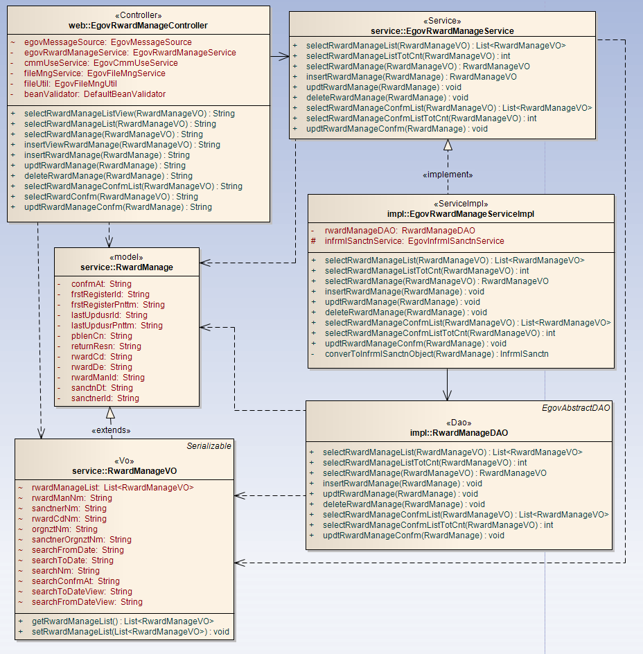
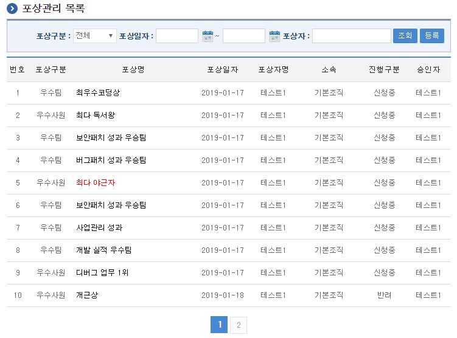
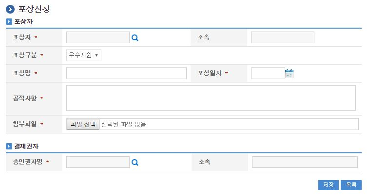
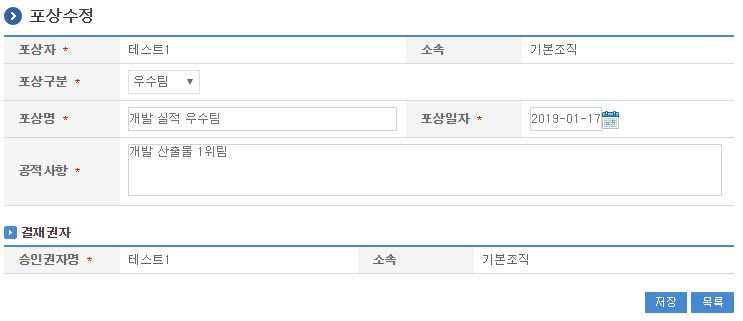
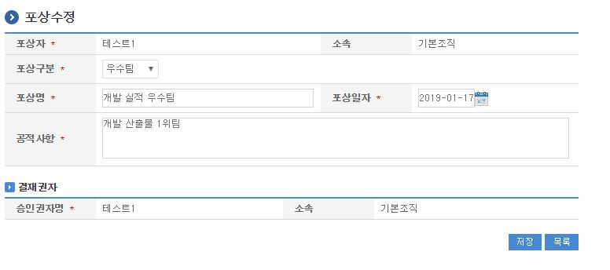

# 포상관리

## 개요

 포상관리는 시스템에서 포상을 관리하는 기능으로 개인/팀별 포상관리정보를 관리하는 기능을 제공한다.

## 설명

 포상관리는 포상정보를 등록하기 위한 목적으로 포상 등록, 수정, 삭제, 조회, 목록조회, 승인처리 기능을 수반한다.

```text
  ① 포상관리목록 : 포상관리 정보를 최근 등록 순서대로 조회하고, 그 결과 목록을 화면에 반영한다.
  ② 포상등록 : 포상정보를 등록하고, 등록 결과를 조회한다.
  ③ 포상수정 : 기 등록된 포상정보의 항목들을 수정한다.
  ④ 포상삭제 : 기 등록된 포상정보를 삭제한다.
  ⑤ 포상상세조회 : 등록된 포상 상세정보를 조회한다.
  ⑥ 포상승인목록 : 포상승인 목록을 최근 등록 순서대로 조회하고, 그 결과 목록을 화면에 반영한다.
  ⑦ 포상승인 : 등록된 포상정보를 승인/반려 처리를 한다.
```

#### 관련소스

| 유형 | 대상소스명 | 비고 |
| --- | --- | --- |
| Controller | egovframework.com.uss.ion.rwd.web.EgovRwardManageController.java | 포상 관리를 위한 컨트롤러 클래스 |
| Service | egovframework.com.uss.ion.rwd.service.EgovRwardManageService.java | 포상 관리를 위한 서비스 인터페이스 |
| ServiceImpl | egovframework.com.uss.ion.rwd.service.impl.EgovRwardManageServiceImpl.java | 포상 관리를 위한 서비스 구현 클래스 |
| DAO | egovframework.com.uss.ion.rwd.service.impl.RwardManageDAO.java | 포상 관리를 위한 데이터처리 클래스 |
| VO | egovframework.com.uss.ion.rwd.service.RwardManageVO.java | 포상 관리를 위한 VO 클래스 |
| Model | egovframework.com.uss.ion.rwd.service.RwardManage.java | 포상 관리를 위한 Model 클래스 |
| JSP | /WEB-INF/jsp/egovframework/com/uss/ion/rwd/EgovRwardManageList.jsp | 포상 목록조회를 위한 jsp페이지 |
| JSP | /WEB-INF/jsp/egovframework/com/uss/ion/rwd/EgovRwardRegist.jsp | 포상 등록를 위한 jsp페이지 |
| JSP | /WEB-INF/jsp/egovframework/com/uss/ion/rwd/EgovRwardDetail.jsp | 등록된 포상를 상세조회/반영하기 위한 jsp페이지 |
| JSP | /WEB-INF/jsp/egovframework/com/uss/ion/rwd/EgovRwardUpdt.jsp | 포상 수정를 위한 jsp페이지 |
| JSP | /WEB-INF/jsp/egovframework/com/uss/ion/rwd/EgovRwardConfmList.jsp | 포상 승인 목록조회를 위한 jsp페이지 |
| JSP | /WEB-INF/jsp/egovframework/com/uss/ion/rwd/EgovRwardConfm.jsp | 포상 승인/반려처리를 위한 jsp페이지 |
| Query XML | resources/egovframework/mapper/com/uss/ion/rwd/EgovRwardManage\_SQL\_altibase.xml | 포상관리 Altibase XML |
| Query XML | resources/egovframework/mapper/com/uss/ion/rwd/EgovRwardManage\_SQL\_cubrid.xml | 포상관리 Cubrid XML |
| Query XML | resources/egovframework/mapper/com/uss/ion/rwd/EgovRwardManage\_SQL\_mysql.xml | 포상관리 MySQL XML |
| Query XML | resources/egovframework/mapper/com/uss/ion/rwd/EgovRwardManage\_SQL\_maria.xml | 포상관리 MariaDB XML |
| Query XML | resources/egovframework/mapper/com/uss/ion/rwd/EgovRwardManage\_SQL\_tibero.xml | 포상관리 Tibero XML |
| Query XML | resources/egovframework/mapper/com/uss/ion/rwd/EgovRwardManage\_SQL\_postgres.xml | 포상관리 PostgreSQL XML |
| Query XML | resources/egovframework/mapper/com/uss/ion/rwd/EgovRwardManage\_SQL\_oracle.xml | 포상관리 Oracle XML |
| Query XML | resources/egovframework/mapper/com/uss/ion/rwd/EgovRwardManage\_SQL\_goldilocks.xml | 포상관리 Goldilocks XML |
| Message properties | resources/egovframework/message/com/uss/ion/rwd/message\_ko.properties | 포상관리 Message properties |
| Message properties | resources/egovframework/message/com/uss/ion/rwd/message\_en.properties | 포상관리 Message properties |
| Idgen XML | resources/egovframework/spring/com/idgn/context-idgn-RwardManage.xml | 포상관리를 위한 Id생성 Idgen XML |

#### 클래스 다이어그램

 

#### 관련테이블

| 테이블명 | 테이블명(영문) | 비고 |
| --- | --- | --- |
| 포상관리 | COMTNRWARDMANAGE | 포상정보를 관리하기 위한 속성정보를 정의하고, 관리한다. |

#### ID Generation 관련 DDL 및 DML

 ID Generation Service를 활용하기 위해서 Sequence 저장테이블인  COMTECOPSEQ에 RWARD_ID 항목을 추가해야 한다.

```sql
    CREATE TABLE COMTECOPSEQ ( table_name varchar(16) NOT NULL, 
                               next_id DECIMAL(30) NOT NULL,
                               PRIMARY KEY (table_name)
    );
 
    INSERT INTO COMTECOPSEQ VALUES ('RWARD_ID','0');
```

#### ID Generation 환경설정(context-idgn-RwardManage.xml)

```xml
    <bean name="egovRwardManageIdGnrService" class="egovframework.rte.fdl.idgnr.impl.EgovTableIdGnrServiceImpl" destroy-method="destroy">
        <property name="dataSource" ref="egov.dataSource" />
        <property name="strategy"   ref="rwardManageIdStrategy" />
        <property name="blockSize"  value="10"/>
        <property name="table"      value="COMTECOPSEQ"/>
        <property name="tableName"  value="RWARD_ID"/>
    </bean>
    <bean name="rwardManageIdStrategy" class="egovframework.rte.fdl.idgnr.impl.strategy.EgovIdGnrStrategyImpl">
        <property name="prefix"     value="RWARD_" />
        <property name="cipers"     value="14" />
        <property name="fillChar"   value="0" />
    </bean>
```

## 관련화면 및 수행메뉴얼

#### 포상관리 목록조회

| Action | URL | Controller method | QueryID |
| --- | --- | --- | --- |
| 조회 | /uss/ion/rwd/selectRwardManageList.do | selectRwardManageList | "rwardManageDAO.selectRwardManageList" |
| 조회 | /uss/ion/rwd/selectRwardManageList.do | selectRwardManageList | "rwardManageDAO.selectRwardManageListTotCnt" |

 포상관리 목록은 페이지당 10건씩 조회되며 페이징은 10페이지씩 이루어진다.
 검색조건은 포상구분, 포상일자, 포상자에 대해서 수행된다.

 

 조회 : 기 등록된 포상관리의 목록을 조회한다.
 등록 : 신규 포상을 등록하기 위해서는 상단의 등록 버튼을 통해서 포상 등록 화면으로 이동한다.
 상세조회: 등록된 포상관리 목록(포상명)을 클릭하면 상세정보 화면으로 이동한다.

#### 포상 등록

| Action | URL | Controller method | QueryID |
| --- | --- | --- | --- |
| 등록 | /uss/ion/rwd/insertRwardManage.do | insertRwardManage | "rwardManageDAO.insertRwardManage" |

 포상의 속성정보를 입력한 뒤 등록한다.

 

 등록 : 신규 포상을 등록하기 위해서는 포상 속성을 입력한 뒤 상단의 포상 버튼을 통해서 포상을 등록한다.
 목록 : 포상 목록조회 화면으로 이동한다.

#### 포상 상세

| Action | URL | Controller method | QueryID |
| --- | --- | --- | --- |
| 상세조회 | /uss/ion/rwd/EgovRwardManageDetail.do | selectRwardManage | "rwardManageDAO.selectRwardManage" |
| 삭제 | /uss/ion/rwd/deleteRwardManage.do | deleteRwardManage | "rwardManageDAO.deleteRwardManage" |

 포상의 상세조회화면이다. 수정 버튼을 통해서 수정화면으로 이동하고, 삭제 버튼을 통해서 포상을 삭제한다.

 

 수정 : 포상 수정 화면으로 이동한다.
 삭제 : 삭제 버튼을 통해서 기 등록된 포상정보를 삭제한다.
 목록 : 포상 목록조회 화면으로 이동한다.

#### 포상 수정

| Action | URL | Controller method | QueryID |
| --- | --- | --- | --- |
| 수정 | /uss/ion/rwd/updtRwardManage.do | updtRwardManage | "rwardManageDAO.updtRwardManage" |
| 상세조회 | /uss/ion/rwd/EgovRwardManageDetail.do | selectRwardManage | "rwardManageDAO.selectRwardManage" |

 포상의 속성정보를 변경한 후 저장한다. 다음 화면은 포상 상세조회 화면과 동일하다.

 

 수정 : 기 등록된 포상 속성을 수정한 뒤 상단의 수정 버튼을 통해서 포상 정보를 수정한다.
 목록 : 포상 목록조회 화면으로 이동한다.
