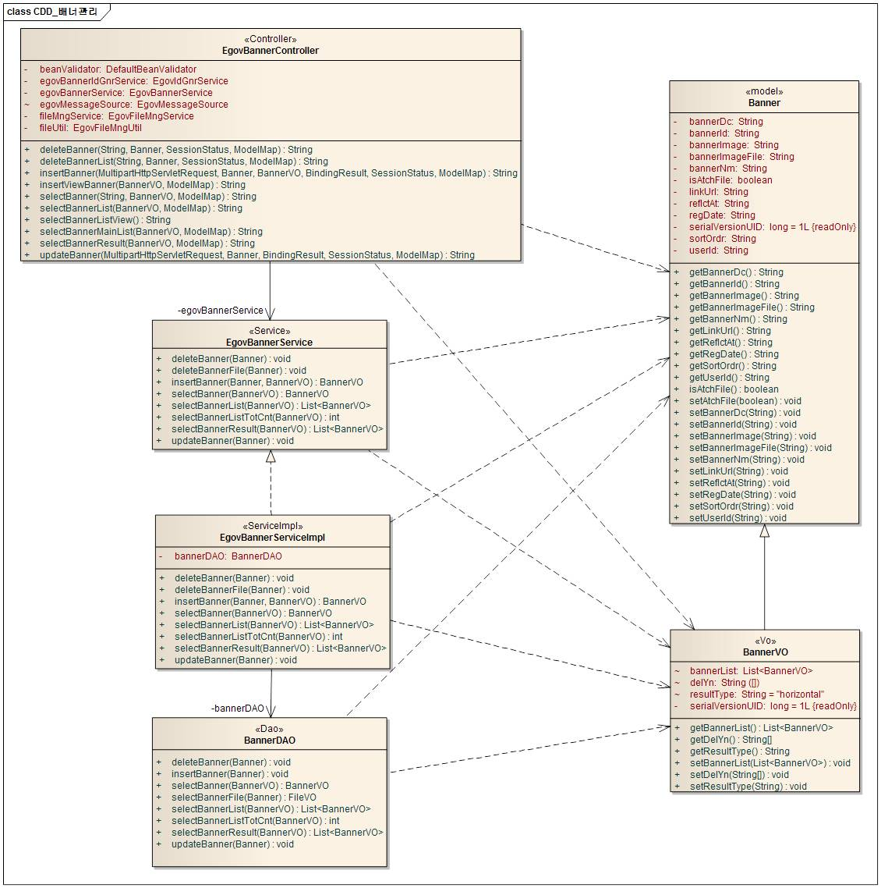
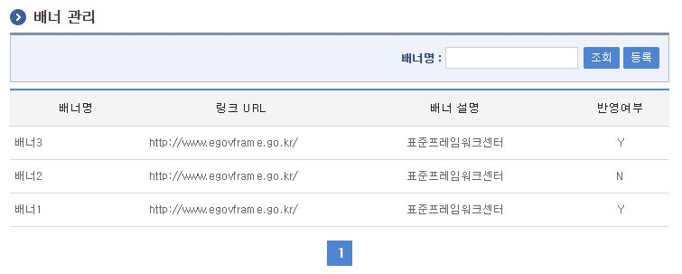
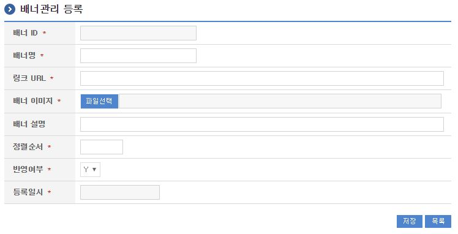
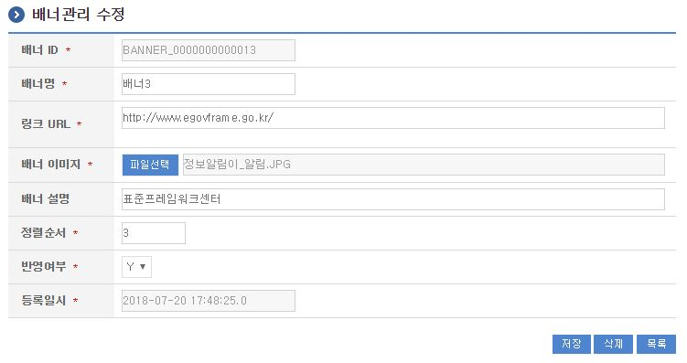

# 배너관리

## 개요

 배너관리는 배너이미지를 등록하면 메인 화면의 배너 코너에 반영되어 이미지에 링크된 사이트로 이동하는 기능을 제공한다.

## 설명

 배너관리는 배너를 등록하여 특정 사이트로의 링크를 반영하기 위한 목적으로 배너의 등록, 수정, 삭제, 조회, 목록조회의 기능을 수반한다.

```text
  ① 배너목록조회 : 배너로 정의된 정보를 최근 등록 순서대로 조회하고, 그 결과 목록을 화면에 반영한다.
  ② 배너등록 : 배너정보를 등록하고, 등록 결과를 조회한다.
  ③ 배너수정 : 기 등록된 배너정보의 항목들을 수정한다.
  ④ 배너삭제 : 기 등록된 배너정보를 삭제한다.
  ⑤ 배너조회 : 등록된 배너는 이미지 단위로 배너표현 위치에 보여진다.
```

### 패키지 참조 관계

 배너관리 패키지는 요소기술의 공통 패키지(cmm)에 대해서만 직접적인 함수적 참조 관계를 가진다.
- 패키지 간 참조 관계 : [사용자지원 Package Dependency](../intro/package-reference.md#사용자지원)

### 관련소스

| 유형 | 대상소스명 | 비고 |
| --- | --- | --- |
| Controller | egovframework.com.uss.ion.bnr.web.EgovBannerController.java | 배너 관리를 위한 컨트롤러 클래스 |
| Service | egovframework.com.uss.ion.bnr.service.EgovBannerService.java | 배너 관리를 위한 서비스 인터페이스 |
| ServiceImpl | egovframework.com.uss.ion.bnr.service.impl.EgovBannerServiceImpl.java | 배너 관리를 위한 서비스 구현 클래스 |
| VO | egovframework.com.uss.ion.bnr.service.BannerVO.java | 배너 관리를 위한 VO 클래스 |
| DAO | egovframework.com.uss.ion.bnr.service.impl.BannerDAO.java | 배너 관리를 위한 데이터처리 클래스 |
| JSP | /WEB-INF/jsp/egovframework/com/uss/ion/bnr/EgovBannerList.jsp | 배너 목록조회를 위한 jsp페이지 |
| JSP | /WEB-INF/jsp/egovframework/com/uss/ion/bnr/EgovBannerRegist.jsp | 배너 등록를 위한 jsp페이지 |
| JSP | /WEB-INF/jsp/egovframework/com/uss/ion/bnr/EgovBannerUpdt.jsp | 배너 수정를 위한 jsp페이지 |
| JSP | /WEB-INF/jsp/egovframework/com/uss/ion/bnr/EgovBannerView.jsp | 등록된 배너를 반영하기 위한 jsp페이지 |
| QUERY XML | resources/egovframework/mapper/com/uss/ion/bnr/EgovBanner\_SQL\_altibase.xml | 배너관리 Altibase용 QUERY XML |
| QUERY XML | resources/egovframework/mapper/com/uss/ion/bnr/EgovBanner\_SQL\_cubrid.xml | 배너관리 Cubrid용 QUERY XML |
| QUERY XML | resources/egovframework/mapper/com/uss/ion/bnr/EgovBanner\_SQL\_maria.xml | 배너관리 Maria용 QUERY XML |
| QUERY XML | resources/egovframework/mapper/com/uss/ion/bnr/EgovBanner\_SQL\_mysql.xml | 배너관리 MySQL용 QUERY XML |
| QUERY XML | resources/egovframework/mapper/com/uss/ion/bnr/EgovBanner\_SQL\_oracle.xml | 배너관리 Oracle용 QUERY XML |
| QUERY XML | resources/egovframework/mapper/com/uss/ion/bnr/EgovBanner\_SQL\_postgres.xml | 배너관리 Postgres용 QUERY XML |
| QUERY XML | resources/egovframework/mapper/com/uss/ion/bnr/EgovBanner\_SQL\_tibero.xml | 배너관리 Tibero용 QUERY XML |
| QUERY XML | resources/egovframework/mapper/com/uss/ion/bnr/EgovBanner\_SQL\_goldilocks.xml | 배너관리 Goldilocks용 QUERY XML |
| Message properties | resources/egovframework/message/com/uss/ion/bnr/message\_ko.properties | 배너관리를 위한 Message properties(한글) |
| Message properties | resources/egovframework/message/com/uss/ion/bnr/message\_en.properties | 배너관리를 위한 Message properties(영문) |
| Idgen XML | resources/egovframework/spring/com/idgn/context-idgn-Banner.xml | 배너등록을 위한 Id생성 Idgen XML |

### 클래스 다이어그램

 

### ID Generation

#### ID Generation 관련 DDL 및 DML

 ID Generation Service를 활용하기 위해서 Sequence 저장테이블인  COMTECOPSEQ에 BANNER_ID 항목을 추가한다.

```sql
  CREATE TABLE COMTECOPSEQ ( table_name varchar(20) NOT NULL, 
  		   next_id NUMERIC(30) NULL,
  		   PRIMARY KEY (table_name));
 
  INSERT INTO COMTECOPSEQ ( TABLE_NAME, NEXT_ID ) VALUES('BANNER_ID','1');
```

#### ID Generation 환경설정(context-idgn-Banner.xml)

```xml
    <bean name="egovBannerIdGnrService" class="egovframework.rte.fdl.idgnr.impl.EgovTableIdGnrServiceImpl" destroy-method="destroy">
        <property name="dataSource" ref="egov.dataSource" />
        <property name="strategy"   ref="bannerIdStrategy" />
        <property name="blockSize"  value="10"/>
        <property name="table"      value="COMTECOPSEQ"/>
        <property name="tableName"  value="BANNER_ID"/>
    </bean>
 
    <bean name="bannerIdStrategy"
        class="egovframework.rte.fdl.idgnr.impl.strategy.EgovIdGnrStrategyImpl">
        <property name="prefix" value="BANNER_" />
        <property name="cipers" value="13" />
        <property name="fillChar" value="0" />
    </bean>
```

### 관련테이블

| 테이블명 | 테이블명(영문) | 비고 |
| --- | --- | --- |
| 배너정보 | COMTNBANNER | 배너정보를 관리하기 위한 속성정보를 정의하고, 관리한다. |

## 관련기능

 배너관리기능은 크게 배너 목록조회, 배너 등록, 배너 수정 기능으로 구성되어 있다.

### 배너 목록조회

#### 비즈니스 규칙

 배너 목록은 페이지당 10건씩 조회되며 페이징은 10페이지씩 이루어진다.
 검색조건은 배너명에 대해서 수행된다.

#### 관련코드

 N/A

#### 관련화면 및 수행매뉴얼

| Action | URL | Controller method | SQL Namespace | SQL QueryID |
| --- | --- | --- | --- | --- |
| 목록조회 | /uss/ion/bnr/selectBannerList.do | selectBannerList | "bannerDAO" | "selectBannerList", |
|  |  |  | "bannerDAO" | "selectBannerListTotCnt" |

 

 조회 : 기 등록된 배너의 목록을 조회한다.
 등록 : 신규 배너를 등록하기 위해서는 상단의 등록 버튼을 통해서 배너 등록 화면으로 이동한다.

### 배너 등록

#### 비즈니스 규칙

 배너의 속성정보를 입력한 뒤 등록한다.

#### 관련코드

 N/A

#### 관련화면 및 수행매뉴얼

| Action | URL | Controller method | SQL Namespace | SQL QueryID |
| --- | --- | --- | --- | --- |
| 등록화면 | /uss/ion/bnr/addViewBanner.do | insertViewBanner |  |  |
| 등록 | /uss/ion/bnr/addBanner.do | insertBanner | "bannerDAO" | "insertBanner" |

 

 등록 : 신규 배너를 등록하기 위해서는 배너 속성을 입력한 뒤 상단의 저장 버튼을 통해서 배너를 등록한다.
 목록 : 배너 목록조회 화면으로 이동한다.

### 배너 수정

#### 비즈니스 규칙

 배너의 속성정보를 변경한 후 저장한다. 다음 화면은 배너 상세조회 화면과 동일하다.

#### 관련코드

 N/A

#### 관련화면 및 수행매뉴얼

| Action | URL | Controller method | SQL Namespace | SQL QueryID |
| --- | --- | --- | --- | --- |
| 수정 | /uss/ion/bnr/updtBanner.do | updateBanner | "bannerDAO" | "updateBanner" |

 

 수정 : 기 등록된 배너 속성을 수정한 뒤 하단의 저장 버튼을 통해서 배너정보를 수정한다.
 삭제 : 기 등록된 배너정보를 삭제한다.
 목록 : 배너 목록조회 화면으로 이동한다.

