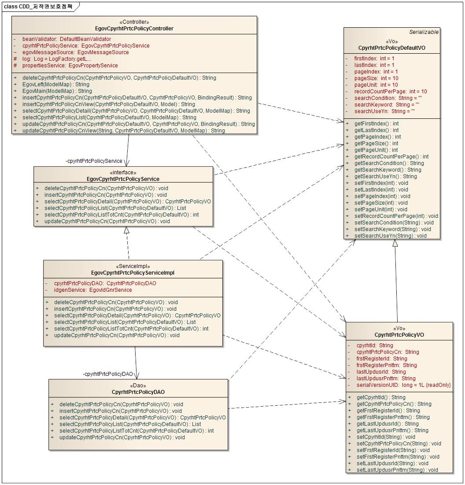
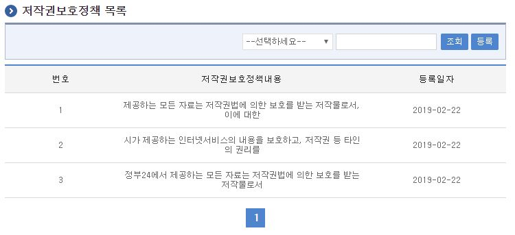
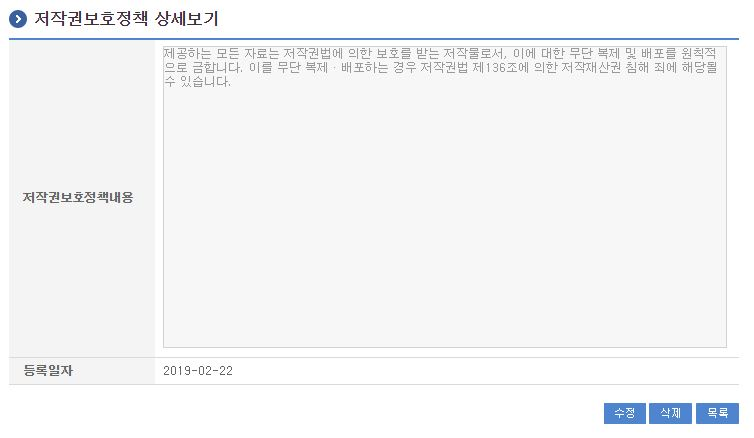
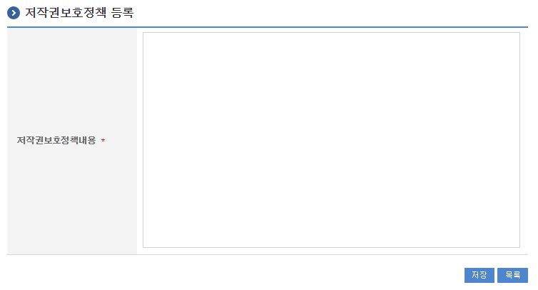
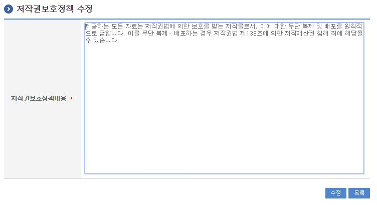

# 저작권보호정책

## 개요

 회원가입 시 회원저작권보호정책 및 정보공유 동의여부를 확인할때 제공되는 저작권보호정책정보 및 정보공유내용을 관리 할 수 있다.

## 설명

### 패키지 참조 관계

 저작권보호정책 패키지는 요소기술의 공통 패키지(cmm)에 대해서만 직접적인 함수적 참조 관계를 가진다.
- 패키지 간 참조 관계 : [사용자지원 Package Dependency](../intro/package-reference.md/#사용자지원)

### 관련소스

| 유형 | 대상소스명 | 비고 |
| --- | --- | --- |
| Controller | egovframework.com.uss.sam.cpy.web.EgovCpyrhtPrtcPolicyController.java | 저작권보호정책관리를 위한 컨트롤러 클래스 |
| Service | egovframework.com.uss.sam.cpy.service.EgovCpyrhtPrtcPolicyService.java | 저작권보호정책관리를 위한 서비스 인터페이스 |
| ServiceImpl | egovframework.com.uss.sam.cpy.service.impl.EgovCpyrhtPrtcPolicyServiceImpl.java | 저작권보호정책관리를 위한 서비스 구현 클래스 |
| VO | egovframework.com.uss.sam.cpy.service.CpyrhtPrtcPolicyVO.java | 저작권보호정책관리를 위한 VO 클래스 |
| VO | egovframework.com.uss.sam.cpy.service.CpyrhtPrtcPolicyDefaultVO.java | 저작권보호정책관리를 위한 SearchVO 클래스 |
| DAO | egovframework.com.uss.sam.cpy.service.impl.CpyrhtPrtcPolicyDAO.java | 저작권보호정책 관리를 위한 데이터처리 클래스 |
| JSP | /WEB-INF/jsp/egovframework/com/uss/sam/cpy/EgovCpyrhtPrtcPolicyListInqire.jsp | 저작권보호정책관리를 위한 목록조회 페이지 |
| JSP | /WEB-INF/jsp/egovframework/com/uss/sam/cpy/EgovCpyrhtPrtcPolicyDetailInqire.jsp | 저작권보호정책관리를 위한 상세조회 페이지 |
| JSP | /WEB-INF/jsp/egovframework/com/uss/sam/cpy/EgovCpyrhtPrtcPolicyCnRegist.jsp | 저작권보호정책관리를 위한 등록 페이지 |
| JSP | /WEB-INF/jsp/egovframework/com/uss/sam/cpy/EgovCpyrhtPrtcPolicyCnUpdt.jsp | 저작권보호정책관리를 위한 수정 페이지 |
| Query XML | resources/egovframework/mapper/com/uss/sam/cpy/EgovCpyrhtPrtcPolicy\_SQL\_altibase.xml | 저작권보호정책관리(조회,등록,수정,삭제)를 위한 Altibase용 Query XML |
| Query XML | resources/egovframework/mapper/com/uss/sam/cpy/EgovCpyrhtPrtcPolicy\_SQL\_cubrid.xml | 저작권보호정책관리(조회,등록,수정,삭제)를 위한 Cubrid용 Query XML |
| Query XML | resources/egovframework/mapper/com/uss/sam/cpy/EgovCpyrhtPrtcPolicy\_SQL\_maria.xml | 저작권보호정책관리(조회,등록,수정,삭제)를 위한 Maria용 Query XML |
| Query XML | resources/egovframework/mapper/com/uss/sam/cpy/EgovCpyrhtPrtcPolicy\_SQL\_mysql.xml | 저작권보호정책관리(조회,등록,수정,삭제)를 위한 MySQL용 Query XML |
| Query XML | resources/egovframework/mapper/com/uss/sam/cpy/EgovCpyrhtPrtcPolicy\_SQL\_oracle.xml | 저작권보호정책관리(조회,등록,수정,삭제)를 위한 Oracle용 Query XML |
| Query XML | resources/egovframework/mapper/com/uss/sam/cpy/EgovCpyrhtPrtcPolicy\_SQL\_postgres.xml | 저작권보호정책관리(조회,등록,수정,삭제)를 위한 Postgres용 Query XML |
| Query XML | resources/egovframework/mapper/com/uss/sam/cpy/EgovCpyrhtPrtcPolicy\_SQL\_tibero.xml | 저작권보호정책관리(조회,등록,수정,삭제)를 위한 Tibero용 Query XML |
| Query XML | resources/egovframework/mapper/com/uss/sam/cpy/EgovCpyrhtPrtcPolicy\_SQL\_goldilocks.xml | 저작권보호정책관리(조회,등록,수정,삭제)를 위한 Goldilocks용 Query XML |
| Message properties | resources/egovframework/message/com/uss/sam/cpy/message\_ko.properties | 저작권보호정책관리를 위한 Message properties(한글) |
| Message properties | resources/egovframework/message/com/uss/sam/cpy/message\_en.properties | 저작권보호정책관리를 위한 Message properties(영문) |
| Idgen XML | resources/egovframework/spring/com/idgn/context-idgn-CpyrhtPrtcPolicy.xml | 저작권보호정책등록을 위한 Id생성 Idgen XML |

### 클래스다이어그램

 

### ID Generation

#### ID Generation 관련 DDL 및 DML

 ID Generation Service를 활용하기 위해서 Sequence 저장테이블인  COMTECOPSEQ에 CPYRHT_ID 항목을 추가해야 한다.

```sql
CREATE TABLE COMTECOPSEQ
(
    TABLE_NAME            VARCHAR(20) NOT NULL,
    NEXT_ID               NUMERIC(30) NULL,
     PRIMARY KEY (TABLE_NAME)
)
;
INSERT INTO COMTECOPSEQ ( TABLE_NAME, NEXT_ID ) VALUES ('CPYRHT_ID', 1);
```

#### ID Generation 환경설정(context-idgn-CpyrhtPrtcPolicy.xml)

```xml
	<bean name="egovCpyrhtPrtcPolicyIdGnrService" class="egovframework.rte.fdl.idgnr.impl.EgovTableIdGnrServiceImpl" destroy-method="destroy">
        <property name="dataSource" ref="egov.dataSource" />
        <property name="strategy"   ref="cpyrhtPrtcPolicyStrategy" />
        <property name="blockSize"  value="10"/>
        <property name="table"      value="COMTECOPSEQ"/>
        <property name="tableName"  value="CPYRHT_ID"/>
    </bean>
    <bean name="cpyrhtPrtcPolicyStrategy" class="egovframework.rte.fdl.idgnr.impl.strategy.EgovIdGnrStrategyImpl">
        <property name="prefix"   value="CPYRHT_" />
        <property name="cipers"   value="13" />
        <property name="fillChar" value="0" />
    </bean>
```

### 관련테이블

| 테이블명 | 테이블명(영문) | 비고 |
| --- | --- | --- |
| 저작권보호정책정보 | COMTNCPYRHTINFO | 저작권보호정책에 대한 내용 관리한다. |

## 관련기능

 저작권보호정책관리는 크게 저작권보호정책목록조회, 저작권보호정책상세조회, 저작권보호정책내용등록, 저작권보호정책내용수정 기능으로 구성되어 있다.

### 저작권보호정책 목록조회

#### 비즈니스 규칙

 조회조건으로 목록조회를 할 수 있고, 등록버튼을 클릭하여 저작권보호정책등록 화면으로 이동하여 저작권보호정책를 등록 처리할 수 있다.

#### 관련코드

 N/A

#### 관련화면 및 수행매뉴얼

| Action | URL | Controller method | SQL Namespace | SQL QueryID |
| --- | --- | --- | --- | --- |
| 목록조회 | /uss/sam/cpy/CpyrhtPrtcPolicyListInqire.do | selectCpyrhtPrtcPolicyList | "CpyrhtPrtcPolicyDAO" | "selectCpyrhtPrtcPolicyList", |
|  |  | selectCpyrhtPrtcPolicyListTotCnt | "CpyrhtPrtcPolicyDAO" | "selectCpyrhtPrtcPolicyListTotCnt" |

 저작권보호정책 목록은 페이지 당 10건씩 조회되며 페이징은 10페이지씩 이루어진다.
 검색조건은 저작권보호정책내용에 대해서 수행된다.
 페이지 당 검색 범위를 변경하고자 하는 경우
 context-properties.xml 파일의 pageUnit, pageSize를 변경한다.(단 해당 설정은 전체 공통서비스 기능에 영향을 미친다.)

 

 조회: 저작권보호정책를 조회하기 위해서는 상단의 검색조건을 선택 후 해당하는 검색문자를 입력 후 조회 버튼을 클릭한다.
 등록: 저작권보호정책를 등록하기 위해서는 상단의 등록 버튼을 통해서 저작권보호정책등록 화면으로 이동한다.
 목록클릭: 저작권보호정책상세조회 화면으로 이동한다.

### 저작권보호정책 상세조회

#### 비즈니스 규칙

 저작권보호정책목록조회에서 목록 클릭 시 이동되는 화면으로 저작권보호정책에 대한 상세정보를 보여준다.

#### 관련코드

 N/A

#### 관련화면 및 수행매뉴얼

| Action | URL | Controller method | SQL Namespace | SQL QueryID |
| --- | --- | --- | --- | --- |
| 상세조회 | /uss/sam/cpy/CpyrhtPrtcPolicyDetailInqire.do | selectCpyrhtPrtcPolicyDetail | "CpyrhtPrtcPolicyDAO" | "selectCpyrhtPrtcPolicyDetail" |

 저작권보호정책 상세조회화면은 저작권보호정책내용수정, 저작권보호정책내용삭제, 저작권보호정책목록조회를 할 수 있다.

 

 수정: 수정버튼 클릭 시 저작권보호정책를 수정할 수 있는 화면으로 이동한다.
 삭제: 삭제버튼 클릭 시 삭제여부를 확인하는 메시지를 보여주고 삭제처리를 할 수 있다.
 목록: 저작권보호정책목록조회 화면으로 이동한다.

### 저작권보호정책내용등록

#### 비즈니스 규칙

 저작권보호정책에 관한 기본정보를 입력 저장처리한다. 입력명 우측의 빨간* 표시는 반드시 입력해야할 항목을 표시한다.

#### 관련코드

 N/A

#### 관련화면 및 수행매뉴얼

| Action | URL | Controller method | SQL Namespace | SQL QueryID |
| --- | --- | --- | --- | --- |
| 등록화면 | /uss/sam/cpy/CpyrhtPrtcPolicyCnRegistView.do | insertCpyrhtPrtcPolicyCnView |  |  |
| 등록 | /uss/sam/cpy/CpyrhtPrtcPolicyCnRegist.do | insertCpyrhtPrtcPolicyCn | "CpyrhtPrtcPolicyDAO" | "insertCpyrhtPrtcPolicyCn" |

 

 저장: 입력한 저작권보호정책정보들이 저장 처리된다.
 목록: 저작권보호정책목록조회 화면으로 이동한다.

### 저작권보호정책내용수정

#### 비즈니스 규칙

 입력한 저작권보호정책정보들을 저장 처리한다. 입력명 우측의 빨간* 표시는 수정 시 반드시 입력해야 할 항목을 표시한다.

#### 관련코드

 N/A

#### 관련화면 및 수행매뉴얼

| Action | URL | Controller method | SQL Namespace | SQL QueryID |
| --- | --- | --- | --- | --- |
| 수정 | /uss/sam/cpy/CpyrhtPrtcPolicyCnUpdt.do | updateCpyrhtPrtcPolicyCn | "CpyrhtPrtcPolicyDAO" | "updateCpyrhtPrtcPolicyCn" |

 

 수정: 수정 입력한 저작권보호정책정보들이 저장 처리된다.
 목록: 저작권보호정책목록조회 화면으로 이동한다.
