# 상담관리

## 개요

 상담 내역 및 조치처리 관리기능으로 일반사용자가 상담내역을 등록하는 기능 및 관리자가 답변글을 등록하는 기능으로 구성되어 있다
 기능흐름

 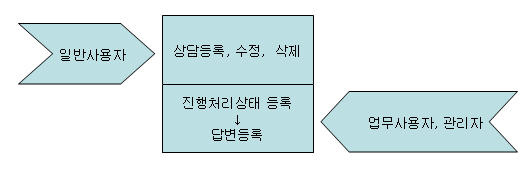

## 설명

### 패키지 참조 관계

 상담관리 패키지는 요소기술의 공통 패키지(cmm)와 시스템 패키지(sim)에 대해서만 직접적인 함수적 참조 관계를 가진다.
 패키지 간 참조 관계 : [사용자지원 Package Dependency](../intro/package-reference.md#사용자지원)

### 관련소스

| 유형 | 대상소스명 | 비고 |
| --- | --- | --- |
| Controller | egovframework.com.uss.olp.cns.web.EgovCnsltManageController.java | 상담관리를 위한 컨트롤러 클래스 |
| Service | egovframework.com.uss.olp.cns.service.EgovCnsltManageService.java | 상담관리를 위한 서비스 인터페이스 |
| ServiceImpl | egovframework.com.uss.olp.cns.service.impl.EgovCnsltManageServiceImpl.java | 상담관리를 위한 서비스 구현 클래스 |
| VO | egovframework.com.uss.olp.cns.service.CnsltManageVO.java | 상담관리를 위한 VO 클래스 |
| VO | egovframework.com.uss.olp.cns.service.CnsltManageDefaultVO.java | 상담관리를 위한 SearchVO 클래스 |
| DAO | egovframework.com.uss.olp.cns.service.impl.CnsltManageDAO.java | 상담관리를 위한 데이터처리 클래스 |
| JSP | /WEB-INF/jsp/egovframework/com/uss/olp/cns/EgovCnsltListInqire.jsp | 상담관리를 위한 목록조회 페이지 |
| JSP | /WEB-INF/jsp/egovframework/com/uss/olp/cns/EgovCnsltDetailInqire.jsp | 상담관리를 위한 상세조회 페이지 |
| JSP | /WEB-INF/jsp/egovframework/com/uss/olp/cns/EgovCnsltDtlsRegist.jsp | 상담관리를 위한 등록 페이지 |
| JSP | /WEB-INF/jsp/egovframework/com/uss/olp/cns/EgovCnsltDtlsUpdt.jsp | 상담관리를 위한 수정 페이지 |
| JSP | /WEB-INF/jsp/egovframework/com/uss/olp/cns/EgovCnsltAnswerListInqire.jsp | 상담관리를 위한 답변목록조회 페이지 |
| JSP | /WEB-INF/jsp/egovframework/com/uss/olp/cns/EgovCnsltAnswerDetailInqire.jsp | 상담관리를 위한 답변상세조회 페이지 |
| JSP | /WEB-INF/jsp/egovframework/com/uss/olp/cns/EgovCnsltDtlsAnswerUpdt.jsp | 상담관리를 위한 답변수정 페이지 |
| Query XML | resources/egovframework/mapper/com/uss/olp/cns/EgovCnsltManage\_SQL\_mysql.xml | 상담관리(조회,등록,수정,삭제)를 위한 MySQL용 Query XML |
| Query XML | resources/egovframework/mapper/com/uss/olp/cns/EgovCnsltManage\_SQL\_cubrid.xml | 상담관리(조회,등록,수정,삭제)를 위한 Cubrid용 Query XML |
| Query XML | resources/egovframework/mapper/com/uss/olp/cns/EgovCnsltManage\_SQL\_oracle.xml | 상담관리(조회,등록,수정,삭제)를 위한 Oracle용 Query XML |
| Query XML | resources/egovframework/mapper/com/uss/olp/cns/EgovCnsltManage\_SQL\_tibero.xml | 상담관리(조회,등록,수정,삭제)를 위한 Tibero용 Query XML |
| Query XML | resources/egovframework/mapper/com/uss/olp/cns/EgovCnsltManage\_SQL\_altibase.xml | 상담관리(조회,등록,수정,삭제)를 위한 Altibase용 Query XML |
| Query XML | resources/egovframework/mapper/com/uss/olp/cns/EgovCnsltManage\_SQL\_maria.xml | 상담관리(조회,등록,수정,삭제)를 위한 MariaDB용 Query XML |
| Query XML | resources/egovframework/mapper/com/uss/olp/cns/EgovCnsltManage\_SQL\_postgres.xml | 상담관리(조회,등록,수정,삭제)를 위한 PostgreSQL용 Query XML |
| Query XML | resources/egovframework/mapper/com/uss/olp/cns/EgovCnsltManage\_SQL\_goldilocks.xml | 상담관리(조회,등록,수정,삭제)를 위한 Goldilocks용 Query XML |
| Message properties | resources/egovframework/message/com/uss/olp/cns/message\_ko.properties | 상담관리를 위한 Message properties(한글) |
| Message properties | resources/egovframework/message/com/uss/olp/cns/message\_en.properties | 상담관리를 위한 Message properties(영문) |
| Idgen XML | resources/egovframework/spring/com/idgn/context-idgn-CnsltManage.xml | 상담등록을 위한 Id생성 Idgen XML |

### 클래스다이어그램

 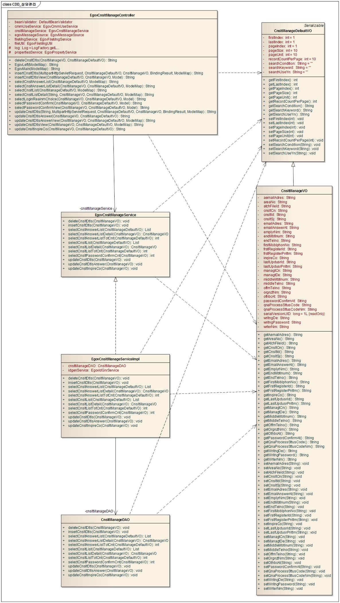

### ID Generation

#### ID Generation 관련 DDL 및 DML

 ID Generation Service를 활용하기 위해서 Sequence 저장테이블인  COMTECOPSEQ에 CNSLT_ID 항목을 추가해야 한다.

```sql
CREATE TABLE COMTECOPSEQ ( TABLE_NAME VARCHAR(20) NOT NULL, 
  		             NEXT_ID NUMERIC(30) NULL,
  		             PRIMARY KEY (TABLE_NAME));
 
  INSERT INTO COMTECOPSEQ VALUES('SCHDUL_ID','1');
```

#### ID Generation 환경설정(context-idgn-CnsltManage.xml)

```xml
<bean name="egovCnsltManageIdGnrService" class="egovframework.rte.fdl.idgnr.impl.EgovTableIdGnrServiceImpl" destroy-method="destroy">
        <property name="dataSource" ref="egov.dataSource" />
        <property name="strategy"   ref="cnsltManageStrategy" />
        <property name="blockSize"  value="10"/>
        <property name="table"      value="COMTECOPSEQ"/>
        <property name="tableName"  value="CNSLT_ID"/>
    </bean>
    <bean name="cnsltManageStrategy" class="egovframework.rte.fdl.idgnr.impl.strategy.EgovIdGnrStrategyImpl">
        <property name="prefix"   value="CNSLT_" />
        <property name="cipers"   value="14" />
        <property name="fillChar" value="0" />
    </bean>
```

### 관련테이블

| 테이블명 | 테이블명(영문) | 비고 |
| --- | --- | --- |
| 상담내역 | COMTNCNSLTLIST | 상담내용 및 조치처리내용(조치내용,조치일자)을 관리한다. |

## 관련기능

 상담관리기능은 크게 일반사용자가 사용하는 상담목록조회, 상담상세조회, 상담내역등록, 상담내역수정 기능 및 관리자가 사용하는 상담답변목록조회, 상담답변상세조회, 상담내역답변수정 기능으로 분류된다.

### 상담목록조회

#### 비즈니스 규칙

 조회조건으로 목록조회를 할 수 있고, 등록버튼을 클릭하여 상담등록 화면으로 이동하여 상담를 등록 처리 할 수 있다.

#### 관련코드

 N/A

#### 관련화면 및 수행매뉴얼

| Action | URL | Controller method | SQL Namespace | SQL QueryID |
| --- | --- | --- | --- | --- |
| 목록조회 | /uss/olp/cns/CnsltListInqire.do | selectCnsltList | "CnsltManageDAO" | "selectCnsltList" |
|  |  |  | "CnsltManageDAO" | "selectCnsltListTotCnt" |

 상담 목록은 페이지 당 10건씩 조회되며 페이징은 10페이지씩 이루어진다.
 검색조건은 작성자명, 상담제목에 대해서 수행된다.
 페이지 당 검색 범위를 변경하고자 하는 경우
 context-properties.xml 파일의 pageUnit, pageSize를 변경한다.(단 해당 설정은 전체 공통서비스 기능에 영향을 미친다.)

 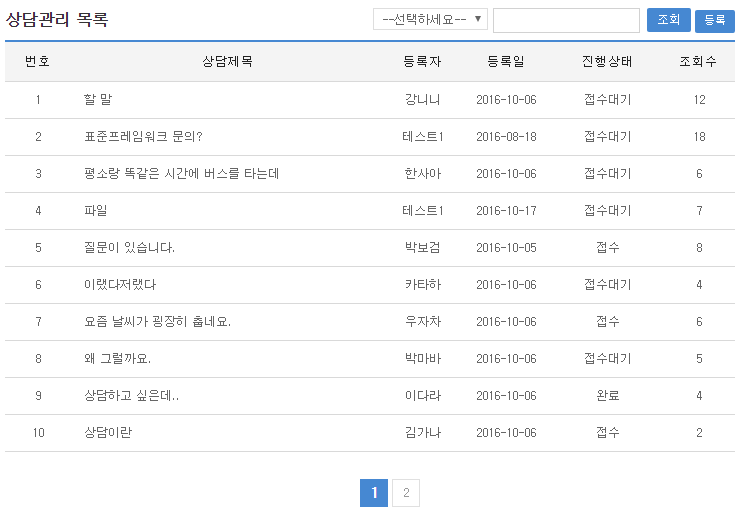

 조회: 상담를 조회하기 위해서는 상단의 검색조건을 선택 후 해당하는 검색문자를 입력 후 조회 버튼을 클릭한다.
 등록: 상담를 등록하기 위해서는 상단의 등록 버튼을 통해서 상담등록 화면으로 이동한다.
 목록클릭: 상담상세조회 화면으로 이동한다.

### 상담상세조회

#### 비즈니스 규칙

 상담목록조회에서 목록 클릭 시 이동되는 화면으로 상담에 대한 상세정보를 보여준다.

#### 관련코드

 N/A

#### 관련화면 및 수행매뉴얼

| Action | URL | Controller method | SQL Namespace | SQL QueryID |
| --- | --- | --- | --- | --- |
| 상세조회 | /uss/olp/cns/CnsltDetailInqire.do | selectCnsltListDetail | "CnsltManageDAO" | "selectCnsltListDetail" |
| 삭제 | /uss/olp/cns/CnsltDtlsDelete.do | deleteCnsltDtls | "CnsltManageDAO" | "deleteCnsltDtls" |

 상담 상세조회화면은 상담내역수정, 상담내역삭제, 상담목록조회를 할 수 있다.

 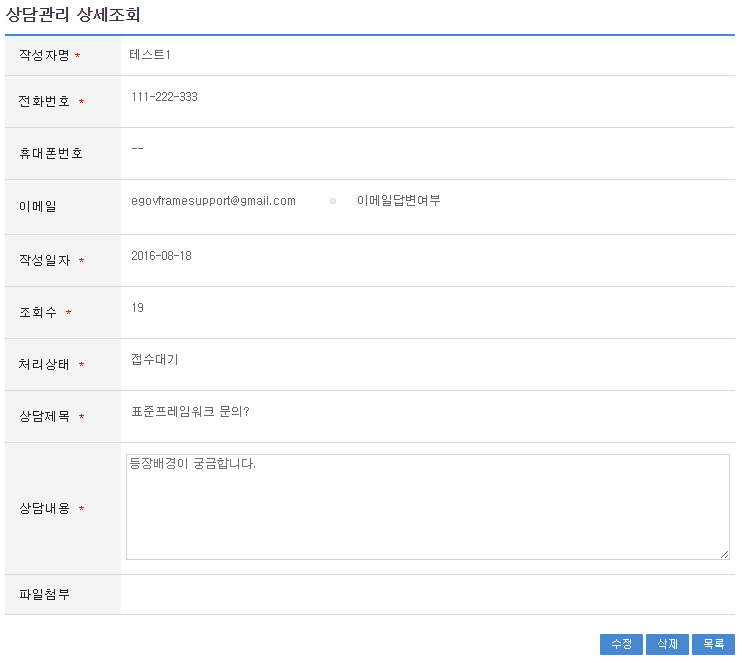

 수정 및 삭제 버튼 클릭 시 작성 비밀번호를 확인 후 상담 글을 수정 및 삭제 할 수 있도록 구성되어 있다.

 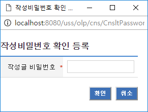

 수정: 수정버튼 클릭 시 상담를 수정할 수 있는 화면으로 이동한다.
 삭제: 삭제버튼 클릭 시 삭제여부를 확인하는 메시지를 보여주고 삭제처리를 할 수 있다.
 목록: 상담목록조회 화면으로 이동한다.

### 상담내역등록

#### 비즈니스 규칙

 상담에 관한 기본정보를 입력 저장처리한다. 입력명 우측의 빨간* 표시는 반드시 입력해야할 항목을 표시한다.

#### 관련코드

 N/A

#### 관련화면 및 수행매뉴얼

| Action | URL | Controller method | SQL Namespace | SQL QueryID |
| --- | --- | --- | --- | --- |
| 등록화면 | /uss/olp/cns/CnsltDtlsRegistView.do | insertCnsltDtlsView |  |  |
| 등록 | /uss/olp/cns/CnsltDtlsRegist.do | insertCnsltDtls | "CnsltManageDAO" | "insertCnsltDtls" |

 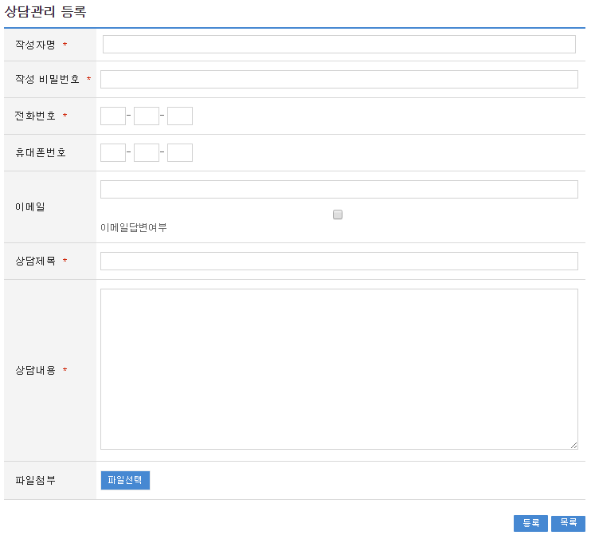

 파일첨부 시 찾아보기를 클릭하여 파일을 첨부할 수 있다(최대 3개 가능 - 설정가능)

 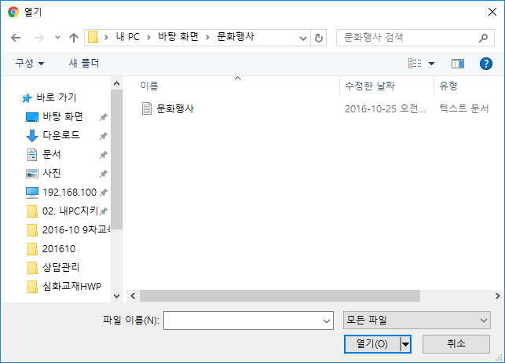

 등록: 입력한 상담정보들이 저장 처리된다.
 목록: 상담목록조회 화면으로 이동한다.

### 상담내역수정

#### 비즈니스 규칙

 수정 입력한 상담정보들을 저장 처리한다. 입력명 우측의 빨간* 표시는 수정 시 반드시 입력해야 할 항목을 표시한다.

#### 관련코드

 N/A

#### 관련화면 및 수행매뉴얼

| Action | URL | Controller method | SQL Namespace | SQL QueryID |
| --- | --- | --- | --- | --- |
| 수정화면 | /uss/olp/cns/CnsltDtlsUpdtView.do | updateCnsltDtlsView | "CnsltManageDAO" | "selectCnsltListDetail" |
| 수정 | /uss/olp/cns/CnsltDtlsUpdt.do | updateCnsltDtls | "CnsltManageDAO" | "updateCnsltDtls" |

 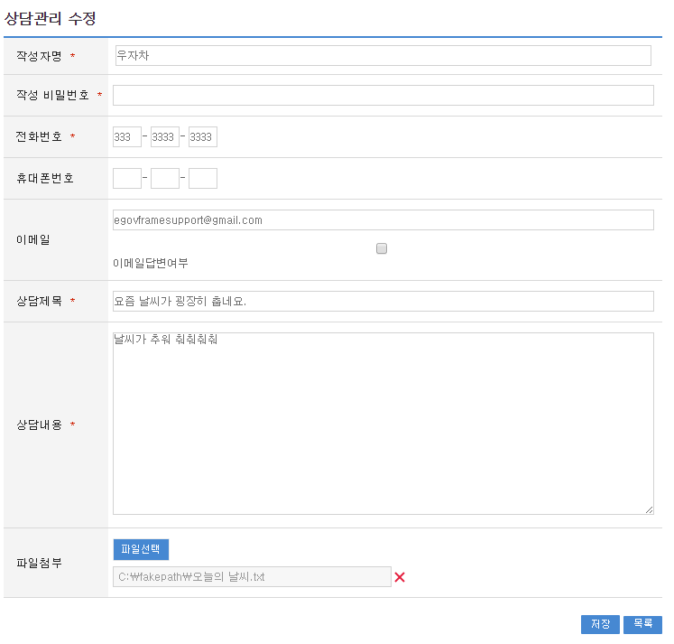

 파일첨부 시 찾아보기를 클릭하여 파일을 첨부할 수 있다(최대 3개 가능 - 설정가능)

 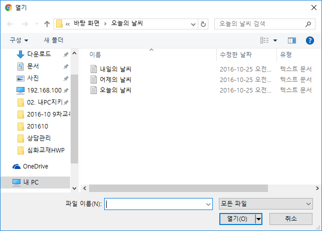

 저장: 수정 입력한 상담정보들이 저장 처리된다.
 목록: 상담목록조회 화면으로 이동한다.

### 상담답변목록조회

#### 비즈니스 규칙

 관리자가 답변글을 관리하기 위한 기능으로 조회조건으로 목록조회를 할 수 있고, 등록버튼을 클릭하여 상담등록 화면으로 이동하여 상담을 등록 처리 할 수 있다.

#### 관련코드

 N/A

#### 관련화면 및 수행매뉴얼

| Action | URL | Controller method | SQL Namespace | SQL QueryID |
| --- | --- | --- | --- | --- |
| 목록조회 | /uss/olp/cnm/CnsltAnswerListInqire.do | selectCnsltAnswerList | "CnsltManageDAO" | "selectCnsltAnswerList" |
|  |  |  | "CnsltManageDAO" | "selectCnsltAnswerListTotCnt" |

 상담 목록은 페이지 당 10건씩 조회되며 페이징은 10페이지씩 이루어진다.
 검색조건은 작성자명, 진행상태에 대해서 수행된다.
 페이지 당 검색 범위를 변경하고자 하는 경우
 context-properties.xml 파일의 pageUnit, pageSize를 변경한다.(단 해당 설정은 전체 공통서비스 기능에 영향을 미친다.)

 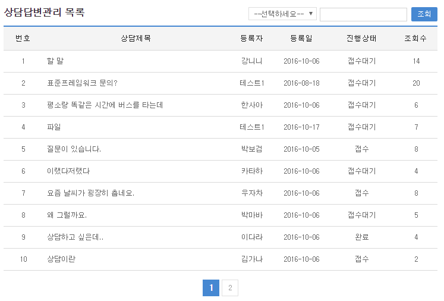

 조회: 상담를 조회하기 위해서는 상단의 검색조건을 선택 후 해당하는 검색문자를 입력 후 조회 버튼을 클릭한다.
 목록클릭: 상담상세조회 화면으로 이동한다.

### 상담답변상세조회

#### 비즈니스 규칙

 관리자에게 작성자정보 및 답변내용상세정보를 보여준다.

#### 관련코드

 N/A

#### 관련화면 및 수행매뉴얼

| Action | URL | Controller method | SQL Namespace | SQL QueryID |
| --- | --- | --- | --- | --- |
| 상세조회 | /uss/olp/cnm/CnsltAnswerDetailInqire.do | selectCnsltAnswerListDetail | "CnsltManageDAO" | "selectCnsltAnswerDetail" |

 상담답변상세조회화면은 상담내역답변수정, 상담답변목록조회를 할 수 있다.

 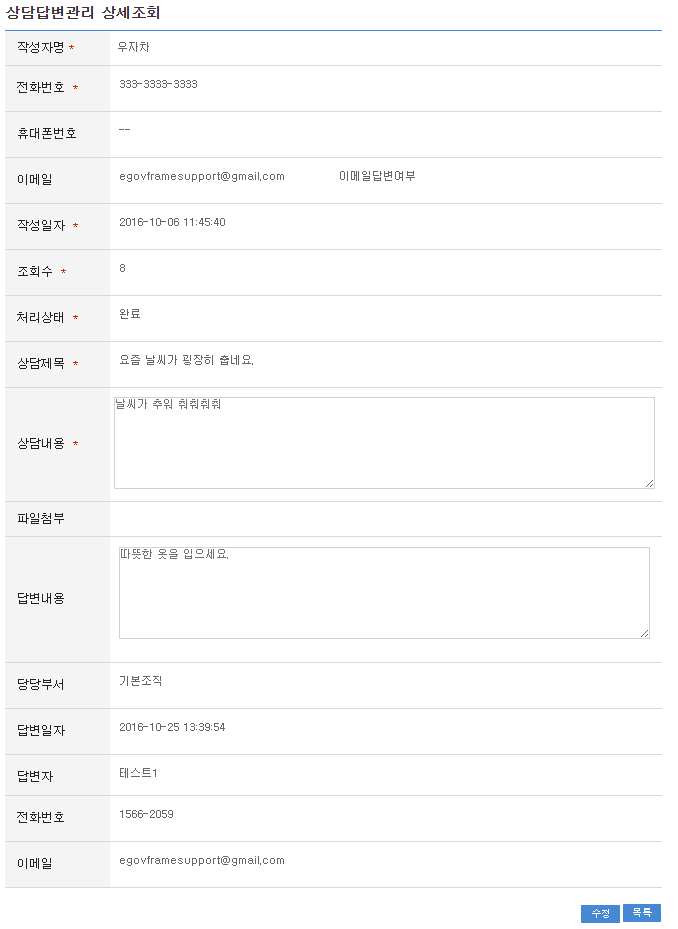

 수정: 수정버튼 클릭 시 상담를 수정할 수 있는 화면으로 이동한다.
 목록: 상담답변목록조회 화면으로 이동한다.

### 상담내역답변수정

#### 비즈니스 규칙

 입력한 상담정보들을 저장 처리한다. 작성자 정보는 참고만 할 수 있고, 하단의 답변내용만 입력 가능하도록 구성되어 있다.

#### 관련코드

 상담관리에서 사용되는 코드 및 그에 따른 설정 값의 반영사항은 다음과 같다.

| 코드분류 | 코드분류명 | 코드ID | 코드명 |
| --- | --- | --- | --- |
| COM028 | 질의응답처리상태 | 1 | 접수대기 |
| COM028 | 질의응답처리상태 | 2 | 접수 |
| COM028 | 질의응답처리상태 | 3 | 완료 |

 질의응답처리상태코드를 추가하여 사용 할 수 있다.

#### 관련화면 및 수행매뉴얼

| Action | URL | Controller method | SQL Namespace | SQL QueryID |
| --- | --- | --- | --- | --- |
| 수정화면 | /uss/olp/cnm/CnsltDtlsAnswerUpdtView.do | updateCnsltDtlsAnswerView | "CnsltManageDAO" | "selectCnsltAnswerDetail" |
| 수정 | /uss/olp/cnm/CnsltDtlsAnswerUpdt.do | updateCnsltDtlsAnswer | "CnsltManageDAO" | "updateCnsltDtlsAnswer" |

 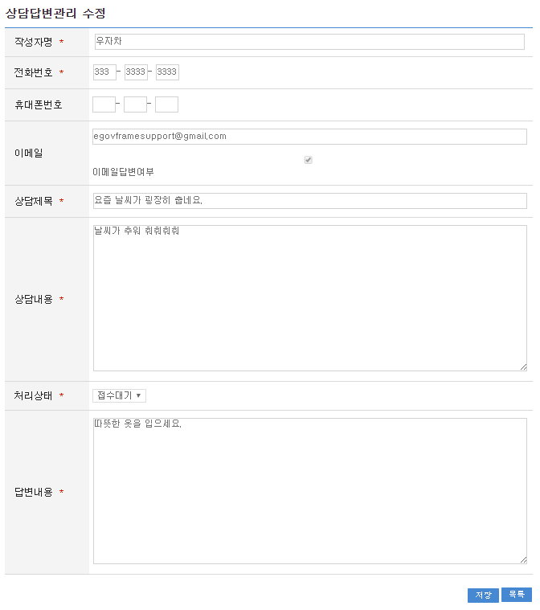

 저장: 수정 입력한 상담정보들이 저장 처리된다.
 목록: 상담목록조회 화면으로 이동한다.
