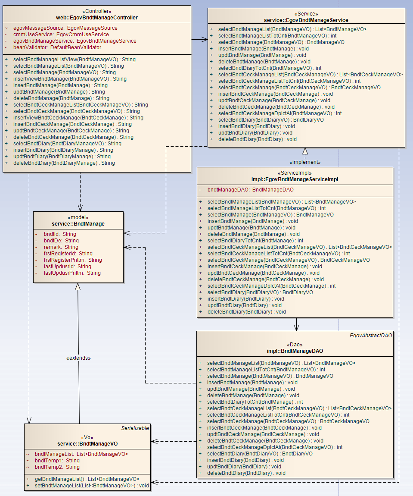
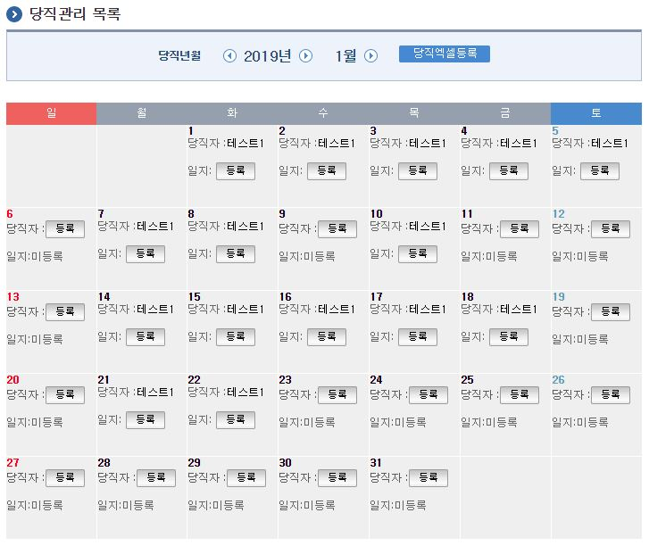
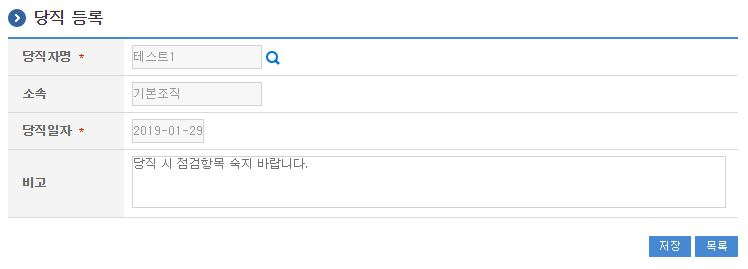
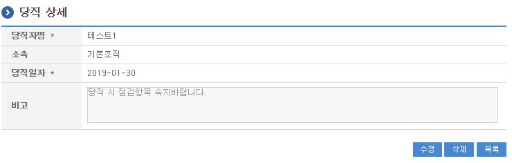
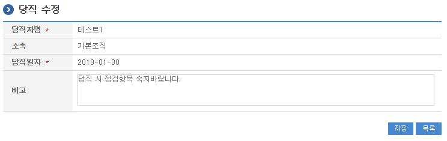
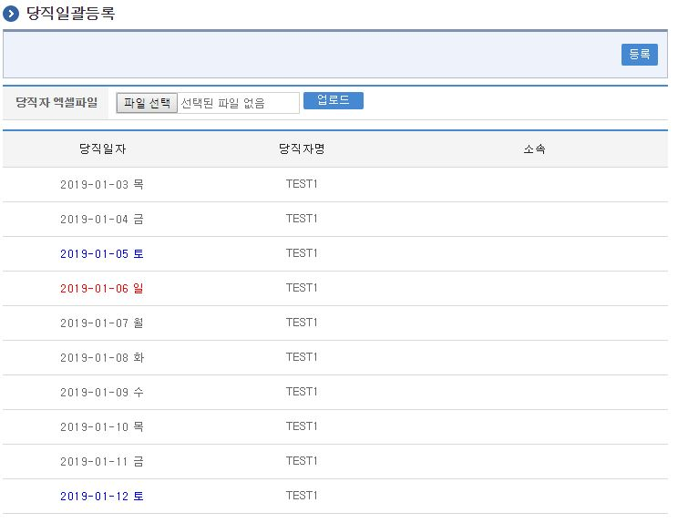
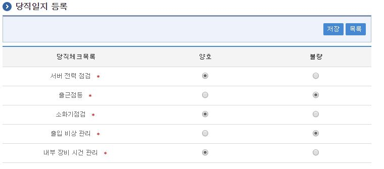
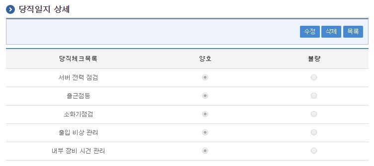
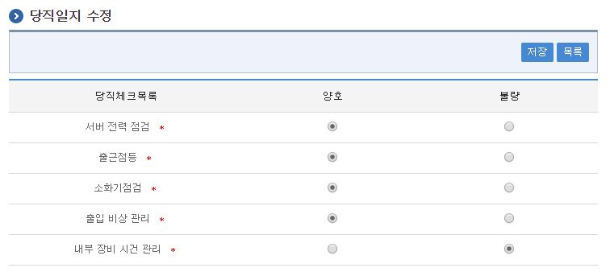

# 당직관리

## 개요

 당직관리는 시스템에서 당직자를 달력형태의 목록에 당직자를 지정하고 지정된 당직자의 점검일지를 관리하는 기능으로
 일자별 당직자등록, 당직체크코드를 활용한 점검일지를 등록 관리하는 기능을 제공한다.

## 설명

 당직관리는 일자별 당직자를 지정하기 위한 목적으로 당직 등록, 수정, 삭제, 조회, 당직목록조회의 기능을 수반한다.
 당직일지는 일자별 당직자의 당직활동일지를 작성하기 위한 목적으로 당직일지등록, 당직일지수정, 당직일지삭제, 당직일지상세조의 기능을 수반한다.

```text
  ① 당직관리목록 : 당직관리 정보를 최근 등록 순서대로 조회하고, 그 결과 목록을 화면에 반영한다.
  ② 당직등록 : 당직정보를 등록하고, 등록 결과를 조회한다.
  ③ 당직수정 : 기 등록된 당직정보의 항목들을 수정한다.
  ④ 당직삭제 : 기 등록된 당직정보를 삭제한다.
  ⑤ 당직상세조회 : 등록된 당직 상세정보를 조회한다.
  ⑥ 당직엑셀등록 : 당직정보를 엑셀에 저장된 내용을 일괄로 등록 처리한다.
  ⑦ 당직일지등록 : 당직일지정보를 등록하고, 등록 결과를 조회한다.
  ⑧ 당직일지수정 : 기 등록된 당직일지정보의 항목들을 수정한다.
  ⑨ 당직일지삭제 : 기 등록된 당직일지정보를 삭제한다.
```

### 관련소스

| 유형 | 대상소스명 | 비고 |
| --- | --- | --- |
| Controller | egovframework.com.uss.ion.bnt.web.EgovBndtManageController.java | 당직 관리를 위한 컨트롤러 클래스 |
| Service | egovframework.com.uss.ion.bnt.service.EgovBndtManageService.java | 당직 관리를 위한 서비스 인터페이스 |
| ServiceImpl | egovframework.com.uss.ion.bnt.service.impl.EgovBndtManageServiceImpl.java | 당직 관리를 위한 서비스 구현 클래스 |
| DAO | egovframework.com.uss.ion.bnt.service.impl.BndtManageDAO.java | 당직 관리를 위한 데이터처리 클래스 |
| VO | egovframework.com.uss.ion.bnt.service.BndtManageVO.java | 당직 관리를 위한 VO 클래스 |
| VO | egovframework.com.uss.ion.bnt.service.BndtCeckManageVO.java | 당직체크 관리를 위한 VO 클래스 |
| VO | egovframework.com.uss.ion.bnt.service.BndtDiaryVO.java | 당직일지 관리를 위한 VO 클래스 |
| JSP | /WEB-INF/jsp/egovframework/com/uss/ion/bnt/EgovBndtManageList.jsp | 당직관리 목록조회를 위한 jsp페이지 |
| JSP | /WEB-INF/jsp/egovframework/com/uss/ion/bnt/EgovBndtManageRegist.jsp | 당직 등록을 위한 jsp페이지 |
| JSP | /WEB-INF/jsp/egovframework/com/uss/ion/bnt/EgovBndtManageDetail.jsp | 등록된 당직을 상세조회/반영하기 위한 jsp페이지 |
| JSP | /WEB-INF/jsp/egovframework/com/uss/ion/bnt/EgovBndtManageUpdt.jsp | 당직 수정을 위한 jsp페이지 |
| JSP | /WEB-INF/jsp/egovframework/com/uss/ion/bnt/EgovBndtManageBndeListPop.jsp | 당직 엑셀파일 사용 등록을 위한 jsp페이지 |
| JSP | /WEB-INF/jsp/egovframework/com/uss/ion/bnt/EgovBndtCeckManageList.jsp | 당직체크관리 목록조회를 위한 jsp페이지 |
| JSP | /WEB-INF/jsp/egovframework/com/uss/ion/bnt/EgovBndtCeckManageRegist.jsp | 당직체크 등록을 위한 jsp페이지 |
| JSP | /WEB-INF/jsp/egovframework/com/uss/ion/bnt/EgovBndtCeckManageDetail.jsp | 등록된 당직체크 상세조회/반영하기 위한 jsp페이지 |
| JSP | /WEB-INF/jsp/egovframework/com/uss/ion/bnt/EgovBndtCeckManageUpdt.jsp | 당직체크 수정을 위한 jsp페이지 |
| JSP | /WEB-INF/jsp/egovframework/com/uss/ion/bnt/EgovBndtDiaryDetail.jsp | 당직일지 상세 확인을 위한 jsp페이지 |
| JSP | /WEB-INF/jsp/egovframework/com/uss/ion/bnt/EgovBndtDiaryRegist.jsp | 당직일지 등록을 위한 jsp페이지 |
| JSP | /WEB-INF/jsp/egovframework/com/uss/ion/bnt/EgovBndtDiaryUpdt.jsp | 당직일지 수정을 위한 jsp페이지 |
| Query XML | resources/egovframework/mapper/com/uss/ion/bnt/EgovBndtManage\_SQL\_altibase.xml | 당직관리,일지,체크 Altibase XML |
| Query XML | resources/egovframework/mapper/com/uss/ion/bnt/EgovBndtManage\_SQL\_cubrid.xml | 당직관리,일지,체크 Cubrid XML |
| Query XML | resources/egovframework/mapper/com/uss/ion/bnt/EgovBndtManage\_SQL\_mysql.xml | 당직관리,일지,체크 MySQL XML |
| Query XML | resources/egovframework/mapper/com/uss/ion/bnt/EgovBndtManage\_SQL\_maria.xml | 당직관리,일지,체크 MariaDB XML |
| Query XML | resources/egovframework/mapper/com/uss/ion/bnt/EgovBndtManage\_SQL\_tibero.xml | 당직관리,일지,체크 Tibero XML |
| Query XML | resources/egovframework/mapper/com/uss/ion/bnt/EgovBndtManage\_SQL\_postgres.xml | 당직관리,일지,체크 PostgreSQL XML |
| Query XML | resources/egovframework/mapper/com/uss/ion/bnt/EgovBndtManage\_SQL\_oracle.xml | 당직관리,일지,체크 Oracle XML |
| Query XML | resources/egovframework/mapper/com/uss/ion/bnt/EgovBndtManage\_SQL\_goldilocks.xml | 당직관리,일지,체크 Goldilocks XML |
| Message properties | resources/egovframework/message/com/uss/ion/bnt/message\_ko.properties | 당직 관리 Message properties |
| Message properties | resources/egovframework/message/com/uss/ion/bnt/message\_en.properties | 당직 관리 Message properties |

### 클래스 다이어그램

 

### 관련테이블

| 테이블명 | 테이블명(영문) | 비고 |
| --- | --- | --- |
| 당직관리정보 | COMTNBNDTMANAGE | 당직정보를 관리하기 위한 속성정보를 정의하고, 관리한다. |

## 관련화면 및 수행메뉴얼

### 당직관리 목록조회

| Action | URL | Controller method | QueryID |
| --- | --- | --- | --- |
| 조회 | /uss/ion/bnt/selectBndtManageList.do | selectBndtManageList | "bndtManageDAO.selectBndtManageList" |
| 조회 | /uss/ion/bnt/selectBndtManageList.do | selectBndtManageList | "bndtManageDAO.selectBndtManageListTotCnt" |

 당직관리 목록은 달력형태로 1달 주기로 일자별로 당직자와 당직일지를 호출 이루어진다.
 검색조건은 "년도", "월"을 선택하면 수행된다.

 

 조회 : 기 등록된 당직관리의 목록을 조회한다.(년월 버튼이동시 조회됨)
 당직 등록  : 신규 당직을 등록하기 위해서는 상단의 등록 버튼을 통해서 당직 등록 화면으로 이동한다.
 당직상세조회: 등록된 당직 달력의 해당일자 당직자명을 클릭하면 당직상세정보 화면으로 이동한다.
 당직일지 등록 : 등록된 당직자가 당직일지를 등록하기 위해서는 상단의 등록 버튼을 통해서 당직일지 등록 화면으로 이동한다.
 당직일지 상세조회: 등록된 당직 달력의 해당일자 당직일지 작성완료를 클릭하면 당직일지 상세정보 화면으로 이동한다.
 당직엑셀: 당직정보를 입력형식에 맞춰 엑셀에 등록된 내용으로 일괄등록 처리하는 화면으로 이동한다.

### 당직 등록

| Action | URL | Controller method | QueryID |
| --- | --- | --- | --- |
| 등록 | /uss/ion/bnt/insertBndtManage.do | insertBndtManage | "bndtManageDAO.insertBndtManage" |
| 등록 | /uss/ion/bnt/insertBndtManage.do | insertBndtManage | "bndtManageDAO.insertBndtManage" |

 당직의 속성정보를 입력한 뒤 등록한다.

 

 등록 : 신규 당직을 등록하기 위해서는 당직 속성을 입력한 뒤 상단의 당직 버튼을 통해서 당직을 등록한다.
 목록 : 당직 목록조회 화면으로 이동한다.

### 당직 상세

| Action | URL | Controller method | QueryID |
| --- | --- | --- | --- |
| 상세조회 | /uss/ion/bnt/selectBndtManage.do | selectBndtManage | "bndtManageDAO.selectBndtManage" |
| 삭제 | /uss/ion/bnt/deleteBndtManage.do | deleteBndtManage | "bndtManageDAO.deleteBndtManage" |

 당직의 상세조회화면이다. 수정 버튼을 통해서 수정화면으로 이동하고, 삭제 버튼을 통해서 당직을 삭제한다.

 

 수정 : 당직 수정 화면으로 이동한다.
 삭제 : 삭제 버튼을 통해서 기 등록된 당직정보를 삭제한다.
 목록 : 당직 목록조회 화면으로 이동한다.

### 당직 수정

| Action | URL | Controller method | QueryID |
| --- | --- | --- | --- |
| 수정 | /uss/ion/bnt/updtBndtManage.do | updtBndtManage | "bndtManageDAO.updtBndtManage" |
| 상세조회 | /uss/ion/bnt/selectBndtManage.do | selectBndtManage | "bndtManageDAO.selectBndtManage" |

 당직의 속성정보를 변경한 후 저장한다. 다음 화면은 당직 상세조회 화면과 동일하다.

 

 수정 : 기 등록된 당직 속성을 수정한 뒤 상단의 수정 버튼을 통해서 당직 정보를 수정한다.
 목록 : 당직 목록조회 화면으로 이동한다.

### 당직일괄등록

| Action | URL | Controller method | QueryID |
| --- | --- | --- | --- |
| 당직엑셀등록 화면조회 | /uss/ion/bnt/EgovBndtManageListPop.do | selectBndtManageBnde | "bndtManageDAO.selectBndtManageBnde" |
| 당직엑셀등록 데이터 출력 | /uss/ion/bnt/EgovBndtManageListPopAction.do | selectBndtManageBnde | "bndtManageDAO.selectBndtManageBnde" |
| 당직엑셀등록 처리 | /uss/ion/bnt/insertBndtManageBnde.do | insertBndtManageBnde | "bndtManageDAO.insertBndtManageBnde" |

 당직정보를 입력형식에 맞춰 엑셀에 등록된 내용을 일괄등록 처리한다.
 입력형식은
 xls : [excelbndt.xls](https://www.egovframe.go.kr/wiki/lib/exe/fetch.php?media=egovframework:com:v3.9:uss:excelbndt.xls)
 xlsx : [excelbndt.xlsx](https://www.egovframe.go.kr/wiki/lib/exe/fetch.php?media=egovframework:com:v3.9:uss:excelbndt.xlsx)
 참조 작성한다.

 

 업로더 : 작성된 당직엑셀파일을 서버에 업로더하여 데이터를 화면에 조회한다.
 등록 : 조회된 데이터를 일괄등록 처리한다.

### 당직일지 등록

| Action | URL | Controller method | QueryID |
| --- | --- | --- | --- |
| 등록 | /uss/ion/bnt/insertBndtManage.do | insertBndtManage | "bndtManageDAO.insertBndtManage" |
| 등록 | /uss/ion/bnt/insertBndtManage.do | insertBndtManage | "bndtManageDAO.insertBndtManage" |

 당직체크코드 중 사용여부 필드중 사용으로 정의된 필드를 토대로 당직일지의 정보가 화면에 출력된다.

 

 등록 : 신규 당직일지를 등록하기 위해서는 당직일지 속성을 입력한 뒤 상단의 당직일지 버튼을 통해서 당직일지를 등록한다.
 목록 : 당직일지 목록조회 화면으로 이동한다.

### 당직일지 상세

| Action | URL | Controller method | QueryID |
| --- | --- | --- | --- |
| 상세조회 | /uss/ion/bnt/selectBndtManage.do | selectBndtManage | "bndtManageDAO.selectBndtManage" |
| 삭제 | /uss/ion/bnt/deleteBndtManage.do | deleteBndtManage | "bndtManageDAO.deleteBndtManage" |

 당직일지의 상세조회 화면이다. 수정 버튼을 통해서 수정화면으로 이동하고, 삭제 버튼을 통해서 당직일지를 삭제한다.

 

 수정 : 당직일지 수정 화면으로 이동한다.
 삭제 : 삭제 버튼을 통해서 기 등록된 당직일지정보를 삭제한다.
 목록 : 당직일지 목록조회 화면으로 이동한다.

### 당직일지 수정

| Action | URL | Controller method | QueryID |
| --- | --- | --- | --- |
| 수정 | /uss/ion/bnt/updtBndtManage.do | updtBndtManage | "bndtManageDAO.updtBndtManage" |
| 상세조회 | /uss/ion/bnt/selectBndtManage.do | selectBndtManage | "bndtManageDAO.selectBndtManage" |

 당직일지의 속성정보를 변경한 후 저장한다. 다음 화면은 당직일지 상세조회 화면과 동일하다.

 

 수정 : 기 등록된 당직일지 속성을 수정한 뒤 상단의 수정 버튼을 통해서 당직일지 정보를 수정한다.
 목록 : 당직일지 목록조회 화면으로 이동한다.

