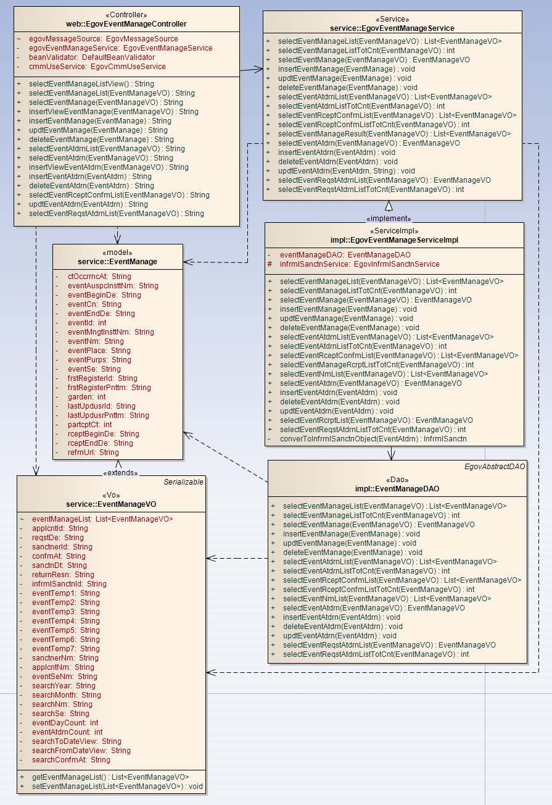
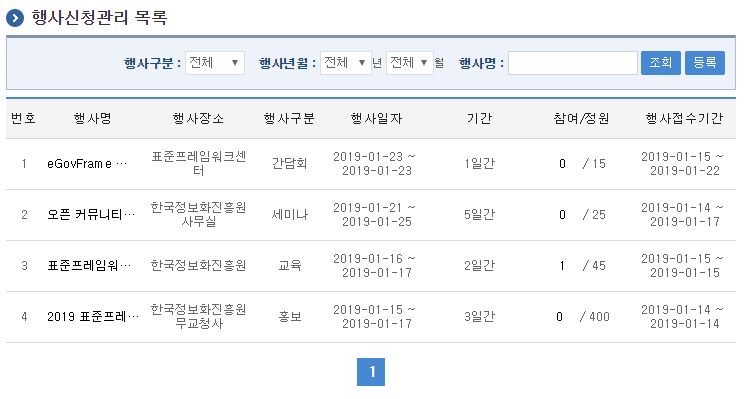
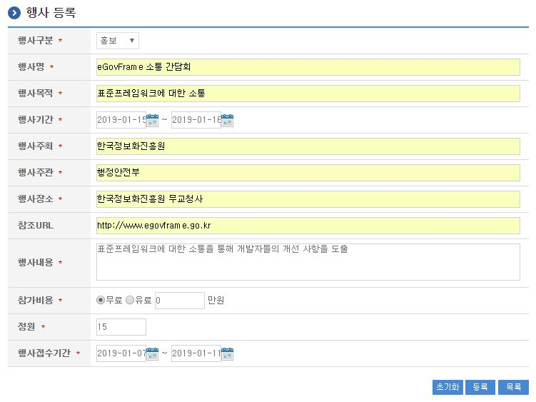
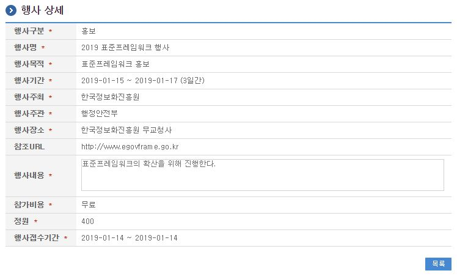
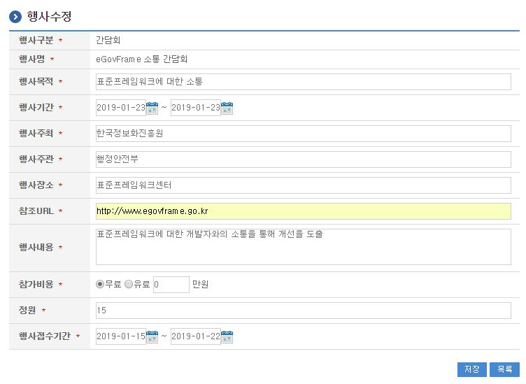

# 행사신청관리

## 개요

 행사신청관리는 시스템에서 행사에 대한 정보를 등록/관리하는 기능으로
 행사구분, 행사명, 행사목적, 행사주최/주관, 행사장소, 행사기간및 행사접수기간, 참가비용, 정원신청 등의 정보를 등록하고 관리한다.

## 설명

 행사신청관리는 행사를 등록하기 위한 목적으로 행사 등록, 수정, 삭제, 조회, 목록조회의 기능을 수반한다.

 ① 행사관리목록 : 행사관리 정보를 최근 등록 순서대로 조회하고, 그 결과 목록을 화면에 반영한다.
 ② 행사등록 : 행사정보를 등록하고, 등록 결과를 조회한다.
 ③ 행사수정 : 기 등록된 행사정보의 항목들을 수정한다.
 ④ 행사삭제 : 기 등록된 행사정보를 삭제한다.
 ⑤ 행사상세조회 : 등록된 행사 상세정보를 조회한다.

### 관련소스

| 유형 | 대상소스명 | 비고 |
| --- | --- | --- |
| Controller | egovframework.com.uss.ion.evt.web.EgovEventManageController.java | 행사 관리를 위한 컨트롤러 클래스 |
| Service | egovframework.com.uss.ion.evt.service.EgovEventManageService.java | 행사 관리를 위한 서비스 인터페이스 |
| ServiceImpl | egovframework.com.uss.ion.evt.service.impl.EgovEventManageServiceImpl.java | 행사 관리를 위한 서비스 구현 클래스 |
| DAO | egovframework.com.uss.ion.evt.service.impl.EventManageDAO.java | 행사 관리를 위한 데이터처리 클래스 |
| VO | egovframework.com.uss.ion.evt.service.EventManageVO.java | 행사 관리를 위한 VO 클래스 |
| Model | egovframework.com.uss.ion.evt.service.EventManage.java | 행사 관리를 위한 Model 클래스 |
| JSP | /WEB-INF/jsp/egovframework/com/uss/ion/evt/EgovEventReqstManageList.jsp | 행사 목록조회를 위한 jsp페이지 |
| JSP | /WEB-INF/jsp/egovframework/com/uss/ion/evt/EgovEventReqstRegist.jsp | 행사 등록을 위한 jsp페이지 |
| JSP | /WEB-INF/jsp/egovframework/com/uss/ion/evt/EgovEventReqstDetail.jsp | 등록된 행사를 상세조회/반영하기 위한 jsp페이지 |
| JSP | /WEB-INF/jsp/egovframework/com/uss/ion/evt/EgovEventReqstUpdt.jsp | 행사 수정을 위한 jsp페이지 |
| JSP | /WEB-INF/jsp/egovframework/com/uss/ion/evt/EgovEventReqstAtdrnList.jsp | 행사 참석자 내역조회 팝업 jsp페이지 |
| Query XML | resources/egovframework/mapper/com/uss/ion/evt/EgovEventManage\_SQL\_altibase.xml | 행사 관리 Altibase XML |
| Query XML | resources/egovframework/mapper/com/uss/ion/evt/EgovEventManage\_SQL\_cubrid.xml | 행사 관리 Cubrid XML |
| Query XML | resources/egovframework/mapper/com/uss/ion/evt/EgovEventManage\_SQL\_mysql.xml | 행사 관리 MySQL XML |
| Query XML | resources/egovframework/mapper/com/uss/ion/evt/EgovEventManage\_SQL\_maria.xml | 행사 관리 MariaDB XML |
| Query XML | resources/egovframework/mapper/com/uss/ion/evt/EgovEventManage\_SQL\_tibero.xml | 행사 관리 Tibero XML |
| Query XML | resources/egovframework/mapper/com/uss/ion/evt/EgovEventManage\_SQL\_postgres.xml | 행사 관리 PostgreSQL XML |
| Query XML | resources/egovframework/mapper/com/uss/ion/evt/EgovEventManage\_SQL\_oracle.xml | 행사 관리 Oracle XML |
| Query XML | resources/egovframework/mapper/com/uss/ion/evt/EgovEventManage\_SQL\_goldilocks.xml | 행사 관리 Goldilocks XML |
| Message properties | resources/egovframework/message/com/uss/ion/evt/message\_ko.properties | 행사 관리  Message properties |
| Message properties | resources/egovframework/message/com/uss/ion/evt/message\_en.properties | 행사 관리  Message properties |
| Idgen XML | resources/egovframework/spring/com/idgn/context-idgn-EventManage.xml | 행사관리를 위한 Id생성 Idgen XML |

### 클래스 다이어그램

 

### 관련테이블

| 테이블명 | 테이블명(영문) | 비고 |
| --- | --- | --- |
| 행사관리 | COMTNEVENTMANAGE | 행사정보를 관리하기 위한 속성정보를 정의하고, 관리한다. |

### ID Generation 관련 DDL 및 DML

 ID Generation Service를 활용하기 위해서 Sequence 저장테이블인  COMTECOPSEQ에 EVENT_ID 항목을 추가해야 한다.

```sql
CREATE TABLE COMTECOPSEQ ( table_name varchar(16) NOT NULL, 
                               next_id DECIMAL(30) NOT NULL,
                               PRIMARY KEY (table_name)
    );
 
    INSERT INTO COMTECOPSEQ VALUES ('EVENT_ID','0');
```

### ID Generation 환경설정(context-idgn-EventManage.xml)

```xml
<bean name="egovEventManageIdGnrService" class="egovframework.rte.fdl.idgnr.impl.EgovTableIdGnrServiceImpl" destroy-method="destroy">
        <property name="dataSource" ref="egov.dataSource" />
        <property name="strategy"   ref="eventManageEventIdStrategy" />
        <property name="blockSize"  value="10"/>
        <property name="table"      value="COMTECOPSEQ"/>
        <property name="tableName"  value="EVENT_ID"/>
    </bean>
    <bean name="eventManageEventIdStrategy" class="egovframework.rte.fdl.idgnr.impl.strategy.EgovIdGnrStrategyImpl">
        <property name="prefix"   value="EVENT_" />
        <property name="cipers"   value="14" />
        <property name="fillChar" value="0" />
    </bean>
```

## 관련화면 및 수행매뉴얼

### 행사관리 목록조회

| Action | URL | Controller method | QueryID |
| --- | --- | --- | --- |
| 조회 | /uss/ion/evt/EgovEventReqstManageList.do | selectEventManageList | "eventManageDAO.selectEventManageList" |
| 조회 | /uss/ion/evt/EgovEventReqstManageList.do | selectEventManageList | "eventManageDAO.selectEventManageListTotCnt" |

 행사관리 목록은 페이지당 10건씩 조회되며 페이징은 10페이지씩 이루어진다.
 검색조건은 행사구분, 행사년월, 행사명에 대해서 수행된다.

 

 조회 : 기 등록된 행사관리의 목록을 조회한다.
 등록 : 신규 행사를 등록하기 위해서는 상단의 등록 버튼을 통해서 행사 등록 화면으로 이동한다.
 상세조회: 등록된 행사 목록(행사명)을 클릭하면 상세정보 화면으로 이동한다.
 행사참석자목록: 등록된 행사 목록(참여/정원)중 참여인원을 클릭하면 행사참석자목록 팝업화면을 호출한다.

### 행사 등록

| Action | URL | Controller method | QueryID |
| --- | --- | --- | --- |
| 등록 | /uss/ion/evt/insertEventManage.do | insertEventManage | "eventManageDAO.insertEventManage" |

 행사의 속성정보를 입력한 뒤 등록한다.

 

 초기화 : 입력필드의 내용을 초기상태로 변경한다.
 등록 : 신규 행사를 등록하기 위해서는 행사 속성을 입력한 뒤 상단의 행사 버튼을 통해서 행사를 등록한다.
 목록 : 행사 목록조회 화면으로 이동한다.

### 행사 상세

| Action | URL | Controller method | QueryID |
| --- | --- | --- | --- |
| 상세조회 | /uss/ion/evt/EgovEventReqstDetail.do | selectEventManage | "eventManageDAO.selectEventManage" |
| 삭제 | /uss/ion/evt/EgovEventReqstDelete.do | deleteEventManage | "eventManageDAO.deleteEventManage" |

 행사의 상세조회화면이다. 수정 버튼을 통해서 수정화면으로 이동하고, 삭제 버튼을 통해서 행사를 삭제한다.
 행사접수기간이 도래한 경우엔 수정 버튼과 삭제 버튼이 비활성화되어 화면에서 보이지 않는다.

 

 수정 : 행사 수정 화면으로 이동한다.
 삭제 : 삭제 버튼을 통해서 기 등록된 행사정보를 삭제한다.
 목록 : 행사 목록조회 화면으로 이동한다.

### 행사 수정

| Action | URL | Controller method | QueryID |
| --- | --- | --- | --- |
| 수정 | /uss/ion/evt/EgovEventReqstSave.do | updtEventManage | "eventManageDAO.updtEventManage" |
| 상세조회 | /uss/ion/evt/EgovEventReqstDetail.do | selectEventManage | "eventManageDAO.selectEventManage" |

 행사의 속성정보를 변경한 후 저장한다. 다음 화면은 행사 상세조회 화면과 동일하다.

 

 저장 : 기 등록된 행사 속성을 수정한 뒤 상단의 수정 버튼을 통해서 행사 정보를 수정한다.
 목록 : 행사 목록조회 화면으로 이동한다.
