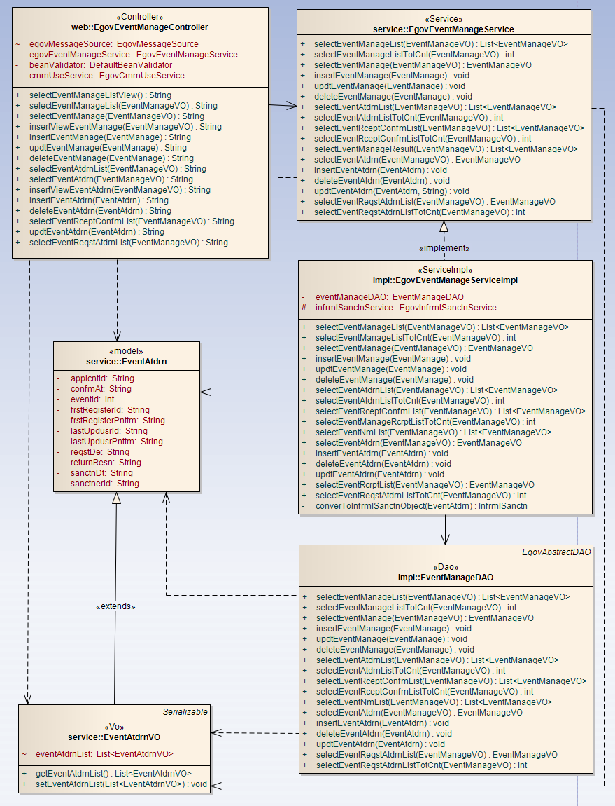
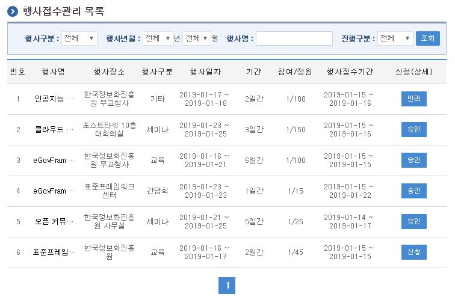
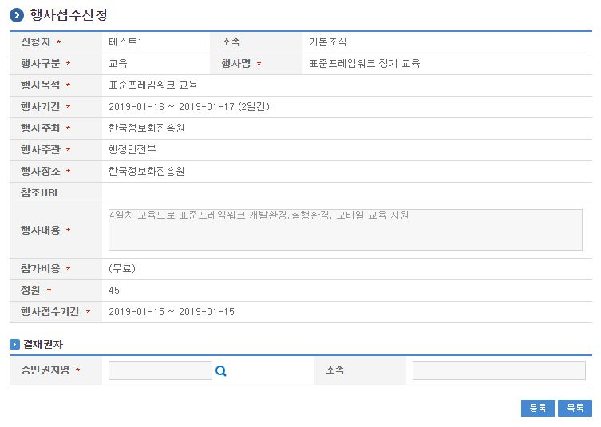
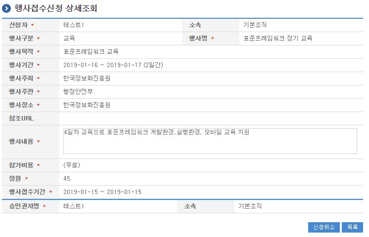

# 행사접수관리

## 개요

 행사접수관리는 시스템에서 행사에 대한 개인별 행사접수 신청처리를 관리하는 기능을 제공한다.

## 설명

 행사접수관리는 행사참석자의 온라인 행사접수을 등록하기 위한 목적으로 행사접수 신청, 취소, 상세조회, 목록조회, 승인처리의 기능을 수반한다.

 ① 행사접수관리목록 : 행사접수관리 정보를 최근 등록 순서대로 조회하고, 그 결과 목록을 화면에 반영한다.
 ② 행사접수신청 : 행사접수정보를 등록하고, 등록 결과를 조회한다.
 ④ 행사접수취소 : 기 등록된 행사접수정보를 삭제한다.
 ⑤ 행사접수상세조회 : 등록된 행사접수 상세정보를 조회한다.
 ① 행사접수승인 : 행사접수관리 정보를 최근 등록 순서대로 조회하고, 해당데이터를 승인/반려 처리한다.
 ① 행사상세팝업 : 행사관리 상세정보를 팝업화면 조회한다.

### 관련소스

| 유형 | 대상소스명 | 비고 |
| --- | --- | --- |
| Controller | egovframework.com.uss.ion.evt.web.EgovEventManageController.java | 행사 관리를 위한 컨트롤러 클래스 |
| Service | egovframework.com.uss.ion.evt.service.EgovEventManageService.java | 행사 관리를 위한 서비스 인터페이스 |
| ServiceImpl | egovframework.com.uss.ion.evt.service.impl.EgovEventManageServiceImpl.java | 행사 관리를 위한 서비스 구현 클래스 |
| DAO | egovframework.com.uss.ion.evt.service.impl.EventManageDAO.java | 행사 관리를 위한 데이터처리 클래스 |
| VO | egovframework.com.uss.ion.evt.service.EventManageVO.java | 행사 관리를 위한 VO 클래스 |
| VO | egovframework.com.uss.ion.evt.service.EventAtdrnVO.java | 행사 예약 관리를 위한 VO 클래스 |
| Model | egovframework.com.uss.ion.evt.service.EventAtdrn.java | 행사 예약 관리를 위한 Model 클래스 |
| JSP | /WEB-INF/jsp/egovframework/com/uss/ion/evt/EgovEventRceptManageList.jsp | 행사접수 목록조회를 위한 jsp페이지 |
| JSP | /WEB-INF/jsp/egovframework/com/uss/ion/evt/EgovEventRceptRegist.jsp | 행사접수 신청을 위한 jsp페이지 |
| JSP | /WEB-INF/jsp/egovframework/com/uss/ion/evt/EgovEventRceptDetail.jsp | 신청된 행사접수에 대한 상세조회/반영하기 위한 jsp페이지 |
| JSP | /WEB-INF/jsp/egovframework/com/uss/ion/evt/EgovEventRceptConfm.jsp | 행사접수 승인처리를 위한 jsp페이지 |
| Query XML | resources/egovframework/mapper/com/uss/ion/evt/EgovEventManage\_SQL\_altibase.xml | 행사 관리 Altibase XML |
| Query XML | resources/egovframework/mapper/com/uss/ion/evt/EgovEventManage\_SQL\_cubrid.xml | 행사 관리 Cubrid XML |
| Query XML | resources/egovframework/mapper/com/uss/ion/evt/EgovEventManage\_SQL\_mysql.xml | 행사 관리 MySQL XML |
| Query XML | resources/egovframework/mapper/com/uss/ion/evt/EgovEventManage\_SQL\_maria.xml | 행사 관리 MariaDB XML |
| Query XML | resources/egovframework/mapper/com/uss/ion/evt/EgovEventManage\_SQL\_tibero.xml | 행사 관리 Tibero XML |
| Query XML | resources/egovframework/mapper/com/uss/ion/evt/EgovEventManage\_SQL\_postgres.xml | 행사 관리 PostgreSQL XML |
| Query XML | resources/egovframework/mapper/com/uss/ion/evt/EgovEventManage\_SQL\_oracle.xml | 행사 관리 Oracle XML |
| Query XML | resources/egovframework/mapper/com/uss/ion/evt/EgovEventManage\_SQL\_goldilocks.xml | 행사 관리 Goldilocks XML |
| Message properties | resources/egovframework/message/com/uss/ion/evt/message\_ko.properties | 행사 관리  Message properties |
| Message properties | resources/egovframework/message/com/uss/ion/evt/message\_en.properties | 행사 관리  Message properties |
| Idgen XML | resources/egovframework/spring/com/idgn/context-idgn-EventAtdrn.xml | 행사관리를 위한 Id생성 Idgen XML |

### 클래스 다이어그램

 

### 관련테이블

| 테이블명 | 테이블명(영문) | 비고 |
| --- | --- | --- |
| 행사관리 | COMTNEVENTMANAGE | 행사정보를 관리하기 위한 속성정보를 정의하고, 관리한다. |
| 행사참석자 | COMTNEVENTATDRN | 행사 참석자정보를 관리하기 위한 속성정보를 정의하고, 관리한다. |

### ID Generation 관련 DDL 및 DML

 ID Generation Service를 활용하기 위해서 Sequence 저장테이블인  COMTECOPSEQ에 APPLCNT_ID 항목을 추가해야 한다.

```sql
CREATE TABLE COMTECOPSEQ ( table_name varchar(16) NOT NULL, 
                               next_id DECIMAL(30) NOT NULL,
                               PRIMARY KEY (table_name)
    );
 
    INSERT INTO COMTECOPSEQ VALUES ('APPLCNT_ID','0');
```

### ID Generation 환경설정(context-idgn-EventAtdrn.xml)

```xml
<bean name="egovEventAtdrnIdGnrService" class="egovframework.rte.fdl.idgnr.impl.EgovTableIdGnrServiceImpl" destroy-method="destroy">
        <property name="dataSource" ref="egov.dataSource" />
        <property name="strategy"   ref="eventAtdrnApplcntIdStrategy" />
        <property name="blockSize"  value="10"/>
        <property name="table"      value="COMTECOPSEQ"/>
        <property name="tableName"  value="APPLCNT_ID"/>
    </bean>
    <bean name="eventAtdrnApplcntIdStrategy" class="egovframework.rte.fdl.idgnr.impl.strategy.EgovIdGnrStrategyImpl">
        <property name="prefix"     value="APPLCNT_" />
        <property name="cipers"     value="12" />
        <property name="fillChar"   value="0" />
    </bean>
```

## 관련화면 및 수행매뉴얼

### 행사접수관리 목록조회

| Action | URL | Controller method | QueryID |
| --- | --- | --- | --- |
| 조회 | /uss/ion/evt/EgovEventRcrptManageList.do | selectEventAtdrnList | "eventManageDAO.selectEventAtdrnList" |
| 조회 | /uss/ion/evt/EgovEventRcrptManageList.do | selectEventAtdrnList | "eventManageDAO.selectEventAtdrnListTotCnt" |

 행사접수관리 목록은 페이지당 10건씩 조회되며 페이징은 10페이지씩 이루어진다.
 행사접수목록 화면은 행사관리목록 중 접수기간 내의 행사목록과 사용자가 참여(접수)했던 행사들의 목록을 보여주는 개인화면으로
 각 개인이 행사접수목록 화면을 통해 행사 참여를 신청하고, 신청한 행사의 승인/반려 여부를 확인하는 화면이다.
 행사접수기간내의 행사인 경우만 해당 행사내역과 신청버튼이 나타나며, 접수 종료된 경우는 목록에 나타나지 않는다.
 이전에 신청한 행사목록도 화면에 조회된다.
 검색조건은 행사구분, 행사년월, 행사명, 승인구분(신청전, 신청중, 승인, 반려)에 대해서 수행된다.
 신청(상세) 필드는 신청버튼, 신청중, 승인, 반려, 신청마감으로 정의된다.
 신청버튼을 통해서만 신청화면으로 이동되고, 그외는 상세화면으로 이동된다.

 

 조회 : 기 등록된 행사접수관리의 목록을 조회한다.
 신청 : 신규 행사접수을 등록하기 위해서는 목록의 신청(상세) 필드의 신청버튼을 통해서 행사접수 신청 화면으로 이동한다.
 상세조회: 등록된 행사접수 목록(신청-상세)을 클릭하면 행사접수 상세정보 화면으로 이동한다.

### 행사접수 신청

| Action | URL | Controller method | QueryID |
| --- | --- | --- | --- |
| 등록 | /uss/ion/evt/insertEventAtdrn.do | insertEventAtdrn | "eventManageDAO.insertEventAtdrn" |

 행사접수의 속성정보를 확인 후 신청한다.
 정원초과인 경우 등록버튼 클릭시 정원초과 메시지 팝업이 뜬다.

 

 등록 : 신규 행사접수을 신청하기 위해서는 행사접수 결재자정보를 입력한 뒤 상단의 등록 버튼을 통해서 행사접수을 등록한다.
 목록 : 행사접수 목록조회 화면으로 이동한다.

### 행사접수 상세

| Action | URL | Controller method | QueryID |
| --- | --- | --- | --- |
| 상세조회 | /uss/ion/evt/EgovEventRcrptDetail.do | selectEventAtdrn | "eventManageDAO.selectEventAtdrn" |
| 신청취소 | /uss/ion/evt/deleteEventAtdrn.do | deleteEventAtdrn | "eventManageDAO.deleteEventAtdrn" |

 행사접수의 상세조회화면이다.  신청취소  버튼을 통해서 행사접수을 신청을 취소한다.

 

 신청취소 : 신청취소 버튼을 통해서 기 등록된 행사접수정보를 삭제한다.
 목록 : 행사접수 목록조회 화면으로 이동한다.
