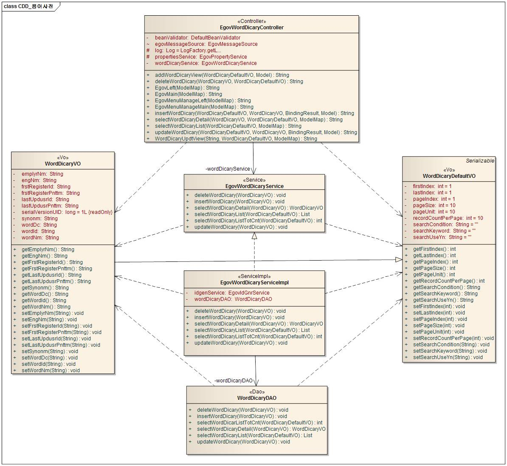
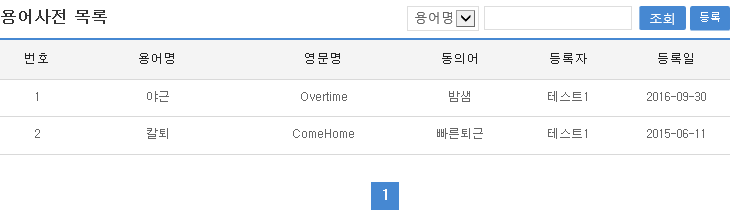
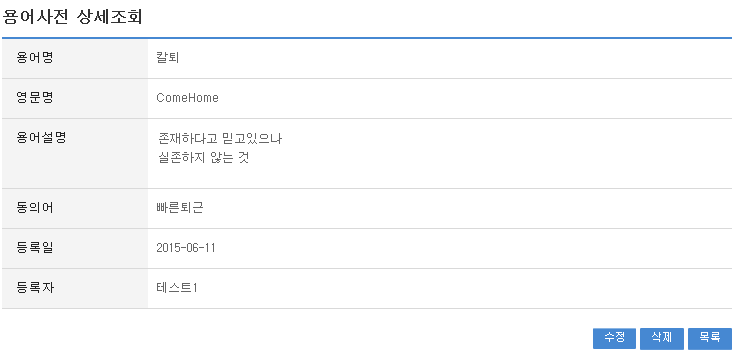
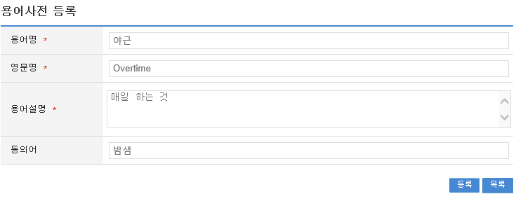
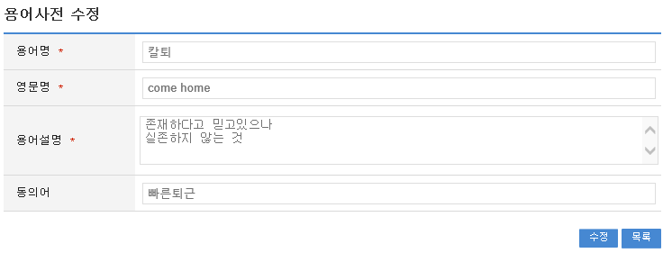

# 용어사전

## 개요

 업무에 활용되는 전문용어를 등록하고 등록된 용어에 대한 수정, 삭제, 검색등의 관리기능을 수행할 수 있도록 구성되어 있다.

## 설명

### 패키지 참조 관계

 용어사전 패키지는 요소기술의 공통 패키지(cmm)에 대해서만 직접적인 함수적 참조 관계를 가진다.
 패키지 간 참조 관계 : [사용자지원 Package Dependency](../intro/package-reference.md/#사용자지원)

### 관련소스

| 유형 | 대상소스명 | 비고 |
| --- | --- | --- |
| Controller | egovframework.com.uss.olh.wor.web.EgovWordDicaryController.java | 용어사전관리를 위한 컨트롤러 클래스 |
| Service | egovframework.com.uss.olh.wor.service.EgovWordDicaryService.java | 용어사전관리를 위한 서비스 인터페이스 |
| ServiceImpl | egovframework.com.uss.olh.wor.service.impl.EgovWordDicaryServiceImpl.java | 용어사전관리를 위한 서비스 구현 클래스 |
| VO | egovframework.com.uss.olh.wor.service.WordDicaryVO.java | 용어사전관리를 위한 VO 클래스 |
| VO | egovframework.com.uss.olh.wor.service.WordDicaryDefaultVO.java | 용어사전관리를 위한 SearchVO 클래스 |
| DAO | egovframework.com.uss.olh.wor.service.impl.EgovWordDicaryDAO.java | 용어사전 관리를 위한 데이터처리 클래스 |
| JSP | /WEB-INF/jsp/egovframework/com/uss/olh/wor/EgovWordDicaryList.jsp | 용어사전관리를 위한 목록조회 페이지 |
| JSP | /WEB-INF/jsp/egovframework/com/uss/olh/wor/EgovWordDicaryDetail.jsp | 용어사전관리를 위한 상세조회 페이지 |
| JSP | /WEB-INF/jsp/egovframework/com/uss/olh/wor/EgovWordDicaryRegist.jsp | 용어사전관리를 위한 등록 페이지 |
| JSP | /WEB-INF/jsp/egovframework/com/uss/olh/wor/EgovWordDicaryUpdt.jsp | 용어사전관리를 위한 수정 페이지 |
| Query XML | resources/egovframework/mapper/com/uss/olh/wor/EgovWordDicary\_SQL\_altibase.xml | 용어사전관리를 위한 Altibase용 Query XML |
| Query XML | resources/egovframework/mapper/com/uss/olh/wor/EgovWordDicary\_SQL\_cubrid.xml | 용어사전관리를 위한 Cubrid용 Query XML |
| Query XML | resources/egovframework/mapper/com/uss/olh/wor/EgovWordDicary\_SQL\_maria.xml | 용어사전관리를 위한 MariaDB용 Query XML |
| Query XML | resources/egovframework/mapper/com/uss/olh/wor/EgovWordDicary\_SQL\_mysql.xml | 용어사전관리를 위한 MySQL용 Query XML |
| Query XML | resources/egovframework/mapper/com/uss/olh/wor/EgovWordDicary\_SQL\_oracle.xml | 용어사전관리를 위한 Oracle용 Query XML |
| Query XML | resources/egovframework/mapper/com/uss/olh/wor/EgovWordDicary\_SQL\_postgres.xml | 용어사전관리를 위한 PostgreSQL용 Query XML |
| Query XML | resources/egovframework/mapper/com/uss/olh/wor/EgovWordDicary\_SQL\_tibero.xml | 용어사전관리를 위한 Tibero용 Query XML |
| Query XML | resources/egovframework/mapper/com/uss/olh/wor/EgovWordDicary\_SQL\_goldilocks.xml | 용어사전관리를 위한 Goldilocks용 Query XML |
| Message properties | resources/egovframework/message/com/uss/olh/wor/message\_ko.properties | 용어사전관리를 위한 Message properties(한글) |
| Message properties | resources/egovframework/message/com/uss/olh/wor/message\_en.properties | 용어사전관리를 위한 Message properties(영문) |
| Idgen XML | resources/egovframework/spring/com/idgn/context-idgn-WordDicary.xml | 용어사전등록을 위한 Id생성 Idgen XML |

### 클래스 다이어그램

 

### ID Generation

#### ID Generation 관련 DDL 및 DML

 ID Generation Service를 활용하기 위해서 Sequence 저장테이블인  COMTECOPSEQ에 WORD_ID 항목을 추가해야 한다.

```sql
CREATE TABLE COMTECOPSEQ ( table_name varchar(16) NOT NULL, 
  		   next_id DECIMAL(30) NOT NULL,
  		   PRIMARY KEY (table_name));
 
  INSERT INTO COMTECOPSEQ VALUES('WORD_ID', 1);
```

#### ID Generation 환경설정(context-idgn-WordDicary.xml)

```xml
<bean name="egovWordDicaryIdGnrService"
		class="org.egovframe.rte.fdl.idgnr.impl.EgovTableIdGnrServiceImpl"
		destroy-method="destroy">
		<property name="dataSource" ref="egov.dataSource" />
		<property name="strategy"   ref="wordDicaryStrategy" />
		<property name="blockSize" 	value="10"/>
		<property name="table"	   	value="COMTECOPSEQ"/>
		<property name="tableName"	value="WORD_ID"/>
	</bean>
 
	<bean name="wordDicaryStrategy"
		class="org.egovframe.rte.fdl.idgnr.impl.strategy.EgovIdGnrStrategyImpl">
		<property name="prefix" value="WORDDICARY_" />
		<property name="cipers" value="9" />
		<property name="fillChar" value="0" />
	</bean>
```

### 관련테이블

| 테이블명 | 테이블명(영문) | 비고 |
| --- | --- | --- |
| 용어사전정보 | COMTNWORDDICARYINFO | 용어사전정보를 관리한다. |

## 관련기능

 용어사전은 용어사전 목록조회, 용어사전 상세조회, 용어사전 등록, 용어사전 수정 기능으로 구성되어 있다.

### 용어사전 목록조회

#### 비즈니스 규칙

 일반사용자가 아닌 관리자가 사용하는 화면으로 조회조건으로 목록조회를 할 수 있고, 등록버튼을 클릭하여 용어사전등록 화면으로 이동하여 용어사전을 등록 처리 할 수 있다.

#### 관련

 N/A

#### 관련화면 및 수행매뉴얼

| Action | URL | Controller method | SQL Namespace | SQL QueryID |
| --- | --- | --- | --- | --- |
| 목록조회 | /uss/olh/wor/selectWordDicaryList.do | selectWordDicaryList | "WordDicary" | "selectWordDicaryList" |
|  |  |  | "WordDicary" | "selectWordDicaryListCnt" |

 용어사전 목록은 페이지 당 10건씩 조회되며 페이징은 10페이지씩 이루어진다.
 검색조건은 용어명, 영문명에 대해서 수행된다.
 페이지 당 검색 범위를 변경하고자 하는 경우
 context-properties.xml 파일의 pageUnit, pageSize를 변경한다.(단 해당 설정은 전체 공통서비스 기능에 영향을 미친다.)

 

 조회: 용어사전을 조회하기 위해서는 상단의 검색조건을 선택 후 해당하는 검색문자를 입력 후 조회 버튼을 클릭한다.
 등록: 용어사전을 등록하기 위해서는 상단의 등록 버튼을 통해서 용어사전등록 화면으로 이동한다.
 목록클릭: 용어사전상세조회 화면으로 이동한다.

### 용어사전 상세조회

#### 비즈니스 규칙

 일반사용자가 아닌 관리자가 사용하는 화면으로 용어사전조회에서 목록 클릭 시 이동되는 화면으로 용어에 대한 상세정보를 보여준다.

#### 관련코드

 N/A

#### 관련화면 및 수행매뉴얼

| Action | URL | Controller method | SQL Namespace | SQL QueryID |
| --- | --- | --- | --- | --- |
| 상세조회 | /uss/olh/wor/selectWordDicaryDetail.do | selectWordDicaryDetail | "WordDicary" | "selectWordDicaryDetail" |
| 삭제 | /uss/olh/wor/deleteWordDicary.do | deleteWordDicary | "WordDicary" | "deleteWordDicary" |

 용어사전 상세조회화면은 용어사전목록조회에서 목록클릭 시 상세조회화면으로 이동된다.

 

 수정: 수정버튼 클릭 시 용어사전을 수정할 수 있는 화면으로 이동한다.
 삭제: 삭제버튼 클릭 시 삭제여부를 확인하는 메시지를 보여주고 삭제처리를 할 수 있다.
 목록: 용어사전목록조회 화면으로 이동한다.

### 용어사전 등록

#### 비즈니스 규칙

 용어사전에 새로운 내용을 등록 처리한다. 입력명 우측의 빨간* 표시는 반드시 입력해야할 항목을 표시한다.

#### 관련코드

 N/A

#### 관련화면 및 수행매뉴얼

| Action | URL | Controller method | SQL Namespace | SQL QueryID |
| --- | --- | --- | --- | --- |
| 등록화면 | /uss/olh/wor/insertWordDicaryView.do | insertWordDicaryView |  |  |
| 등록 | /uss/olh/wor/insertWordDicary.do | insertWordDicary | "WordDicary" | "insertWordDicary" |

 

 목록: 용어사전목록조회 화면으로 이동한다.
 저장: 입력한 용어사전항목들이 저장 처리된다.

### 용어사전수정

#### 비즈니스 규칙

 수정된 용어사전 내용을 저장 처리한다. 입력명 우측의 빨간* 표시는 수정 시 반드시 입력해야 할 항목을 표시한다.

#### 관련코드

 N/A

#### 관련화면 및 수행매뉴얼

| Action | URL | Controller method | SQL Namespace | SQL QueryID |
| --- | --- | --- | --- | --- |
| 수정화면 | /uss/olh/wor/updateWordDicaryView.do | updateWordDicaryView | "WordDicary" | "selectWordDicaryDetail" |
| 수정 | /uss/olh/wor/updateWordDicary.do | updateWordDicary | "WordDicary" | "updateWordDicary" |

 

 수정: 수정 입력한 용어사전항목들이 저장 처리된다.
 목록: 용어사전목록조회 화면으로 이동한다.
