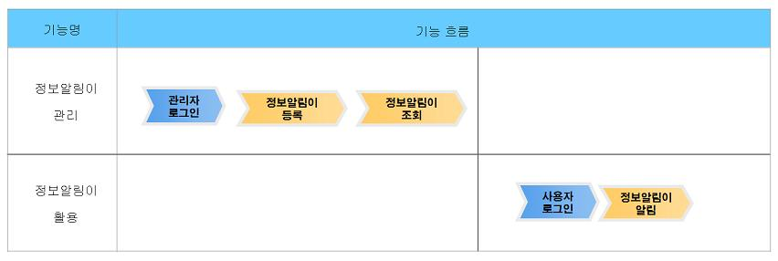
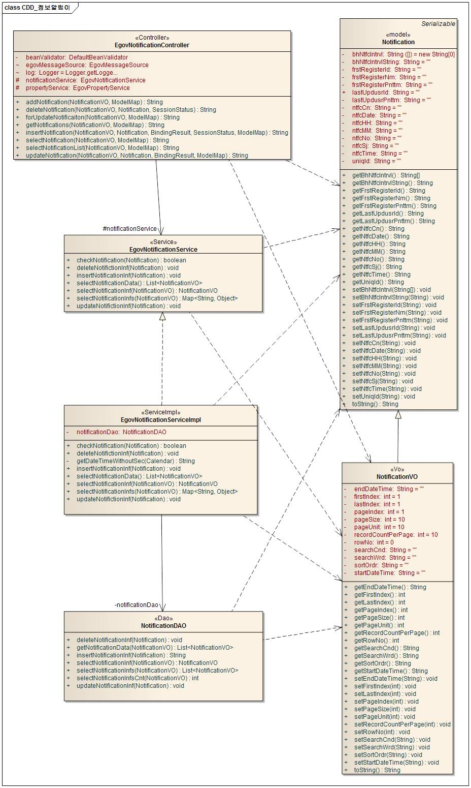
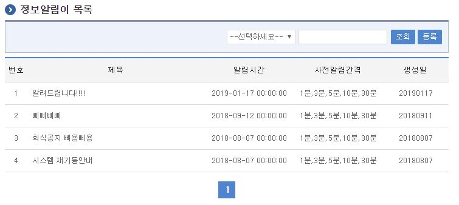
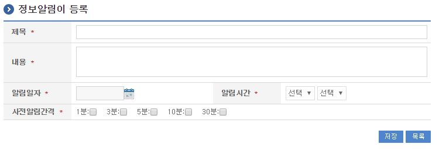
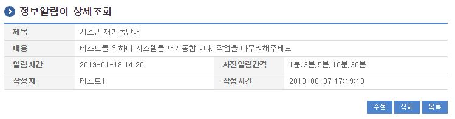
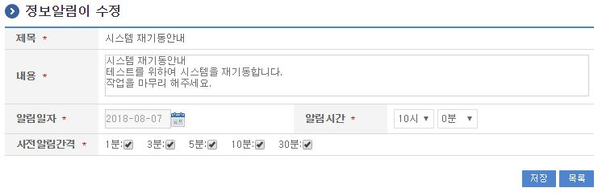
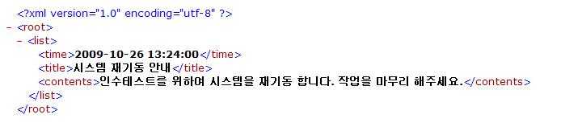
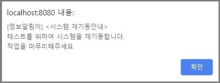
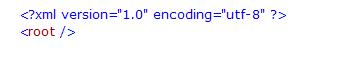

# 정보알림이

## 개요

 관리자가 등록한 메시지를 사용자에게 알려주는 알림서비스 기능을 제공한다. 시스템에 대하여 긴급히 알려야 할 경우 사용할 수 있는 기능이다.
 정보알림이 활용 부분은 메인화면의 메인메뉴 부분 처럼 항상 사용되는 페이지에 정보알림이에서 제공하는 js를 포함함으로써 사용자에게 정보알림이 내용을 제공한다.
 기능흐름

 

## 설명

 정보알림이는 관리자가 사용하는 정보알림이 관리 기능과 정보알림이를 사용자에게 제공하는 활용기능으로 제공된다.

### 패키지 참조 관계

 정보알림이 패키지는 요소기술의 공통 패키지(cmm)에 대해서만 직접적인 함수적 참조 관계를 가진다. 하지만, 컴포넌트 배포 시 오류 없이 실행되기 위하여 패키지 간의 참조관계에 따라 달력 패키지와 함께 배포 파일을 구성한다.
- 패키지 간 참조 관계 : [사용자지원 Package Dependency](../intro/package-reference.md/#사용자지원)

### 관련소스

| 유형 | 대상소스 | 비고 |
| --- | --- | --- |
| Controller | egovframework.com.uss.ion.noi.web.EgovNotificationController.java | 정보알림이를 위한 컨트롤러 클래스 |
| Service | egovframework.com.uss.ion.noi.service.EgovNotificationService.java | 정보알림이를 위한 서비스 인터페이스 |
| ServiceImpl | egovframework.com.uss.ion.noi.service.impl.EgovNotificationServiceImpl.java | 정보알림이를 위한 서비스 구현 클래스 |
| VO | egovframework.com.uss.ion.noi.service.NotificationVO.java | 정보알림이를 위한 VO 클래스 |
| DAO | egovframework.com.uss.ion.noi.service.impl.NotificationDAO.java | 정보알림이를 위한 데이터처리 클래스 |
| JSP | /WEB-INF/jsp/egovframework/com/uss/ion/noi/EgovNotificationRegist.jsp | 정보알림이 등록을 위한 jsp페이지 |
| JSP | /WEB-INF/jsp/egovframework/com/uss/ion/noi/EgovNotificationUpdt.jsp | 생성된 정보알림이 수정을 위한 jsp페이지 |
| JSP | /WEB-INF/jsp/egovframework/com/uss/ion/noi/EgovNotificationList.jsp | 생성된 정보알림이 조회를 위한 jsp페이지 |
| JSP | /WEB-INF/jsp/egovframework/com/uss/ion/noi/EgovNotificationDetail.jsp | 정보알림이 상세 조회를 위한 jsp페이지 |
| JSP | /WEB-INF/jsp/egovframework/com/uss/ion/noi/EgovNotificationData.jsp | 정보알림이 표시를 위한 XML jsp페이지 |
| JS | /js/egovframework/uss/ion/noi/EgovNotification.js | 정보알림이 표시(AJAX)를 위한 js페이지 |
| Query XML | resources/egovframework/mapper/com/uss/ion/noi/EgovNotification\_SQL\_altibase.xml | 정보알림이를 위한 Altibase용 Query 파일 |
| Query XML | resources/egovframework/mapper/com/uss/ion/noi/EgovNotification\_SQL\_cubrid.xml | 정보알림이를 위한 Cubrid용 Query 파일 |
| Query XML | resources/egovframework/mapper/com/uss/ion/noi/EgovNotification\_SQL\_maria.xml | 정보알림이를 위한 Maria용 Query 파일 |
| Query XML | resources/egovframework/mapper/com/uss/ion/noi/EgovNotification\_SQL\_mysql.xml | 정보알림이를 위한 MySQL용 Query 파일 |
| Query XML | resources/egovframework/mapper/com/uss/ion/noi/EgovNotification\_SQL\_oracle.xml | 정보알림이를 위한 Oracle용 Query 파일 |
| Query XML | resources/egovframework/mapper/com/uss/ion/noi/EgovNotification\_SQL\_postgres.xml | 정보알림이를 위한 Postgres용 Query 파일 |
| Query XML | resources/egovframework/mapper/com/uss/ion/noi/EgovNotification\_SQL\_tibero.xml | 정보알림이를 위한 Tibero용 Query 파일 |
| Query XML | resources/egovframework/mapper/com/uss/ion/noi/EgovNotification\_SQL\_goldilocks.xml | 정보알림이를 위한 Goldilocks용 Query 파일 |
| Message properties | resources/egovframework/message/com/uss/ion/noi/message\_ko.properties | 정보알림이를 위한 Message properties(한글) |
| Message properties | resources/egovframework/message/com/uss/ion/noi/message\_en.properties | 정보알림이를 위한 Message properties(영문) |

### 클래스 다이어그램

 

### 관련테이블

| 테이블명 | 테이블명(영문) | 비고 |
| --- | --- | --- |
| 정보알림 | COMTNNTFCINFO | 정보알림이 정보를 관리한다. |

### 환경설정

 등록된 정보알림이를 사용자에게 알리기 위해서는 다음과 같은 js를 항상 사용되는 페이지(Top 메뉴 표시 부분 등)에 포함시킨다.

```xml

<script type="text/javascript" language="javaScript" src="<c:url value='/js/egovframework/uss/ion/noi/EgovNotification.js' />"></script>
```

 (관리자를 위한 정보알림이 목록조회 화면에도 테스트를 위하여 포함되어 있음)

## 관련기능

 정보알림이는 정보알림이 목록조회, 정보알림이 등록, 정보알림이 상세조회, 정보알림이 수정, 정보알림이 표시 기능으로 구분된다.

### 정보알림이 목록조회

#### 비즈니스 규칙

 검색조건은 알림일자, 제목, 내용에 대해서 수행된다.

#### 관련코드

 N/A

#### 관련화면 및 수행매뉴얼

| Action | URL | Controller method | SQL Namespace | SQL QueryID |
| --- | --- | --- | --- | --- |
| 목록조회 | /uss/ion/noi/selectNotificationList.do | selectNotificationList | "NotificationDAO" | "selectNotificationInfs" |
|  |  |  | "NotificationDAO" | "selectNotificationInfsCnt" |

 정보알림이 목록은 페이지 당 10건씩 조회되며 페이징은 10페이지씩 이루어진다.
 페이지 당 검색 범위를 변경하고자 하는 경우 context-properties.xml 파일의 pageUnit, pageSize를 변경한다.
 (단 해당 설정은 전체 공통컴포넌트 기능에 영향을 미친다.)

 

 조회: 검색조건에 따른 결과를 보여준다.
 등록: 정보알림이 등록화면으로 이동한다.

### 정보알림이 등록

#### 비즈니스 규칙

 정보알림에 대한 제목, 내용, 알림일자, 알림시간 및 사전알림간격을 선택하여 정보알림이를 등록한다. 등록이 성공되면 정보알림이 목록조회 화면으로 이동한다.
 사전알림간격은 주어진 알림시간 이전 메시지 표시 시각을 나타낸다. 즉 알림시간이 13:00으로 지정된 경우 1분은 12:59, 3분은 12:57 등으로 지정가능하다. (다중 선택 가능)

#### 관련코드

 N/A

#### 관련화면 및 수행매뉴얼

| Action | URL | Controller method | SQL Namespace | SQL QueryID |
| --- | --- | --- | --- | --- |
| 등록화면 | /uss/ion/noi/addNotification.do | addNotification |  |  |
| 등록 | /uss/ion/noi/insertNotification.do | insertNotification | "NotificationDAO" | "insertNotificationInf" |

 

 저장: 입력한 정보를 저장처리한다.
 목록: 정보알림이 목록조회 페이지로 이동한다.

### 정보알림이 상세조회

#### 비즈니스 규칙

 정보알림이 대한 정보를 변경하기 위한 수정 및 삭제 기능을 제공한다. (등록한 사용자의 경우 표시됨)

#### 관련코드

 N/A

#### 관련화면 및 수행매뉴얼

| Action | URL | Controller method | SQL Namespace | SQL QueryID |
| --- | --- | --- | --- | --- |
| 상세조회 | /uss/ion/noi/selectNotification.do | selectNotification | "NotificationDAO" | "selectNotificationInf" |
| 삭제 | /uss/ion/noi/deleteNotification.do | deleteNotification | "NotificationDAO" | "deleteNotificationInf" |

 

 수정: 정보알림이 수정을 위해 수정페이지로 이동한다.
 삭제: 정보알림이 정보를 삭제한다.
 목록: 정보알림이에 대한 목록을 조회한다.

### 정보알림이 수정

#### 비즈니스 규칙

 알림일자 및 일림시간은 현재 시간 이후가 되어야 한다.

#### 관련코드

 N/A

#### 관련화면 및 수행매뉴얼

| Action | URL | Controller method | SQL Namespace | SQL QueryID |
| --- | --- | --- | --- | --- |
| 수정화면 | /uss/ion/noi/forUpdateNotification.do | forUpdateNotificaiton |  |  |
| 수정 | /uss/ion/noi/updateNotification.do | updateNotification | "NotificationDAO" | "updateNotificationInf" |

 

### 정보알림이 표시

#### 비즈니스 규칙

 AJAX를 통해 처리되는 XML로 사용자에게 표시할 내용이 있는 경우 아래 화면과 같은 XML이 제공된다.
 이런 경우 제공된 js(EgovNotification.js)를 통해 다음과 같은 alert 내용을 표시한다.

#### 관련코드

 N/A

#### 관련화면 및 수행매뉴얼

| Action | URL | Controller method | SQL Namespace | SQL QueryID |
| --- | --- | --- | --- | --- |
| 정보표시 | /uss/ion/noi/getNotifications.do | getNotifications | "NotificationDAO" | "getNotificationData" |

 

 

 참고로 제공된 내용이 없는 경우 다음과 같은 XML이 제공된다.

 

