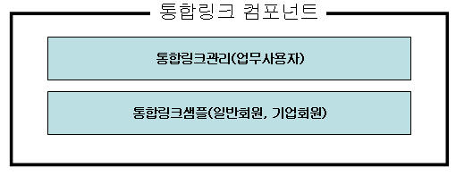
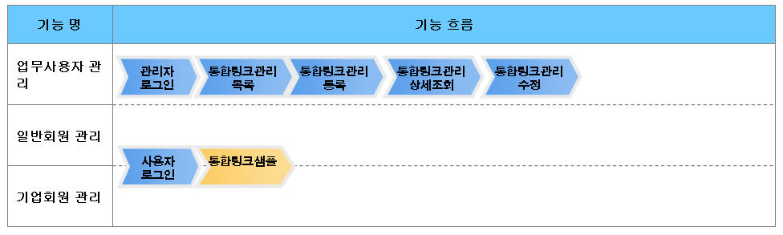
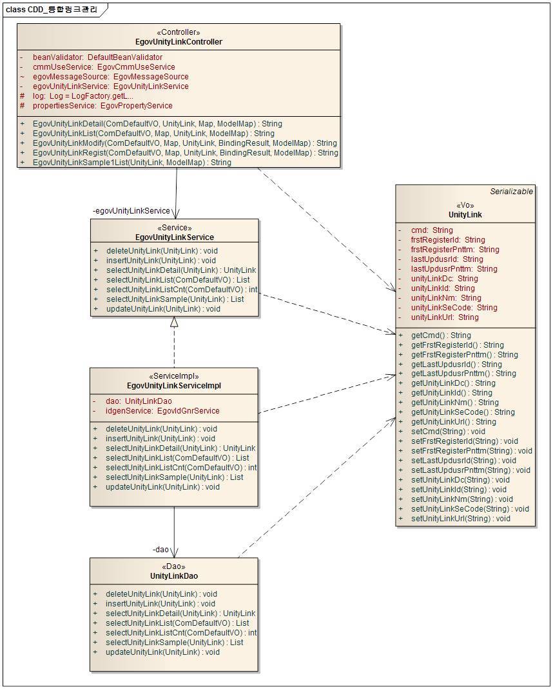
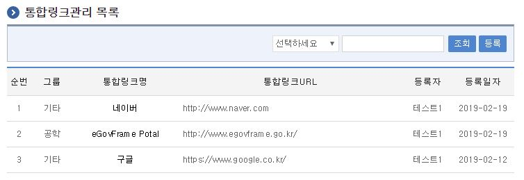
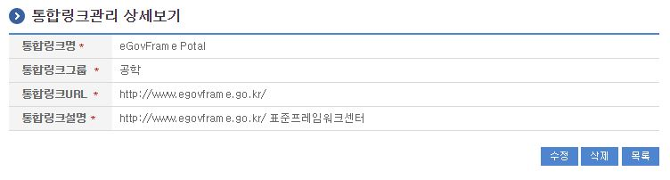
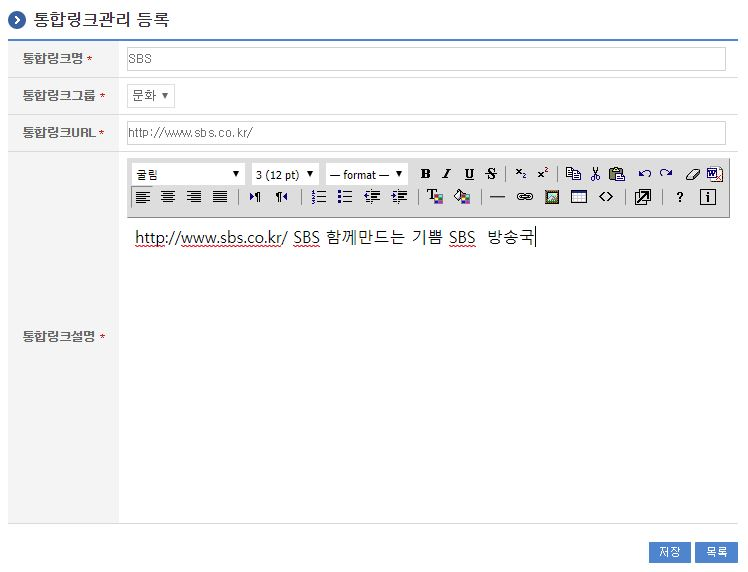
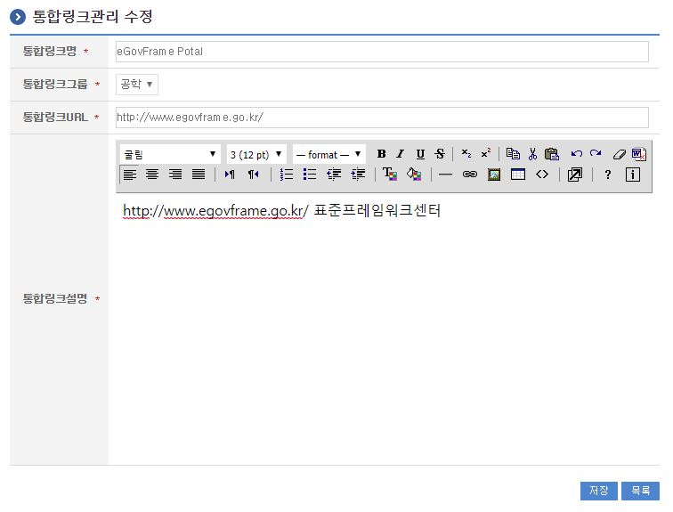
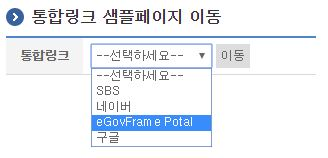

# 통합링크관리

## 개요

 링크 사이트에 대한 통합링크 기능을 제공한다.
 컴포넌트 구성

 

 기능흐름

 

## 설명

### 패키지 참조 관계

 통합링크관리 패키지는 요소기술의 공통 패키지(cmm)에 대해서만 직접적인 함수적 참조 관계를 가진다. 하지만, 컴포넌트 배포 시 오류 없이 실행되기 위하여 패키지 간의 참조관계에 따라 포맷/날짜/계산, 웹에디터 패키지들과 함께 배포 파일을 구성한다.
 패키지 간 참조 관계 : [사용자지원 Package Dependency](../intro/package-reference.md/#사용자지원)

### 관련소스

| 유형 | 대상소스명 | 비고 |
| --- | --- | --- |
| Controller | egovframework.com.uss.ion.ulm.web.EgovUnityLinkController.java | 통합링크관리 Controller Class |
| Service | egovframework.com.uss.ion.ulm.service.EgovUnityLinkService.java | 통합링크관리 Service Class |
| ServiceImpl | egovframework.com.uss.ion.ulm.service.impl.EgovUnityLinkServiceImpl.java | 통합링크관리 ServiceImpl Class |
| Model | egovframework.com.uss.ion.ulm.service.UnityLink.java | 통합링크관리 Model Class |
| VO | egovframework.com.cmm.ComDefaultVO.java | 검색 VO Class |
| DAO | egovframework.com.uss.ion.ulm.service.impl.UnityLinkDao.java | 통합링크관리 Dao Class |
| JSP | /WEB-INF/jsp/egovframework/com/uss/ion/ulm/EgovUnityLinkList.jsp | 통합링크관리 목록조회 페이지 |
| JSP | /WEB-INF/jsp/egovframework/com/uss/ion/ulm/EgovUnityLinkRegist.jsp | 통합링크관리 등록 페이지 |
| JSP | /WEB-INF/jsp/egovframework/com/uss/ion/ulm/EgovUnityLinkUpdt.jsp | 통합링크관리 수정 페이지 |
| JSP | /WEB-INF/jsp/egovframework/com/uss/ion/ulm/EgovUnityLinkDetail.jsp | 통합링크관리 상세조회 페이지 |
| JSP | /WEB-INF/jsp/egovframework/com/uss/ion/ulm/UnityLinkSample.jsp | 통합링크 샘플 |
| QUERY XML | resources/egovframework/mapper/com/uss/ion/ulm/EgovUnityLink\_SQL\_altibase.xml | 통합링크관리 Altibase용 QUERY XML |
| QUERY XML | resources/egovframework/mapper/com/uss/ion/ulm/EgovUnityLink\_SQL\_cubrid.xml | 통합링크관리 Cubrid용 QUERY XML |
| QUERY XML | resources/egovframework/mapper/com/uss/ion/ulm/EgovUnityLink\_SQL\_maria.xml | 통합링크관리 Maria용 QUERY XML |
| QUERY XML | resources/egovframework/mapper/com/uss/ion/ulm/EgovUnityLink\_SQL\_mysql.xml | 통합링크관리 MySQL용 QUERY XML |
| QUERY XML | resources/egovframework/mapper/com/uss/ion/ulm/EgovUnityLink\_SQL\_oracle.xml | 통합링크관리 Oracle용 QUERY XML |
| QUERY XML | resources/egovframework/mapper/com/uss/ion/ulm/EgovUnityLink\_SQL\_postgres.xml | 통합링크관리 postgres용 QUERY XML |
| QUERY XML | resources/egovframework/mapper/com/uss/ion/ulm/EgovUnityLink\_SQL\_tibero.xml | 통합링크관리 Tibero용 QUERY XML |
| QUERY XML | resources/egovframework/mapper/com/uss/ion/ulm/EgovUnityLink\_SQL\_goldilocks.xml | 통합링크관리 Goldilocks용 QUERY XML |
| Message properties | resources/egovframework/message/com/uss/ion/ulm/message\_ko.properties | 통합링크관리를 위한 Message properties(한글) |
| Message properties | resources/egovframework/message/com/uss/ion/ulm/message\_en.properties | 통합링크관리를 위한 Message properties(영문) |
| Idgen XML | resources/egovframework/spring/com/idgn/context-idgn-UnityLink.xml | 통합링크관리 Id생성 Idgen XML |

### 클래스 다이어그램

 

### ID Generation

#### ID Generation 관련 DDL 및 DML

 ID Generation Service를 활용하기 위해서 Sequence 저장테이블인  COMTECOPSEQ에 UNITY_LINK_ID 항목을 추가해야 한다.

```sql
CREATE TABLE COMTECOPSEQ
(
    TABLE_NAME            VARCHAR(20) NOT NULL,
    NEXT_ID               NUMERIC(30) NULL,
     PRIMARY KEY (TABLE_NAME)
)
;
 
INSERT INTO COMTECOPSEQ ( TABLE_NAME, NEXT_ID ) VALUES ('UNITY_LINK_ID', 1);
```

#### ID Generation 환경설정(context-idgn-UnityLink.xml)

```xml
<bean name="egovUnityLinkIdGnrService"
		class="egovframework.rte.fdl.idgnr.impl.EgovTableIdGnrServiceImpl"
		destroy-method="destroy">
		<property name="dataSource" ref="egov.dataSource" />
		<property name="strategy" ref="unityLinkIdMsgtrategy" />
		<property name="blockSize" 	value="10"/>
		<property name="table"	   	value="COMTECOPSEQ"/>
		<property name="tableName"	value="UNITY_LINK_ID"/>
	</bean>
	<bean name="unityLinkIdMsgtrategy"
		class="egovframework.rte.fdl.idgnr.impl.strategy.EgovIdGnrStrategyImpl">
		<property name="prefix" value="ULINK_" />
		<property name="cipers" value="14" />
		<property name="fillChar" value="0" />
	</bean>
```

### 관련테이블

| 테이블명 | 테이블명(영문) | 비고 |
| --- | --- | --- |
| 통합링크관리 | COMTNUNITYLINK | 통합링크를 관리 한다. |

### 관련코드

| 코드분류 | 코드분류명 | 코드ID | 코드명 |
| --- | --- | --- | --- |
| COM039 | 통합링크그룹 | 001 | 사회 |
| COM039 | 통합링크그룹 | 002 | 정치 |
| COM039 | 통합링크그룹 | 003 | 경제 |
| COM039 | 통합링크그룹 | 004 | 문화 |
| COM039 | 통합링크그룹 | 005 | 인문 |
| COM039 | 통합링크그룹 | 006 | 공학 |
| COM039 | 통합링크그룹 | 007 | 기타 |

## 관련기능

 통합링크관리기능은 크게 통합링크관리 목록조회, 통합링크관리 상세조회, 통합링크관리 내용등록, 통합링크관리 내용수정, 통합링크관리 샘플기능으로 구성되어 있다.

### 통합링크관리 목록조회

#### 비즈니스 규칙

 관리자가 기(記) 등록된 통합링크관리 정보를 리스트 형태로 조회 할 수 있고, 등록버튼을 클릭하여 등록화면으로 이동할수있다.

#### 관련코드

 N/A

#### 관련화면 및 수행매뉴얼

| Action | URL | Controller method | SQL Namespace | SQL QueryID |
| --- | --- | --- | --- | --- |
| 목록조회 | /uss/ion/ulm/listUnityLink.do | egovUnityLinkList | "UnityLink" | selectUnityLink" |
|  |  |  | "UnityLink" | "selectUnityLinkCnt" |

 

 등록: 등록하기 위해서는 상단의 등록 버튼을 통해서 통합링크관리 등록 화면으로 이동한다.
 목록 최근검색어명: 통합링크관리 상세조회 화면으로 이동한다

### 통합링크관리 상세조회

#### 비즈니스 규칙

 통합링크관리 목록에서 목록 클릭 시 이동되는 화면으로 통합링크관리에 대한 상세정보를 보여준다.

#### 관련코드

 N/A

#### 관련화면 및 수행매뉴얼

| Action | URL | Controller method | SQL Namespace | SQL QueryID |
| --- | --- | --- | --- | --- |
| 상세조회 | /uss/ion/ulm/detailUnityLink.do | egovUnityLinkDetail | "UnityLink" | "selectUnityLinkDetail" |
| 삭제 | /uss/ion/ulm/detailUnityLink.do | egovUnityLinkDetail | "UnityLink" | "deleteUnityLink" |

 

 수정: 수정버튼 클릭 시 통합링크관리 수정 화면으로 이동한다.
 삭제: 삭제버튼 클릭 시 삭제여부를 확인하는 메시지를 보여주고 삭제처리를 할 수 있다.
 목록: 통합링크관리 목록 화면으로 이동한다.

### 통합링크관리 내용등록

#### 비즈니스 규칙

 입력명 우측의 빨간* 표시는 반드시 입력해야할 항목을 표시한다.
 저장처리 시 UNITY_LINK_ID 컬럼은 "egovframework.rte.fdl.idgnr.impl.EgovTableIdGnrServiceImpl"를 통하여

 Primary Key => ULINK_(20자리) : ULINK_(6자리) + 일련번호(14자리)로 자동생성 부여된다.

```xml
<!-- IdGnrService... START-->			
<bean name="egovUnityLinkIdGnrService"
	class="egovframework.rte.fdl.idgnr.impl.EgovTableIdGnrService"
	destroy-method="destroy">
	<property name="dataSource" ref="dataSource" />
	<property name="strategy" ref="unityLinkIdMsgtrategy" />
	<property name="blockSize" 	value="10"/>
	<property name="table"	   	value="COMTECOPSEQ"/>
	<property name="tableName"	value="UNITY_LINK_ID"/>
</bean>
<bean name="unityLinkIdMsgtrategy"
	class="egovframework.rte.fdl.idgnr.impl.strategy.EgovIdGnrStrategyImpl">
	<property name="prefix" value="ULINK_" />
	<property name="cipers" value="14" />
	<property name="fillChar" value="0" />
</bean>	
<!-- IdGnrService... END-->
```

#### 관련코드

 N/A

#### 관련화면 및 수행매뉴얼

| Action | URL | Controller method | SQL Namespace | SQL QueryID |
| --- | --- | --- | --- | --- |
| 목록 | /uss/ion/ulm/listUnityLink.do | EgovUnityLinkList | "UnityLink" | "selectUnityLink", |
|  |  |  | "UnityLink" | "selectUnityLinkCnt" |
| 저장 | /uss/ion/ulm/registUnityLink.do | EgovUnityLinkRegist | "UnityLink" | "insertUnityLink" |

 통합링크관리에 관한 기본정보를 입력 저장처리한다.

 

 저장: 입력한 통합링크관리 정보들이 저장 처리된다.
 목록: 통합링크관리 목록 화면으로 이동한다.

### 통합링크관리 내용수정

#### 비즈니스 규칙

 입력한 통합링크관리 정보를(을) 저장 처리한다. 입력명 우측의 빨간* 표시는 수정 시 반드시 입력해야 할 항목을 표시한다.

#### 관련코드

 N/A

#### 관련화면 및 수행매뉴얼

| Action | URL | Controller method | SQL Namespace | SQL QueryID |
| --- | --- | --- | --- | --- |
| 수정 | /uss/ion/ulm/updtUnityLink.do | egovUnityLinkModify | "UnityLink" | "updateUnityLink" |

 

 저장: 통합링크관리 목록 화면으로 이동한다.
 수정: 수정된 정보들이 저장 처리된다.

### 통합링크관리 샘플

#### 비즈니스 규칙

 통합링크 사이트명을 필수로 선택해야 이동이 가능하다.

#### 관련코드

 N/A

#### 관련화면 및 수행매뉴얼

 

 이동: 선택된 사이트로 이동 된다.

## 참고자료

 실행환경 참조 : ID Generation Service
