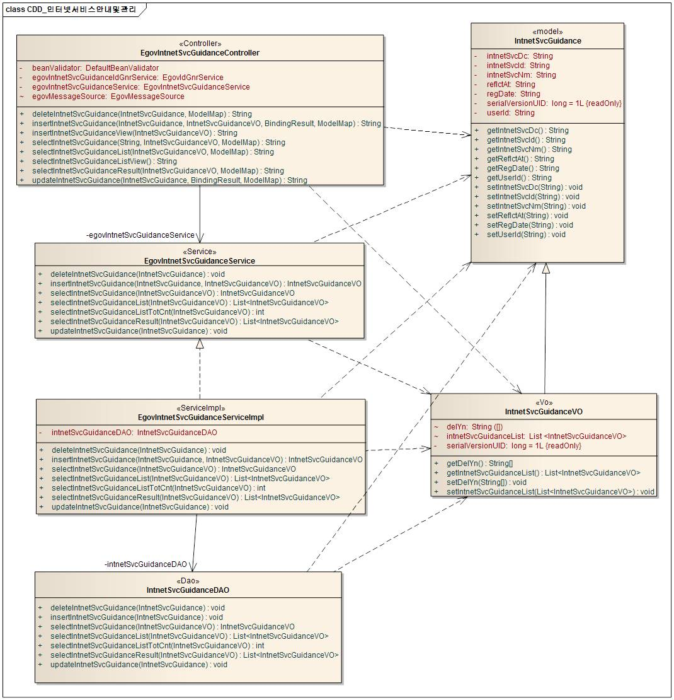
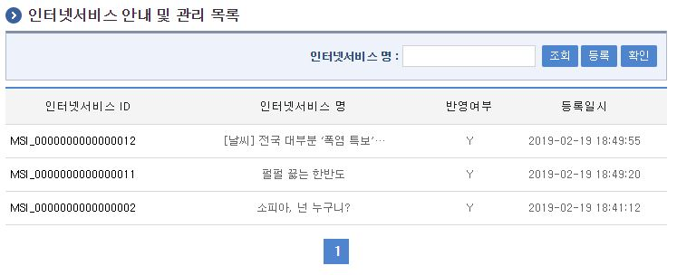
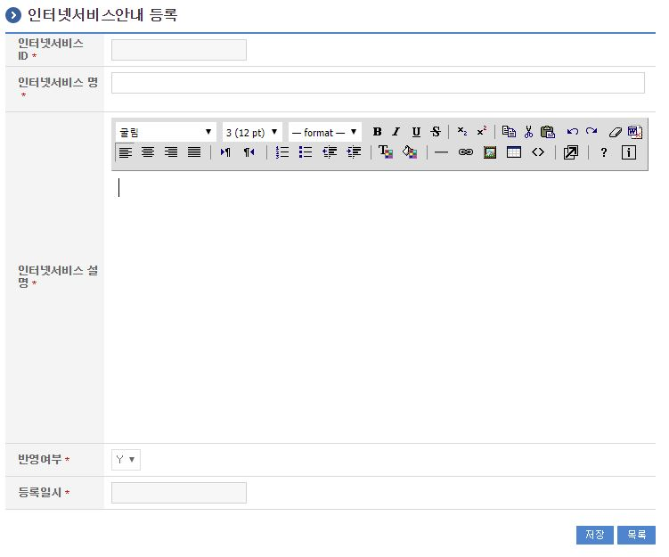
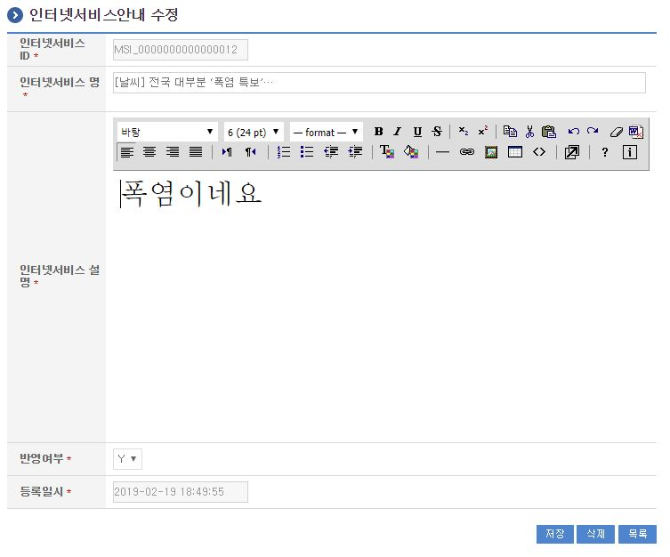

# 인터넷서비스안내 및 관리

## 개요

 인터넷서비스안내관리는 인터넷으로 서비스하는 정보를 등록 관리하여 해당 서비스 안내 정보가 웹페이지에 보여지게 하는 기능을 제공한다.

## 설명

 인터넷서비스안내관리는 인터넷서비스안내정보를 등록하여 서비스에 대한 안내 목적으로 인터넷서비스안내정보의 등록, 수정, 삭제, 조회, 목록조회의 기능을 수반한다.

 ① 인터넷서비스정보목록조회 : 인터넷서비스정보를 최근 등록 순서대로 조회하고, 그 결과 목록을 화면에 반영한다.
 ② 인터넷서비스정보등록 : 인터넷서비스정보를 등록하고, 등록 결과를 조회한다.
 ③ 인터넷서비스정보수정 : 기 등록된 인터넷서비스정보의 항목들을 수정한다.
 ④ 인터넷서비스정보삭제 : 기 등록된 인터넷서비스정보를 삭제한다.
 ⑤ 인터넷서비스정보조회 : 기 등록된 인터넷서비스정보를 특정 화면에서 서비스 형태로 반영한다.

### 패키지 참조 관계

 인터넷서비스안내 및 관리 패키지는 요소기술의 공통 패키지(cmm)와 포맷/날짜/계산(fcc) 패키지에 대해서 직접적인 함수적 참조 관계를 가진다. 하지만, 컴포넌트 배포 시 오류 없이 실행되기 위하여 패키지 간의 참조관계에 따라 웹에디터 패키지와 함께 배포 파일을 구성한다.
 패키지 간 참조 관계 : [사용자지원 Package Dependency](../intro/package-reference.md#사용자지원)

### 관련소스

| 유형 | 대상소스명 | 비고 |
| --- | --- | --- |
| Controller | egovframework.com.uss.ion.isg.web.EgovIntnetSvcGuidanceController.java | 인터넷서비스안내 관리를 위한 컨트롤러 클래스 |
| Service | egovframework.com.uss.ion.isg.service.EgovIntnetSvcGuidanceService.java | 인터넷서비스안내 관리를 위한  서비스 인터페이스 |
| ServiceImpl | egovframework.com.uss.ion.isg.service.impl.EgovIntnetSvcGuidanceServiceImpl.java | 인터넷서비스안내 관리를 위한 서비스 구현 클래스 |
| VO | egovframework.com.uss.ion.isg.service.IntnetSvcGuidanceVO.java | 인터넷서비스안내 관리를 위한 VO 클래스 |
| DAO | egovframework.com.uss.ion.isg.service.impl.IntnetSvcGuidanceDAO.java | 인터넷서비스안내 관리를 위한 데이터처리 클래스 |
| JSP | /WEB-INF/jsp/egovframework/com/uss/ion/isg/EgovIntnetSvcGuidanceList.jsp | 인터넷서비스안내 목록조회를 위한 jsp페이지 |
| JSP | /WEB-INF/jsp/egovframework/com/uss/ion/isg/EgovIntnetSvcGuidanceRegist.jsp | 인터넷서비스안내 등록를 위한 jsp페이지 |
| JSP | /WEB-INF/jsp/egovframework/com/uss/ion/isg/EgovIntnetSvcGuidanceUpdt.jsp | 인터넷서비스안내 수정를 위한 jsp페이지 |
| JSP | /WEB-INF/jsp/egovframework/com/uss/ion/isg/EgovIntnetSvcGuidanceView.jsp | 인터넷서비스안내를 반영하기 위한 jsp페이지 |
| QUERY XML | resources/egovframework/mapper/com/uss/ion/isg/EgovIntnetSvcGuidance\_SQL\_altibase.xml | 인터넷서비스안내 Altibase용 QUERY XML |
| QUERY XML | resources/egovframework/mapper/com/uss/ion/isg/EgovIntnetSvcGuidance\_SQL\_cubrid.xml | 인터넷서비스안내 Cubrid용 QUERY XML |
| QUERY XML | resources/egovframework/mapper/com/uss/ion/isg/EgovIntnetSvcGuidance\_SQL\_maria.xml | 인터넷서비스안내 Maria용 QUERY XML |
| QUERY XML | resources/egovframework/mapper/com/uss/ion/isg/EgovIntnetSvcGuidance\_SQL\_mysql.xml | 인터넷서비스안내 Mysql용 QUERY XML |
| QUERY XML | resources/egovframework/mapper/com/uss/ion/isg/EgovIntnetSvcGuidance\_SQL\_oracle.xml | 인터넷서비스안내 Oracle용 QUERY XML |
| QUERY XML | resources/egovframework/mapper/com/uss/ion/isg/EgovIntnetSvcGuidance\_SQL\_postgres.xml | 인터넷서비스안내 Postgres용 QUERY XML |
| QUERY XML | resources/egovframework/mapper/com/uss/ion/isg/EgovIntnetSvcGuidance\_SQL\_tibero.xml | 인터넷서비스안내 Tibero용 QUERY XML |
| QUERY XML | resources/egovframework/mapper/com/uss/ion/isg/EgovIntnetSvcGuidance\_SQL\_goldilocks.xml | 인터넷서비스안내 Goldilocks용 QUERY XML |
| Message properties | resources/egovframework/message/com/uss/ion/isg/message\_ko.properties | 인터넷서비스안내를 위한 Message properties(한글) |
| Message properties | resources/egovframework/message/com/uss/ion/isg/message\_en.properties | 인터넷서비스안내를 위한 Message properties(영문) |
| Idgen XML | resources/egovframework/spring/com/idgn/context-idgn-IntnetSvcGuidance.xml | 인터넷서비스안내 Id생성 Idgen XML |

### 클래스 다이어그램

 

### ID Generation

#### ID Generation 관련 DDL 및 DML

 ID Generation Service를 활용하기 위해서 Sequence 저장테이블인  COMTECOPSEQ에 ISG_ID 항목을 추가한다.

```sql
CREATE TABLE COMTECOPSEQ
(
    TABLE_NAME            VARCHAR(20) NOT NULL,
    NEXT_ID               NUMERIC(30) NULL,
     PRIMARY KEY (TABLE_NAME)
)
 
INSERT INTO COMTECOPSEQ ( TABLE_NAME, NEXT_ID ) VALUES ('ISG_ID', 1);
```

#### ID Generation 환경설정(context-idgn-IntnetSvcGuidance.xml)

```xml
<bean name="egovIntnetSvcGuidanceIdGnrService" class="egovframework.rte.fdl.idgnr.impl.EgovTableIdGnrServiceImpl" destroy-method="destroy">
        <property name="dataSource" ref="egov.dataSource" />
        <property name="strategy"   ref="intnetSvcGuidanceIdStrategy" />
        <property name="blockSize"  value="10"/>
        <property name="table"      value="COMTECOPSEQ"/>
        <property name="tableName"  value="ISG_ID"/>
    </bean>
 
    <bean name="intnetSvcGuidanceIdStrategy" class="egovframework.rte.fdl.idgnr.impl.strategy.EgovIdGnrStrategyImpl">
        <property name="prefix" value="ISG_" />
        <property name="cipers" value="16" />
        <property name="fillChar" value="0" />
    </bean>
```

### 관련테이블

| 테이블명 | 테이블명(영문) | 비고 |
| --- | --- | --- |
| 인터넷서비스 | COMTNINTNETSVC | 인터넷으로 서비스하는 정보를 등록 관리하여 해당 서비스 안내 정보가 웹페이지에 보여지게 하는 기능을 제공하기 위한 속성을 관리한다. |

## 관련기능

 인터넷서비스안내및관리기능은 크게 인터넷서비스안내 목록조회, 인터넷서비스안내 등록, 인터넷서비스안내 수정 기능으로 구성되어 있다.

### 인터넷서비스안내 목록조회

#### 비즈니스 규칙

 인터넷서비스안내 목록은 페이지당 10건씩 조회되며 페이징은 10페이지씩 이루어진다.
 검색조건은 인터넷서비스명 대해서 수행된다.

#### 관련코드

 N/A

#### 관련화면 및 수행매뉴얼

| Action | URL | Controller method | SQL Namespace | SQL QueryID |
| --- | --- | --- | --- | --- |
| 조회 | /uss/ion/isg/selectIntnetSvcGuidanceList.do | selectIntnetSvcGuidanceList | "intnetSvcGuidanceDAO" | "selectIntnetSvcGuidanceList", |
|  |  |  | "intnetSvcGuidanceDAO" | "selectIntnetSvcGuidanceListTotCnt" |

 

 조회 : 기 등록된 인터넷서비스안내 목록을 조회한다.
 등록 : 신규 인터넷서비스안내를 등록하기 위해서는 상단의 등록 버튼을 통해서 인터넷서비스안내 등록 화면으로 이동한다.
 확인 : 기 등록된 인터넷안내서비스 정보 화면을 확인한다.

### 인터넷서비스안내 등록

#### 비즈니스 규칙

 인터넷서비스의 속성정보를 입력한 뒤 등록한다.

#### 관련코드

 N/A

#### 관련화면 및 수행매뉴얼

| Action | URL | Controller method | SQL Namespace | SQL QueryID |
| --- | --- | --- | --- | --- |
| 등록화면 | /uss/ion/isg/addViewIntnetSvcGuidance.do | insertIntnetSvcGuidanceView |  |  |
| 등록 | /uss/ion/isg/addIntnetSvcGuidance.do | insertIntnetSvcGuidance | "intnetSvcGuidanceDAO" | "insertIntnetSvcGuidance" |

 

 등록 : 신규 인터넷서비스안내를 등록하기 위해서는 인터넷서비스 속성을 입력한 뒤 하단의 저장 버튼을 통해서 인터넷서비스정보를 등록한다.
 목록 : 인터넷서비스안내 목록조회 화면으로 이동한다.

### 인터넷서비스안내 수정

#### 비즈니스 규칙

 인터넷서비스의 속성정보를 변경한 후 저장한다.

#### 관련코드

 N/A

#### 관련화면 및 수행매뉴얼

| Action | URL | Controller method | SQL Namespace | SQL QueryID |
| --- | --- | --- | --- | --- |
| 수정 | /uss/ion/isg/updtIntnetSvcGuidance.do | updateIntnetSvcGuidance | "intnetSvcGuidanceDAO" | "updateIntnetSvcGuidance" |
| 상세조회 | /uss/ion/isg/getIntnetSvcGuidance.do | selectIntnetSvcGuidance | "intnetSvcGuidanceDAO" | "selectIntnetSvcGuidance" |
| 삭제 | /uss/ion/isg/removeIntnetSvcGuidance.do | deleteIntnetSvcGuidance | "intnetSvcGuidanceDAO" | "deleteIntnetSvcGuidance" |

 다음 화면은 인터넷서비스안내 상세조회 화면과 동일하다.

 

 수정 : 기 등록된 인터넷서비스 속성을 수정한 뒤 하단의 저장 버튼을 통해서 인터넷서비스안내정보를 수정한다.
 삭제 : 기 등록된 인터넷서비스안내정보를 삭제한다.
 목록 : 인터넷서비스안내 목록조회 화면으로 이동한다.

