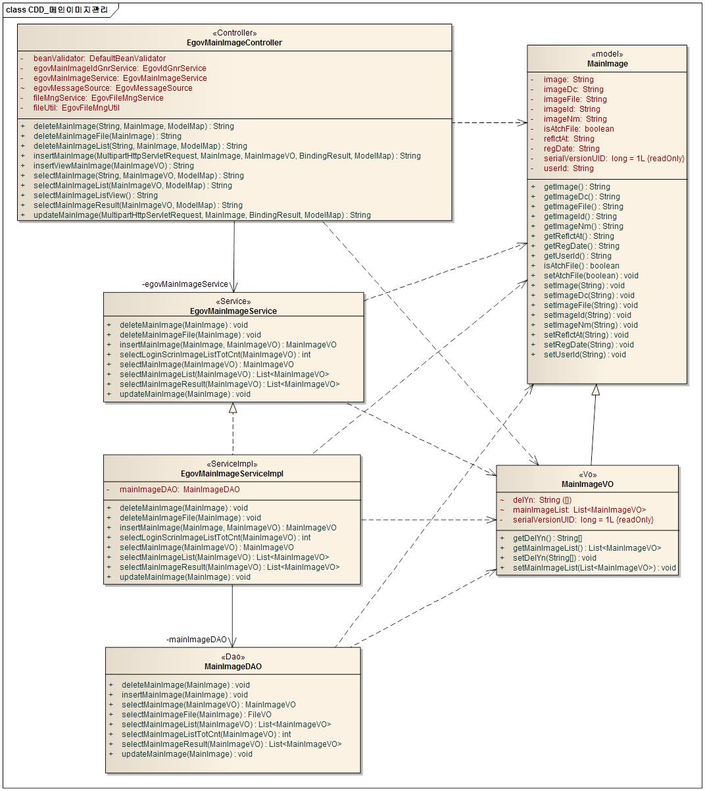
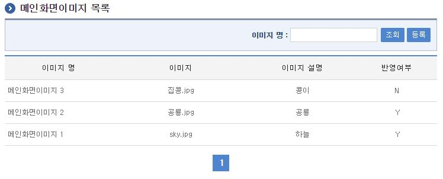
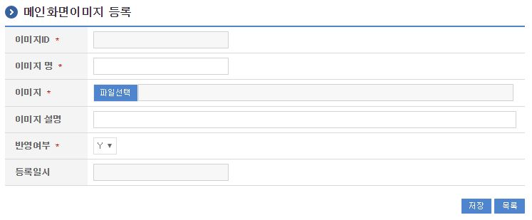
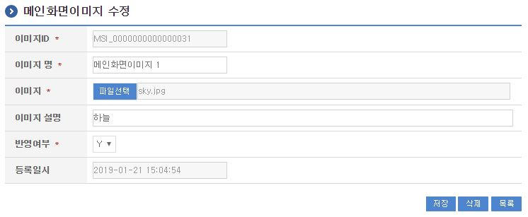

# 메인이미지 관리

## 개요

 메인이미지관리는 메인화면에 대한 이미지를 등록하고, 등록한 이미지가 메인화면에 출력되는 기능을 제공한다.

## 설명

 메인이미지관리는 메인이미지를 등록하여 메인화면에 반영하기 위한 목적으로 메인이미지의 등록, 수정, 삭제, 조회, 목록조회의 기능을 수반한다.

```text
  ① 메인이미지목록조회 : 메인이미지로 정의된 정보를 최근 등록 순서대로 조회하고, 그 결과 목록을 화면에 반영한다.
  ② 메인이미지등록 : 메인이미지정보를 등록하고, 등록 결과를 조회한다.
  ③ 메인이미지수정 : 기 등록된 메인이미지정보의 항목들을 수정한다.
  ④ 메인이미지삭제 : 기 등록된 메인이미지정보를 삭제한다.
  ⑤ 메인이미지조회 : 등록된 메인이미지는 메인화면에 표현된다.
```

### 패키지 참조 관계

 메인이미지관리 패키지는 요소기술의 공통 패키지(cmm)에 대해서만 직접적인 함수적 참조 관계를 가진다.
- 패키지 간 참조 관계 : [사용자지원 Package Dependency](../intro/package-reference.md/#사용자지원)

### 관련소스

| 유형 | 대상소스명 | 비고 |
| --- | --- | --- |
| Controller | egovframework.com.uss.ion.msi.web.EgovMainImageController.java | 메인이미지 관리를 위한 컨트롤러 클래스 |
| Service | egovframework.com.uss.ion.msi.service.EgovMainImageService.java | 메인이미지 관리를 위한 서비스 인터페이스 |
| ServiceImpl | egovframework.com.uss.ion.msi.service.impl.EgovMainImageServiceImpl.java | 메인이미지 관리를 위한 서비스 구현 클래스 |
| VO | egovframework.com.uss.ion.msi.service.MainImageVO.java | 메인이미지 관리를 위한 VO 클래스 |
| DAO | egovframework.com.uss.ion.msi.service.impl.MainImageDAO.java | 메인이미지 관리를 위한 데이터처리 클래스 |
| JSP | /WEB-INF/jsp/egovframework/com/uss/ion/msi/EgovMainImageList.jsp | 메인이미지 목록조회를 위한 jsp페이지 |
| JSP | /WEB-INF/jsp/egovframework/com/uss/ion/msi/EgovMainImageRegist.jsp | 메인이미지 등록를 위한 jsp페이지 |
| JSP | /WEB-INF/jsp/egovframework/com/uss/ion/msi/EgovMainImageUpdt.jsp | 메인이미지 수정를 위한 jsp페이지 |
| JSP | /WEB-INF/jsp/egovframework/com/uss/ion/msi/EgovMainImageView.jsp | 등록된 메인이미지를 반영하기 위한 jsp페이지 |
| QUERY XML | resources/egovframework/mapper/com/uss/ion/msi/EgovMainImage\_SQL\_altibase.xml | 메인이미지 Altibase용 QUERY XML |
| QUERY XML | resources/egovframework/mapper/com/uss/ion/msi/EgovMainImage\_SQL\_cubrid.xml | 메인이미지 Cubrid용 QUERY XML |
| QUERY XML | resources/egovframework/mapper/com/uss/ion/msi/EgovMainImage\_SQL\_maria.xml | 메인이미지 Maria용 QUERY XML |
| QUERY XML | resources/egovframework/mapper/com/uss/ion/msi/EgovMainImage\_SQL\_mysql.xml | 메인이미지 MySQL용 QUERY XML |
| QUERY XML | resources/egovframework/mapper/com/uss/ion/msi/EgovMainImage\_SQL\_oracle.xml | 메인이미지 Oracle용 QUERY XML |
| QUERY XML | resources/egovframework/mapper/com/uss/ion/msi/EgovMainImage\_SQL\_postgres.xml | 메인이미지 Postgres용 QUERY XML |
| QUERY XML | resources/egovframework/mapper/com/uss/ion/msi/EgovMainImage\_SQL\_tibero.xml | 메인이미지 Tibero용 QUERY XML |
| QUERY XML | resources/egovframework/mapper/com/uss/ion/msi/EgovMainImage\_SQL\_goldilocks.xml | 메인이미지 Goldilocks용 QUERY XML |
| Message properties | resources/egovframework/message/com/uss/ion/msi/message\_ko.properties | 메인이미지관리를 위한 Message properties(한글) |
| Message properties | resources/egovframework/message/com/uss/ion/msi/message\_en.properties | 메인이미지관리를 위한 Message properties(영문) |
| Idgen XML | resources/egovframework/spring/com/idgn/context-idgn-MainImage.xml | 메인이미지등록을 위한 Id생성 Idgen XML |

### 클래스 다이어그램

 

### ID Generation

#### ID Generation 관련 DDL 및 DML

 ID Generation Service를 활용하기 위해서 Sequence 저장테이블인  COMTECOPSEQ에 MSI_ID 항목을 추가한다.

```sql
  CREATE TABLE COMTECOPSEQ
(
    TABLE_NAME            VARCHAR(20) NOT NULL,
    NEXT_ID               NUMERIC(30) NULL,
     PRIMARY KEY (TABLE_NAME)
);
 
  INSERT INTO COMTECOPSEQ ( TABLE_NAME, NEXT_ID ) VALUES ('MSI_ID', 1);
```

#### ID Generation 환경설정(context-idgn-MainImage.xml)

```xml
    <bean name="egovMainImageIdGnrService"
        class="egovframework.rte.fdl.idgnr.impl.EgovTableIdGnrServiceImpl"
        destroy-method="destroy">
        <property name="dataSource" ref="egov.dataSource" />
        <property name="strategy"   ref="mainImageIdStrategy" />
        <property name="blockSize"  value="10"/>
        <property name="table"      value="COMTECOPSEQ"/>
        <property name="tableName"  value="MSI_ID"/>
    </bean>
 
    <bean name="mainImageIdStrategy"
        class="egovframework.rte.fdl.idgnr.impl.strategy.EgovIdGnrStrategyImpl">
        <property name="prefix" value="MSI_" />
        <property name="cipers" value="16" />
        <property name="fillChar" value="0" />
    </bean>
```

### 관련테이블

| 테이블명 | 테이블명(영문) | 비고 |
| --- | --- | --- |
| 메인이미지 | COMTNMAINIMAGE | 메인화면에 대한 이미지를 등록하고 등록한 이미지가 메인화면에 출력되는 기능을 제공하기 위한 속성정보를 관리한다. |

## 관련기능

 메인이미지관리기능은 크게 메인이미지 목록조회, 메인이미지 등록, 메인이미지 수정 기능으로 구성되어 있다.

### 메인이미지 목록조회

#### 비즈니스 규칙

 메인이미지 목록은 페이지당 10건씩 조회되며 페이징은 10페이지씩 이루어진다.
 검색조건은 메인이미지명 대해서 수행된다.

#### 관련코드

 N/A

#### 관련화면 및 수행메뉴얼

| Action | URL | Controller method | SQL Namespace | SQL QueryID |
| --- | --- | --- | --- | --- |
| 조회 | /uss/ion/msi/selectMainImageList.do | selectMainImageList | "mainImageDAO" | "selectMainImageList", |
|  |  |  | "mainImageDAO" | "selectMainImageListTotCnt" |

 

 조회 : 기 등록된 메인이미지의 목록을 조회한다.
 등록 : 신규 메인이미지를 등록하기 위해서는 상단의 등록 버튼을 통해서 메인이미지 등록 화면으로 이동한다.

### 메인이미지 등록

#### 비즈니스 규칙

 메인이미지의 속성정보를 입력한 뒤 등록한다.

#### 관련코드

 N/A

#### 관련화면 및 수행메뉴얼

| Action | URL | Controller method | SQL Namespace | SQL QueryID |
| --- | --- | --- | --- | --- |
| 등록화면 | /uss/ion/msi/addViewMainImage.do | insertViewMainImage |  |  |
| 등록 | /uss/ion/msi/addMainImage.do | insertMainImage | "mainImageDAO" | "insertMainImage" |

 

 등록 : 신규 메인이미지를 등록하기 위해서는 메인이미지 속성을 입력한 뒤 하단의 저장 버튼을 통해서 그룹을 등록한다.
 목록 : 메인이미지 목록조회 화면으로 이동한다.

### 메인이미지 수정

#### 비즈니스 규칙

 메인이미지의 속성정보를 변경한 후 저장한다.

#### 관련코드

 N/A

#### 관련화면 및 수행메뉴얼

| Action | URL | Controller method | SQL Namespace | SQL QueryID |
| --- | --- | --- | --- | --- |
| 상세조회 | /uss/ion/msi/getMainImage.do | selectMainImage | "mainImageDAO" | "selectMainImage" |
| 수정 | /uss/ion/msi/updtMainImage.do | updateMainImage | "mainImageDAO" | "updateMainImage" |
| 삭제 | /uss/ion/msi/removeMainImageList.do | deleteMainImage | "mainImageDAO" | "deleteMainImage" |

 다음 화면은 메인이미지 상세조회 화면과 동일하다.

 

 등록 : 기 등록된 메인이미지 속성을 수정한 뒤 하단의 저장 버튼을 통해서 메인이미지정보를 수정한다.
 삭제 : 기 등록된 메인이미지정보를 삭제한다.
 목록 : 메인이미지 목록조회 화면으로 이동한다.

