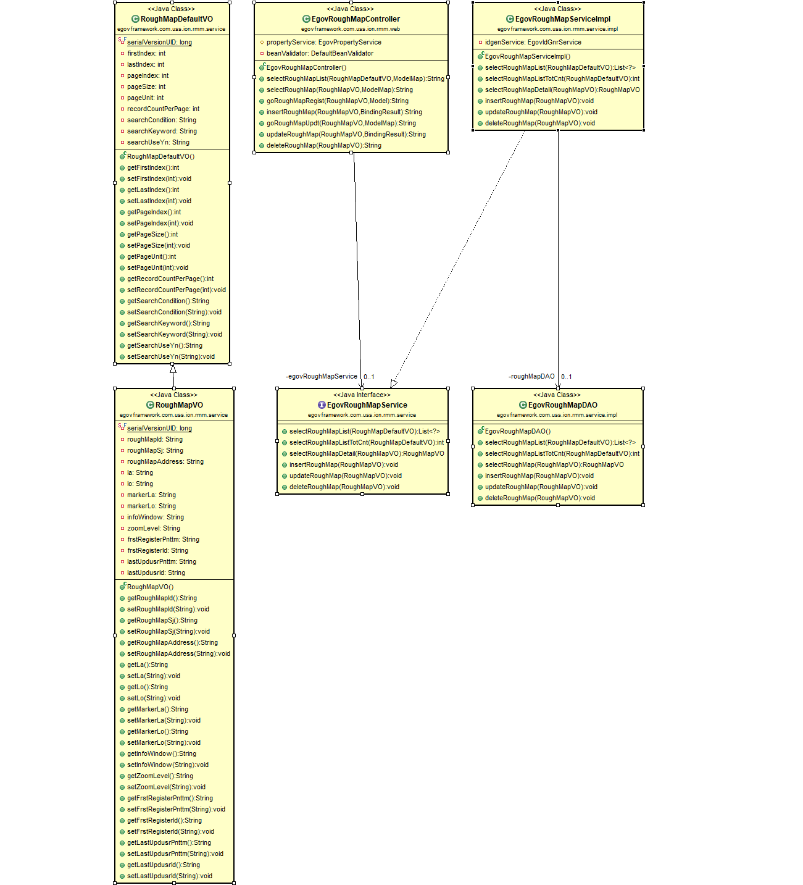
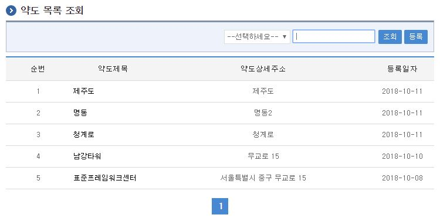
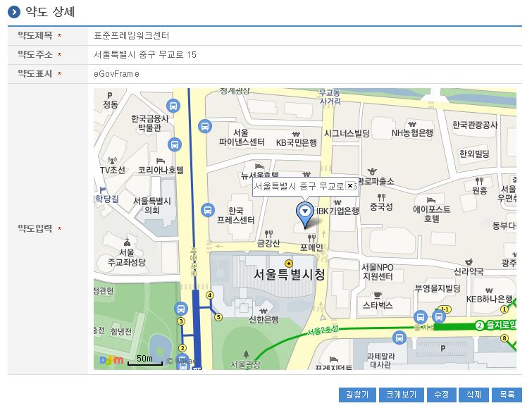
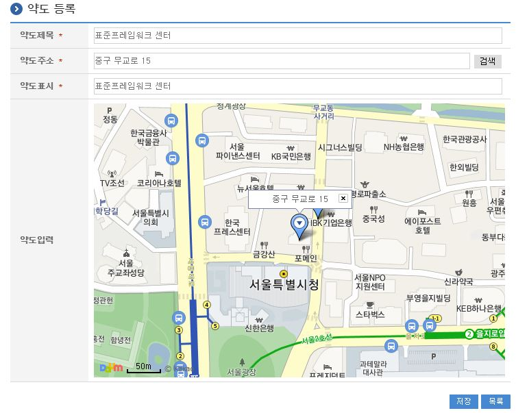
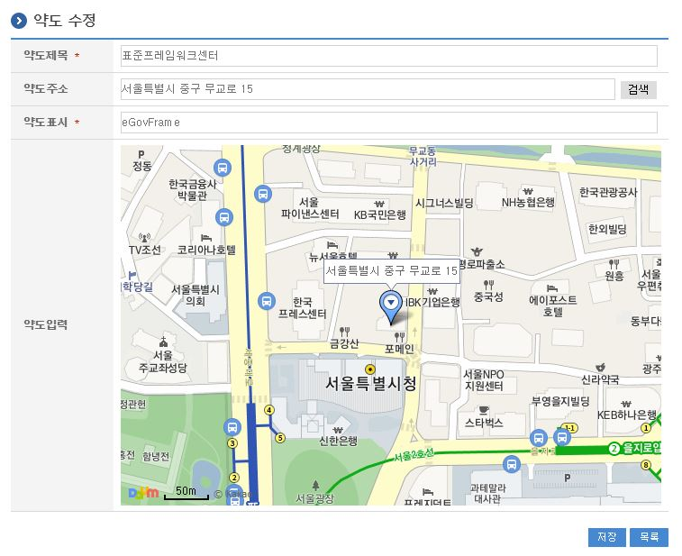

# 약도관리

## 개요

 약도를 저장하고 관리한다.

## 설명

 카카오 다음 API를 사용해 약도관리 컴포넌트를 사용한다.

### 관련소스

| 유형 | 대상소스명 | 비고 |
| --- | --- | --- |
| Controller | egovframework.com.uss.ion.rmm.web.EgovRoughMapController.java | 약도관리를 위한 컨트롤러 클래스 |
| Service | egovframework.com.uss.ion.rmm.service.EgovRoughMapService.java | 약도관리를 위한 서비스 인터페이스 |
| ServiceImpl | egovframework.com.uss.ion.rmm.service.impl.EgovRoughMapServiceImpl.java | 약도관리를 위한 서비스 구현 클래스 |
| VO | egovframework.com.uss.ion.rmm.service.RoughMapVO.java | 약도관리를 위한 VO 클래스 |
| VO | egovframework.com.uss.ion.rmm.service.RoughMapDefaultVO.java | 약도관리를 위한 SearchVO 클래스 |
| DAO | egovframework.com.uss.ion.rmm.service.impl.EgovRoughMapDAO.java | 약도관리를 위한 데이터처리 클래스 |
| JSP | /WEB-INF/jsp/egovframework/com/uss/ion/rmm/EgovRoughMapList.jsp | 약도관리를 위한 목록조회 페이지 |
| JSP | /WEB-INF/jsp/egovframework/com/uss/ion/rmm/EgovRoughMapDetail.jsp | 약도관리를 위한 상세조회 페이지 |
| JSP | /WEB-INF/jsp/egovframework/com/uss/ion/rmm/EgovRoughMapRegist.jsp | 약도관리를 위한 등록 페이지 |
| JSP | /WEB-INF/jsp/egovframework/com/uss/ion/rmm/EgovRoughMapUpdt.jsp | 약도관리를 위한 수정 페이지 |
| XML | resources/egovframework/mapper/com/uss/ion/rmm/EgovRoughMap\_SQL\_altibase.xml | 약도관리 QUERY Altibase XML |
| XML | resources/egovframework/mapper/com/uss/ion/rmm/EgovRoughMap\_SQL\_cubrid.xml | 약도관리 QUERY Cubrid XML XML |
| XML | resources/egovframework/mapper/com/uss/ion/rmm/EgovRoughMap\_SQL\_maria.xml | 약도관리 QUERY MariaDB XML XML |
| XML | resources/egovframework/mapper/com/uss/ion/rmm/EgovRoughMap\_SQL\_mysql.xml | 약도관리 QUERY MySQL XML XML |
| XML | resources/egovframework/mapper/com/uss/ion/rmm/EgovRoughMap\_SQL\_oracle.xml | 약도관리 QUERY Oracle XML |
| XML | resources/egovframework/mapper/com/uss/ion/rmm/EgovRoughMap\_SQL\_postgres.xml | 약도관리 QUERY PostgreSQL XML |
| XML | resources/egovframework/mapper/com/uss/ion/rmm/EgovRoughMap\_SQL\_tibero.xml | 약도관리 QUERY Tibero XML |
| XML | resources/egovframework/mapper/com/uss/ion/rmm/EgovRoughMap\_SQL\_goldilocks.xml | 약도관리 QUERY Goldilocks XML |
| Message properties | resources/egovframework/message/com/uss/ion/rmm/message\_ko.properties | 약도관리를 위한 Message properties |
| Message properties | resources/egovframework/message/com/uss/ion/rmm/message\_en.properties | 약도관리를 위한 Message properties |
| Idgen XML | resources/egovframework/spring/com/idgn/context-idgn-RoughMap.xml | 약도관리를 위한 Id생성 Idgen XML |

### 클래스 다이어그램

 

### ID Generation

#### ID Generation 관련 DDL 및 DML

 ID Generation Service를 활용하기 위해서 Sequence 저장테이블인  COMTECOPSEQ에 ROUGHMAP_ID 항목을 추가해야 한다.

```sql
    CREATE TABLE COMTECOPSEQ ( table_name varchar(16) NOT NULL, 
                               next_id DECIMAL(30) NOT NULL,
                               PRIMARY KEY (table_name)
    );
 
    INSERT INTO COMTECOPSEQ VALUES ('ROUGHMAP_ID','0');
```

#### ID Generation 환경설정(context-idgn-RoughMap.xml)

```xml
    <bean name="egovRoughMapIdGnrService" class="egovframework.rte.fdl.idgnr.impl.EgovTableIdGnrServiceImpl" destroy-method="destroy">
        <property name="dataSource" ref="egov.dataSource" />
        <property name="strategy"   ref="roumManageStrategy" />
        <property name="blockSize"  value="10"/>
        <property name="table"      value="COMTECOPSEQ"/>
        <property name="tableName"  value="ROUGHMAP_ID"/>
    </bean>
    <bean name="roumManageStrategy" class="egovframework.rte.fdl.idgnr.impl.strategy.EgovIdGnrStrategyImpl">
        <property name="prefix"     value="ROUGHMAP_" />
        <property name="cipers"     value="11" />
        <property name="fillChar"   value="0" />
    </bean>
```

### 관련테이블

| 테이블명 | 테이블명(영문) | 비고 |
| --- | --- | --- |
| 약도정보 | COMTNROUGHMAP | 약도에 대한 제목, 주소, 약도표시 등을 관리한다. |

### 테스트방법

 * 약도관리 예제의 경우 카카오 다음지도 API를 사용하고 있으며, 예제를 실행하기 위해 다음 Api Key를 발급 받아야 사용이 가능하다.
 * 카카오 다음 API 주소 : [https://developers.kakao.com/apps](https://developers.kakao.com/apps)
 * 키를 발급받으면, 발급된 키를 해당 \resources\egovframework\egovProps\globals.properties 위치(Api key)에 입력 후 예제를 실행한다.

```properties
#약도관리 Kakao 개발자 appkey 발급 받아 등록해서 기입 (카카오개발 Dev 앱관리 내에서 도메인 등록 필요)
roughMap.appkey = 발급키입력
```

## 관련기능

 약도관리기능은 크게 약도목록조회, 약도상세조회, 약도등록, 약도수정 기능으로 구성되어 있다.

### 약도목록조회

#### 비즈니스 규칙

 조회조건으로 목록조회를 할 수 있고, 등록버튼을 클릭하여 약도등록 화면으로 이동하여 약도정보를 등록 처리 할 수 있다.

#### 관련코드

 N/A

#### 관련화면 및 수행매뉴얼

| Action | URL | Controller method | QueryID |
| --- | --- | --- | --- |
| 목록조회 | /com/uss/ion/rmm/selectRoughMapList.do | selectRoughMapList | "EgovRoughMapDAO.selectRoughMapList", |
|  |  |  | "EgovRoughMapDAO.selectRoughMapListTotCnt" |

 약도목록은 페이지 당 10건씩 조회되며 페이징은 10페이지씩 이루어진다.
 검색조건은 약도제목, 약도주소에 대해서 수행된다.
 페이지 당 검색 범위를 변경하고자 하는 경우
 context-properties.xml 파일의 pageUnit, pageSize를 변경한다.(단 해당 설정은 전체 공통서비스 기능에 영향을 미친다.)

 

 조회: 약도를 조회하기 위해서는 상단의 검색조건을 선택 후 해당하는 검색문자를 입력 후 조회 버튼을 클릭한다.
 등록: 약도를 등록하기 위해서는 상단의 등록 버튼을 통해서 약도등록 화면으로 이동한다.
 목록클릭: 약도상세조회 화면으로 이동한다.

### 약도상세조회

#### 비즈니스 규칙

 약도목록조회에서 목록 클릭 시 이동되는 화면으로 약도에 대한 상세정보를 보여준다.

#### 관련코드

 N/A

#### 관련화면 및 수행매뉴얼

| Action | URL | Controller method | QueryID |
| --- | --- | --- | --- |
| 상세조회 | /com/uss/ion/rmm/selectRoughMapDetail.do | selectRoughMap | "RoughMapDAO.selectRoughMapDetail" |
| 삭제 | /com/uss/ion/rmm/deleteRoughMap.do | deleteRoughMap | "RoughMapDAO.deleteRoughMap" |

 약도상세조회화면은 길찾기, 크게보기, 약도수정, 약도삭제, 약도목록조회를 할 수 있다.

 

 길찾기 : 약도에 표시된 위치로 목적지로 하는 다음길찾기 화면으로 이동한다.
 크게보기 : 약도에 표신된 위치를 기준으로 하는 다음지도 화면으로 이동한다.
 수정: 수정버튼 클릭 시 약도를 수정할 수 있는 화면으로 이동한다.
 삭제: 삭제버튼 클릭 시 삭제여부를 확인하는 메시지를 보여주고 삭제처리를 할 수 있다.
 목록: 약도목록조회 화면으로 이동한다.

### 약도등록

#### 비즈니스 규칙

 * 약도에 관한 기본정보를 입력 저장처리한다. 입력명 우측의 빨간 *표시는 반드시 입력해야할 항목을 표시한다.
 * 지도를 클릭하여 약도의 주요위치를 표시하고, 해당 주소는 약도주소 입력란에 좌표의 주소가 입력된다.
 * 입력되는 주소는 동까지만 지원하고, 도로명 주소는 지원하지 않는다.(API에서 좌표 → 주소 변환 기능을 사용)
 * 약도주소 입력란에 약도 생성할 주소를 입력하고 검색버튼을 누르면, 해당 위치로 좌표이동이 된다.(API에서 주소 → 좌표 변환기능을 사용)

#### 관련코드

 N/A

#### 관련화면 및 수행매뉴얼

| Action | URL | Controller method | QueryID |
| --- | --- | --- | --- |
| 등록화면 | /com/uss/ion/rmm/registRoughMap.do | goRoughMapRegist |  |
| 등록 | /com/uss/ion/rmm/insertRoughMap.do | insertRoughMap | "RoughMapDAO.insertRoughMap" |

 

 지도를 클릭하여 약도의 주요위치를 표시할 수 있고
 지도를 드래그하여 지도표시영역을 변경할 수 있다.
 검색: 입력한 주소로 위치로 이동한다
 저장: 입력한 약도가 저장 처리된다.
 목록: 약도목록조회 화면으로 이동한다.

### 약도수정

#### 비즈니스 규칙

 * 입력한 약도를 수정 처리한다. 입력명 우측의 빨간 *표시는 수정 시 반드시 입력해야 할 항목을 표시한다.
 * 지도를 클릭하여 약도의 주요위치를 표시하고, 해당 주소는 약도주소 입력란에 좌표의 주소가 입력된다.
 * 입력되는 주소는 동까지만 지원하고, 도로명 주소는 지원하지 않는다.(API에서 좌표 → 주소 변환 기능을 사용)
 * 약도주소 입력란에 약도 생성할 주소를 입력하고 검색버튼을 누르면, 해당 위치로 좌표이동이 된다.(API에서 주소 → 좌표 변환기능을 사용)

#### 관련코드

 N/A

#### 관련화면 및 수행매뉴얼

| Action | URL | Controller method | QueryID |
| --- | --- | --- | --- |
| 수정화면 | /com/uss/ion/rmm/updateRoughMapView.do | goRoughMapUpdt | "RoughMapDAO.selectRoughMapDetail" |
| 수정 | /com/uss/ion/rmm/updateRoughMap.do | updateRoughMap | "RoughMapDAO.updateRoughMap" |

 

 검색: 입력한 주소로 위치로 이동한다
 수정: 수정 입력한 약도가 저장 처리된다.
 목록: 약도목록조회 화면으로 이동한다.
