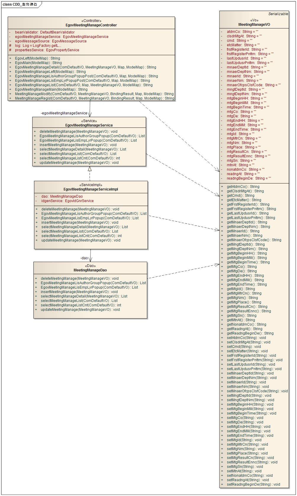
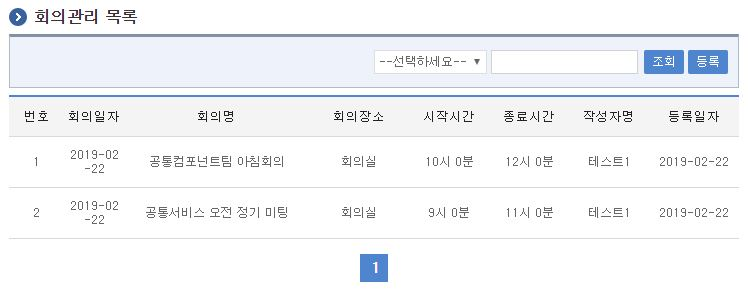
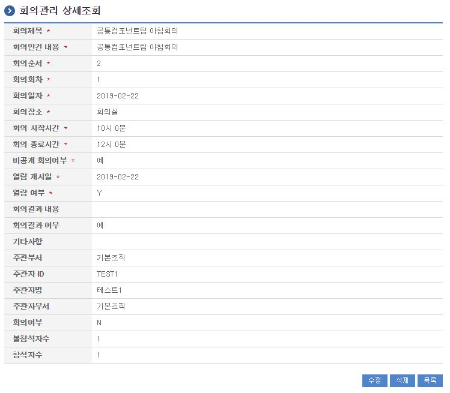
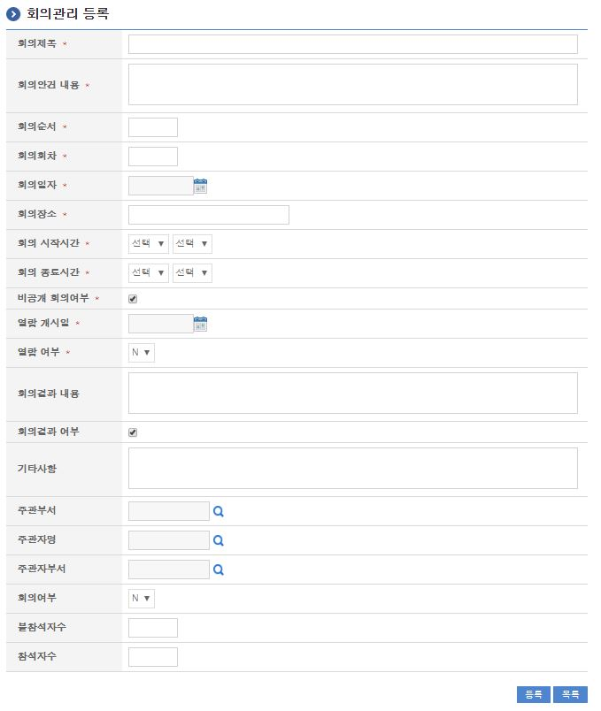
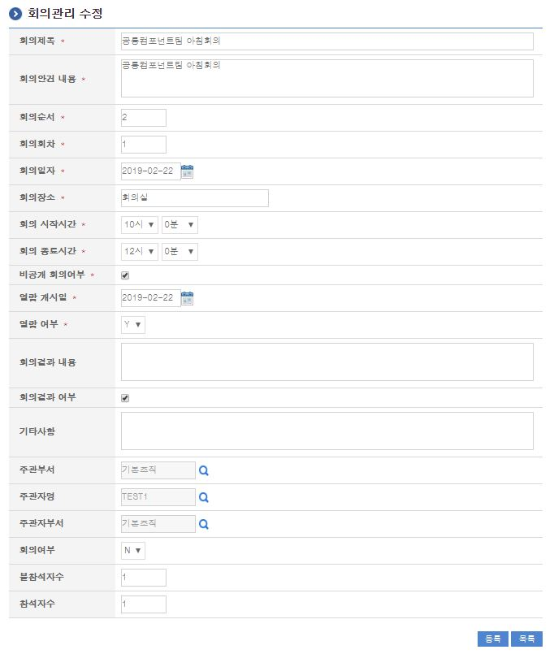

# 회의관리

## 개요

 시스템 또는 서비스 이용 시 많은 사람들이 빈번히 하는 회의들에 대해 별도로 관리하여 회의안건상정 및 회의결과를 기록 관리할 수 있는 기능을 제공한다.

## 설명

### 패키지 참조 관계

 회의관리 패키지는 요소기술의 공통 패키지(cmm)에 대해서만 직접적인 함수적 참조 관계를 가진다. 하지만, 컴포넌트 배포 시 오류 없이 실행되기 위하여 패키지 간의 참조관계에 따라 달력 패키지와 함께 배포 파일을 구성한다.
 패키지 간 참조 관계 : [사용자지원 Package Dependency](../intro/package-reference.md#사용자지원)
 패키지관계 : 회원관리

### 관련소스

| 유형 | 대상소스명 | 비고 |
| --- | --- | --- |
| Controller | egovframework.com.uss.olp.mgt.web.EgovMeetingManageController.java | 회의정보관리 Controller Class |
| Service | egovframework.com.uss.olp.mgt.service.EgovMeetingManageService.java | 회의정보관리 Service Class |
| ServiceImpl | egovframework.com.uss.olp.mgt.service.impl.EgovMeetingManageServiceImpl.java | 회의정보관리 ServiceImpl Class |
| VO | egovframework.com.uss.olp.mgt.service.MeetingManageVO.java | 회의정보관리  VO Class |
| VO | egovframework.com.cmm.ComDefaultVO.java | 검색 VO Class |
| DAO | egovframework.com.uss.olp.mgt.service.impl.MeetingManageDao.java | 회의정보관리 Dao Class |
| JSP | /WEB-INF/jsp/egovframework/com/uss/olp/mgt/EgovMeetingManageList.jsp | 회의정보관리 목록조회 페이지 |
| JSP | /WEB-INF/jsp/egovframework/com/uss/olp/mgt/EgovMeetingManageRegist.jsp | 회의정보관리 등록 페이지 |
| JSP | /WEB-INF/jsp/egovframework/com/uss/olp/mgt/EgovMeetingManageModify.jsp | 회의정보관리 수정 페이지 |
| JSP | /WEB-INF/jsp/egovframework/com/uss/olp/mgt/EgovMeetingManageDetail.jsp | 회의정보관리 상세조회 페이지 |
| JSP | /WEB-INF/jsp/egovframework/com/uss/olp/mgt/EgovMeetingManageLisAuthorGroupPopup.jsp | 부서 목록 팝업페이지 |
| JSP | /WEB-INF/jsp/egovframework/com/uss/olp/mgt/EgovMeetingManageLisEmpLyrPopup.jsp | 사용자 목록 팝업페이지 |
| QUERY XML | resources/egovframework/mapper/com/uss/olp/mgt/EgovMeetingManage\_SQL\_altibase.xml | 회의정보관리 Altibase용 QUERY XML |
| QUERY XML | resources/egovframework/mapper/com/uss/olp/mgt/EgovMeetingManage\_SQL\_cubrid.xml | 회의정보관리 Cubrid용 QUERY XML |
| QUERY XML | resources/egovframework/mapper/com/uss/olp/mgt/EgovMeetingManage\_SQL\_maria.xml | 회의정보관리 Maria용 QUERY XML |
| QUERY XML | resources/egovframework/mapper/com/uss/olp/mgt/EgovMeetingManage\_SQL\_mysql.xml | 회의정보관리 MySQL용 QUERY XML |
| QUERY XML | resources/egovframework/mapper/com/uss/olp/mgt/EgovMeetingManage\_SQL\_oracle.xml | 회의정보관리 Oracle용 QUERY XML |
| QUERY XML | resources/egovframework/mapper/com/uss/olp/mgt/EgovMeetingManage\_SQL\_postgres.xml | 회의정보관리 Postgres용 QUERY XML |
| QUERY XML | resources/egovframework/mapper/com/uss/olp/mgt/EgovMeetingManage\_SQL\_tibero.xml | 회의정보관리 Tibero용 QUERY XML |
| QUERY XML | resources/egovframework/mapper/com/uss/olp/mgt/EgovMeetingManage\_SQL\_goldilocks.xml | 회의정보관리 Goldilocks용 QUERY XML |
| Message properties | resources/egovframework/message/com/uss/olp/mgt/message\_ko.properties | 회의정보관리 Message properties(한글) |
| Message properties | resources/egovframework/message/com/uss/olp/mgt/message\_en.properties | 회의정보관리 Message properties(영문) |
| Idgen XML | resources/egovframework/spring/com/idgn/context-idgn-Mgt.xml | 회의정보관리 Id생성 Idgen XML |

### 클래스 다이어그램

 

### ID Generation

#### ID Generation 관련 DDL 및 DML

 ID Generation Service를 활용하기 위해서 Sequence 저장테이블인  COMTECOPSEQ에 MTG_ID 항목을 추가해야 한다.

```sql
CREATE TABLE COMTECOPSEQ
(
    TABLE_NAME            VARCHAR(20) NOT NULL,
    NEXT_ID               NUMERIC(30) NULL,
     PRIMARY KEY (TABLE_NAME)
)
;
INSERT INTO COMTECOPSEQ ( TABLE_NAME, NEXT_ID ) VALUES ('MTG_ID', 1);
```

#### ID Generation 환경설정(context-idgen.xml)

```xml
<bean name="egovMgtIdGnrService" class="egovframework.rte.fdl.idgnr.impl.EgovTableIdGnrServiceImpl" destroy-method="destroy">
        <property name="dataSource" ref="egov.dataSource" />
        <property name="strategy"   ref="mgtMsgtrategy" />
        <property name="blockSize"  value="10"/>
        <property name="table"      value="COMTECOPSEQ"/>
        <property name="tableName"  value="MTG_ID"/>
</bean>
<bean name="mgtMsgtrategy" class="egovframework.rte.fdl.idgnr.impl.strategy.EgovIdGnrStrategyImpl">
        <property name="prefix"   value="MTG_" />
        <property name="cipers"   value="16" />
        <property name="fillChar" value="0" />
</bean>
```

### 관련테이블

| 테이블명 | 테이블명(영문) | 비고 |
| --- | --- | --- |
| 회의정보관리 | COMTNMTGINFO | 회의정보를 관리 한다. |

## 관련기능

 회의정보관리기능은 크게 회의정보 목록조회, 회의정보 상세조회, 회의정보 내용등록, 회의정보 내용수정기능으로 구성되어 있다.

### 회의정보 목록

#### 비즈니스 규칙

 관리자가 기(記) 등록된 회의정보 정보를 리스트 형태로 조회 할 수 있고, 등록버튼을 클릭하여 등록화면으로 이동할 수 있다.

#### 관련코드

 N/A

#### 관련화면 및 수행매뉴얼

| Action | URL | Controller method | SQL Namespace | SQL QueryID |
| --- | --- | --- | --- | --- |
| 목록조회 | /uss/olp/mgt/EgovMeetingManageList.do | egovMeetingManageList | "MeetingManage" | "selectMeetingManage", |
|  |  |  | "MeetingManage" | "selectMeetingManageCnt" |

 회의정보 목록은 페이지 당 10건씩 조회되며 페이징은 10페이지씩 이루어진다.
 검색조건은 회의명, 회의안건내용에 대해서 수행된다.
 페이지 당 검색 범위를 변경하고자 하는 경우
 context-properties.xml 파일의 pageUnit, pageSize를 변경한다.(단 해당 설정은 전체 공통서비스 기능에 영향을 미친다.)

 

 조회: 조회하기 위해서는 상단의 검색조건을 선택 후 해당하는 검색문자를 입력 후 조회 버튼을 클릭한다.
 등록: 등록하기 위해서는 상단의 등록 버튼을 통해서 회의정보 등록 화면으로 이동한다.
 목록클릭: 회의정보 상세조회 화면으로 이동한다.

### 회의정보 상세조회

#### 비즈니스 규칙

 회의정보 목록에서 목록 클릭 시 이동되는 화면으로 회의정보에 대한 상세정보를 보여준다.

#### 관련코드

 N/A

#### 관련화면 및 수행매뉴얼

##### 회의정보 상세조회

| Action | URL | Controller method | SQL Namespace | SQL QueryID |
| --- | --- | --- | --- | --- |
| 상세조회 | /uss/olp/mgt/EgovMeetingManageDetail.do | egovMeetingManageDetail | "MeetingManage" | "selectMeetingManageDetail" |
| 삭제 | /uss/olp/mgt/EgovMeetingManageDetail.do | egovMeetingManageDetail | "MeetingManage" | "deleteMeetingManage" |

 

 수정: 수정버튼 클릭 시 회의정보 수정 화면으로 이동한다.
 삭제: 삭제버튼 클릭 시 삭제여부를 확인하는 메시지를 보여주고 삭제처리를 할 수 있다.
 목록: 회의정보 목록 화면으로 이동한다.

### 회의정보 등록

#### 비즈니스 규칙

 회의정보에 관한 기본정보를 입력 저장처리한다. 입력명 우측의 빨간* 표시는 반드시 입력해야할 항목을 표시한다.

#### 관련코드

 N/A

#### 관련화면 및 수행매뉴얼

##### 회의정보 등록

| Action | URL | Controller method | SQL Namespace | SQL QueryID |
| --- | --- | --- | --- | --- |
| 등록 | /uss/olp/mgt/EgovMeetingManageRegist.do | meetingManageRegist | "MeetingManage" | "insertMeetingManage" |

 

 등록: 입력한 회의정보 정보들이 저장 처리된다.
 목록: 회의정보 목록 화면으로 이동한다.

### 회의정보 수정

#### 비즈니스 규칙

 입력명 우측의 빨간* 표시는 수정 시 반드시 입력해야 할 항목을 표시한다.

#### 관련코드

 N/A

#### 관련화면 및 수행매뉴얼

##### 회의정보 수정

| Action | URL | Controller method | SQL Namespace | SQL QueryID |
| --- | --- | --- | --- | --- |
| 수정 | /uss/olp/mgt/EgovMeetingManageModify.do | meetingManageModify | "MeetingManage" | "updateMeetingManage" |

 입력한 회의정보 정보를(을) 저장 처리한다.

 

 등록: 수정된 정보들이 저장 처리된다.
 목록: 회의정보 목록 화면으로 이동한다.
