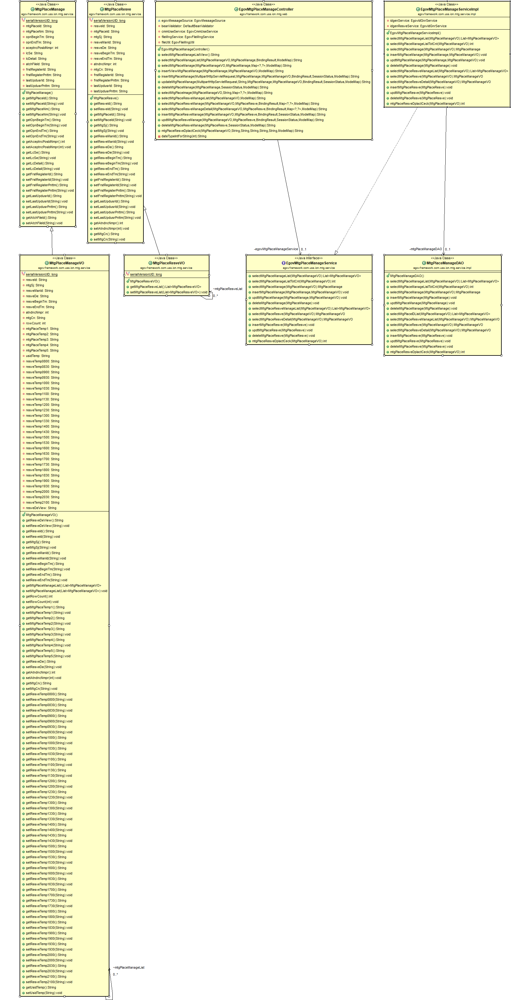
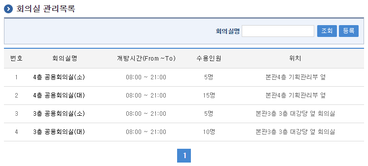
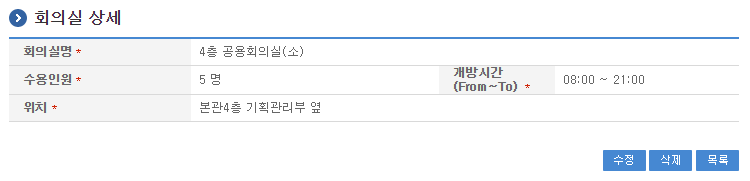
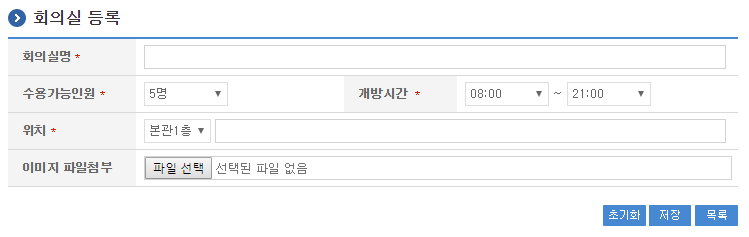
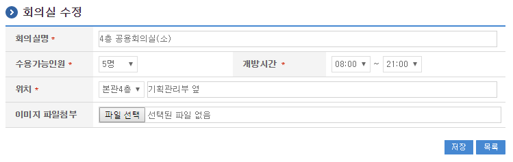

# 회의실관리

### 개요

 기관내의 회의실위치, 개방시간, 수용인원, 비치물품 등 회의실에 대한 정보를 관리하는 기능을 제공한다.


# 기능 설명

 회의실관리 목록  : 회의실 목록을 리스트으로 보여준다.
 회의실관리 상세 : 회의실 상세 내용을 보여준다.
 회의실관리 등록 : 회의실 등록 화면으로 이동한다.
 회의실관리 수정 : 회의실 수정 화면으로 이동한다.

### 관련소스

| 유형 | 대상소스명 | 비고 |
| --- | --- | --- |
| Controller | egovframework.com.uss.ion.mtg.web.EgovMtgPlaceManageController.java | 회의실관리를 위한 컨트롤러 클래스 |
| Service | egovframework.com.uss.ion.mtg.service.EgovMtgPlaceManageService.java | 회의실관리를 위한  서비스 인터페이스 |
| ServiceImpl | egovframework.com.uss.ion.mtg.service.impl.EgovMtgPlaceManageServiceImpl.java | 회의실관리를 위한 서비스 구현 클래스 |
| DAO | egovframework.com.uss.ion.mtg.service.impl.MtgPlaceManageDAO.java | 회의실관리를 위한 데이터처리 클래스 |
| VO | egovframework.com.uss.ion.mtg.service.MtgPlaceManageVO.java | 회의실관리를 위한 VO 클래스 |
| JSP | /WEB-INF/jsp/egovframework/com/uss/ion/mtg/EgovMtgPlaceManageList.jsp | 회의실관리 목록조회를 위한 jsp페이지 |
| JSP | /WEB-INF/jsp/egovframework/com/uss/ion/mtg/EgovMtgPlaceDetail.jsp | 회의실관리 상세화면을 위한 jsp페이지 |
| JSP | /WEB-INF/jsp/egovframework/com/uss/ion/mtg/EgovMtgPlaceRegist.jsp | 회의실관리 등록를 위한 jsp페이지 |
| JSP | /WEB-INF/jsp/egovframework/com/uss/ion/mtg/EgovMtgPlaceUpdt.jsp | 회의실관리 수정를 위한 jsp페이지 |
| Query XML | resources/egovframework/mapper/com/uss/ion/mtg/EgovMtgPlaceManage\_SQL\_altibase.xml | 회의실관리를 위한 Altibase용 Query XML |
| Query XML | resources/egovframework/mapper/com/uss/ion/mtg/EgovMtgPlaceManage\_SQL\_cubrid.xml | 회의실관리를 위한 Cubrid용 Query XML |
| Query XML | resources/egovframework/mapper/com/uss/ion/mtg/EgovMtgPlaceManage\_SQL\_maria.xml | 회의실관리를 위한 MariaDB용 Query XML |
| Query XML | resources/egovframework/mapper/com/uss/ion/mtg/EgovMtgPlaceManage\_SQL\_mysql.xml | 회의실관리를 위한 MySQL용 Query XML |
| Query XML | resources/egovframework/mapper/com/uss/ion/mtg/EgovMtgPlaceManage\_SQL\_oracle.xml | 회의실관리를 위한 Oracle용 Query XML |
| Query XML | resources/egovframework/mapper/com/uss/ion/mtg/EgovMtgPlaceManage\_SQL\_postgres.xml | 회의실관리를 위한 PostgreSQL용 Query XML |
| Query XML | resources/egovframework/mapper/com/uss/ion/mtg/EgovMtgPlaceManage\_SQL\_tibero.xml | 회의실관리를 위한 Tibero용 Query XML |
| Query XML | resources/egovframework/mapper/com/uss/ion/mtg/EgovMtgPlaceManage\_SQL\_goldilocks.xml | 회의실관리를 위한 Goldilocks용 Query XML |
| Message properties | resources/egovframework/message/com/uss/ion/mtg/message\_en.properties | 회의실관리를 위한 Message properties(영문) |
| Message properties | resources/egovframework/message/com/uss/ion/mtg/message\_ko.properties | 회의실관리를 위한 Message properties(한글) |
| Idgen XML | resources/egovframework/spring/com/idgn/context-idgn-MtgPlaceManage.xml | 회의실관리를 위한 Id생성 Idgen XML |

### 클래스 다이어그램

 

### ID Generation 관련 DDL 및 DML

 ID Generation Service를 활용하기 위해서 Sequence 저장테이블인  COMTECOPSEQ에 MTG_PLACE_ID 항목을 추가해야 한다.

```sql
CREATE TABLE COMTECOPSEQ ( table_name varchar(16) NOT NULL, 
                               next_id DECIMAL(30) NOT NULL,
                               PRIMARY KEY (table_name)
    );
 
    INSERT INTO COMTECOPSEQ VALUES ('MTG_PLACE_ID','0');
```

### ID Generation 환경설정(context-idgn-MtgPlaceManage.xml)

```xml
<bean name="egovMtgPlaceManageIdGnrService" class="egovframework.rte.fdl.idgnr.impl.EgovTableIdGnrServiceImpl" destroy-method="destroy">
        <property name="dataSource" ref="egov.dataSource" />
        <property name="strategy"   ref="mtgPlaceManageIdStrategy" />
        <property name="blockSize"  value="10"/>
        <property name="table"      value="COMTECOPSEQ"/>
        <property name="tableName"  value="MTG_PLACE_ID"/>
    </bean>
    <bean name="mtgPlaceManageIdStrategy" class="egovframework.rte.fdl.idgnr.impl.strategy.EgovIdGnrStrategyImpl">
        <property name="prefix"   value="MTGP_" />
        <property name="cipers"   value="15" />
        <property name="fillChar" value="0" />
    </bean>
```


# 화면 설명

## 회의실 현황 리스트

 회의실 목록을 리스트로 보여준다.

 

 회의실명 : 회의실명으로 조회한다.
 등록 : 등록버튼 클릭하면 회의실 등록 화면으로 이동한다.
 상세 : 회의실명 클릭하면 회의실 상세 화면으로 이동한다.

## 회의실 상세

 회의실 상세 내역을 볼 수 있다.

 

 수정 : 회의실 정보를 수정할 수 있는 편집 가능한 화면으로 이동한다.
 삭제 : 등록한 회의실을 삭제 한다.
 목록 : 회의실 목록 조회 화면으로 이동한다.

## 회의실 등록

 회의실 내용을 등록할 수 있는 기능을 제공한다.

 

 초기화 : 입력한 회의실 내용을 공백으로 만든다.
 저장 : 입력한 회의실 내용을 등록한다.
 목록 : 회의실 목록 조회 화면으로 이동한다.
 이미지 파일첨부 : 회의실 등록에 대한 이미지 파일을 첨부한다.

## 회의실 수정

 회의실 내용을 수정할 수 있는 기능을 제공한다.

 

 저장 : 입력한 회의실 내용을 수정한다.
 목록 : 회의실 목록 조회 화면으로 이동한다.
 이미지 파일첨부 : 회의실 등록에 대한 이미지 파일을 첨부한다.


# 관련 기능

 해당 내용 없음


# 참고

 회의실예약관리

