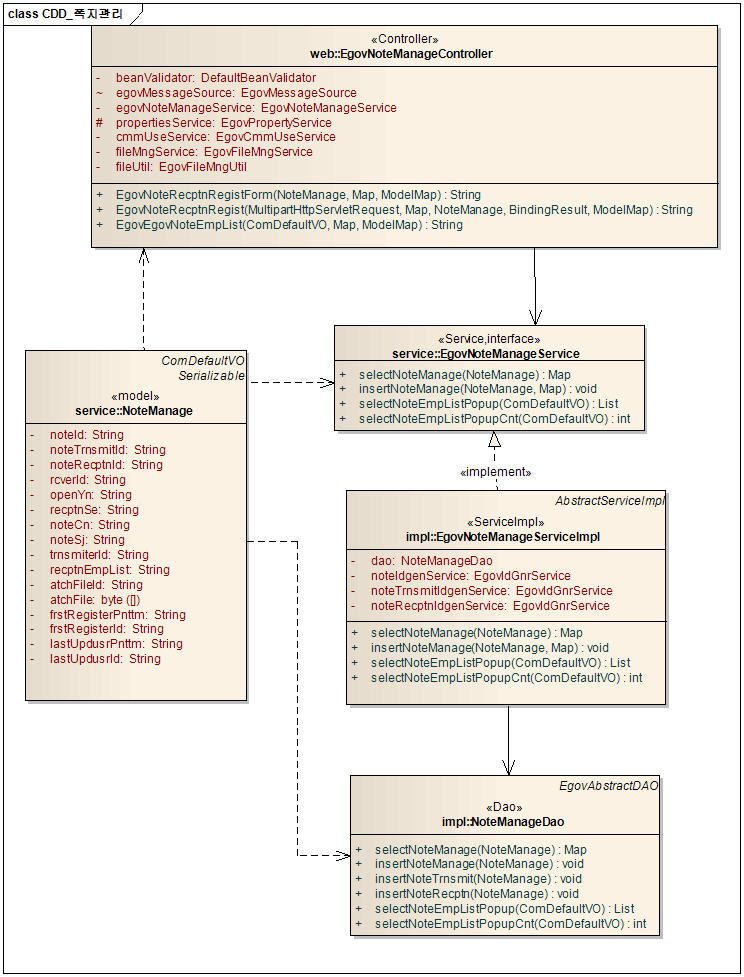
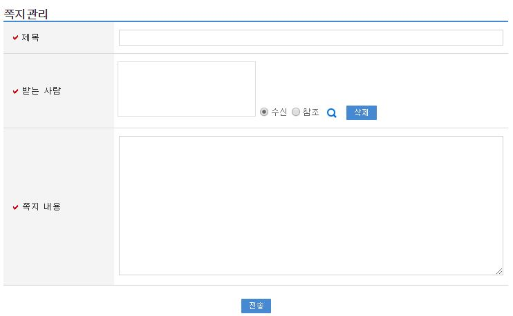
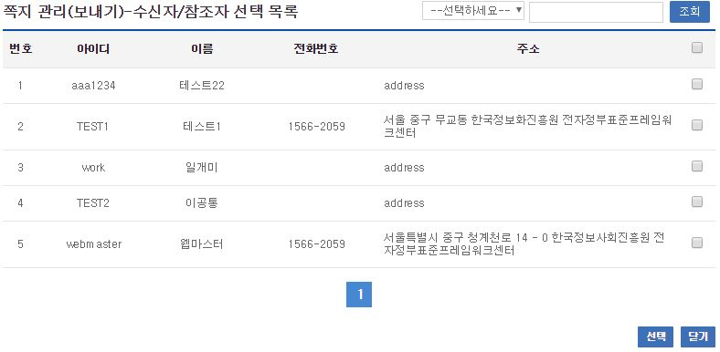

# 쪽지관리

## 개요

 쪽지관리는 사용자가 작성한 쪽지정보를 다른 사용자에게 쪽지 정보를 전달하는 기능을 제공한다.

## 설명

 쪽지관리는 쪽지를 보내기  위한 목적으로 쪽지관리는 등록, 수정, 삭제, 조회, 목록조회의 기능을 수반한다.

 ① 쪽지보내기 : 사용자가 작성한 쪽지 정보를 다른 사람에게 전송한다.
 ② 수신자/참조자 선택 : 쪽지를 보내기위해 수신자/참조자를 선택할 수 있는 팝업 창.

### 관련소스

| 유형 | 대상소스명 | 비고 |
| --- | --- | --- |
| Controller | egovframework.com.uss.ion.ntm.web.EgovNoteManageController.java | 쪽지관리를 위한 컨트롤러 클래스 |
| Service | egovframework.com.uss.ion.ntm.service.EgovNoteManageService.java | 쪽지관리를 위한 서비스 인터페이스 |
| ServiceImpl | egovframework.com.uss.ion.ntm.service.impl.EgovNoteManageServiceImpl.java | 쪽지관리를 위한 서비스 구현 클래스 |
| DAO | egovframework.com.uss.ion.ntm.service.impl.NoteManageDao.java | 쪽지관리를 위한 데이터처리 클래스 |
| Model | egovframework.com.uss.ion.ntm.service.NoteManageVO.java | 쪽지관리를 위한 Model 클래스 |
| JSP | /WEB-INF/jsp/egovframework/com/uss/ion/ntm/EgovNoteEmpList.jsp | 쪽지를 보내기 위한 jsp페이지 |
| JSP | /WEB-INF/jsp/egovframework/com/uss/ion/ntm/EgovNoteManage.jsp | 쪽지를 보내기 위해 수신자/참조자 선택하는 jsp페이지 |
| Mapper | resources/egovframework/mapper/com/uss/ion/ntm/EgovNoteManage\_SQL\_*.xml | 쪽지관리 QUERY XML |
| Idgnr | resources/egovframework/spring/com/idgn/context-idgn-NoteManage.xml | 쪽지관리를 위한 Idgn |
| Properties | resources/egovframework/message/com/uss/ion/ntm/message\_*.properties | 쪽지관리 국제화 |

 쪽지관리 QUERY XML의 경우 MySQL, Oracle, Cubrid, Altibase, Tibero, MariaDB, PostgreSQL, Goldilocks 지원하며, globals.properties에서 설정 가능
 국제화의 경우 한국어(ko)/영어(en) 2개국어 지원

### 클래스 다이어그램

 

### 관련테이블

| 테이블명 | 테이블명(영문) | 비고 |
| --- | --- | --- |
| 쪽지관리 | COMTNNOTE | 쪽지정보를 관리하기 위한 속성정보를 정의하고, 관리한다. |
| 받은쪽지함관리 | COMTNNOTERECPTN | 받은쪽지함을 관리하기 위한 속성정보를 정의하고, 관리한다. |
| 보낸쪽지함관리 | COMTNNOTETRNSMIT | 보낸쪽지함을를 관리하기 위한 속성정보를 정의하고, 관리한다. |

### ID Generation

 ID Generation Service를 활용하기 위해서 Sequence 저장테이블인  COMTECOPSEQ에 NOTE_ID, NOTE_TRNSMIT_ID, NOTE_RECPTN_ID 항목을 추가한다.

```sql
INSERT INTO COMTECOPSEQ VALUES('NOTE_ID',0);
INSERT INTO COMTECOPSEQ VALUES('NOTE_TRNSMIT_ID',0);
INSERT INTO COMTECOPSEQ VALUES('NOTE_RECPTN_ID',0);
```

## 관련화면 및 수행매뉴얼

### 쪽지보내기

| Action | URL | Controller method | QueryID |
| --- | --- | --- | --- |
| 쪽지보내기 | /uss/ion/ntm/registEgovNoteManage.do | EgovNoteRecptnRegistForm | "NoteManage.insertNoteManage" |
|  |  |  | "NoteManage.insertNoteTrnsmit" |
|  |  |  | "NoteManage.insertNoteRecptn" |
|  |  |  | "NoteManage.selectNoteManage" |

 

 삭제 : 선택된 수신자/참조자 목록을 삭제한다.
 ▲ : 선택된 수신자/참조자 목록을 위로 이동한다.
 ▼ : 선택된 수신자/참조자 목록을 아래로 이동한다.
 수신자/참조자 찾기 : 수신자/참조자 선택 팝업창을 오픈한다.
 보내기 : 작성된 쪽지를 전송을 요청 한다.

### 수신자/참조자 선택

| Action | URL | Controller method | QueryID |
| --- | --- | --- | --- |
| 수신자/참조자 선택 | /uss/ion/ntm/listEgovNoteEmpListPopup.do | EgovEgovNoteEmpList | "NoteManage.EovNoteEmpListPopup" |
|  |  |  | "NoteManage.EovNoteEmpListPopupCnt" |

 

 조회 : 검색조건, 검색명으로 수신자/참조자 조회를 요청한다.
 닫기 : 팝업창을 닫는다.
 선택 : 체크한 수신자/참조자를 부모창에 입력 한다.
