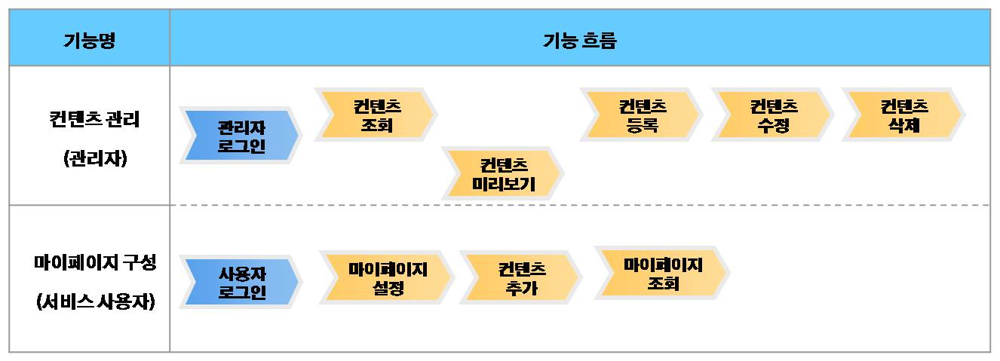
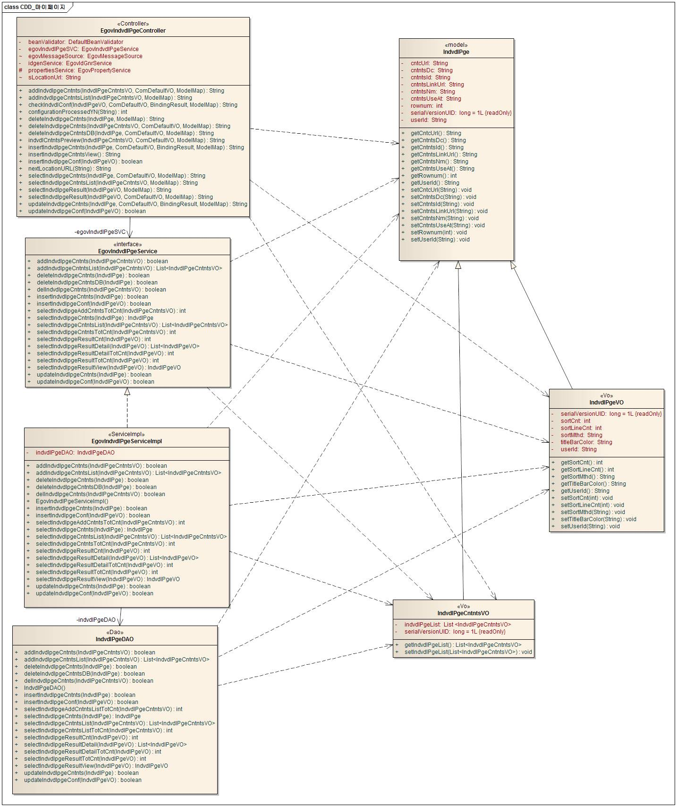
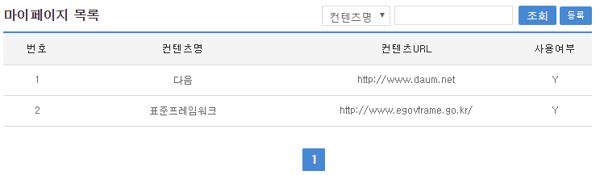
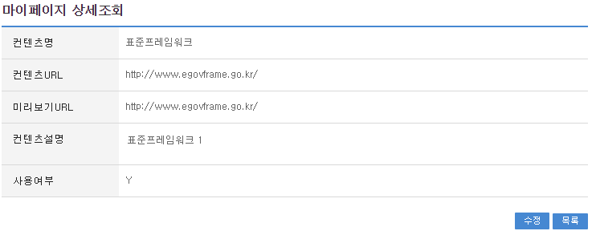
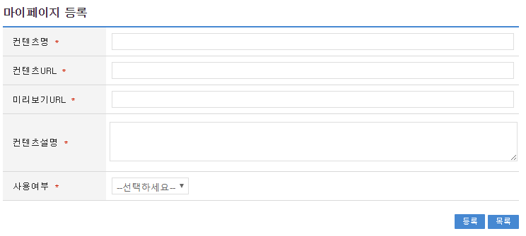
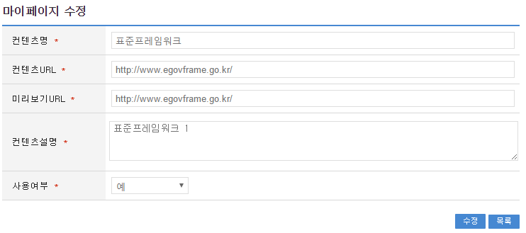

# 마이페이지

## 개요

 사용자가 즐겨 찾는 정보를 사용자가 원하는 형태에 따라 제공하며, 마이페이지의 콘텐츠 등록, 수정, 조회 및 마이페이지를 구성하는 기능을 제공한다.
 기능흐름

 

## 설명

### 패키지 참조 관계

 마이페이지 패키지는 요소기술의 공통 패키지(cmm)에 대해서만 직접적인 함수적 참조 관계를 가진다.
- 패키지 간 참조 관계 : [사용자지원 Package Dependency](../intro/package-reference.md/#사용자지원)

### 관련소스

| 유형 | 대상소스명 | 비고 |
| --- | --- | --- |
| Controller | egovframework.com.uss.mpe.web.EgovIndvdlPgeController.java | 마이페이지 Controller Class |
| Service | egovframework.com.uss.mpe.service.EgovIndvdlPgeService.java | 마이페이지 Service Class |
| ServiceImpl | egovframework.com.uss.mpe.service.impl.EgovIndvdlPgeServiceImpl.java | 마이페이지 ServiceImpl Class |
| VO | egovframework.com.uss.mpe.service.IndvdlPgeVO.java | 마이페이지 구성 VO Class |
| VO | egovframework.com.cmm.ComDefaultVO.java | 검색 VO Class |
| DAO | egovframework.com.uss.mpe.service.impl.EgovIndvdlPgeDAO.java | 마이페이지 Dao Class |
| JSP | /WEB-INF/jsp/egovframework/com/uss/mpe/EgovIndvdlPgeList.jsp | 마이페이지 컨텐츠 목록조회 페이지 |
| JSP | /WEB-INF/jsp/egovframework/com/uss/mpe/EgovIndvdlPgeRegist.jsp | 마이페이지 컨텐츠 등록 페이지 |
| JSP | /WEB-INF/jsp/egovframework/com/uss/mpe/EgovIndvdlPgeUpdt.jsp | 마이페이지 컨텐츠 수정 페이지 |
| JSP | /WEB-INF/jsp/egovframework/com/uss/mpe/EgovIndvdlPgeDetail.jsp | 마이페이지 컨텐츠 상세조회 페이지 |
| Query XML | resources/egovframework/mapper/com/uss/mpe/EgovIndvdlPge\_SQL\_altibase.xml | 마이페이지 관리를 위한 Altibase용 Query XML |
| Query XML | resources/egovframework/mapper/com/uss/mpe/EgovIndvdlPge\_SQL\_cubrid.xml | 마이페이지 관리를 위한 Cubrid용 Query XML |
| Query XML | resources/egovframework/mapper/com/uss/mpe/EgovIndvdlPge\_SQL\_maria.xml | 마이페이지 관리를 위한 MariaDB용 Query XML |
| Query XML | resources/egovframework/mapper/com/uss/mpe/EgovIndvdlPge\_SQL\_mysql.xml | 마이페이지 관리를 위한 MySQL용 Query XML |
| Query XML | resources/egovframework/mapper/com/uss/mpe/EgovIndvdlPge\_SQL\_oracle.xml | 마이페이지 관리를 위한 Oracle용 Query XML |
| Query XML | resources/egovframework/mapper/com/uss/mpe/EgovIndvdlPge\_SQL\_postgres.xml | 마이페이지 관리를 위한 PostgreSQL용 Query XML |
| Query XML | resources/egovframework/mapper/com/uss/mpe/EgovIndvdlPge\_SQL\_tibero.xml | 마이페이지 관리를 위한 Tibero용 Query XML |
| Query XML | resources/egovframework/mapper/com/uss/mpe/EgovIndvdlPge\_SQL\_goldilocks.xml | 마이페이지 관리를 위한 Goldilocks용 Query XML |
| Message properties | resources/egovframework/message/com/uss/mpe/message\_ko.properties | 마이페이지 Message properties(한글) |
| Message properties | resources/egovframework/message/com/uss/mpe/message\_en.properties | 마이페이지 Message properties(영문) |
| Idgen XML | resources/egovframework/spring/com/idgn/context-idgn-IndvdlPge.xml | 마이페이지 컨텐츠 Id생성 Idgen XML |

### 클래스 다이어그램

 

### ID Generation

#### ID Generation 관련 DDL 및 DML

 ID Generation Service를 활용하기 위해서 Sequence 저장테이블인  COMTECOPSEQ에 CNTNTS_ID (컨텐츠 아이디) 항목을 추가해야 한다.

```sql
  CREATE TABLE COMTECOPSEQ ( TABLE_NAME VARCHAR(20) NOT NULL, 
  		             NEXT_ID NUMERIC(30) NULL,
  		             PRIMARY KEY (TABLE_NAME));
 
  INSERT INTO COMTECOPSEQ VALUES('SCHDUL_ID','1');
```

#### ID Generation 환경설정(context-idgn-IndvdlPge.xml)

```xml
    <bean name="egovIndvdlPgeIdGnrService" class="egovframework.rte.fdl.idgnr.impl.EgovTableIdGnrServiceImpl" destroy-method="destroy">
        <property name="dataSource" ref="egov.dataSource" />
        <property name="strategy"   ref="cntntsIdStrategy" />
        <property name="blockSize"  value="10"/>
        <property name="table"      value="COMTECOPSEQ"/>
        <property name="tableName"  value="CNTNTS_ID"/>
    </bean>
    <bean name="cntntsIdStrategy" class="egovframework.rte.fdl.idgnr.impl.strategy.EgovIdGnrStrategyImpl">
        <property name="prefix"   value="C" />
        <property name="cipers"   value="19" />
        <property name="fillChar" value="0" />
    </bean>
```

### 관련테이블

| 테이블명 | 테이블명(영문) | 비고 |
| --- | --- | --- |
| 마이페이지 컨텐츠 | COMTNINDVDLPGECNTNTS | 마이페이지에 추가할 수 있는 컨텐츠를 관리자가 등록한다. |
| 마이페이지 환경설정 | COMTNINDVDLPGEESTBS | 마이페이지 조회 시 구성될 화면을 설정한다. |
| 마이페이지에 추가된 컨텐츠 | COMTNCNTNTSLIST | 마이페이지에 추가된 컨텐츠를 관리한다. |

## 관련기능

 마이페이지관리는 크게 마이페이지 컨텐츠 목록조회, 마이페이지 컨텐츠 상세조회, 마이페이지 컨텐츠 등록, 마이페이지 컨텐츠 수정 기능으로 구성되어 있다.

### 마이페이지 컨텐츠 목록조회

#### 비즈니스 규칙

 관리자가 기(記) 등록된 마이페이지 컨텐츠 정보를 리스트 형태로 조회 할 수 있고, 기능버튼으로는 등록 기능을 사용할 수 있다.

#### 관련코드

 N/A

#### 관련화면 및 수행매뉴얼

| Action | URL | Controller method | SQL Namespace | SQL QueryID |
| --- | --- | --- | --- | --- |
| 목록조회 | uss/mpe/selectIndvdlPgeList.do | selectIndvdlPgeList | "IndvdlPge" | "selectIndvdlPgeList" |
|  |  |  | "IndvdlPge" | "selectIndvdlPgeListCnt" |

 

 등록 : 컨텐츠를 등록하기 위해서는 상단의 등록 버튼을 통해서 마이페이지 등록 화면으로 이동한다.
 목록 : 마이페이지 컨텐츠의 상세조회 화면으로 이동한다.

### 마이페이지 컨텐츠 상세조회

#### 비즈니스 규칙

 마이페이지 컨텐츠 목록조회에서 목록 클릭 시 이동되는 화면으로 마이페이지 컨텐츠에 대한 상세정보를 보여준다.

#### 관련코드

 N/A

#### 관련화면 및 수행메뉴얼

| Action | URL | Controller method | SQL Namespace | SQL QueryID |
| --- | --- | --- | --- | --- |
| 상세조회 | /uss/mpe/selectIndvdlPgeDetail.do | selectIndvdlPgeDetail | "IndvdlPge" | "selectIndvdlPgeDetail" |

 

 수정 : 수정 버큰 클릭시 마이페이지 컨텐츠 수정 후 수정 완료 메시지를 출력한다.
 목록 : 목록 버튼 클릭시 마이페이지 컨텐츠 목록 조회 화면으로 이동한다.

### 마이페이지 컨텐츠 등록

#### 비즈니스 규칙

 마이페이지에 컨텐츠를 관리자가 등록하는 화면으로 컨텐츠 명, 컨텐츠 URL, 미리보기 URL, 컨텐츠 설명, 사용여부는 필수 입력 항목이므로 반드시 입력해야 한다.

#### 관련코드

 N/A

#### 관련화면 및 수행메뉴얼

| Action | URL | Controller method | SQL Namespace | SQL QueryID |
| --- | --- | --- | --- | --- |
| 등록화면 | /uss/mpe/insertIndvdlPgeView.do | insertIndvdlPgeView |  |  |
| 등록 | /uss/mpe/insertIndvdlPge.do | insertIndvdlPge | "IndvdlPge" | "insertIndvdlPge" |

 

 등록 : 등록 버튼 클릭시 입력한 마이페이지 컨텐츠 정보를 저장한다.
 목록 : 목록 버튼 클릭시 마이페이지 컨텐츠 목록 조회 화면으로 이동한다.

### 마이페이지 컨텐츠 수정

#### 비즈니스 규칙

 마이페이지에 컨텐츠 수정 화면으로 컨텐츠 명, 컨텐츠 URL, 미리보기 URL, 컨텐츠 설명, 사용여부를 수정할 수 있다.

#### 관련코드

 N/A

#### 관련화면 및 수행메뉴얼

| Action | URL | Controller method | SQL Namespace | SQL QueryID |
| --- | --- | --- | --- | --- |
| 수정화면 | /uss/mpe/updateIndvdlPgeView.do | updateIndvdlPgeView | "IndvdlPge" | "selectIndvdlPgeDetail" |
| 수정 | /uss/mpe/updateIndvdlPge.do | updateIndvdlPge | "IndvdlPge" | "updateIndvdlPge" |

 

 수정 : 수정 버큰 클릭시 마이페이지 컨텐츠 수정 후 수정 완료 메시지를 출력한다.
 목록 : 목록 버튼 클릭시 마이페이지 컨텐츠 목록 조회 화면으로 이동한다.

